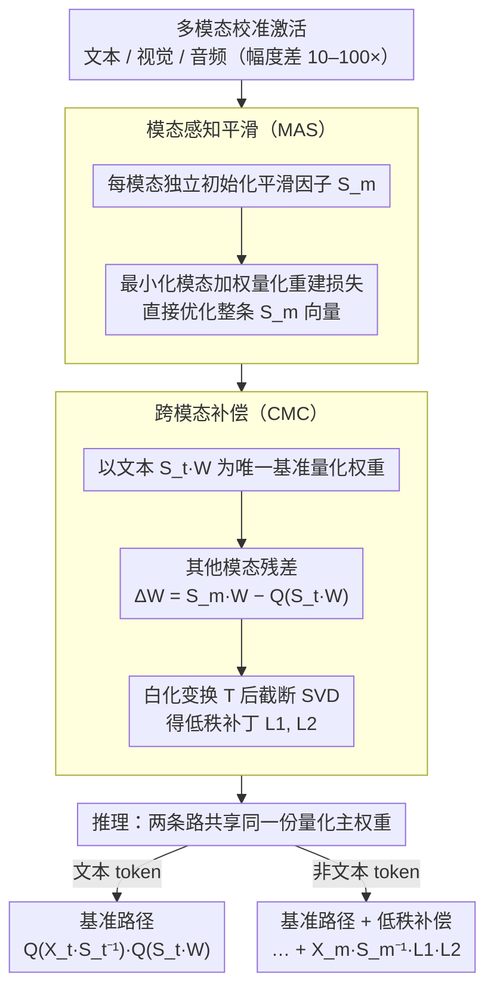

# MASQuant: Modality-Aware Smoothing Quantization for Multimodal Large Language Models

**会议**: CVPR 2026  
**arXiv**: [2603.04800](https://arxiv.org/abs/2603.04800)  
**代码**: [https://github.com/alibaba/EfficientAI](https://github.com/alibaba/EfficientAI)  
**领域**: 多模态VLM  
**关键词**: 后训练量化, 多模态LLM, 平滑量化, 跨模态补偿, 低秩分解

## 一句话总结
揭示了通道平滑量化（如 SmoothQuant）直接应用于 MLLM 时的"平滑失配"问题——不同模态激活幅度差异巨大导致非主导模态被过度平滑，提出 MASQuant 通过模态感知平滑因子和基于 SVD 白化的跨模态低秩补偿解决该问题。

## 研究背景与动机

**领域现状**：后训练量化（PTQ）是部署大模型的关键技术。基于计算不变性的通道平滑方法（SmoothQuant、AWQ 等）在纯文本 LLM 上表现优异，通过通道缩放因子重分配激活离群值。

**现有痛点**：直接将通道平滑应用于 MLLM 时，视觉 token 的激活幅度通常比文本 token 大 10-100 倍。统一的平滑因子由主导模态（通常是视觉）决定，导致非主导模态（文本、音频）被过度平滑，信号被压缩，产生严重量化误差——即"平滑失配"（Smoothing Misalignment）。

**核心矛盾**：为每个模态学习独立平滑因子解决了失配问题，但需要为每个模态存储独立的量化权重，完全违背了量化压缩的初衷。

**本文目标**：能否在保持单一量化权重的前提下，实现模态感知的平滑量化？

**切入角度**：观察到不同模态平滑后的权重差异是低秩的（可数学证明），因此可用轻量低秩矩阵补偿。

**核心 idea**：学习模态特异平滑因子 + 以文本模态为基准存储一套量化权重 + 用 SVD 白化低秩补偿其他模态。

## 方法详解

### 整体框架
MASQuant 想解决的是把通道平滑量化搬到 MLLM 上时的"平滑失配"：视觉 token 的激活幅度比文本大 10–100 倍，一套统一的平滑因子被主导模态绑架，文本、音频这些非主导模态被压得几乎没信号，量化误差随之爆炸。它的破法分两步——先让每个模态各自学一套最优平滑因子，从根上消除失配（模态感知平滑 MAS）；再用一个低秩补偿把"每模态一套平滑权重"重新压回"单套量化权重 + 轻量补丁"（跨模态补偿 CMC）。这样既拿到了模态感知带来的精度，又没把量化本该省下的存储重新吐回去。整套流程是校准期搭好两套东西、推理期分模态走两条路：

### 关键设计

**1. 模态感知平滑（Modality-Aware Smoothing, MAS）：让每个模态各自学最优平滑因子，而不是共用一套**

失配的根源在于单一平滑因子 $\mathbf{S}$ 由幅度最大的模态说了算，其余模态只能被动接受。MASQuant 干脆为每个模态 $m$ 单独学一套平滑因子 $\mathbf{S}_m$：先用经典初始化 $s_i^m = \sqrt{\max_t|x_{t,i}^m| / \max_j|w_{j,i}|}$ 给一个起点，再直接最小化按模态加权的量化重建损失 $\sum_{m} \lambda_m \cdot \mathcal{L}_{MAE}(\mathbf{S}_m, \mathbf{X}_m, \mathbf{W})$，把平滑因子本身优化到位。和 SmoothQuant、AWQ 去搜一个标量超参 $\beta$ 不同，这里优化的是整条平滑因子向量，相当于直接逼近通道平滑能达到的精度上限。为什么非得给每个模态独立因子，论文用 SQNR 退化给了定量解释：统一平滑下非主导模态的信噪比会掉

$$\Delta = 10\log_{10}\left(\frac{d\,(\min_i \alpha_i^2)}{\sum_i 1/\alpha_i^2}\right)$$

其中 $\alpha_i$ 是模态间的激活范围比。模态幅度差越悬殊，$\Delta$ 越负、失配越严重——这恰好量化了"视觉主导时文本被淹没"的直觉。

**2. 跨模态补偿（Cross-Modal Compensation, CMC）：用单套量化权重 + 低秩补丁，把 MAS 的多套权重重新压回去**

MAS 把精度救回来了，却带来新麻烦：每个模态一套 $\mathbf{S}_m$ 就意味着 $Q(\mathbf{S}_m\mathbf{W})$ 是各不相同的量化权重，存 N 套权重等于把量化的压缩收益全赔进去。CMC 只存文本模态那套 $Q(\mathbf{S}_t\mathbf{W})$ 当基准，其余模态用一个补丁找回差异。以视觉为例，它和基准的残差是 $\Delta\mathbf{W} = \mathbf{S}_v \mathbf{W} - Q(\mathbf{S}_t \mathbf{W})$。直接对 $\Delta\mathbf{W}$ 做 SVD 压不下去（它本身没有低秩结构），关键一步是先做白化变换 $\mathbf{T} = (\mathbf{P}\Lambda^{1/2})^\top$，变换后的 $\mathbf{T}(\Delta\mathbf{W})$ 才显出很强的低秩特性，截断 SVD 就能用两个瘦矩阵把它逼近出来：

$$\Delta\mathbf{W} \approx \mathbf{L}_1 \mathbf{L}_2,\quad \mathbf{L}_1 = \mathbf{T}^{-1}\mathbf{U}_r,\ \ \mathbf{L}_2 = \Sigma_r \mathbf{V}_r^\top$$

论文进一步证明，这个"白化 + 截断"的组合恰好最小化了输出端的重建误差 $\|\mathbf{X}_v \mathbf{S}_v^{-1}(\Delta\mathbf{W} - \mathbf{L})\|_F^2$，所以补偿不是凑出来的工程 trick，而是有理论保证的最优低秩近似。最终非文本模态只多背一对低秩矩阵，主权重仍是唯一的那份量化版本。

### 一个完整示例：两类 token 走完同一层

设想同一层里同时来了文本 token 和视觉 token。文本 token 走基准路径，平滑、量化、相乘一气呵成：

$$\mathbf{Y} = Q(\mathbf{X}_t \mathbf{S}_t^{-1}) \cdot Q(\mathbf{S}_t \mathbf{W})$$

视觉 token 则用自己学到的 $\mathbf{S}_v$ 去平滑激活，但权重侧仍复用文本那套量化权重 $Q(\mathbf{S}_t\mathbf{W})$，二者之间被压掉的那部分由低秩补丁补回来：

$$\mathbf{Y} = Q(\mathbf{X}_v \mathbf{S}_v^{-1}) \cdot Q(\mathbf{S}_t \mathbf{W}) + \mathbf{X}_v \mathbf{S}_v^{-1} \cdot \mathbf{L}_1^v \mathbf{L}_2^v$$

可以看到两条路径共享同一份量化主权重，差别只在前面各自用了本模态的平滑因子、后面给非文本模态多挂了一项轻量的低秩乘法。再扩到三模态（如加音频），无非是又多挂一对 $\mathbf{L}_1^m\mathbf{L}_2^m$，主权重自始至终只存一份。

## 实验关键数据

### 主实验（Qwen2.5-VL 系列）

| 方法 | Bits | MMMU | OCRBench | ScienceQA | TextVQA | Avg |
|------|------|------|----------|-----------|---------|-----|
| FP16 | W16A16 | 基线 | 基线 | 基线 | 基线 | 100% |
| SmoothQuant | W8A8 | 下降明显 | 下降 | 下降 | 下降 | - |
| MASQuant | W8A8 | **最优** | **最优** | **最优** | **最优** | SOTA |

### 跨架构验证

| 模型类型 | 说明 |
|---------|------|
| 双模态 VLM | Qwen2.5-VL-3B/7B 上一致优于 SmoothQuant、AWQ |
| 三模态 Omni | Qwen2.5-Omni-3B 上同样有效，音频模态也受益 |

### 消融实验
- MAS 单独使用即显著提升 SQNR（图 2 验证定理 1）
- CMC 的低秩近似质量随秩增加快速收敛
- 白化后残差的低秩特性远优于直接 SVD

## 亮点
- 首次形式化定义 MLLM 量化中的“平滑失配”问题并给出 SQNR 理论分析（定理 1）
- 数学证明跨模态激活差异的低秩特性，使 CMC 有理论保证（定理 2）
- 框架同时适用于双模态（视觉-文本）和三模态（视觉-文本-音频）MLLM
- 保持单一量化权重，额外存储开销极低（仅低秩矩阵）
- 在 Qwen2.5-VL 和 Qwen2.5-Omni 上均一致优于现有通道平滑 PTQ 方法

### 消融实验
- 仅用 MAS（不加 CMC）：不同模态需存储独立量化权重，但量化精度最优
- 仅用 CMC（不改平滑）：修补效果有限，因底层平滑失配未解决
- MAS + CMC（完整方案）：在单一权重约束下逼近 MAS 的精度上限
- CMC 低秩补偿：秩 16-32 通常足以恢复 90%+ 的精度差距
- 白化后 $\mathbf{T}(\Delta\mathbf{W})$ 的奇异值衰减远快于直接 SVD，验证了低秩假设

## 局限与展望
- 校准阶段需要收集各模态数据来分别优化平滑因子，增加预处理复杂度
- 低秩补偿的秩 $r$ 选择需要在精度和额外存储之间权衡
- 当前仅验证了 W8A8 和 W4A8 设置，更激进的低位宽（如 W2A4）效果未知
- 非文本模态推理时需要额外的矩阵乘法 $\mathbf{X}_m \mathbf{S}_m^{-1} \cdot \mathbf{L}_1^m \mathbf{L}_2^m$，有少量延迟开销
- 可考虑将模态感知思想推广到旋转基方法（如 QuaRot、SpinQuant）
- 三模态及以上场景中低秩补偿矩阵数量线性增长，需要内存管理优化

### 实现细节
- MAS 优化使用 Adam，通常 100-200 次迭代即可收敛
- CMC 低秩矩阵以 FP16 存储，相比完整权重矩阵占用可忽略不计

<!-- RELATED:START -->

## 相关论文

- [\[CVPR 2026\] Fine-Grained Post-Training Quantization for Large Vision Language Models with Quantization-Aware Integrated Gradients](fine-grained_post-training_quantization_for_large_vision_language_models_with_qu.md)
- [\[CVPR 2026\] Direction-aware 3D Large Multimodal Models](direction-aware_3d_large_multimodal_models.md)
- [\[CVPR 2025\] MBQ: Modality-Balanced Quantization for Large Vision-Language Models](../../CVPR2025/multimodal_vlm/mbq_modality-balanced_quantization_for_large_vision-language_models.md)
- [\[CVPR 2026\] AutoTraces: Autoregressive Trajectory Forecasting via Multimodal Large Language Models](autotraces_autoregressive_trajectory_forecasting_via_multimodal_large_language_m.md)
- [\[CVPR 2026\] CoVFT: Context-aware Visual Fine-tuning for Multimodal Large Language Models](covft_context-aware_visual_fine-tuning_for_multimodal_large_language_models.md)

<!-- RELATED:END -->
