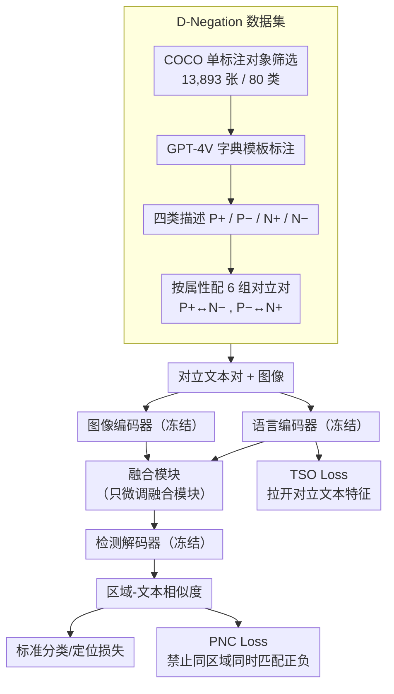

<!-- 由 src/gen_stubs.py 自动生成 -->
# Mastering Negation: Boosting Grounding Models via Grouped Opposition-Based Learning

**会议**: CVPR2026  
**arXiv**: [2603.12606](https://arxiv.org/abs/2603.12606)  
**代码**: 待确认  
**领域**: 多模态VLM  
**关键词**: 视觉定位, 否定语义理解, 对立学习, 高效微调, 视觉-语言融合, 负样本

## 一句话总结

提出 D-Negation 数据集和 Grouped Opposition-Based Learning (GOBL) 微调机制，通过对立语义配对和两个专用损失函数，仅微调不到 10% 参数即大幅提升视觉定位模型对否定语义的理解能力（最高 +5.7 mAP）。

## 研究背景与动机

**否定语义是自然语言的基本组成**：人类描述物体时常使用"不是红色的猫"等否定表达，但现有视觉定位（Visual Grounding）模型几乎完全忽略否定词，甚至给出完全相反的定位结果。

**缺乏否定语义训练数据**：现有 VG 数据集（LVIS、Object365、Flickr30K、GQA）只包含肯定描述或简单类别名，没有包含否定语义的标注数据。

**修饰词理解不足**：正确处理否定语义需要先理解属性修饰词（颜色、位置、状态），这是当前模型的薄弱环节。

**简单增加数据量无效**：实验表明用 Flickr30K 等正向数据微调甚至会导致否定语义性能下降，说明需要针对性的训练策略。

**融合模块是瓶颈**：作者发现文本编码器已在预训练中接触过否定文本，检测解码器也能处理正向引用，真正混淆正/负特征的是视觉-语言融合模块。

**高效微调的现实需求**：主流模型（GLIP、Grounding-DINO、APE）在数百万图像上训练，全量重训代价极高，需要参数高效的适配方案。

## 方法详解

### 整体框架

方法建在标准视觉定位模型（图像编码器 + 语言编码器 + 融合模块 + 检测解码器）之上。作者先定位了问题的真正瓶颈：文本编码器在预训练里接触过否定文本、检测解码器也能处理正向引用，真正把正/负特征混淆的是**视觉-语言融合模块**。于是它只微调融合模块（<10% 参数），用 D-Negation 数据集的 6 组对立语义描述对做监督，在标准定位损失之外加入 PNC 和 TSO 两个约束。整条链路是：先离线构建 D-Negation 数据集，再把成对的对立文本与图像送进冻结的编码器，只让融合模块学习，最后由检测解码器输出定位，并在文本特征层（TSO）和区域-文本匹配层（PNC）各加一个对立约束。

### 关键设计

**1. D-Negation 数据集：把否定语义做成成对的对立监督**

现有 VG 数据集只有肯定描述或类别名、没有否定语义标注，而简单加正向数据反而会降分。D-Negation 从 COCO 筛出仅含单标注对象的图像（共 13,893 张、80 个类别），用 GPT-4V 以严格字典格式模板生成标注。针对颜色/位置/状态三种属性，每个对象生成 12 条描述，分四类：P+（正向语义-正确，"红色的猫"）、P-（正向-错误硬负例，"黑色的猫"）、N+（否定-正确，"不是黑色的猫"）、N-（否定-错误硬负例，"不是红色的猫"）。再把 P+ 与 N-、P- 与 N+ 按属性分为 6 组对立对，共 139,980 条文本标注，否定词频率远超现有数据集。成对的对立语义是后面两个损失能生效的前提。

**2. 只微调融合模块：对准真正的瓶颈**

主流模型在数百万图像上训练，全量重训代价极高。既然混淆来自融合模块，就冻结文本编码器、图像编码器和检测解码器，只调融合模块（约 <10% 参数），单 epoch、batch size=1、约 10 小时完成。消融验证了这一判断：调融合模块 +4.7/+5.7 远超调文本编码器（+0.7）、解码器（+1.2）、图像编码器（-0.3）。

**3. Positive-Negation Constraint (PNC) Loss：禁止同一区域同时匹配正负描述**

对同一图像区域，计算它与正向/否定描述的融合后相似度，经 softmax（温度系数 σ=5）归一化后与 ground truth 匹配计算损失。它强制模型区分对立语义——不能把同一区域同时匹配到正/负两种描述。

**4. Text Semantic-Opposite (TSO) Loss：在特征空间拉开对立文本**

正/负文本特征高度相似是融合模块混淆的根源。TSO 在特征空间里显式拉远语义对立的文本特征向量：

$$L_{\text{TSO}} = \frac{1}{N}\left(2 - \sum_{i=1}^{N} \|f_p - f_n\|_2^2\right)$$

把正、负文本特征 $f_p, f_n$ 推开，从源头缓解融合模块分不清正负的问题。

### 损失函数 / 训练策略

总损失在标准分类/定位损失之上加两个对立约束：

$$L_{\text{total}} = L_{\text{cls}} + L_{\text{loc}} + \alpha L_{\text{PNC}} + \beta L_{\text{TSO}}$$

其中 α=0.5、β=0.3。

## 实验

### 主实验：D³ 数据集（否定语义评测）

| 方法 | Full | Presence | Absence |
|------|------|----------|---------|
| APE-C (baseline) | 27.8 | 27.9 | 27.3 |
| APE-C (+Ours) | **32.5** (+4.7) | **32.3** (+4.4) | **33.0** (+5.7) |
| APE-D (baseline) | 37.5 | 38.8 | 33.9 |
| APE-D (+Ours) | **38.6** (+1.1) | **39.8** (+1.0) | **35.0** (+1.1) |
| G-DINO-Base | 15.6 | 16.4 | 13.4 |
| G-DINO-Base (+Ours) | **17.8** (+2.2) | **17.4** (+1.0) | **19.0** (+5.6) |

- Absence（否定语义）子集改进最为显著，APE-C 上 +5.7，G-DINO-Base 上 +5.6
- 即使在纯正向语义（Presence）评测中也有提升，说明方法同时增强了修饰词理解

### D-Negation 测试集

| 方法 | Original | +Flickr30k | +Ours |
|------|----------|------------|-------|
| APE-D | 78.9 | 80.2 (+1.3) | **84.1** (+5.2) |
| APE-B | 80.5 | 78.9 (-1.6) | **83.7** (+3.2) |

- 用等量 Flickr30k 微调有时反而降分，证明非针对性数据无效

### 消融实验

**数据类型消融**（APE-C on D³）：
- 仅正向样本：Full +0.3，Absence -0.3
- 仅负向样本：Full -0.4，Absence +0.6
- 正负结合：Full +0.9，Absence +1.8
- 正负结合 + GOBL：Full **+4.7**，Absence **+5.7**
- 结论：正/负语义互补，GOBL 机制贡献了主要增益

**微调模块消融**：

| 模块 | Full | Absence |
|------|------|---------|
| 文本编码器 | +0.7 | +1.1 |
| 图像骨干 | -0.3 | -0.7 |
| 解码器 | +1.2 | +1.3 |
| **融合模块** | **+4.7** | **+5.7** |

- 明确验证了融合模块是否定语义理解的关键瓶颈

**损失函数消融**：PNC Loss 单独贡献 +4.3 Full / +5.2 Absence，TSO Loss 进一步提升至 +4.7 / +5.7

### 关键发现

1. 提升否定理解同时提升正向语义表现，属性间具有可迁移性
2. 超参数 σ、α、β 在较宽范围内性能稳定，方法对调参不敏感
3. 与 Flickr30k 混合训练可进一步达到 Full +5.1、Absence +6.2
4. RefCOCO 上正向语义性能不降反略升（APE-C: val +0.7、testA +1.0、testB +0.9）

## 亮点

- **问题定义精准**：首次系统研究视觉定位中的否定语义理解，填补数据和方法的双重空白
- **极致高效**：仅 13K 图像、单 epoch、<10% 参数即获大幅提升，对比原始训练规模（6.8M-17.28M 图像）效率提升数百倍
- **理论假设得到充分验证**：融合模块是瓶颈、正负语义互补、属性可迁移性均通过控制实验严格证实
- **实用性强**：方法可即插即用于 GLIP/Grounding-DINO/APE 等主流框架

## 局限性

- D-Negation 规模有限（13K 图像），且每张图像仅含单类单实例，与真实场景（多实例同类）有差距
- 仅微调融合模块，视觉骨干的细粒度属性表征未被改善，当视觉区分度低时仍可能失败（如黑色 vs 黑白色）
- 属性仅覆盖颜色/位置/状态三种，未涉及材质、纹理、动作等更多维度
- 在参数量最大的 APE-D 上增益有限（+1.1），可能存在饱和效应

## 相关工作

- **视觉定位**：MDETR、GLIP、Grounding-DINO、APE、UNINEXT 等统一检测-定位框架是主流，但均未建模否定语义
- **负样本与否定语义**：CREPE/NegCLIP 在训练中引入硬负例；CLIPN/CoN-CLIP 利用否定提示改进分类/OOD 检测，但均局限于分类粒度
- **对立学习(OBL)**：利用对立样本对加速学习的框架，本文首次将其引入视觉-语言定位任务

## 评分

- 新颖性: ⭐⭐⭐⭐ — 首个否定语义视觉定位数据集 + 对立学习微调机制，问题和方法均有明确创新
- 实验充分度: ⭐⭐⭐⭐⭐ — 多模型（6 种配置）、多基准（D³/D-Negation/RefCOCO）、多维消融（数据/模块/损失/超参/属性）
- 写作质量: ⭐⭐⭐⭐ — 结构清晰，动机-方法-实验逻辑链完整
- 价值: ⭐⭐⭐⭐ — 揭示了融合模块这一结构瓶颈，方法高效实用，但数据规模和属性覆盖度限制了影响力

<!-- RELATED:START -->

## 相关论文

- [\[CVPR 2026\] Continual Learning with Vision-Language Models via Semantic-Geometry Preservation](continual_learning_with_vision-language_models_via_semantic-geometry_preservatio.md)
- [\[CVPR 2026\] Reason-SVG: Enhancing Structured Reasoning for Vector Graphics Generation with Reinforcement Learning](reason-svg_enhancing_structured_reasoning_for_vector_graphics_generation_with_re.md)
- [\[CVPR 2026\] Mind the Discriminability Trap in Source-Free Cross-domain Few-shot Learning](mind_the_discriminability_trap_in_source-free_cross-domain_few-shot_learning.md)
- [\[CVPR 2026\] Multi-Modal Representation Learning via Semi-Supervised Rate Reduction for Generalized Category Discovery](multi-modal_representation_learning_via_semi-supervised_rate_reduction_for_gener.md)
- [\[CVPR 2026\] FALCON: False-Negative Aware Learning of Contrastive Negatives in Vision-Language Alignment](falcon_false-negative_aware_learning_of_contrastive_negatives_in_vision-language.md)

<!-- RELATED:END -->
