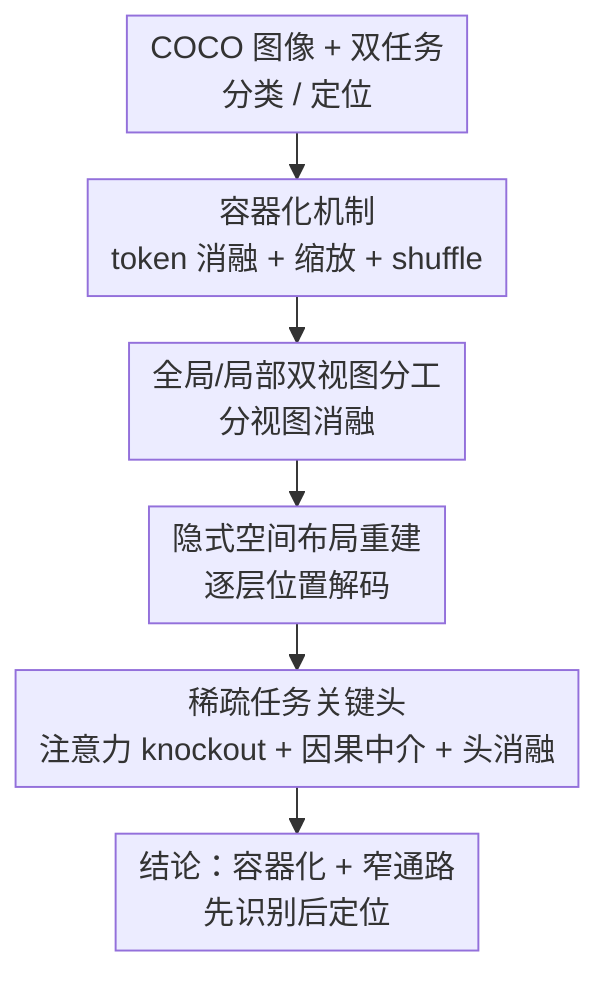

# Mechanisms of Object Localization in Vision-Language Models

**会议**: CVPR 2026  
**arXiv**: [2605.19792](https://arxiv.org/abs/2605.19792)  
**代码**: https://github.com/t9s9/vlm-loc-mechanisms (有)  
**领域**: 多模态VLM / 机制可解释性  
**关键词**: 机制可解释性, 物体定位, 因果中介分析, 注意力 knockout, 容器化

## 一句话总结
作者用一套机制可解释性工具（token 消融、注意力 knockout、因果中介分析）解剖了 LLaVA-1.5 与 InternVL-3.5 内部到底"怎么"把物体定位出来，发现定位靠的是一种"容器化"机制——物体区域的 token 集体框定空间范围，其内部语义排布几乎无关——并且整个因果链只由极少数注意力头承担，分类与定位用的是基本不重叠的两组专用头，且定位在因果上依赖分类的中间结果，呈现"先识别、后定位"的顺序计算。

## 研究背景与动机
**领域现状**：主流 VLM 都走 `ViT → MLP → LLM` 范式——视觉编码器抽 patch 特征，多模态投影把它映射进语言空间，再和文本一起交给 LLM 联合处理。这套架构在 VQA、captioning 上很强，也能回答"某物体在哪"这类需要定位的问题。

**现有痛点**：尽管能力很强，VLM 在最基础的视觉任务上反而频繁翻车——经常误分类、定位不准。更关键的是，大家对"分类"的内部机制研究得相对多，但对"定位"几乎一无所知：模型内部到底在哪一层、用哪些组件把一个物体的边界框算出来，完全是黑箱。

**核心矛盾**：绝大多数 VLM 的视觉特征继承自 CLIP，而 CLIP 是用全局图文对比监督训出来的，天生缺乏像素级精度。按理说这种"弱接地"的特征不该支持精确定位，但 VLM 偏偏能定位——这说明模型一定是在 LLM 内部"从弱接地表征里重建出了空间结构"。这个重建过程是怎么发生的，就是本文要回答的问题。

**本文目标**：给出 VLM 物体定位的**层级与注意力头级**的机制解释，具体拆成几个子问题——定位信息编码在哪些 token 里？空间结构是视觉骨干带进来的还是 LLM 重建的？任务处理集中在哪些层、哪些头？分类和定位共享还是分离？

**切入角度**：不提新模型、不刷榜，而是把模型当"待解剖的对象"，用机制可解释性工具（token 消融、扰动、位置解码、注意力 knockout、因果中介）一层层往里挖，并刻意挑两个复杂度不同的代表——简单可解释的 LLaVA-1.5 和带 token 压缩 + 多视图的 SOTA InternVL-3.5——做对照。

**核心 idea**：用因果干预（而非相关性探针）从粗到细逐级定位，把定位机制坐实到"容器化 + 稀疏专用头 + 先识别后定位"这条窄计算通路上。

## 方法详解

### 整体框架
这是一篇**机制分析**论文，没有提出新模型，"方法"就是一套精心设计的因果干预实验流水线。输入是 COCO 验证集上经清洗的图像，每张图配两套 prompt——分类（列出图中物体）和定位（给出目标物体的边界框，用 IoU 在 0.5/0.7/0.9 三个阈值上取成功率均值作为定位分）。研究对象是 LLaVA-1.5（7B/13B）和 InternVL-3.5-8B。整体思路是"从粗到细逐级收窄"：先问定位信息编码在**哪些 token**里（token 消融）、对 InternVL 进一步问编码在**哪个视图**里（双视图消融）、再问空间结构是谁**重建**的（位置解码）、最后定位到任务处理集中在**哪些层、哪些头**（注意力 knockout → 因果中介分析 → 头消融）。

为保证分析针对"真实物体证据"而非背景上下文，作者还构造了一个**物体移除对照集**：用 LaMa 把目标物体抠掉并 inpaint 补背景，只保留"原图认得、补全后认不出"的图对，三个模型取交集后得到 1,720 张图 / 2,248 个标注作为探测子集。

### 关键设计

**1. 容器化机制（containerization）：定位靠 token 集体框范围，不靠内部语义排布**

第一个要回答的是"定位信息藏在哪些 token 里"。作者在 LLM 输入处（多模态投影之后、位置编码之前）做 token 消融，把选中的视觉 token 换成在 ImageNet 验证集上算出的全局平均视觉嵌入（保持嵌入统计但抹掉具体内容），对比四种选 token 策略：物体 token（把物体掩码投影到 token 网格）、register token（嵌入范数超均值 2 个标准差的）、Integrated Gradients 选出的高归因 token、随机 token。结果很干净：只有抹掉**物体 token**才会让性能断崖式下跌（LLaVA-7B 定位 $35.34\to5.92$、分类 $58.10\to19.44$），同等数量的随机/梯度 token 影响小得多，说明关键信息就驻留在物体边界内。

真正"啊哈"的是进一步的两个扰动实验。其一，人为给物体掩码外扩 $p$ 层 padding，并把物体内的 token 随机复制填进去——这会**扩大物体空间范围但打乱其内部结构**（比如把眼睛相关的 token 塞到嘴巴下面）；结果预测框会**跟着放大**，padding=1 的预测与 +1 缩放的真值框对齐最好、padding=2 对齐 +2，呈强对角一致。其二，把物体掩码内的 token 直接 shuffle，定位只轻微掉点（LLaVA-7B 仅 ↓0.0），而打乱全部 token 则定位崩溃（↓33.4）；分类在两种 shuffle 下都几乎不变。两者合起来说明：模型是把一簇物体相关 token**当作一个"容器"来界定空间范围**，框的大小由"哪里有物体 token"决定，而非这些 token 内部语义是否排布正确——这正是 containerization 这个词的含义

**2. 全局/局部双视图分工：全局视图扛空间、局部视图补语义**

InternVL 比 LLaVA 多了两个结构——Pixel Shuffle（把 $2\times2$ 视觉 token 压成一个）和动态高分辨率处理（把图切成多块 $448^2$ 的 local view 高清块，外加一张 $448^2$ 缩略图 global view）。这就引出一个问题：空间信号和语义信号分别落在哪个视图上？作者分别只消融 global 或 local 视图里的物体 token。结果出现明显**分工**：去掉 global 物体 token 定位掉 $-36.4\%$、去掉 local 仅 $-9.7\%$；分类则两边都掉但幅度更小（$-9.5\%$ vs $-6.6\%$）。按物体尺寸细分更清楚——小物体对两个视图都极敏感（global $-64.8\%$、local $-54.3\%$），大物体则对 global 仍敏感（$-26.1\%$）、去掉 local 甚至能略微变好（$+6.5\%$）。

结论是：**global 视图是定位的主要空间载体，local 高清块主要给小物体补分类细节**；两个视图是互补而非冗余——单视图受损时另一个能补偿，两个一起受损（two-view + padding）才会大跌。这条发现的实用含义是裁块数量其实可以按任务/物体尺寸动态调整，省算力

**3. 隐式空间布局重建：LLM 自己从一维 token 序列里重建出二维网格**

既然 CLIP 类视觉骨干随深度增加会"用空间精度换语义抽象"，那定位所需的二维结构到底是谁提供的？作者给每一层（含多模态投影、视觉骨干、LLM 各层）单独训一个线性分类器，去预测每个图像 token 在输入网格里的行/列位置（各轴独立预测，50,000 张 ImageNet 图训、10,000 张评）。结果是：视觉骨干里位置信息早期可解码、到末层基本消失；而 **LLM 里位置可辨识度起初很低，但迅速上升并在中间层达峰**（LLaVA-7B 约第 12 层、LLaVA-13B 第 13 层、InternVL 第 7 层）。

关键观察在多模态投影处：它对**四个图像角点**保留了很强的位置信号，这些角点 + 残余位置信号足以让 LLM 推断出近似的"行边界（换行）"，从而把一维 token 序列重新组织成网格状布局；落在这些推断换行处的 token 被预测的概率也更高，说明模型把角点当作重建空间布局的**结构锚点**。这条机制解释了"弱接地特征为何还能定位"——空间结构不是搬进来的，而是 LLM **重建**出来的

**4. 稀疏任务关键头 + 先识别后定位的顺序机制：极少数注意力头承担几乎全部因果效应**

最后把分析收窄到"哪些层、哪些头"。先用**注意力 knockout**：阻断后续 token 对物体 token 的注意力（按每 4 层分组），看性能在哪些层组掉得最狠。结果 LLaVA 集中在早—中层、InternVL 在中—后层，且两个任务都依赖**早期共享层**，之后定位才需要额外的任务专属处理——这暗示"先识别物体、再定位"的两步机制（而且 LLaVA 中定位掉点最大的层正好和位置信息最强的层吻合，与设计 3 呼应）。

再用**因果中介分析（CMA）**精确到单个头。做法是构造 source 图（物体在）和 base 图（物体被 inpaint 抠掉）一对，对每个头单独把 source run 的激活 patch 进 base run 的前向，用 mediation fraction 量化它闭合了多少 base↔source 的差距：

$$\text{MF} = \frac{P_{\text{base}} - P_{\text{patched}}}{P_{\text{base}} - P_{\text{src}}}$$

其中 $P$ 是 token 级困惑度（模板 token 如括号会被掩掉以免主导分数）。MF≈1 表示该头几乎完全中介任务信息，MF≈0 表示无贡献，MF<0 表示干扰/反证。结果高度**稀疏**：只有极少数头有大 MF，LLaVA 主导头集中在第 11–16 层、InternVL 在 16–22 层，其余几乎全为零。两任务的头**基本不重叠**——top-10 里 LLaVA 只共享 2 个、InternVL 共享 1 个，top-50 重叠也只有 20/15/18。最后用**累积头消融**验证因果必要性：按 MF 排序逐步删头，删任务关键头比删等量低重要头掉得多得多；尤其是——删"分类关键头"也会严重拖垮**定位**，这就坐实了定位在因果上依赖分类的中间表征，即"先识别后定位"的顺序计算

### 损失函数 / 训练策略
本文是分析研究，不训练新模型，分析的是冻结的现成 VLM。唯一的"训练"是位置解码里给每层单独训的线性位置分类器（10 epoch，ImageNet 50k 训 / 10k 评），以及 CMA 用的 50 张 source/base 图对的激活 patching（teacher-forcing 下用困惑度评估）。

## 实验关键数据

### 主实验
token 消融（Table 1，节选）。结论：只有抹掉物体 token 才会断崖下跌，随机/梯度选 token 影响小；定位比分类更敏感，外扩 padding 进一步放大效应。

| 模型 | 消融策略 (token%) | 定位 (%) | 分类 (%) |
|------|------|------|------|
| LLaVA-7B | Baseline (0%) | 35.34 | 58.10 |
| LLaVA-7B | 物体 token (8%) | 5.92 ↓29.4 | 19.44 ↓38.7 |
| LLaVA-7B | +2 padding (21%) | 0.34 ↓35.0 | 10.59 ↓47.5 |
| LLaVA-7B | 随机 (8%) | 35.09 ↓0.2 | 56.58 ↓1.5 |
| InternVL-3.5-8B | Baseline (0%) | 72.64 | 83.30 |
| InternVL-3.5-8B | 物体 token | 11.27 ↓61.4 | 33.19 ↓50.1 |
| InternVL-3.5-8B | +2 padding | 2.02 ↓70.6 | 20.73 ↓62.6 |

token shuffle（Table 2，节选）。结论：打乱全部 token 定位崩溃，只打乱物体内 token 定位几乎不变，分类对两种打乱都免疫——证明容器化对内部语义排布不敏感。

| 模型 | 扰动 | 定位 (%) | 分类 (%) |
|------|------|------|------|
| LLaVA-7B | Baseline | 35.34 | 58.10 |
| LLaVA-7B | 全部 shuffle | 1.90 ↓33.4 | 62.42 ↑4.3 |
| LLaVA-7B | 物体内 shuffle | 35.30 ↓0.0 | 58.44 ↑0.3 |
| InternVL-8B | 全部 shuffle | 4.70 ↓67.9 | 81.19 ↓2.1 |
| InternVL-8B | 物体内 shuffle | 37.70 ↓34.9 | 83.15 ↓0.1 |

### 消融实验
InternVL 双视图分视图消融（Table 3，节选）。

| 视图 | 配置 | 定位 (%) | 分类 (%) | 说明 |
|------|------|------|------|------|
| — | Baseline | 72.64 | 83.30 | 完整模型 |
| Local | 物体 token | 62.93 ↓9.7 | 76.65 ↓6.6 | 去局部，定位仅中度掉 |
| Global | 物体 token | 36.20 ↓36.4 | 73.80 ↓9.5 | 去全局，定位大跌 |
| Global | +1 padding | 25.86 ↓46.8 | 72.06 ↓11.2 | 外扩进一步放大 |

注意力头消融（累积删头）：删任务关键头比删等量低重要头使定位掉得多得多；删分类关键头同样严重拖垮定位（证明顺序依赖）。

### 关键发现
- **容器化坐实**：物体内 shuffle 几乎不影响定位（LLaVA-7B ↓0.0），而打乱内部结构的 padding 实验里预测框会"跟着物体放大"——定位由"哪有物体 token"决定，不由内部语义排布决定。
- **空间结构是 LLM 重建的**：视觉骨干位置信息末层消失，而 LLM 位置可辨识度在中间层达峰（LLaVA-7B 第 12 层 / InternVL 第 7 层），多模态投影的四角点是重建网格的锚点。
- **极致稀疏 + 任务分离**：少数头承担几乎全部因果效应，分类/定位的主导头 top-10 仅共享 1–2 个；但删分类关键头会拖垮定位，呈"先识别后定位"。
- **视图分工随物体尺寸变化**：小物体两视图都极敏感（global -64.8%、local -54.3%），大物体去 local 反而略涨（+6.5%），提示裁块数可按需动态化。

## 亮点与洞察
- **"容器化"是个很有画面感的发现**：用"复制物体 token 填到 padding 区→框跟着放大"和"物体内 shuffle→定位不变"两个互补扰动，干净地把"定位靠范围、不靠语义排布"这件事证出来，比纯探针有说服力，因为是因果干预。
- **source/base inpaint 对照设计巧妙**：用 LaMa 抠掉物体做反事实 base 图，再 patch 激活算 MF，把"上下文幻觉"这个混淆因素从分析里剔除——只保留"原图认得、补全后认不出"的图对，确保结论建立在真实物体证据上，这个 trick 可迁移到任何"想排除背景捷径"的可解释性研究。
- **"先识别后定位"的因果证据**：不是靠相关性观察，而是靠"删分类关键头也会拖垮定位"这个反直觉的因果实验把顺序机制坐实，给后续"针对性微调定位头 / 接地感知的注意力监督"指了方向。
- **双视图的互补 vs 冗余判定**：单视图受损能被另一个补偿、两个一起损才崩，明确判成"协同而非冗余"，这对 VLM 推理时该切几块图（算力 vs 精度）有直接工程含义。

## 局限与展望
- **作者承认的局限**：用的是过滤后的 COCO 子集——每张图含多物体但每个查询类别只有一个目标，是刻意简化以隔离基础机制；CMA 只作用于注意力头、且分析的是冻结模型，其他组件（MLP、LayerNorm 等）和训练动态都没碰。
- **泛化性存疑**：结论建立在 LLaVA-1.5 和 InternVL-3.5 两个家族上，是否推广到更多架构、更复杂场景（多目标、关系定位、分割、视频）还需验证；横向比较不同模型的掉点幅度时要注意 baseline 定位分本身差异很大（LLaVA-7B 35.34 vs InternVL 72.64），↓百分点不可直接比大小。
- **改进思路**：作者自己点出的方向最直接——既然定位由极少数专用头承担，就可以做**针对性的头微调**或**接地感知的注意力监督**来定向增强定位，而不必全模型重训；另外双视图分工提示可做**任务/尺寸自适应的动态裁块**来省算力。

## 相关工作与启发
- **vs 前期 VLM 可解释性（Basu 等 / Li 等 / Yu&Lee）**：他们多聚焦高层推理、VQA 行为、幻觉缓解或用逐层探针揭示分阶段层级；本文不同在于**专门针对定位**，并把粒度推到**注意力头级的因果中介**，而非停留在相关性探针。
- **vs VLM 失败模式研究（单/多物体分类、计数、视觉搜索、空间推理）**：那些工作记录了 VLM 在各种能力上的系统性短板，但**没有研究物体定位、也没定位空间表征在模型里哪冒出来**；本文正好补上"在哪、怎么"这一层机制解释。
- **vs 提升接地能力的工作（架构改造 / 额外训练 / 专门数据集，如 Qwen-VL 等）**：它们靠改模型/加数据刷接地榜，但**内部计算机制仍是黑箱**；本文不刷榜，而是解释清楚机制，从而能反过来指导这些模型该往哪个头、哪一层施加监督。

## 评分
- 新颖性: ⭐⭐⭐⭐⭐ 首个给出 VLM 物体定位的层级与注意力头级机制解释，"容器化"和"先识别后定位"都是新且可验证的发现
- 实验充分度: ⭐⭐⭐⭐ 五类干预（消融/扰动/位置解码/knockout/CMA）交叉印证、三个模型对照，扎实；但仅限单目标 COCO 子集和两个家族
- 写作质量: ⭐⭐⭐⭐⭐ 逻辑从粗到细层层收窄，每个结论都有对应实验，扰动设计直观易懂
- 价值: ⭐⭐⭐⭐ 机制洞察能直接指导"定位头微调 / 接地感知监督 / 动态裁块"等后续设计，但短期不改 SOTA

<!-- RELATED:START -->

## 相关论文

- [\[CVPR 2026\] VLM-Loc: Localization in Point Cloud Maps via Vision-Language Models](vlm-loc_localization_in_point_cloud_maps_via_vision-language_models.md)
- [\[CVPR 2026\] BOP-Ask: Object-Interaction Reasoning for Vision-Language Models](bop-ask_object-interaction_reasoning_for_vision-language_models.md)
- [\[CVPR 2026\] Circuit Tracing in Vision-Language Models: Understanding the Internal Mechanisms of Multimodal Thinking](circuit_tracing_in_vision-language_models_understanding_the_internal_mechanisms_.md)
- [\[CVPR 2026\] Boosting Vision-Language Models Towards Cross-Domain Incremental Object Detection](boosting_vision-language_models_towards_cross-domain_incremental_object_detectio.md)
- [\[CVPR 2026\] ORIC: Benchmarking Object Recognition under Contextual Incongruity in Large Vision-Language Models](oric_benchmarking_object_recognition_under_contextual_incongruity_in_large_visio.md)

<!-- RELATED:END -->
