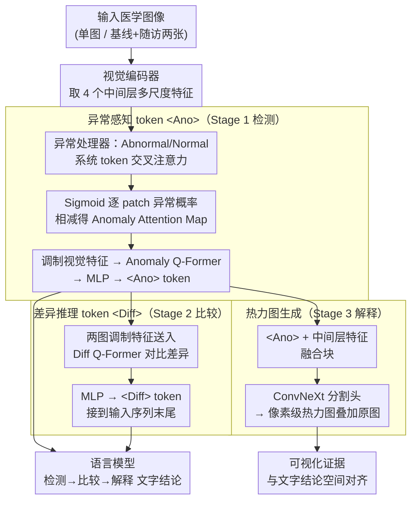

# Medic-AD: Towards Medical Vision-Language Model's Clinical Intelligence

**会议**: CVPR 2026  
**arXiv**: [2603.27176](https://arxiv.org/abs/2603.27176)  
**代码**: [https://github.com/AIDASLab/Medic-AD](https://github.com/AIDASLab/Medic-AD)  
**领域**: 多模态VLM  
**关键词**: 医学VLM, 异常检测, 时序追踪, 可解释性, 热力图

## 一句话总结

Medic-AD 通过三阶段渐进式训练框架——异常检测（<Ano> token）、时序差异推理（<Diff> token）、可视化解释（热力图），将通用医学 VLM 升级为具备病灶检测、症状追踪和视觉可解释性的临床智能模型，在多项医学任务上达到 SOTA。

## 研究背景与动机

医学 VLM 近年取得快速进展，但大多优化的是"广泛医学知识覆盖"而非"真正的临床应用"。实际临床工作流需要三个关键能力：(1) 准确的病灶检测，(2) 可靠的纵向症状追踪，(3) 透明的视觉可解释性。

**核心矛盾**：现有医学 VLM 的训练依赖长文本描述、OCR 指令和 CoT 推理，增强的是泛化推理能力，但忽视了临床所需的精确感知和可验证的推理过程。

**本文目标**：设计一个遵循临床诊断工作流——"检测→比较→解释"的 VLM 训练范式。

## 方法详解

### 整体框架

Medic-AD 想解决的问题是：现成的医学 VLM 知识面够广，但在临床里真正要用的三件事——找到病灶、对比前后变化、给出可看的证据——都做得不到位。它的做法是把这三件事拆成一条"检测→比较→解释"的诊断流水线，按这个顺序分三阶段在 Lingshu 基线上渐进式训练。每个阶段引入一个专用 token 和对应模块，且后一阶段直接复用前一阶段学到的表征：Stage 1 先让模型学会"哪里异常"并输出 `<Ano>` token，Stage 2 在此基础上比较两次扫描产出 `<Diff>` token，Stage 3 再把异常表征还原成空间热力图。训练时冻结前阶段模块，能力只增不退。

### 关键设计

**1. 异常感知 token `<Ano>`：把"什么是异常"显式建模出来，而不是让模型隐式去猜**

通用 VLM 的视觉特征是为"描述图像"而学的，对病灶这种细微局部异常并不敏感。Stage 1 设计了一个异常处理器，引入 Abnormal、Normal 两个可学习的系统 token，让它们通过交叉注意力与视觉编码器四个中间层的多尺度特征交互，分别算出逐 patch 的"像异常"和"像正常"的响应。关键一步是用 Sigmoid 而非 Softmax 得到每个 patch 的异常概率——Softmax 会强制各 patch 竞争、只能突出一处，而 Sigmoid 允许多个病灶 patch 同时取高值，更贴合一张片子上可能有多处病灶的现实。两路响应相减得到 Anomaly Attention Map，用它对视觉特征做元素级调制（病灶区被放大、正常区被压低），调制后的特征经 2D 全局池化、Anomaly Q-Former、两层 MLP 压成一个 `<Ano>` token 喂进语言模型。这样异常信息以一个紧凑、可解释的语义瓶颈进入推理，而不是淹没在成百上千个普通视觉 token 里。

**2. 差异推理 token `<Diff>`：让模型读懂两次扫描"之间"发生了什么**

纵向追踪的难点在于：把基线扫描和随访扫描的视觉特征简单拼接，模型看到的还是两堆静态特征，分不清"恶化 / 改善 / 稳定"。Stage 2 把两张图各自经过 Stage 1 调制后的特征送进一个 Diff Q-Former，让它显式对比、分离出病灶特异的变化模式：每张图的投影视觉 token 充当 keys/values，Diff Q-Former 的可学习 query 从中抽取差异，输出再过 MLP 压成一个 `<Diff> ` token，接在多模态输入序列末尾。模型于是不必自己从两组特征里反推变化，而是直接拿到一个"变化向量"参与推理，时序追踪因此从隐式比较变成了有专门表征支撑的显式推理。

**3. 热力图生成：把抽象的异常表征还原成医生能看的视觉证据**

文字结论再准，临床上也需要"模型凭什么这么判断"的可视化依据。Stage 3 复用 Stage 1 已经学到的 `<Ano>` token：把它和视觉编码器中间层特征在一个融合块里结合，送进一个轻量的 ConvNeXt 分割头生成像素级热力图，再叠加回原图。由于热力图来自同一个 `<Ano>` 表征，它和文本推理指向的是同一块区域，做到了"说的"和"画的"空间对齐，而不是事后另训一个无关的解释器。

### 一个完整示例

以一例脑 MRI 随访为例走一遍三阶段：医生给入基线和随访两张片子，问"病灶有无进展"。**Stage 1** 分别处理两张图：异常处理器在随访图的右侧颞叶一片 patch 上同时给出高异常概率（Sigmoid 不强制只挑一处），减出的 Anomaly Attention Map 把这片区域放大，最终各压出一个 `<Ano>` token——模型已"知道"两张图各自的病灶在哪。**Stage 2** 把两张图的调制特征送进 Diff Q-Former 对比，发现随访图病灶范围扩大，输出一个 `<Diff>` token 接到序列末尾，语言模型据此回答"病灶较基线增大、提示进展"。**Stage 3** 拿随访图的 `<Ano>` token 过 ConvNeXt 分割头，在原图右侧颞叶画出与文字结论重合的热力图，医生一眼就能核对模型看的是不是同一处。整条链路上，三个 token 各自承担一个临床动作，串成"检测→比较→解释"的闭环。

### 损失函数 / 训练策略

三阶段渐进训练，每阶段冻结前阶段模块，让新能力叠加而不冲掉旧能力：Stage 1 用 BMAD、ChestX-Det 等异常检测数据集配合医学 VQA 数据；Stage 2 用 MIMIC-Diff-VQA 纵向数据；Stage 3 用带像素级分割标注的 BMAD、ChestX-Det 子集。

## 实验关键数据

### 主实验

| 模型 | Brain MRI F1 | Head CT F1 | COVID-19 F1 | 平均F1 |
|------|-------------|-----------|-------------|--------|
| GPT-4o | 74.1 | 65.5 | 44.4 | 62.4 |
| Citrus-V (8B) | 90.2 | 88.1 | 70.9 | 84.2 |
| Lingshu (7B) | 88.4 | 92.8 | 84.2 | 88.7 |
| **Medic-AD (7B)** | **91.5** | **93.3** | **89.4** | **91.2** |

### 消融实验

| 配置 | 异常检测 | 症状追踪 | 可解释性 | 说明 |
|------|---------|---------|---------|------|
| 基线 Lingshu | 88.7 | 较低 | 无 | 无临床特化 |
| + Stage 1 (<Ano>) | 91.2 | 提升 | 无 | 异常感知增强 |
| + Stage 2 (<Diff>) | 91.2 | SOTA | 无 | 时序推理增强 |
| + Stage 3 (热力图) | 91.2 | SOTA | SOTA | 完整临床能力 |

### 关键发现

- <Ano> token 的引入对异常检测的改善最为显著，说明显式异常建模比隐式推理更有效
- 在真实医院纵向数据上验证了 Medic-AD 的稳定性和临床可信度
- 超越 GPT-4o 和 Claude-3.5 等闭源模型，7B 开源模型即可胜任

## 亮点与洞察

- **临床工作流对齐**：检测→比较→解释的三阶段设计直接映射临床医生的诊断流程，这种"任务驱动"的训练范式比"数据驱动"更对口
- **特殊 Token 作为信息瓶颈**：<Ano> 和 <Diff> token 迫使模型将丰富的视觉信息压缩为紧凑的语义表示，既提供了可解释的中间表征，也避免了信息过载
- **真实临床验证**：在真实医院工作流数据上的验证增加了论文的可信度和实用价值

## 局限与展望

- 三阶段训练需要不同类型的标注数据，数据需求总量较大
- 热力图精度受限于分割头的能力，对微小病灶可能不够精细
- 目前主要验证了 MRI/CT/X-ray，对病理切片等其他模态的泛化需进一步测试
- 未来可探索端到端联合训练替代渐进式训练

## 相关工作与启发

- **vs Lingshu/Citrus-V**: 这些医学 VLM 侧重通用医学知识，Medic-AD 特化于临床关键能力
- **vs AnomalyGPT**: AnomalyGPT 主要面向工业异常检测，Medic-AD 专为医学场景设计
- **vs 传统医学图像分析**: 传统方法各模块独立，Medic-AD 统一在一个 VLM 框架内

## 评分

- 新颖性: ⭐⭐⭐⭐ 三阶段设计和特殊Token机制有新意，但整体框架较标准
- 实验充分度: ⭐⭐⭐⭐⭐ 多模态多任务全面评测，包含真实临床数据
- 写作质量: ⭐⭐⭐⭐ 结构清晰，临床动机明确
- 价值: ⭐⭐⭐⭐⭐ 对医学AI的实际临床部署有重要推动作用

<!-- RELATED:START -->

## 相关论文

- [\[CVPR 2026\] Vision-Language Models Encode Clinical Guidelines for Concept-Based Medical Reasoning](vision-language_models_encode_clinical_guidelines_for_concept-based_medical_reas.md)
- [\[ICML 2025\] MMedPO: Aligning Medical Vision-Language Models with Clinical-Aware Multimodal Preference Optimization](../../ICML2025/multimodal_vlm/mmedpo_aligning_medical_vision-language_models_with_clinical-aware_multimodal_pr.md)
- [\[CVPR 2026\] Abstract 3D Perception for Spatial Intelligence in Vision-Language Models](abstract_3d_perception_for_spatial_intelligence_in_vision-language_models.md)
- [\[CVPR 2026\] RNED: Rotary Number Encoding and Decoding for Medical VLMs](rned_rotary_number_encoding_and_decoding_for_medical_vlms.md)
- [\[CVPR 2026\] Sparse Spectral LoRA: Routed Experts for Medical VLMs](sparse_spectral_lora_routed_experts_for_medical_vlms.md)

<!-- RELATED:END -->
