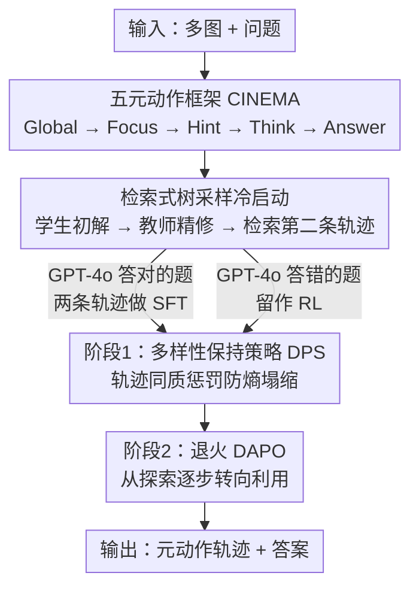

# Mimic Human Cognition, Master Multi-Image Reasoning: A Meta-Action Framework for Enhanced Visual Understanding

**会议**: CVPR 2026  
**论文**: [CVF Open Access](https://openaccess.thecvf.com/content/CVPR2026/html/Yin_Mimic_Human_Cognition_Master_Multi-Image_Reasoning_A_Meta-Action_Framework_for_CVPR_2026_paper.html)  
**代码**: 待确认  
**领域**: 多模态VLM / 多图推理 / 强化学习  
**关键词**: 多图推理, 元动作, 认知框架, 树采样冷启动, 多样性保持强化学习

## 一句话总结
针对多模态大模型（MLLM）在多图推理上明显掉点的问题，本文模仿人类认知，把多图推理拆成 Global / Focus / Hint / Think / Answer 五个结构化"元动作"（CINEMA 框架），用"检索式树采样"造两条高质量轨迹做冷启动、再用"多样性保持 + 退火 DAPO"两阶段强化学习防熵塌缩，让 7B 模型在 MUIR、MV-Math 等多图基准上反超 GPT-4o，并在视频与单图任务上同样涨点。

## 研究背景与动机

**领域现状**：MLLM 在单图理解上已很强，大量研究也在提升其单图推理能力。但现实应用（电商、自动驾驶、视频理解）常常要同时处理**多张**图像。

**现有痛点**：尽管单图任务表现优异，MLLM 在多图推理场景下性能明显退化。原因有二：(1) 图与图之间存在语义关联、空间排布、时间序列等**复杂关系**，需要超越"逐图孤立处理"的深度整合；(2) 关键信息常**散落**在图集里的特定几张图中，模型要在干扰图里精准定位并聚焦相关内容。

**核心矛盾**：现有方法要么只做单图内推理（如把多图任务拆成针对单图的子问题），要么用偏好优化处理"多图上下文里其实只问单图"的简化情形，**没有真正同时建模"逐图分析 + 全局图间关系"**。

**本文目标**：让模型既能聚焦单张图的局部细节、又能理解整组图的全局关系，从而在真正的多图推理上稳定涨点，并能泛化到视频与单图。

**切入角度**：从人类认知出发——人面对复杂多图问题时会走一套系统流程：先通读把握整体结构（全局），再聚焦关键图（局部细节），显式说出关键点与易错点能提升复杂推理表现。把这套"先全局后局部、显式点关键"的认知步骤搬给模型。

**核心 idea**：用一组离散的"元动作"显式建模人类推理步骤（CINEMA），并配套"造好轨迹（树采样冷启动）+ 保多样性地训（两阶段 RL）"的训练范式，让模型学会按人类认知顺序推理而非死记答案。

## 方法详解

### 整体框架
CINEMA（Cognition-Inspired Meta-Action Framework）以 Qwen2.5-VL-7B 为骨干，把多图推理统一成一条**元动作轨迹**：模型在 `<global>` / `<focus>` / `<hint>` / `<think>` / `<answer>` 这五个标签间组织推理，最后用 `<answer>` 给出答案（单图输入时禁用 `global`）。训练分两阶段：先做冷启动 SFT——用"检索式树采样"为每道题造**两条**不同的正确元动作轨迹做监督；再做两阶段强化学习——第一阶段用"多样性保持策略（DPS）"维持元动作层面的多样性、防止熵塌缩，第二阶段用退火的 DAPO 逐步从探索转向利用、巩固性能。训练数据共 56k 冷启动实例（每条含两条轨迹）+ 58k 强化学习实例，覆盖多图、多帧（视频）、单图三类任务。

### 关键设计

**1. 五个元动作（CINEMA）：用离散标签显式把多图推理拆成人类认知的五步**

多图推理掉点的根因是模型缺乏组织"先看全局、再抠局部、显式点关键、再综合推理"的结构。本文定义五个元动作：**Global** 分析多图之间的时间/空间/语义关系、把握整体结构；**Focus** 聚焦特定图的关键细节（关键线索常藏在某一张图里）；**Hint** 总结题目的关键点与易错/易混淆之处（多图间常有误导信息）；**Think** 整合线索与先验知识做逻辑推理；**Answer** 基于前面分析输出最终答案、且必为轨迹终点。每条合法轨迹形如 `<global>...<focus>...<hint>...<think>...<answer>A</answer>`，但起始动作可以是 Global/Focus/Hint/Think 中任意一个、顺序也可灵活组合，从而显式建模人类那种"非固定顺序却有章法"的认知流程。消融显示去掉任一元动作都会掉点（见下）。

**2. 检索式树采样（Retrieval-Based Tree Sampling）：用"学生—教师—检索"造每题两条高质量且多样的轨迹**

光定义元动作不够，还得有高质量轨迹教模型怎么用。本文借鉴"学生先自己做、老师先顺着学生思路再纠正、然后引入别的解法"的学习机制，分三步：**① 初始轨迹生成**——让较小的学生模型用元动作对题目做初解（不论对错都产出一条轨迹）；**② 教师引导精修**——把初始轨迹交给更强的 GPT-4o 教师，让它**顺着学生的动作轨迹**重做一遍、产出一条**保持原动作结构又保证正确**的轨迹；**③ 检索式多样采样**——维护若干"元动作树"（根节点可为 Global/Focus/Hint/Think、叶子必为 Answer）作为轨迹数据库，用 BGE 编码轨迹算余弦相似度，从与第二步轨迹**相似度低**的开始逐步检索到越来越相似的，直到找出一条**不同**的正确推理路径。于是每道题都配上**两条不同的正确轨迹**，既保证质量又扩大后续 RL 的探索空间。冷启动/RL 的数据划分也由此而来：GPT-4o 在第②步**答对**的题进第③步、作冷启动 SFT 的两条监督轨迹；GPT-4o **答错**的难题则留给强化学习。

**3. 两阶段强化学习（DPS → 退火 DAPO）：先在元动作层面保多样性防熵塌缩，再退火巩固性能**

标准 RL 常见熵塌缩——策略越训越确定、丧失探索力。本文在 DAPO 基础上分两阶段解决。**第一阶段·多样性保持策略 DPS**：核心假设是"鼓励多样解法能更好挖掘模型潜力、提升泛化"，于是对答对的题奖励多样响应，奖励定义为准确率与格式有效性的加权组合

$$R = 0.5 \cdot \Big(R_{acc}\cdot\big(R_{acc} - \tfrac{N-1}{G-1}\cdot 0.1\big)\Big) + 0.5 \cdot R_{format}$$

其中 $R_{acc}$、$R_{format}$ 为二值指示（答对/全部元动作合法为 1），$G$ 是采样组大小、$N$ 是组内**元动作模式相同**的轨迹数。惩罚项 $\tfrac{N-1}{G-1}$ 直接压制"扎堆用同质轨迹"，逼模型在保持正确的同时铺开多种解法（实际做动态采样时仍只用 $R_{acc}$ 作过滤）。**第二阶段·退火 DAPO**：用退火调度从探索逐步转向利用，复用第一阶段攒下的多样性、同时巩固性能。整套流程实测能全程维持比基线更高的熵、避免熵塌缩，且不牺牲训练准确率；Pass@K 实验进一步证明两阶段 RL 抬高了性能上限。具体训练中冷启动 2 个 epoch（lr 1e-5），RL 第一阶段 700 步 DPS + 第二阶段 300 步退火 DAPO，且 RL 阶段去掉 KL 与熵正则。

### 一个完整示例
以一道"四张图的正确顺序是哪个（A/B/C/D）"的多图排序题为例：模型先发 `<global>` 分析四张图之间的时序/语义关系，判断它们描述的是同一过程的不同阶段；再 `<focus>` 聚焦到能区分顺序的关键图（如某张图里出现了决定性的状态变化）；接着 `<hint>` 点出易错点（"两个选项只差中间两张图的先后，别看反"）；然后 `<think>` 综合线索与常识推断正确时序；最后 `<answer>A</answer>` 输出。训练时这道题会有两条结构不同但都正确的轨迹（如一条以 Global 起手、另一条以 Hint/Focus 起手），让模型学到"同一题可有多条合法认知路径"。

## 实验关键数据

### 多图 / 视频基准主结果（Table 1，部分，骨干 Qwen2.5-VL-7B）
| 模型 | MUIR | MMIU | MV-Math | EMMA | MIRB | MVBench | VideoMME | VideoMMMU | Overall |
|------|------|------|---------|------|------|---------|----------|-----------|---------|
| GPT-4o（闭源） | 68.0 | 55.7 | 32.1 | 32.7 | – | – | 75.0 | 61.2 | – |
| Qwen2.5-VL-7B（基线） | 57.9 | 50.6 | 26.7 | 20.4 | 48.3 | 62.6 | 56.7 | 45.8 | 48.2 |
| VISC 7B | 44.5 | 52.8 | – | – | 60.2 | 68.0 | – | – | – |
| VideoRFT 7B | 56.6 | 44.5 | 25.1 | 17.8 | 46.7 | 62.1 | 59.8 | 51.1 | 46.7 |
| **本文 Ours（DAPO）** | **71.6** | 53.3 | **36.9** | 29.3 | 55.2 | 66.5 | 59.4 | 49.0 | 54.3 |
| 本文 Ours（DPS+退火） | 71.0 | 52.2 | 35.0 | 28.6 | 55.7 | 66.8 | 61.0 | 50.1 | 54.3 |
| Δ vs 基线 | +13.7 | +2.7 | +10.2 | +8.9 | +6.9 | +3.9 | +2.7 | +3.2 | +6.1 |

本文模型在 MUIR、MV-Math 上**反超闭源 GPT-4o**（71.6>68.0、36.9>32.1），在所有三个视频基准上超过专门的视频推理模型；相对基线 Qwen2.5-VL 平均涨 +6.1。单图基准（Table 2）上 Overall 45.5、相对基线 +4.7，在 M3COT 上也超过 GPT-4V/GPT-4o，证明框架对单图任务同样泛化。

### 消融一：检索式树采样（Table 3，MUIR / MMIU / EMMA，SFT→RL）
| 冷启动方式 | MUIR(RL) | MMIU(RL) | EMMA(RL) | 说明 |
|-----------|----------|----------|----------|------|
| Direct Prompting（不训练直接提示元动作） | 33.8 | 36.9 | 14.1 | 远低于原模型，说明未训练模型不会用元动作 |
| 常规 CoT 冷启动 | 70.0 | 51.6 | 26.9 | `<think>...</think><answer>...` 单一格式 |
| 单条轨迹冷启动 | 65.1 | 52.2 | 27.9 | 每题只 1 条轨迹 |
| **本文 两条轨迹** | **71.6** | **53.3** | **29.3** | RL 下三项最优 |

### 消融二：各元动作贡献（Table 4，逐个移除）
| 配置 | MUIR | MIRB | VideoMME |
|------|------|------|----------|
| 完整 CINEMA | 71.0 | 55.7 | 61.0 |
| w/o global | 63.4 | 52.6 | 57.1 |
| w/o focus | 61.6 | 53.2 | 57.5 |
| w/o hint | 63.5 | 52.3 | 56.8 |
| w/o think | 60.1 | 53.6 | 57.1 |

### 关键发现
- **两条轨迹优于单条与常规 CoT**：RL 后三个基准均最优，说明"每题多条正确解法"的监督能更好打开探索空间。
- **每个元动作都不可或缺**：去掉 think 掉最多（MUIR 71.0→60.1），去掉 focus 次之（→61.6），证明"全局把握 + 聚焦细节 + 点关键 + 综合推理"缺一不可。
- **两阶段 RL 抗熵塌缩**：DPS 阶段维持中等熵、退火阶段渐降，全程熵高于基线却不损训练准确率；Pass@K（K=2/4/8/16）全面优于基线，性能上限更高、采样更多样。
- **图越多越显优势**：在 MUIR（2–9 图）、MMIU（2–32 图）上，即便输入图超过 17 张本文仍显著超基线；MUIR 的 12 个任务里几乎全涨，连训练集未含的 Geographic/Cartoon/Visual Grounding 也涨，说明泛化好。

## 亮点与洞察
- **把"人类认知步骤"离散成可监督、可强化、可消融的元动作标签**，比模糊的 CoT 更结构化：既能逐个 ablate 验证每步价值，又能在 RL 里以"元动作模式"为单位度量多样性，是一个干净的抽象。
- **检索式树采样"学生—教师—检索"造双轨迹** 是便宜又有效的冷启动配方：用小模型铺路、强模型纠错、再用 BGE 相似度检索补一条不同解，既保质量又保多样性，可迁移到其他需要多样推理监督的任务。
- **DPS 的同质惩罚项 $\tfrac{N-1}{G-1}$ 把"多样性"直接写进奖励**，且作用在元动作层面而非 token/答案层面，给"如何防 RL 熵塌缩"提供了一个具体可抄的解法。
- "未训练模型直接提示元动作反而比原模型更差"是一个有警示意义的观察：结构化推理框架必须配套训练，不能只靠 prompt。

## 局限与展望
- **依赖强教师与额外模型**：轨迹精修靠 GPT-4o 教师、轨迹检索靠 BGE 编码，数据质量上限受教师能力与潜在偏差影响，论文未量化这部分噪声。
- **元动作集合固定**：五个元动作是人工设计的，是否对所有多图任务都最优、能否自适应扩展未充分讨论。
- **骨干单一**：主要在 Qwen2.5-VL-7B 上验证，更大/更小骨干及不同架构上的可迁移性有待确认。⚠️ Pass@K、熵曲线等多为图示结论，具体数值需查原文图。
- 改进方向：让元动作集合或顺序可学习/可扩展；减少对单一闭源教师的依赖；探索把该范式用到更长视频与更大图集。

## 相关工作与启发
- **vs VISC（Focus-Centric Visual Chain）**：VISC 把多图任务拆成一串针对单图的子问题，偏"局部分解"；CINEMA 用 Global 显式建模图间全局关系，兼顾局部与全局。
- **vs MIA-DPO**：用无关图增广单图数据做偏好优化，主要处理"多图上下文里其实只问单图"的简化情形；本文面向真正需要跨图整合的多图推理。
- **vs 常规 RLHF / DPO**：它们依赖奖励模型或偏好标注；本文走纯 RL（结果奖励 + 格式奖励），并在元动作层面加多样性惩罚控熵，不需偏好标注。
- **vs 其他控熵 RL（熵/KL 正则、clip-higher）**：多数在单个响应内部控熵；本文强调**跨响应**、在元动作模式层面鼓励多样性，思路互补。

## 评分
- 新颖性: ⭐⭐⭐⭐ 元动作抽象 + 双轨迹树采样 + 元动作层面多样性 RL 组合清晰，单点多为已有思路的精巧改造。
- 实验充分度: ⭐⭐⭐⭐⭐ 覆盖多图/视频/单图十余个基准 + 5 个 RQ + 双消融 + Pass@K + 熵分析，非常充分。
- 写作质量: ⭐⭐⭐⭐ 框架与训练范式讲得清楚，但部分关键结论（Pass@K、熵曲线）仅以图呈现。
- 价值: ⭐⭐⭐⭐⭐ 用 7B 反超 GPT-4o 于多图基准、且泛化到视频与单图，对多图推理与可控 RL 都有实用价值。

<!-- RELATED:START -->

## 相关论文

- [\[CVPR 2026\] Will Multimodal Models Be Dazzled by Multi-Image Visual Puzzles?](will_multimodal_models_be_dazzled_by_multi-image_visual_puzzles.md)
- [\[CVPR 2026\] EgoMind: Activating Spatial Cognition through Linguistic Reasoning in MLLMs](egomind_activating_spatial_cognition_through_linguistic_reasoning_in_mllms.md)
- [\[CVPR 2026\] KEC: Hierarchical Textual Knowledge for Enhanced Image Clustering](kec_hierarchical_textual_knowledge_clustering.md)
- [\[CVPR 2026\] MA-Bench: Towards Fine-grained Micro-Action Understanding](ma-bench_towards_fine-grained_micro-action_understanding.md)
- [\[ACL 2026\] SlideAgent: Hierarchical Agentic Framework for Multi-Page Visual Document Understanding](../../ACL2026/multimodal_vlm/slideagent_hierarchical_agentic_framework_for_multi-page_visual_document_underst.md)

<!-- RELATED:END -->
