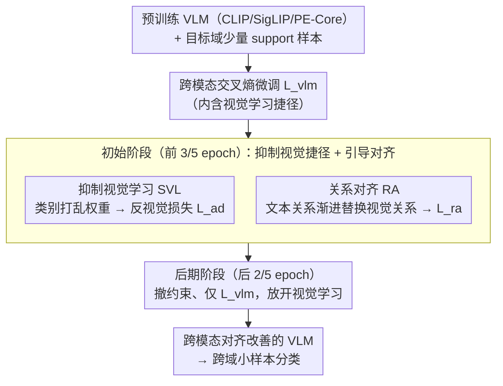

# Mind the Discriminability Trap in Source-Free Cross-domain Few-shot Learning

**会议**: CVPR2026  
**arXiv**: [2603.13341](https://arxiv.org/abs/2603.13341)  
**代码**: [zhenyuZ-HUST/CVPR26-Mind-the-Discriminability-Trap](https://github.com/zhenyuZ-HUST/CVPR26-Mind-the-Discriminability-Trap)  
**领域**: 医学图像 / 跨域小样本学习  
**关键词**: Source-Free CDFSL, Vision-Language Model, 跨模态对齐, 视觉判别性陷阱, CLIP微调

## 一句话总结

揭示了在 VLM 的跨域小样本微调中，增强视觉判别性反而损害跨模态对齐（"判别性陷阱"），提出 SVL + RA 两个即插即用模块来抑制视觉学习捷径并引导跨模态对齐，在 4 个 CDFSL 数据集和 11 个 FSL 数据集上取得 SOTA。

## 研究背景与动机

**Source-Free CDFSL 场景**：目标域（医学/遥感图像）仅有极少量标注数据，且无法访问源域数据，需要在预训练 VLM 上直接微调。

**VLM 的跨模态分类范式**：CLIP/SigLIP 等通过计算图像-文本特征的余弦相似度进行分类，跨模态对齐质量直接决定性能。

**传统认知 vs 实际现象**：传统视觉模型中，视觉特征越具判别性，分类越好；但在 VLM-based SF-CDFSL 中，作者发现增强视觉判别性反而降低跨模态分类准确率。

**跨域场景下模态错位严重**：已有研究表明 VLM 在跨域场景中视觉-文本对齐被严重破坏，微调需要修复这种错位。

**视觉学习是损失函数的"捷径"**：交叉熵损失 $\mathcal{L}_{\text{vlm}}$ 内含视觉学习和跨模态学习两个方向，视觉学习可以在不改善跨模态对齐的情况下降低损失，类似"双阀排水"中的旁路阀门。

**现有方法忽视此问题**：无论是 prompt learning（CoOp/Maple）、adapter（LP++/LDC）还是 LoRA 微调，均未考虑视觉学习的捷径效应。

## 方法详解

### 整体框架

这篇要治的是 VLM 跨域小样本微调里一个反直觉的现象：增强视觉判别性反而损害跨模态对齐（“判别性陷阱”）。根源在于交叉熵损失 $\mathcal{L}_{\text{vlm}}$ 内含视觉学习和跨模态学习两条路，视觉学习是一条“捷径”——能降损失但不改善跨模态对齐，类似“双阀排水”里的旁路阀门。作者在 CLIP/SigLIP/PE-Core 上采用**两阶段训练**配上 SVL、RA 两个即插即用模块：初始阶段（前 3/5 epoch，即 250 epoch 里的前 150）叠加 SVL 的反视觉损失 $\mathcal{L}_{\text{ad}}$ 与 RA 的关系对齐损失 $\mathcal{L}_{\text{ra}}$，抵制视觉捷径、引导跨模态对齐；后期阶段（后 2/5 epoch）撤掉这两项约束、只留 $\mathcal{L}_{\text{vlm}}$，恢复正常微调、放开视觉学习。

### 关键设计

**1. 抑制视觉学习 SVL（Suppressing Visual Learning）：用“类别打乱权重”堵住视觉捷径**

视觉学习让同类视觉特征聚拢、异类远离，看似在提升判别性，实则绕过了跨模态对齐、把本该用于对齐的优化资源分流走了。SVL 提出反视觉损失 $\mathcal{L}_{\text{ad}}$ 来扰动这条捷径：正常视觉学习用与类别一一对应的分类器权重把同类特征拉到一起，SVL 反其道而行，从 support set 随机采样视觉特征拼出“类别打乱”（class-shuffle）的分类器权重 $w'$，再照常算交叉熵——由于权重不再对应真实类别，优化它会**打散**而非强化判别性聚类，逼模型转而走跨模态路径去降 $\mathcal{L}_{\text{vlm}}$。这里的设计取舍很关键：作者验证过直接把视觉损失取负（$\mathcal{L}_{\text{ad}}=-\mathcal{L}_v$）或用随机初始化权重（Noise Proto）都无效甚至有害，原因是有效的扰动必须仍落在合法的视觉特征分布内，而“打乱真实样本特征”恰好满足这一点。

**2. 关系对齐 RA（Relationship Alignment）：给视觉模态内部关系一个正确方向**

仅抵制视觉学习还不够——抹掉错路之后还得给视觉模态内部关系指一个对的方向。RA 构造一个随训练推进逐渐用文本模态关系替代视觉模态关系的融合关系矩阵

$$A^{\text{fuse}} = \left(1 - \frac{e}{E}\right) A^v + \frac{e}{E} A^t[L,L]$$

再用对齐损失 $\mathcal{L}_{\text{ra}} = D_{KL}(A^v \| A^{\text{fuse}})$ 拉齐。渐进策略是关键：初期 $A^{\text{fuse}} \approx A^v$ 起抵制作用、避免视觉捷径，后期逐步引入文本语义关系引导视觉特征对齐。

### 损失函数 / 训练策略

两阶段损失：初期叠加 RA 与 SVL 约束以抵制视觉捷径、引导对齐，后期只留 $\mathcal{L}_{\text{vlm}}$ 恢复正常微调：

$$\mathcal{L} = \begin{cases} \mathcal{L}_{\text{vlm}} + \beta \mathcal{L}_{\text{ra}} + \lambda \mathcal{L}_{\text{ad}} & \text{(初始阶段)} \\ \mathcal{L}_{\text{vlm}} & \text{(后期阶段)} \end{cases}$$

超参数：$\lambda = 0.1$（视觉分支）或 $0.001$（文本分支），$\beta = 3$。

## 实验

### 主实验：4 个 CDFSL 数据集（5-way 1-shot / 5-shot）

| 方法 | Backbone | ISIC | EuroSAT | CropDisease | ChestX | Avg |
|------|----------|------|---------|-------------|--------|-----|
| CLIP-LoRA-Vision | ViT/CLIP | 36.40 | 81.72 | 84.62 | 21.86 | 56.07 |
| **CLIP-LoRA + Ours** | ViT/CLIP | **38.12** | **85.02** | **87.20** | **22.68** | **58.26** |
| PE-Core-LoRA | ViT/PE-Core | 40.89 | 84.49 | 91.75 | 22.02 | 59.78 |
| **PE-Core-LoRA + Ours** | ViT/PE-Core | **45.01** | **86.83** | **93.03** | **23.66** | **62.14** |

5-shot 场景下 PE-Core-LoRA + Ours 平均准确率达 **70.29%**（vs 基线 68.64%）。

### 模态对齐分析（Gap Shift 实验）

| 方法 | CropDisease Gap↓ | EuroSAT Gap↓ | ISIC Gap↓ | ChestX Gap↓ |
|------|:-:|:-:|:-:|:-:|
| Fine-tune | 0.014 | 0.048 | 0.406 | 0.356 |
| FT + $\mathcal{L}_v$ | 0.022 | 0.072 | 0.626 | 0.742 |
| FT + $\mathcal{L}_{ad}$ | 0.012 | 0.024 | 0.191 | 0.249 |
| **FT + $\mathcal{L}_{ad}$ + $\mathcal{L}_{ra}$** | **0.009** | **0.027** | **0.171** | **0.238** |

Gap 越小表示模态对齐越好，增强视觉学习显著恶化对齐，而 SVL+RA 大幅改善。

### 消融实验

| SVL | RA | CropDisease | EuroSAT | ISIC | ChestX | Avg |
|:---:|:--:|:-----------:|:-------:|:----:|:------:|:---:|
| ✗ | ✗ | 84.6 | 81.7 | 36.4 | 21.8 | 56.07 |
| ✓ | ✗ | 86.4 | 83.8 | 37.6 | 22.4 | 57.55 |
| ✗ | ✓ | 85.9 | 83.2 | 37.4 | 22.2 | 57.17 |
| ✓ | ✓ | **87.2** | **85.0** | **38.1** | **22.7** | **58.26** |

### 关键发现

- **抑制时机**：在训练前期抑制视觉学习效果最佳（Begin），后期抑制反而有害（Last 比不用更差）
- **计算开销几乎为零**：参数增加 0.0028%，FLOPs 增加 0.000021%，准确率提升 3.9%
- **泛化性强**：在 CLIP、SigLIP2、PE-Core 三种 VLM 以及 CoOp/Maple/LoRA 三类微调范式上均有效
- **11 个 FSL 数据集**上同样取得各 shot 设定下的最优性能

## 亮点

- **洞察深刻**：首次揭示 VLM 微调中视觉判别性学习是跨模态对齐的"捷径"，用理论推导+实验验证+可视化三重证据链
- **双阀排水类比直观**：将损失优化比作双阀排水，视觉学习是旁路阀，分流了本应用于跨模态对齐的资源
- **方法极简**：SVL + RA 仅需几行代码，即插即用，适配各类 VLM 微调方法
- **零额外开销**：参数和计算量几乎不变，却带来显著性能提升
- **Gap Shift 实验设计巧妙**：通过手动调整模态间距测量对齐程度，直观定量

## 局限性

- 仅在分类任务上验证，未探索检测/分割等下游任务
- 两阶段训练的切换点（3/5 epoch）是固定比例，未自适应调整
- 超参数 $\lambda, \beta$ 对不同域差异场景的敏感性讨论有限
- "反视觉学习"可能在域差异较小时不必要甚至有害（如 in-domain FSL）
- 文本 prompt 采用简单模板 "a photo of [class]"，未结合更丰富的文本描述

## 相关工作

- **SF-CDFSL**：StepSTP、FWT 等聚焦无源域跨域小样本，但未分析视觉学习的负面影响
- **VLM 微调**：CoOp（prompt learning）、CLIP-Adapter（adapter）、CLIP-LoRA（LoRA）均采用交叉熵微调，受判别性陷阱影响
- **模态 Gap 研究**：Liang et al. 首次发现模态 gap；后续工作分析了跨域场景中的模态错位，但认为微调足以修复
- **捷径学习**：在传统视觉模型中已被研究，本文首次将其引入 VLM 跨模态微调场景

## 评分

- 新颖性: ⭐⭐⭐⭐⭐ — 首次揭示 VLM 微调中视觉判别性与跨模态对齐的矛盾
- 实验充分度: ⭐⭐⭐⭐⭐ — 多 VLM backbone + 多微调范式 + 15 个数据集 + 理论分析 + 消融 + 可视化
- 写作质量: ⭐⭐⭐⭐⭐ — 双阀排水类比精彩，论证逻辑严密
- 价值: ⭐⭐⭐⭐ — 即插即用的通用方法，但仅限分类任务

<!-- RELATED:START -->

## 相关论文

- [\[CVPR 2026\] Addressing Exacerbated Attention Sink for Source-Free Cross-Domain Few-Shot Learning](addressing_exacerbated_attention_sink_for_source-free_cross-domain_few-shot_lear.md)
- [\[CVPR 2026\] Vision-Language Model Guided Source-Free Domain Adaptation via Optimal Transport](vision-language_model_guided_source-free_domain_adaptation_via_optimal_transport.md)
- [\[CVPR 2026\] Pointing at Parts: Training-Free Few-Shot Grounding in Multimodal LLMs](pointing_at_parts_training-free_few-shot_grounding_in_multimodal_llms.md)
- [\[CVPR 2026\] Towards Multimodal Domain Generalization with Few Labels](towards_multimodal_domain_generalization_with_few_labels.md)
- [\[ICCV 2025\] Causal Disentanglement and Cross-Modal Alignment for Enhanced Few-Shot Learning](../../ICCV2025/multimodal_vlm/causal_disentanglement_and_cross-modal_alignment_for_enhanced_few-shot_learning.md)

<!-- RELATED:END -->
