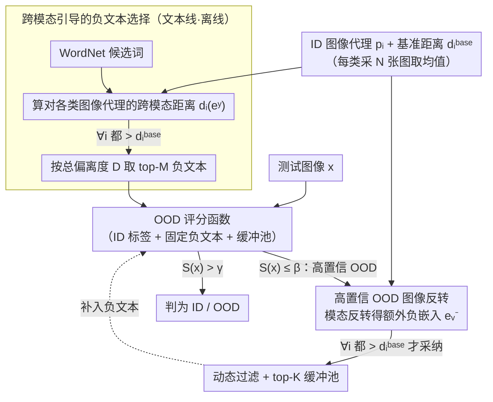

# Mind the Way You Select Negative Texts: Pursuing the Distance Consistency in OOD Detection with VLMs

**会议**: CVPR 2026  
**arXiv**: [2603.02618](https://arxiv.org/abs/2603.02618)  
**代码**: [https://github.com/ZhikangXu0112/InterNeg](https://github.com/ZhikangXu0112/InterNeg)  
**领域**: 多模态VLM  
**关键词**: OOD检测, CLIP, 跨模态距离, 负文本选择, 零样本

## 一句话总结
指出现有基于 VLM 的 OOD 检测方法使用模态内距离（文本-文本或图像-图像）选择负文本，与 CLIP 优化的跨模态距离不一致，提出 InterNeg 从文本和视觉两个视角系统地利用跨模态距离，在 ImageNet 上实现 FPR95 降低 3.47%。

## 研究背景与动机

**领域现状**：VLM（如 CLIP）在 OOD 检测中表现强劲。NegLabel 方法从 WordNet 中挖掘与 ID 标签文本距离大的负文本来近似 OOD 标签，简单有效，催生了一系列后续工作（CLIPScope、CSP、AdaNeg）。

**现有痛点**：NegLabel 及其后续方法在选择负文本时使用模态内距离（文本空间中与 ID 标签的距离），生成图像代理时使用图像-图像距离。但 CLIP 是优化跨模态距离（图像-文本对）的——模态内距离大不保证跨模态距离也大。

**核心矛盾**：模态内距离和跨模态距离的不一致导致两类 ID 误分类：(1) Max-OOD 主导——某个负文本与 ID 图像的跨模态距离反而小于 ID 标签；(2) Sum-OOD 主导——多个负文本的聚合分数超过 ID 分数。

**本文目标**：如何确保 OOD 检测全流程使用与 CLIP 优化目标一致的跨模态距离？

**切入角度**：定义 ID 跨模态基准距离 $d_i^{base} = 1 - \cos(\mathbf{e}_i, \mathbf{p}_i)$，用此基准筛选和生成负文本。

**核心 idea**：从文本视角（跨模态引导的负文本选择）和视觉视角（高置信 OOD 图像反转为额外负文本嵌入）两个方向统一使用跨模态距离。

## 方法详解

### 整体框架
InterNeg 想解决的核心问题是：CLIP 的相似度是在跨模态（图像-文本）空间里优化出来的，可现有 OOD 检测方法挑负文本时却用模态内距离（文本-文本），两者口径不一致，导致挑出来的"伪 OOD 标签"在 CLIP 真正看图打分的空间里未必远离 ID。InterNeg 因此把整条流程的度量统一到跨模态距离上，分文本和视觉两条线走：文本线在推理前离线挑选 WordNet 负文本时改用图像代理来量距离，视觉线则在推理过程中把那些明显是 OOD 的测试图像反过来"翻译"成新的负文本嵌入、动态补进一个缓冲池。两条线产出的负文本最后汇到同一个 NegLabel 式打分函数里给测试图像判 ID/OOD，全程不需要对 ID 数据或额外数据做训练。

### 关键设计

**1. 跨模态引导的负文本选择：用图像代理而非文本-文本距离来量"够不够远"**

NegLabel 之类的方法在文本空间里挑离 ID 标签远的词当负文本，但文本空间远不等于 CLIP 打分时的跨模态空间远。InterNeg 先给每个 ID 类随机采 $N$ 张图像、编码取均值得到图像代理 $\mathbf{p}_i$，并用类别文本嵌入 $\mathbf{e}_i$ 算出该类的跨模态基准距离 $d_i^{base} = 1 - \cos(\mathbf{e}_i, \mathbf{p}_i)$——这就是"一个真正属于本类的样本离类中心应有的跨模态距离"。对每个候选负文本 $y$，再算它对各类图像代理的跨模态距离 $d_i(\mathbf{e}^y)$，只有当它对**所有** ID 类都比基准更远（$\forall i,\ d_i(\mathbf{e}^y) > d_i^{base}$）时才保留，并按总偏离度

$$D(\mathbf{e}^y) = \sum_{i=1}^{C} \big(d_i(\mathbf{e}^y) - d_i^{base}\big)$$

从大到小取 top-$M$。这样筛出来的负文本是在 CLIP 实际比对的那个空间里确实远离每一个 ID 分布的，直接堵住了"某负文本对某张 ID 图反而比 ID 标签更近"（Max-OOD）这类误分类的源头。

**2. 高置信 OOD 图像反转：把测试流里明显是 OOD 的图像变成额外负文本**

固定的 WordNet 负文本覆盖不到测试时真正遇到的 OOD 分布，于是 InterNeg 在推理过程中顺手挖：当一张测试样本的 OOD 分数低到 $S(\mathbf{x}) \le \beta$、判定为高置信 OOD 时，通过模态反转把它的图像嵌入投射回文本空间，得到一个额外的负文本嵌入 $\mathbf{e}_v^-$。关键是这条线沿用了设计 1 同一把尺子：额外嵌入也必须满足 $\forall i,\ d_i(\mathbf{e}_v^-) > d_i^{base}$ 才会被采纳，把那些其实贴近某个 ID 类的噪声样本挡在外面。被采纳的嵌入进入一个固定容量 $K$ 的缓冲池，按偏离度只保留 top-$K$，于是负文本集合随着测试数据流动态扩充、且越扩越对路——这正是 Near-OOD 这种近域难样本上提升最大的原因。

**3. OOD 评分函数：在更干净、还在增长的负文本集合上沿用 NegLabel 的打分**

最终分数把 ID 标签、筛选后的固定负文本、以及缓冲池里的额外负嵌入合在一起算，公式结构与 NegLabel 一脉相承。差别不在公式而在输入：参与打分的负文本都经过跨模态基准过滤、质量更高，数量还随推理动态增长，因此对聚合型误分类（多个负文本累加分数压过 ID，即 Sum-OOD）也更有抵抗力。

## 实验关键数据

### 主实验（ImageNet-1K，CLIP ViT-B/16）

| OOD 数据集 | 指标 | NegLabel | AdaNeg | InterNeg | 提升 |
|-----------|------|----------|--------|----------|------|
| 四数据集均值 | AUROC↑ | 基线 | 次优 | **最优** | +0.77% |
| 四数据集均值 | FPR95↓ | 基线 | 次优 | **最优** | -3.47% |

### Near-OOD 挑战性基准

| 基准 | AUROC 提升 | FPR95 降低 |
|------|-----------|-----------|
| Near-OOD | +5.50% | -2.09% |

### 消融实验
- 跨模态负文本选择：显著减少 Max-OOD 和 Sum-OOD 两类 ID 误分类
- 额外负嵌入：在 Near-OOD 场景提升尤为明显
- 动态过滤机制有效排除了噪声 OOD 图像的干扰
- 对负文本数量 $M$ 和缓冲池大小 $K$ 均有稳健的超参鲁棒性

## 亮点
- 首次明确指出 VLM OOD 检测中模态内/跨模态距离不一致问题，视角新颖且重要
- 方法简洁（无需训练、无需额外数据），但效果显著，FPR95 降低 3.47%
- 从文本和视觉双视角统一使用跨模态距离，理论逻辑自洽
- 在最具挑战性的 Near-OOD 场景下提升最大（AUROC +5.50%）
- Max-OOD 和 Sum-OOD 两类误分类的分析框架提供了清晰的诊断视角

### 消融实验
- 跨模态负文本选择 vs 模态内选择：Max-OOD 误分类率下降约 40%，Sum-OOD 误分类率同样显著降低
- 额外负嵌入的贡献：在 Near-OOD 场景提升最大（AUROC +3.2%），因为 Near-OOD 样本更难区分
- 动态过滤机制：去除过滤后性能下降，证明噪声 OOD 样本的干扰不可忽略
- 超参鲁棒性：对负文本数量 $M$（500-2000）和缓冲池大小 $K$（50-500）均不敏感
- 不同 CLIP backbone（ViT-B/16 vs ViT-L/14）上均有一致提升

## 局限与展望
- 需要少量 ID 训练样本计算图像代理（每类 $N$ 张，虽然量很少但不是完全零样本）
- 高置信 OOD 图像反转质量依赖于测试数据的分布组成
- 模态反转的具体实现细节（如映射网络结构）值得进一步优化
- 在测试流（streaming）场景下，缓冲池的更新策略需要更多研究
- 可探索将跨模态距离一致性原则推广到其他 VLM 下游任务（如检索、分类）
- 当 ID 类别数量极大（如 ImageNet-21K）时基准距离计算开销增大

### 实验补充
- 在 iNaturalist 单数据集上 AUROC 达到最优，证明对细粒度类别同样有效
- 与训练方法（如 LoCoOp）相比，无需任何训练即可取得可比甚至更优的效果

<!-- RELATED:START -->

## 相关论文

- [\[ICCV 2025\] NegRefine: Refining Negative Label-Based Zero-Shot OOD Detection](../../ICCV2025/multimodal_vlm/negrefine_refining_negative_label-based_zero-shot_ood_detection.md)
- [\[CVPR 2026\] Activation Matters: Test-time Activated Negative Labels for OOD Detection with Vision-Language Models](activation_matters_test-time_activated_negative_labels_for_ood_detection_with_vi.md)
- [\[AAAI 2026\] Cross-modal Proxy Evolving for OOD Detection with Vision-Language Models](../../AAAI2026/multimodal_vlm/cross-modal_proxy_evolving_for_ood_detection_with_vision-lan.md)
- [\[CVPR 2026\] Rethinking VLMs for Image Forgery Detection and Localization](rethinking_vlms_for_image_forgery_detection_and_localization.md)
- [\[CVPR 2026\] MindPower: Enabling Theory-of-Mind Reasoning in VLM-based Embodied Agents](mindpower_enabling_theoryofmind_reasoning_in_vlmba.md)

<!-- RELATED:END -->
