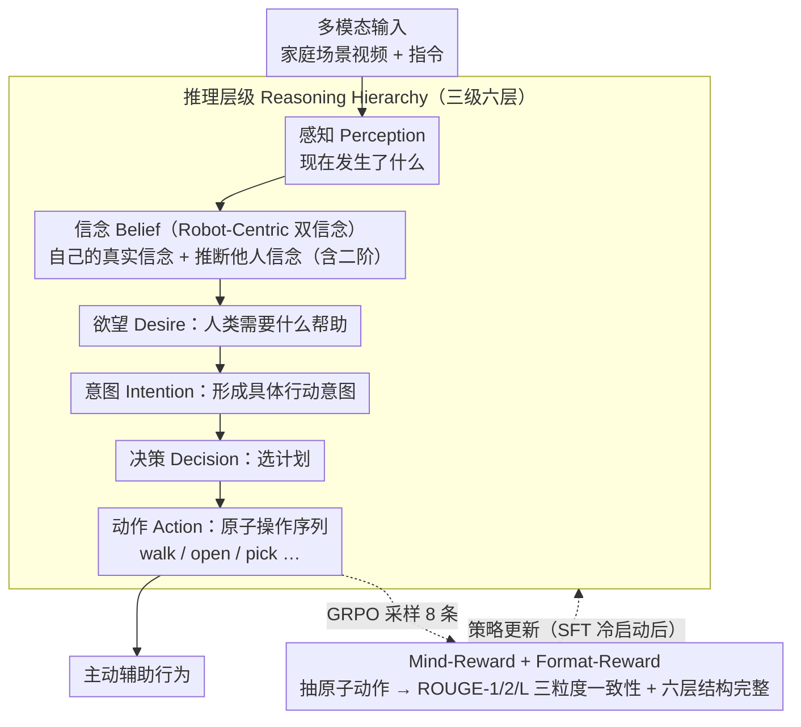

# MindPower: Enabling Theory-of-Mind Reasoning in VLM-based Embodied Agents

**会议**: CVPR 2026  
**arXiv**: [2511.23055](https://arxiv.org/abs/2511.23055)  
**代码**: [zhangdaxia22.github.io/MindPower/](https://zhangdaxia22.github.io/MindPower/) (Benchmark)  
**领域**: 多模态VLM  
**关键词**: Theory of Mind, BDI推理, 具身Agent, Mind-Reward, GRPO

## 一句话总结

MindPower提出以机器人为中心的心智理论（ToM）推理框架，将感知→信念→欲望→意图→决策→行动组织为六层推理层级，并用Mind-Reward（基于GRPO）优化推理一致性，在决策和动作生成上分别超过GPT-4o 12.77%和12.49%。

## 研究背景与动机

**领域现状**：具身Agent领域快速发展——PaLM-E、RoboBench、Smart-Help等实现了任务分解和执行。VLM（GPT-4o、Gemini、Qwen-VL）在感知层表现出色，但在推断人类意图和主动辅助方面仍然薄弱。现有ToM benchmark（MuMA-ToM、MMToM-QA）只评估对视频中人物心理状态的推断。

**现有痛点**：(1) 现有VLM-based agent只能执行显式指令，缺乏推断人类信念/欲望/意图的能力；(2) 现有ToM benchmark采用"角色中心"视角——只推断视频中人物的心理状态，不涉及agent自身视角的推理，也不要求生成决策和动作；(3) VLM在感知层容易被场景偏见干扰（如看到厨房就预测"清洁"而非推理实际意图）。

**核心矛盾**：agent需要理解"别人在想什么"才能主动帮忙，但还需要从"自己的视角"推理——"我知道苹果实际在冰箱里，虽然Alice以为苹果在桌上"。现有benchmark和方法均未建立这种双视角推理闭环。

**本文目标** 让具身agent从自身视角出发推断人类心理状态（信念、欲望、意图），并基于此做出主动的决策和行动。

**切入角度**：将认知科学的BDI框架（Belief-Desire-Intention）系统化地引入具身agent，构建三级六层的连续推理层级，并用结构化奖励函数（Mind-Reward）通过RL优化推理一致性。

**核心 idea**：用三级六层的Robot-Centric BDI推理层级将感知连接到行动，并用原子动作匹配的Mind-Reward通过GRPO优化推理链的一致性。

## 方法详解

### 整体框架

MindPower想让具身agent不再只会执行显式指令，而是能从自己的视角推断人类的信念、欲望、意图，再据此主动决策行动。它由三块拼成：一个评测台（**MindPower Benchmark**，590个 VirtualHome + ThreeDWorld 家庭场景，含错误信念纠正与隐式目标推断两类任务）、一套把感知接到行动的推理层级（**Reasoning Hierarchy**，三级六层），以及一个让推理链自洽的强化信号（**Mind-Reward + GRPO**）。Robot-Centric 双信念视角内嵌在推理层级的信念层里，是把它和只评测他人心理的旧 benchmark 区分开的关键。整条pipeline以 Qwen2.5-VL-7B 为底座，先 SFT 冷启动建立基本推理能力，再用 GRPO 把推理链拧紧。

### 关键设计

**1. Reasoning Hierarchy：把"一步到位"的决策拆成可追溯的三级六层推理链**

现有VLM看到画面直接吐决策，中间没有任何可解释的推理过程，错了也不知道错在哪一步。MindPower把决策形式化成一条从感知流向行动的链：Level-1 感知 `<Perception>` 先回答"现在发生了什么"；Level-2 心智推理依次走 `<Belief>`（推断自己和人类的信念，且支持二阶信念——"我认为 Alice 认为苹果在桌上"）→ `<Desire>`（"Alice 需要什么帮助"）→ `<Intention>`（形成具体行动意图）；Level-3 落到 `<Decision>`（选计划）→ `<Action>`（输出原子操作序列如 `walk(fridge), open(fridge), pick(apple)`）。这样每个动作背后都挂着一条可回溯的信念-欲望-意图证据链，比直接出答案更可解释也更一致。

**2. Robot-Centric 视角：让 agent 同时维护自己和别人的心理模型**

MuMA-ToM、MMToM-QA 这类 ToM benchmark 只让模型对视频里人物的心理做选择题，agent 自己始终是旁观者。但真正的协作要求 agent 同时持有两套信念：在错误信念纠正任务里，agent 先看到物体被移动，当人类返回寻找时，它必须同时推出"Alice 认为苹果在桌上（她的错误信念）"和"我知道苹果实际在冰箱里（我的真实信念）"，才能得出"我应该去冰箱取苹果给她"。这种自我信念与他人信念的并行建模，正是 Role-Centric 评测缺失、而协助行为不可或缺的一环。

**3. Mind-Reward：用原子动作匹配把推理链的一致性变成可优化的奖励**

推理链是连续的，从感知到行动存在时序与逻辑依赖，只盯最终动作打分管不住中间步骤会不会跑偏。Mind-Reward 先用 LLM（Qwen3-Max）把每一层推理输出抽成原子动作序列，再算三个不同粒度的对齐指标——原子准确度（ROUGE-1）、局部一致性（ROUGE-2）、全局一致性（ROUGE-L），合成过程级奖励：

$$R_{Mind} = \alpha_1 R_{atomic} + \alpha_2 R_{local} + \alpha_3 R_{global}$$

再配一个 Format-Reward 保证六层结构完整。相比黑盒地给最终输出打分，这种把奖励铺到每一步的做法能直接约束中间推理的质量。

### 一个完整示例：错误信念纠正

以 Alice 找苹果的场景走一遍六层：**感知**——agent 看到 Alice 把苹果放在桌上后离开，自己随后观察到有人把苹果挪进了冰箱；**信念**——一阶"苹果实际在冰箱"，二阶"Alice 仍以为苹果在桌上"，两者冲突即检测到错误信念；**欲望**——推断 Alice 回来是想拿苹果；**意图**——决定替她消除信息差，主动取苹果；**决策**——选择"去冰箱取苹果并交给 Alice"而非"提醒她苹果不在桌上"；**行动**——输出 `walk(fridge), open(fridge), pick(apple), walk(Alice), give(apple)`。整条链清楚展示了 Robot-Centric 双信念如何一路驱动到原子动作。

### 损失函数 / 训练策略

- 两阶段训练：(1) SFT 冷启动（5 epochs），建立基本推理能力；(2) GRPO 强化（400 iterations，每次 8 个生成样本），用 Mind-Reward + Format-Reward
- GRPO 通过组内相对优势 $A_i = (R_i - \text{mean}(\{R_j\})) / \text{std}(\{R_j\})$ 更新策略
- 训练在单卡 H800 上完成，基础模型 Qwen2.5-VL-7B

## 实验关键数据

### 主实验

| 方法 | Decision (S) | Action SR | Action AC | BPC |
|------|-------------|-----------|-----------|-----|
| GPT-4o (图像) | 34.35 | 1.82 | 2.91 | 8.05 |
| Gemini-2.5 Pro | 33.87 | 2.08 | 2.54 | 8.56 |
| Video-R1 (开源最佳) | 30.33 | 1.43 | 1.72 | 6.45 |
| Qwen2.5-VL-7B (base) | 26.56 | 0.29 | 0.22 | 6.07 |
| **Ours (SFT+Mind-Reward)** | **47.12** | **11.75** | **15.40** | **8.87** |
| Human Baseline | 56.66 | 19.37 | 26.26 | 8.19 |

### 消融实验

| 训练配置 | Action AC | Decision (S) | BPC |
|----------|-----------|-------------|-----|
| Qwen2.5-VL-7B (无训练) | 0.22 | 26.56 | 6.07 |
| 仅Mind-Reward (无SFT) | 0.40 | - | - |
| 仅SFT (无RL) | 10.48 | 42.35 | 8.32 |
| **SFT + Mind-Reward** | **15.40** | **47.12** | **8.87** |

| 推理策略 (GPT-4o) | Decision | Action AC |
|-------------------|----------|-----------|
| 直接输出 (无推理) | 33.11 | 0.82 |
| 标准CoT (`<think>`) | 29.46 | 0.90 |
| **MindPower Hierarchy** | **34.35** | **2.91** |

### 关键发现

- 仅SFT就带来巨大提升（Action AC: 0.22→10.48），说明BDI推理层级结构本身有效
- RL在SFT基础上进一步提升约5个点（10.48→15.40），但无SFT的RL几乎无效（0.40）
- MindPower Hierarchy显著优于标准CoT（决策+4.89%）——结构化BDI推理比通用"思考"更有效
- 开源VLM严重缺乏Robot-Centric视角——容易被场景偏见干扰（如厨房→清洁，卧室→整理）
- 与Human Baseline仍有显著差距（Decision: 47.12 vs 56.66, Action: 15.40 vs 26.26）

## 亮点与洞察

- 将认知科学BDI框架系统化引入具身agent，形成可解释的推理链——每个决策都有可追溯的信念支撑
- Robot-Centric视角是核心创新——agent不仅推断他人心理状态，还显式建模自己的信念，实现二阶推理
- Mind-Reward将推理质量分解为原子-局部-全局三个粒度的一致性评估，比黑盒LLM评分更可控
- 两个任务设计有洞察力：错误信念纠正（agent察觉物体被移动）和隐式目标推断（从搜索行为推断需求）

## 局限与展望

- 数据集仅590个场景，全部来自模拟器（VirtualHome + ThreeDWorld），场景多样性受限
- 动作空间较粗（高层原子操作如`walk(fridge)`），未涉及底层运动控制
- Mind-Reward依赖Qwen3-Max提取原子动作，引入额外LLM依赖
- 开放式评估的自动指标（BERTScore、ROUGE）能否真正反映推理质量存疑
- 只评估了7B模型，未验证更大规模模型的表现

## 相关工作与启发

- **MuMA-ToM / MMToM-QA**: 只做角色心理推断的选择题，MindPower要求从自身视角做完整BDI推理+动作生成
- **Smart-Help / AToM-Bot**: 做人机交互辅助但缺乏显式心智推理，MindPower明确建模信念不一致的检测与纠正
- **Video-R1 / VideoChat-R1**: 视频理解的RL训练，但不涉及ToM推理和具身决策
- **启发**: BDI推理层级可作为"结构化CoT"推广到其他需要推理他人意图的任务；Mind-Reward的过程拆解+原子匹配思路对其他过程奖励设计有参考价值

## 评分

- ⭐⭐⭐⭐⭐ 新颖性: Robot-Centric ToM + BDI推理层级是全新视角，认知科学+AI的交叉创新
- ⭐⭐⭐⭐ 实验充分度: 对比多个闭源/开源VLM + 人类基线 + 详细消融，但数据集规模偏小
- ⭐⭐⭐⭐ 写作质量: 概念清晰层次分明，三级六层的形式化框架易于理解
- ⭐⭐⭐⭐ 价值: 为具身agent赋予ToM能力是重要方向，实际应用仍有距离但方向明确

<!-- RELATED:START -->

## 相关论文

- [\[CVPR 2026\] Video-Only ToM: Enhancing Theory of Mind in Multimodal Large Language Models](video-only_tom_enhancing_theory_of_mind_in_multimodal_large_language_models.md)
- [\[ACL 2026\] GroupToM-Bench: Benchmarking Group Theory of Mind and Nonlinear Social Emergence in MLLMs](../../ACL2026/multimodal_vlm/grouptom-bench_benchmarking_group_theory_of_mind_and_nonlinear_social_emergence_.md)
- [\[CVPR 2026\] HiconAgent: History Context-aware Policy Optimization for GUI Agents](hiconagent_history_context-aware_policy_optimization_for_gui_agents.md)
- [\[ICML 2025\] Overcoming Multi-step Complexity in Multimodal Theory-of-Mind Reasoning: A Scalable Bayesian Planner](../../ICML2025/multimodal_vlm/overcoming_multi-step_complexity_in_multimodal_theory-of-mind_reasoning_a_scalab.md)
- [\[ICML 2025\] From Black Boxes to Transparent Minds: Evaluating and Enhancing the Theory of Mind in Multimodal Large Language Models](../../ICML2025/multimodal_vlm/from_black_boxes_to_transparent_minds_evaluating_and_enhancing_the_theory_of_min.md)

<!-- RELATED:END -->
