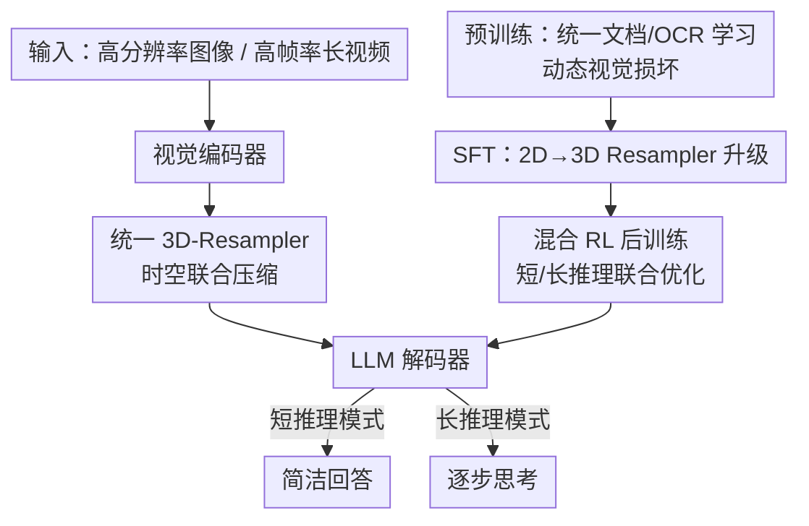

# MiniCPM-V 4.5: Cooking Efficient MLLMs via Architecture, Data and Training Recipes

**会议**: CVPR 2026  
**论文**: [CVF Open Access](https://openaccess.thecvf.com/content/CVPR2026/html/Yu_MiniCPM-V_4.5_Cooking_Efficient_MLLMs_via_Architecture_Data_and_Training_CVPR_2026_paper.html)  
**代码**: 有（MiniCPM-V Code and Model，官方开源）  
**领域**: 多模态VLM / MLLM效率  
**关键词**: 高效MLLM、3D-Resampler、文档OCR统一学习、混合强化学习、长视频理解

## 一句话总结
MiniCPM-V 4.5 用「统一 3D-Resampler 压缩视觉 token + 动态损坏统一文档/OCR 学习 + 短长双模式混合 RL」三招把一个 8B MLLM 做到既高效又强，在 OpenCompass 上以 77.0 分超过 GPT-4o-latest 和 Qwen2.5-VL 72B，且 VideoMME 推理只用约 10% 的时间。

## 研究背景与动机
**领域现状**：多模态大模型（MLLM）正快速进步，但训练与推理的成本（GPU 显存、算力、数据工程）随能力增长而急剧上升，效率已成为「把强模型做得人人可用、可规模化」的核心瓶颈。作者把效率问题拆成三块：模型架构、训练数据、训练方法。

**现有痛点**：（1）**架构层**——高分辨率图像编码会产生大量视觉 token，视频更夸张：一段 6 秒、2fps、448×448 的低清视频，Qwen2.5-VL 要 1,536 个 token、InternVL3 要 3,072 个 token，长序列直接把训练/推理成本拉爆。（2）**数据层**——现代 MLLM 越来越依赖文档（论文、教材 PDF）里的高质量多学科知识，但主流做法是先用脆弱的外部解析器把 PDF 转成图文交错序列，复杂排版下经常出错（如把图注放到对应图片之前、让图片"不可见"），要么学错知识、要么得花大量人力修 bug。（3）**训练层**——RL 能提升复杂推理，但代价是输出极度啰嗦，连"这是什么明显物体"这种简单任务都要写一大段思考，训练和推理都低效。

**核心矛盾**：能力提升与效率之间存在系统性 trade-off——更高分辨率/更多帧、更多文档知识、更强推理，都意味着更多 token、更重的数据流水线、更长的输出。

**本文目标**：在 8B 规模上同时拿下三件事——视觉 token 高度压缩、文档知识/OCR 不依赖解析器、推理可控不冗长。

**切入角度**：作者不追求"把单个组件做复杂"，而是用尽量简单、可统一的设计去吃掉冗余（视频的时空冗余、文档解析的中间环节、长短推理的重复训练）。

**核心 idea**：用一套统一架构（3D-Resampler 同时编码图像与视频）+ 一个统一学习目标（从损坏文档图像预测原文）+ 一种混合 RL（短长模式联合优化），把效率瓶颈逐个打掉。

## 方法详解

### 整体框架
MiniCPM-V 4.5 是一个 8B MLLM，推理侧由三个模块串成：**轻量视觉编码器**（像素→视觉特征）→ **统一 3D-Resampler**（把图像/视频压成紧凑 token，吃掉时空冗余）→ **LLM 解码器**（理解图/视频/文本并生成文本，可在"短推理"和"长推理"两种风格间切换）。其中 3D-Resampler 对图像最高 16× 压缩、对视频在此基础上再 6× 压缩。

训练侧是一条"烹饪配方"：**预训练**（三阶段渐进解冻，约 620B token，内嵌统一文档/OCR 学习）→ **SFT**（90B token，并在此阶段把 2D-Resampler 轻量升级成 3D-Resampler）→ **混合 RL 后训练**（658k prompt，短长模式联合优化）。三个核心设计分别落在架构、数据、训练三条线上。

### 关键设计

**1. 统一 3D-Resampler：用一套权重把图像和视频都压成紧凑 token**

视觉 token 太多是 MLLM 的首要效率瓶颈，视频尤甚。作者把图像用的 2D-Resampler 扩展成 3D-Resampler：图像侧沿用 LLaVA-UHD 的切片策略，对每个 slice 用带 2D 空间位置编码的可学习 query 通过 cross-attention 产生定长序列（如 448×448 图只用 64 token）；视频侧先沿时间维把帧分成若干"包"（package），同一个包内相邻帧视觉信息高度冗余，于是对每个包的帧特征用 cross-attention 重采样成定长序列，query 同时带 2D 空间位置编码和**时间位置编码**，最后把所有包的 token 拼起来。相比 2D-Resampler 额外拿到约 6× 的时间压缩，一段 6 秒、2fps、448×448 的视频只需 **128 个 token**，比代表性 MLLM 低 12×–24×。因为 resampler 对输入形状不敏感，图像和视频可以**共享同一套架构与权重**，所以从 2D 升到 3D 只需在 SFT 阶段用少量高质量视频数据轻量过一遍。作者还发现这种"简单架构"反而略胜专门设计的视频压缩方法 QuicksViewer，体现了简单设计的可扩展优势。

**2. 统一文档/OCR 学习：用动态视觉损坏把"认字"和"理解文档知识"合成一个目标**

为了甩开脆弱的外部 PDF 解析器，作者提出一个洞察：文档知识获取与文字识别的最大区别，仅在于**文字在图像里是否可见**。于是把两者统一成单一目标——**从损坏的文档图像预测原始文本**。对每个文档，取一部分文字区域当 ground truth，再随机施加不同强度的损坏：① **低损坏（增强 OCR）**——文字仍可辨认，模型靠文字识别就能预测；② **中损坏（融合推理）**——单字高度模糊不可靠，模型必须把噪声视觉线索、文档上下文和内部知识融合起来重建原文；③ **高损坏/完全遮挡（上下文推理与文档知识学习）**——没有字符级线索，模型只能从多模态上下文和内部知识去推断，直接培养文档级理解。这样既消掉了为修解析失败而做的繁重数据工程，又避免了"过度增强 OCR 让文字不可辨→逼模型硬猜→幻觉"的老问题（以前只能用很小很保守的增强）。更妙的是知识学习与 OCR 目标能在同一个训练 batch 里自由混合，最大化数据利用率，产出一个通用的文档理解模型。

**3. 混合 RL 后训练：短/长两种推理模式联合优化，可控又省训练量**

RL 提升推理但导致输出冗长。作者让模型同时具备**短推理模式**（快答）和**长推理模式**（显式 step-by-step 思考），模式由 prompt 控制，两种行为先在 SFT 阶段初始化，再用混合 RL 联合优化——rollout 时在两种模式间随机切换，用 GRPO 优化并去掉 KL 和熵损失以稳定训练。奖励是四项加权合成：准确率 $R_{acc}$、格式 $R_{format}$、重复惩罚 $R_{rep}$ 和偏好奖励 $R_{rm}$，

$$R = R_{acc} + R_{format} + R_{rep} + \tfrac{1}{2}\tilde{R}_{rm},$$

其中 $\tilde{R}_{rm} = (R_{rm}-\bar{R}_{rm})/\sigma(R_{rm})$ 是同一 prompt 下采样响应做标准化后的偏好分。奖励质量上还做了三重控制：人工巡检标签准确率、对短答案用规则验证（98% 奖励准确率）/对复杂自然语言用 RLPR 的概率式奖励、再叠一个奖励模型提供密集偏好信号。混合策略带来跨模式泛化（长推理的分析深度反哺短推理、短推理的直接性精炼长推理），只用纯长推理策略 **70.5%** 的训练 token 就达到更好性能。此外还集成 RLAIF-V（并扩展到视频）来压低幻觉。

### 损失函数 / 训练策略
预训练用 Warmup-Stable-Decay 学习率调度，稳定段固定 $5\times10^{-5}$、衰减到 $1\times10^{-5}$；SFT 用 cosine 从 $1\times10^{-5}$ 衰减到 $1\times10^{-6}$；Long-CoT 与 3D-Resampler 阶段从 SFT checkpoint 续训，warmup 到 $5\times10^{-6}$ 再衰减到 $1\times10^{-6}$；RL 用 GRPO（无熵损失、无 KL 惩罚）。预训练分三阶段渐进解冻：warm-up 只训 resampler（其余冻结）→ 解冻视觉编码器用富文本/图文数据增强感知 → 全参端到端训最高质量数据。

## 实验关键数据

> 指标说明：**OpenCompass 平均分**是 8 个常用基准的综合分（其中 MMStar、MMVet、HallusionBench、MathVista、MMMU 用长推理模式评测）；**VideoMME** 衡量视频理解，w/o sub 表示评测时不给字幕；推理效率以完成整套评测的墙钟时间（Time）和 GPU 显存（Mem）衡量，均在 8×A100 上测得。

### 主实验

单图理解与综合能力（节选 Table 1）：

| 模型 | 规模 | OpenCompass↑ | OCRBench↑ | MMHal-Score↑ |
|------|------|------|------|------|
| GPT-4o-latest | — | 75.4 | 86.7 | 4.2 |
| Qwen2.5-VL | 72B | 76.1 | 89.5 | 4.2 |
| GLM-4.1V | 9B | 76.6 | 84.2 | 4.6 |
| Qwen3-VL Thinking | 8B | 77.5 | 85.8 | 4.7 |
| **MiniCPM-V 4.5** | **8B** | **77.0** | **87.4** | **5.0** |

推理效率（Table 3，8×A100）：

| 任务 | 模型 | 规模 | 分数↑ | 时间↓ | 显存↓ |
|------|------|------|------|------|------|
| OpenCompass | GLM-4.1V-thinking | 10.3B | 76.6 | 17.5h | — |
| OpenCompass | MiMo-VL-7B-RL | 8.3B | 76.4 | 11.0h | — |
| OpenCompass | **MiniCPM-V 4.5** | 8.7B | **77.0** | **7.5h** | — |
| Video-MME | Qwen2.5-VL-7B | 8.3B | 71.6 | 3.00h | 60G |
| Video-MME | GLM-4.1V-thinking | 10.3B | 73.6 | 2.63h | 32G |
| Video-MME | **MiniCPM-V 4.5** | 8.7B | 73.5 | **0.26h** | **28G** |

在 OpenCompass 上比 GLM-4.1V 更强且只用 **42.9%** 的时间；Video-MME 上以 73.5 的接近分数把推理时间从 2.63h 砍到 0.26h（近 10×），显存也最低。

### 消融实验

| 配置 | 关键指标 | 说明 |
|------|---------|------|
| SFT 基线 | OpenCompass 73.6 | 未做 RL |
| 仅长推理 RL | 77.0（4.4B RL token） | 性能强但训练量大 |
| 混合 RL（关长推理评测） | 74.9 | 关掉长推理仍超 SFT 基线 |
| 混合 RL（开长推理评测） | 77.1（3.1B RL token） | 性能最佳且**省 ~30% 训练 token** |
| 外部解析器（文档学习） | MMMU 49.0 / AI2D 74.9 / OCRBench 576 | 旧范式 |
| 统一学习范式 | MMMU 51.4 / AI2D 76.5 / OCRBench 617 | 知识与 OCR 双涨 |
| 2D-Resampler | VideoMME 65.5（64 token/帧） | token 多 |
| QuicksViewer | VideoMME 66.9（21.3 token/帧） | 专用视频压缩 |
| **3D-Resampler** | VideoMME 67.3（21.3 token/帧） | 同预算下最高 |

### 关键发现
- **混合 RL 是"既要又要"的关键**：它拿到最佳长推理性能，且即便评测时关掉长推理也超过 SFT 基线，说明两种模式共享底层感知/认知技能、能互相增益；同时只花纯长推理约 70%（消融里 3.1B vs 4.4B RL token）的训练量。
- **概率式奖励补规则验证的短板**：VR+PR（规则+RLPR 概率奖励）在训练步数放大后持续、显著超过仅规则方案，且响应长度/熵更稳定——规则只能覆盖少量简单数据，复杂自然语言答案靠概率奖励才有有效信号。
- **3D-Resampler 用 1/3 的 token 反超专用方法**：同 token 预算下略胜 QuicksViewer，印证"简单架构更可扩展"。
- **统一文档学习双向受益**：直接从文档图像学习，知识密集评测与文字识别同时涨点，绕开了脆弱解析器引入的噪声。

## 亮点与洞察
- **"认字 = 看不清的极端"这个统一视角很巧**：把 OCR 和文档知识理解归结为"文字可见度"的连续谱，再用一个"从损坏图像预测原文"的目标覆盖整个谱，既省掉解析器又顺手治了过度增强 OCR 的幻觉，是数据侧最漂亮的一招。
- **resampler 对输入形状不敏感→图像视频共享权重**：让 2D→3D 升级几乎"免费"（SFT 阶段少量视频数据即可），这种"统一架构带来低升级成本"的思路可迁移到任何需要扩展模态/维度的编码器。
- **短长双模式可控推理**：把"该快答还是该深思"交给 prompt 控制并联合优化，直接对冲了 RL 模型"什么都长篇大论"的效率病。

## 局限与展望
- **依赖大规模高质量数据与算力**：620B 预训练 + 90B SFT + 658k RL prompt 的配方，复现门槛仍高；论文把大量数据构造细节放在附录，正文难以独立复现。⚠️ 缓存为正文，附录细节未含。
- **3D-Resampler 的包大小/帧率靠训练时随机增强获得鲁棒性**，最优超参在不同设备/场景如何选择，论文给的是"可在推理时调"的灵活性，缺乏系统的选择准则。
- **幻觉仍是软肋**：尽管 RLAIF-V 把幻觉指标做到同档最优（MMHal-Score 5.0、ObjHalBench 最低），但视频幻觉作者也承认尤其严重，属于持续挑战。
- **可改进方向**：把动态视觉损坏的"损坏强度"做成可学习/自适应课程，而非固定三档；探索 3D-Resampler 之上更激进的跨包冗余建模。

## 相关工作与启发
- **vs Qwen2.5-VL / InternVL3（高 token 编码）**: 它们对短视频要上千 token，本文用 3D-Resampler 把同样视频压到 128 token，核心区别是显式利用时间冗余做联合时空压缩，本文在效率上压倒性领先、精度持平或更好。
- **vs QuicksViewer（专用视频压缩）**: 它专门为视频设计复杂压缩，本文用一个图像/视频共享的简单 resampler，同 token 预算下反超（67.3 vs 66.9），印证简单架构的可扩展性。
- **vs 依赖外部解析器的文档 MLLM**: 它们靠 PDF 解析器转图文序列、复杂排版易错，本文直接从文档图像端到端学习，绕开中间环节、知识与 OCR 双涨。
- **vs 纯长推理 RL 模型（GLM-4.1V、MiMo-VL-RL）**: 它们倾向输出冗长，本文混合短长模式联合优化，在更高/相当性能下推理时间只用 42.9%–68.2%。

## 评分
- 新颖性: ⭐⭐⭐⭐ 三个改进各自不算颠覆，但"动态视觉损坏统一文档/OCR"这个视角和"图像视频共享 resampler"的组合很有巧思。
- 实验充分度: ⭐⭐⭐⭐⭐ 覆盖 STEM/文档/幻觉/多图/视频/综合六大类基准，且每个核心设计都有对应消融与效率对照。
- 写作质量: ⭐⭐⭐⭐ 结构清晰、动机—方法—消融对得上，但大量构造细节压在附录，正文略显"配方提纲"。
- 价值: ⭐⭐⭐⭐⭐ 8B 开源模型超 GPT-4o-latest 与 72B 模型且推理快约 10×，对"高效可部署 MLLM"是很实用的落地参考。

<!-- RELATED:START -->

## 相关论文

- [\[CVPR 2026\] HoneyBee: Data Recipes for Vision-Language Reasoners](honeybee_data_recipes_for_vision-language_reasoners.md)
- [\[CVPR 2026\] Parameter-Efficient Adaptation for MLLMs via Implicit Modality Decomposition](parameter-efficient_adaptation_for_mllms_via_implicit_modality_decomposition.md)
- [\[CVPR 2026\] TableMix: Enhancing Multimodal Table Reasoning in MLLMs from a Data-Centric Perspective](tablemix_enhancing_multimodal_table_reasoning_in_mllms_from_a_data-centric_persp.md)
- [\[CVPR 2026\] Why Does RL Generalize Better Than SFT? A Data-Centric Perspective on VLM Post-Training](why_does_rl_generalize_better_than_sft_a_data-centric_perspective_on_vlm_post-tr.md)
- [\[CVPR 2026\] POINTS-Long: Adaptive Dual-Mode Visual Reasoning in MLLMs](points-long_adaptive_dual-mode_visual_reasoning_in_mllms.md)

<!-- RELATED:END -->
