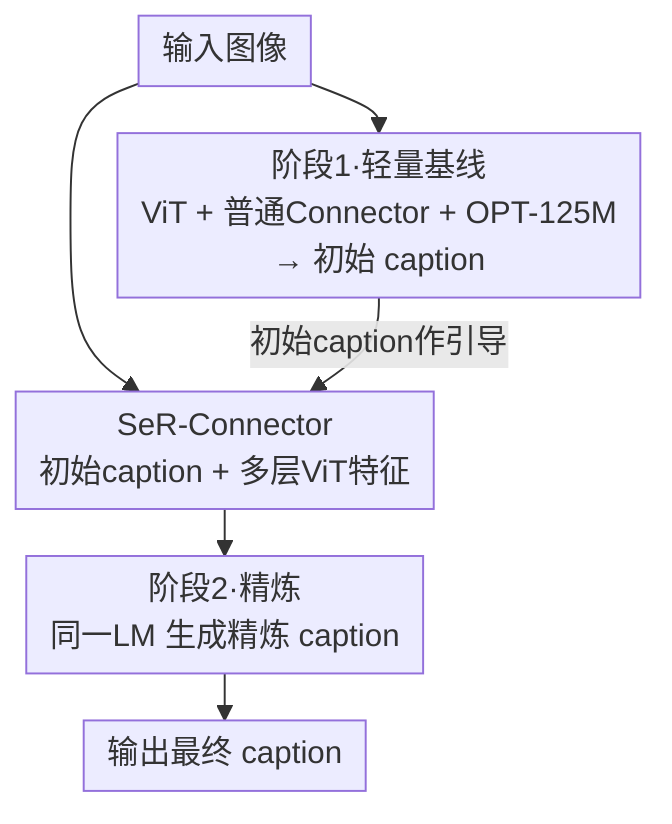

# MM-SeR: Multimodal Self-Refinement for Lightweight Image Captioning

**会议**: CVPR 2026  
**论文**: [CVF Open Access](https://openaccess.thecvf.com/content/CVPR2026/html/Song_MM-SeR_Multimodal_Self-Refinement_for_Lightweight_Image_Captioning_CVPR_2026_paper.html)  
**代码**: 待确认  
**领域**: 多模态VLM / 图像描述 / 边缘部署  
**关键词**: 轻量图像描述, 自我精炼, 多模态, 端侧部署, 视觉特征

## 一句话总结
作者先发现把 MLLM 里的 7B 语言模型换成 125M 的 OPT 也能在事实性图像描述上逼近大模型，再提出多模态自我精炼框架 MM-SeR——让这个轻量模型先生成粗描述、再用粗描述引导提取更细的视觉特征做二次精炼，在单句/详细描述乃至长视频问答上都拿到接近大模型的效果，同时参数省 93%、推理时间省 97%。

## 研究背景与动机

**领域现状**：视频聊天机器人、导航/探索机器人等系统普遍依赖「流式图像描述」把视觉输入转成文字，再喂给下游 LLM。当前主流做法是直接用多模态大模型（MLLM，如 LLaVA-1.5-7B、Qwen-VL）来做这件事。

**现有痛点**：MLLM 算力开销巨大。论文 Table 1 指出 LLaVA-1.5-7B 这类模型在 FP16 下显存占用动辄 8GB+、34B/72B 更是 68GB/140GB+，远超 iPhone、Galaxy 这类边缘设备的可用内存；而云端 API 又依赖稳定网络，在灾难救援等场景不可用。重复地对多帧/多场景反复描述还会进一步放大开销。

**核心矛盾**：图像描述在效率与性能之间存在矛盾——要么用大模型保性能但部署不了，要么用小模型能部署但能力受限。作者进一步追问：图像描述真的难到非用 MLLM 不可吗？

**本文目标**：① 验证一个极小的语言模型能否胜任图像描述；② 在此基础上补上轻量模型与大模型之间的「可靠性差距」。

**切入角度**：作者观察到 MLLM 之所以强大，主要靠大 LLM 的复杂推理能力，但事实性图像描述本质是「枚举画面里的视觉细节」，更依赖感知grounding 而非抽象推理。于是他们直接把 LLaVA-1.5 里的 LLaMA-7B 换成 OPT-125M（小 56×），结果在 MS COCO 上居然能打平 MLLM，证明这个假设。

**核心 idea**：用「先看全局粗描述、再聚焦显著区域精炼」的人类视觉过程，给轻量描述模型加一个多模态自我精炼阶段（MM-SeR），用模型自己产出的初始 caption 去引导提取更细的多层视觉特征，从而在不堆大模型的前提下补齐细粒度描述能力。

## 方法详解

### 整体框架
MM-SeR 的出发点是：传统描述模型都是「单次 (single-pass)」——图像只过一遍就吐描述，容易出现「视觉盲点」（视觉特征模糊、抓不住细节）。MM-SeR 把它扩展成「初始 + 精炼」两阶段：模型先生成一个捕捉整体场景的初始 caption，再用这个（可能粗糙的）caption 去引导一个专用连接器（SeR-Connector）从视觉编码器的多层特征里抽取更清晰、更有信息量的视觉线索，最后用同一个语言模型生成精炼后的最终描述。

整条流水线：输入图像 → ViT 编码 → 标准 Connector → 轻量 LM 生成初始 caption → SeR-Connector 同时吃「初始 caption + 多层 ViT 特征」→ 同一 LM 生成精炼 caption。注意初始阶段和精炼阶段共享同一个语言模型，区别只在连接器：精炼用的是专门设计的 SeR-Connector（而非初始阶段那种普通两层 MLP）。

### 关键设计

**1. 轻量 captioner 基线：用 OPT-125M 换掉 7B LLM，证明描述不需要大模型推理**

针对「MLLM 算力部署不了」这个痛点，作者沿用 LLaVA-1.5 的架构，只把 LLaMA-7B 换成 OPT-125M（在 LLaVA-7B 中 LLM 占了约 96% 的算力）。训练上先在 558K Concept-balanced 数据上预训练多模态连接器，再在 MS COCO / DCI / ShareGPT4V 上微调，其余配置（batch size、学习率）全部保持 LLaVA 原样。结果出人意料：这个 450M 总参数的模型在 MS COCO 上 CIDEr 比同样用 OPT-125M 的 SmallCap 高 6.9 分，并逼近 7B 级 MLLM。这条「负结果变正结果」的发现支撑了全文论点——事实性描述靠的是感知 grounding，不是抽象推理，因此小模型够用。

**2. SeR-Connector + 两阶段精炼：用初始 caption 引导「看重点 + 看细节」**

轻量模型仍有可靠性差距，作者归因于「视觉盲点」——视觉特征模糊导致抓不住细粒度。MM-SeR 用两个互补输入来补：① **看重点 (looking at what matters)**：把初始 caption 喂给 SeR-Connector 和 LM，让模型像人一样顺着文本里点名的关键实体（「a cat relaxing on a brown chair」里的 cat、chair）去定位相关区域并集中注意力；② **看细节 (looking in detail)**：不像有些工作额外加 DINOv2 这类辅助编码器（Interleaved MoF 加 DINOv2 多 300M 参数、+66.7%），而是榨干现有 ViT——从 $m$ 个选定层各取 $N$ 个 $d$ 维视觉 token，沿通道维拼成 $N\times(md)$ 的层次化表示。SeR-Connector 本身用一组 Transformer block 实现（含 self-attention + 位置编码），把这两路输入融合后送给 LM 做精炼。这一阶段只额外引入约 50M 参数和一次推理，开销相比 MLLM 仍然极小。

**3. 伪初始 caption 训练：靠「小扰动 → 定向修正」逼模型学会精炼而非重写**

精炼阶段训练有个陷阱：若直接拿模型当下第一遍产出的 caption 当输入、真值 $c_k$ 当目标，两者常语义错位（如初始「a table in front of a window」对真值「a cat sitting on a table」），模型会学成「无视初始 caption、重新生成」而非精炼。作者改用 GPT-4o-mini 对真值 $c_k$ 做实体/属性/关系上的小扰动，得到伪初始 caption $\hat{c}_k$（如「a cat sitting on a chair」→「a dog sitting on a chair」），让 SeR-Connector 在 $\hat{c}_k$ 与多层视觉特征上学着抽出更利于纠错的特征。由于 $\hat{c}_k$ 只在少数 token 位置 $E_k=\{t\mid \hat{c}_{k,t}\neq c_{k,t}\}$ 偏离真值，序列级目标

$$\mathcal{L}(\theta) = -\mathbb{E}\Big[\sum_j \log \pi_\theta\big(c_{k,j}\mid i_k, \hat{c}_k, c_{k,<j}\big)\Big]$$

的梯度主要集中在 $E_k$ 上，形成「定向优化」——保留对的部分、只改错的部分。记 $\Delta_k(\theta)=\log\pi_\theta(c_k\mid i_k,\hat{c}_k)-\log\pi_\theta(\hat{c}_k\mid i_k,\hat{c}_k)$，则 $\mathcal{L}\propto-\mathbb{E}[\Delta_k]$，最小化 loss 等价于最大化精炼 caption 相对粗描述的期望 margin。作者指出这与 DPO 把 $c_k/\hat{c}_k$ 当「优/劣响应」的哲学相近，但区别在于 DPO 对称处理两者，而 MM-SeR 给它们分配了「输入 / 目标」两种不同角色。

> ⚠️ **框架↔关键设计一致**：框架图里的三个贡献节点（轻量基线、SeR-Connector、精炼生成）对应设计 1 与设计 2；设计 3 是支撑精炼阶段能学起来的训练策略，不在推理流中但决定 SeR-Connector 是否有效。

### 损失函数 / 训练策略
两阶段训练：阶段一按标准 LLaVA 流程训练初始 caption 生成（跑 10 epoch）；阶段二用伪初始 caption 训练精炼（跑 2 epoch），目标即上面的序列级交叉熵 $\mathcal{L}(\theta)$。两阶段均 batch size 256、学习率 $2\times10^{-5}$，在 2 张 A6000 上完成；主实验语言模型为 OPT-125M，并用 Qwen2.5-500M 验证泛化性。

## 实验关键数据

### 主实验
在 MS COCO（单句）与 ShareGPT4V & DCI（详细描述）上，450M 的轻量模型即可逼近 7B/10B MLLM；加上 MM-SeR 后稳定提升。

| 数据集 | 模型 | 参数 | CIDEr | GPT(MLLM-Judge) |
|--------|------|------|-------|------|
| MS COCO | LLaVA-1.5 (大模型参照) | 7.3B | 133.7 | 2.93 |
| MS COCO | 本文轻量基线 | 450M | 129.6 | 2.74 |
| MS COCO | + MM-SeR(①+②) | 500M | 133.5 (+3.9) | 2.82 |
| ShareGPT4V&DCI | Cambrian (大模型参照) | 10.5B | 38.7 | 3.00 |
| ShareGPT4V&DCI | 本文轻量基线 | 450M | 40.5 | 2.74 |
| ShareGPT4V&DCI | + MM-SeR(①+②) | 500M | 43.6 (+3.1) | 3.02 |

> 注：① 指初始 caption 输入、② 指多层视觉特征。轻量基线本身在详细描述上 CIDEr 已超过 10.5B 的 Cambrian，加 MM-SeR 后进一步 +3.1。

效率方面（Table 5，对 100 张流式图像计时）：LLaVA-1.5 需 274.49s，本文基线仅 5.55s（↓97.97%），加 MM-SeR 为 7.44s（↓97.28%）。

### 消融实验
MM-SeR 的两个输入分别拆开看贡献（以 ShareGPT4V&DCI 的 CIDEr / CAPT 为例）：

| 配置 | CIDEr | CAPT | 说明 |
|------|-------|------|------|
| 轻量基线（无精炼） | 40.5 | 45.9 | 单次描述 |
| + 仅① 初始caption | 42.8 | 47.1 | 只给文本引导 |
| + 仅② 多层特征 | 43.1 | 47.6 | 只给细节特征 |
| 单次但喂② | 42.5 | 46.5 | 不做精炼、只塞多层特征 → 增益有限 |
| + MM-SeR(①+②) 完整 | 43.6 | 48.4 | 两路缺一不可 |

### 关键发现
- **两个输入互补、缺一不可**：单独①或②都有提升，但「单次推理直接塞多层特征②」增益很有限（CIDEr +2.0），说明真正起作用的是「精炼这个步骤」而非单纯加特征。
- **迭代精炼的收益取决于模型容量**：对 OPT-125M 做多轮精炼几乎无额外提升（refinement ×2/×3 与 ×1 持平甚至略降），但 OPT-1.3B 在 2–3 轮上才有 meaningful 增益——小模型缺乏利用多步精炼信号的容量，与 LLM 自我精炼「容量越大收益越大」的趋势一致。
- **框架可推广到更大 LM**：在 OPT-1.3B / LLaMA-2-7B 上 MM-SeR 仍稳定提升（CAPT +1.2 / +0.9，CIDEr 最高 +4.4），说明这是个通用框架而非只对极小模型有效。
- **长视频 QA 下游验证**：在 LLoVi 的长程 VideoQA 设置里（用 Qwen2.5-14B 统一作答以隔离 caption 质量），本文 specialist 取 49.3、加 MM-SeR 到 50.8，逼近 LLaVA-1.5 generalist 的 51.1，但参数少 14×、时间 ~5min vs ~29min。

## 亮点与洞察
- **「负结果→正结果」的叙事很扎实**：先用一个反直觉发现（125M LM 也能打平 MLLM）打破「描述必须靠大模型」的默认假设，再顺势提出精炼框架补齐短板，逻辑闭环漂亮。这条 insight（描述靠感知 grounding 而非抽象推理）本身就有传播价值。
- **把 LLM 的 self-refinement 第一次落到多模态**：以往 self-refine 都在纯文本 LLM 里打转，本文让精炼直接吃视觉证据（多层 ViT 特征），并用注意力可视化证明精炼阶段注意力确实从「全图弥散」收敛到「关键词对应区域」。
- **用伪初始 caption 绕开训练错位**：把「精炼训练」转化成「小扰动定向纠错」，并给出与 DPO 的对照（非对称地分配输入/目标角色），这个 trick 可迁移到任何「先生成后修订」的多模态任务（如代码描述、报告生成）。
- **不加辅助编码器、只榨多层特征**：对比 Interleaved MoF 加 DINOv2（+300M），本文只额外 ~50M，体现「在现有编码器里挖信息」而非「堆模块」的工程取向。

## 局限与展望
- **小模型吃不下多轮精炼**：迭代精炼对 OPT-125M 无效，说明本框架的收益上限受语言模型容量限制；作者把「动态调整迭代次数」列为未来方向。
- **精炼依赖 GPT-4o-mini 造伪初始 caption**：训练数据构造引入了对外部大模型的依赖（虽然只在训练期），其扰动质量会影响精炼训练效果；论文未充分讨论扰动策略的敏感性（细节在附录 G.1）。
- **仍是 +1 次推理的开销**：虽然相对 MLLM 微不足道，但相比纯单次描述确实多一次 LM 前向（500M、+50M 连接器），在极端算力受限场景需权衡。
- **作者展望**：可引入外部工具（如 zoom/crop，类似 GPT-o3）、设计统一连接器同时服务初始与精炼两次「看」。

## 相关工作与启发
- **vs SmallCap / Tag2Text（轻量描述）**: 这些方法主打「减少可训练参数」（检索增强、mean-teacher 蒸馏、tagging）。本文则主打「推理效率 + 解决单次生成的局限」，用同样 OPT-125M 骨干却靠架构现代化 + 自我精炼把 CIDEr 拉高，定位互补。
- **vs Interleaved MoF / EyesWideShut（补视觉细节）**: 它们靠加辅助视觉编码器（如 DINOv2，+300M）解决视觉盲点；本文不扩架构，改用多层特征 + 文本引导，参数代价低一个量级。
- **vs LLM Self-Refine（文本自我精炼）**: 文本域 self-refine 让模型自评自改输出；本文把精炼引入多模态、由「语言 + 视觉」双路引导，并据称是首个在 MLLM 里实现自我精炼的工作。

## 评分
- 新颖性: ⭐⭐⭐⭐ 首个多模态自我精炼框架 + 反直觉的轻量化 insight，但精炼范式借自 LLM 领域
- 实验充分度: ⭐⭐⭐⭐⭐ 单句/详细/长视频 QA 三类任务 + 多骨干 + 迭代/效率消融，覆盖很全
- 写作质量: ⭐⭐⭐⭐ 「负结果→正结果」叙事清晰，公式推导（margin/DPO 对照）到位
- 价值: ⭐⭐⭐⭐ 端侧/离线场景的实用轻量描述方案，效率提升显著

<!-- RELATED:START -->

## 相关论文

- [\[ICCV 2025\] SC-Captioner: Improving Image Captioning with Self-Correction by Reinforcement Learning](../../ICCV2025/multimodal_vlm/sc-captioner_improving_image_captioning_with_self-correction_by_reinforcement_le.md)
- [\[CVPR 2026\] OmniZip: Learning a Unified and Lightweight Lossless Compressor for Multi-Modal Data](omnizip_learning_a_unified_and_lightweight_lossless_compressor_for_multi-modal_d.md)
- [\[CVPR 2026\] Text-Only Training for Image Captioning with Retrieval Augmentation and Modality Gap Correction](text-only_training_for_image_captioning_with_retrieval_augmentation_and_modality.md)
- [\[CVPR 2026\] Self-guided Semantic Inspection for Zero-Shot Composed Image Retrieval](self-guided_semantic_inspection_for_zero-shot_composed_image_retrieval.md)
- [\[CVPR 2026\] Agentic Video Summarization via Self-Reflecting Multimodal Understanding](agentic_video_summarization_via_self-reflecting_multimodal_understanding.md)

<!-- RELATED:END -->
