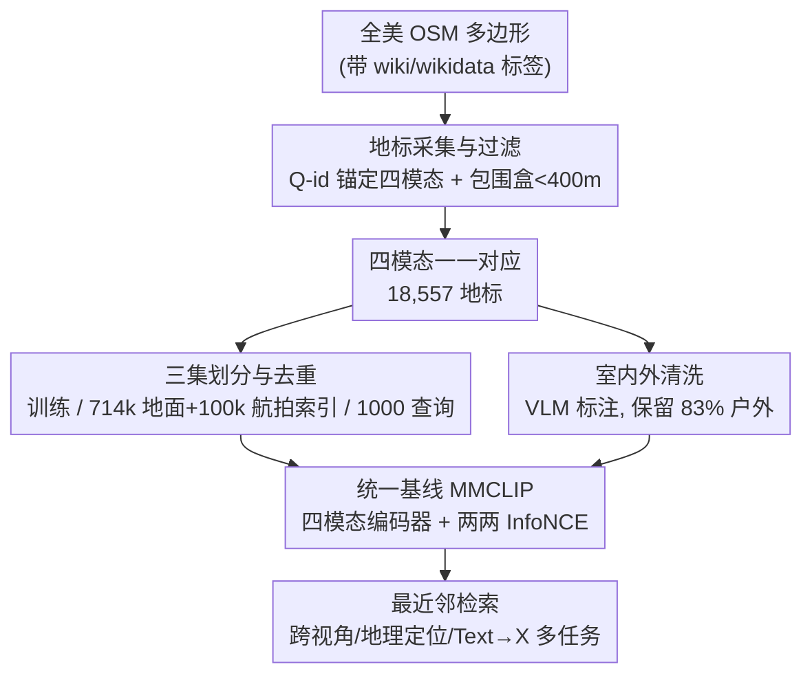

# MMLandmarks: a Cross-View Instance-Level Benchmark for Geo-Spatial Understanding

**会议**: CVPR 2026  
**arXiv**: [2512.17492](https://arxiv.org/abs/2512.17492)  
**代码**: https://mmlandmarks.compute.dtu.dk (项目主页)  
**领域**: 多模态VLM / 遥感地理空间 / 跨视角检索 / 基准数据集  
**关键词**: 地理空间理解, 跨视角检索, 实例级基准, 多模态对齐, 地理定位

## 一句话总结
MMLandmarks 构建了首个在「地面图 / 航拍图 / 文本 / GPS」四模态间做到**逐地标一一对应**的大规模实例级地理空间基准（美国 18,557 个地标、32.9 万地面图 + 19.7 万航拍图），并证明现有专用模型和通用基础模型都解不好它，再用一个 CLIP 风格的简单四模态对比学习 baseline（MMCLIP）说明「在这种数据上训练能一套模型横扫多任务」。

## 研究背景与动机
**领域现状**：地理空间理解长期被拆成互不相通的子任务——跨视角检索（地面↔卫星）、图像地理定位（预测 GPS）、地标检索（精确匹配同一地标）各有各的数据集和专用模型。多模态学习（CLIP、ImageBind、GeoCLIP）虽已进入这个领域，但大多只对齐「图像-文本」或「图像-GPS」这类成对模态。

**现有痛点**：① 现有遥感/航拍数据集（DOTA、NAIP 类）多为目标检测、分类、地物语义分割这类**粗粒度、低分辨率**任务，没有**实例级**标注；② 跨视角检索基准（CVUSA、VIGOR、CVACT 等）严重依赖 Google 街景全景图，只能覆盖**道路和城市**，图像内容缺乏多样性，导致基准已经饱和（强几何对应让任务变简单）；③ 这些数据集大量受 Google 街景/卫星图的**许可限制**，无法自由再分发或用于机器学习训练，拖慢研究。

**核心矛盾**：缺一个**细粒度、实例级、跨多模态多视角**的数据集——既要规模大、又要每个地标在所有模态上都有对应、还要许可宽松可以自由分享模型和数据。三者很难同时满足，这正是现有数据集在「规模 / 多样性 / 标注粒度」上各有短板的根因。

**本文目标**：拆成三个子问题——(1) 怎么可信地把同一地标的四种模态绑在一起；(2) 怎么构造一个有挑战性、不会因模态相关性而虚高的评测协议；(3) 用什么基线证明这种多模态数据真能带来「一套模型多任务通用」。

**切入角度**：作者放弃「街景全景 + 卫星图采样」的老路，改用 **landmark-centric（以地标为中心）** 的采集——以 OpenStreetMap 的带 Wiki 标签的多边形为锚点，借 Wikimedia Commons（地面图）、Wikipedia（文本）、NAIP（高分航拍）三个**许可宽松**的公开源把四模态绑到同一个 Wiki 实体（Q-id）上。这样既绕开 Google 的许可枷锁，又天然引入真实世界的视角/光照/室内外多样性。

**核心 idea**：用「Wiki 实体 ID 作为锚点 + 四个开放数据源 + 一一对应约束」造一个四模态地理空间基准，再用「全模态两两 InfoNCE 对比」的简单 baseline 把所有任务统一成同一嵌入空间里的最近邻检索。

## 方法详解
这是一篇基准（benchmark）论文，核心贡献是**数据集构建管线 + 评测协议 + 一个统一基线**，而不是某个复杂网络结构。下面先讲数据怎么从「全美 OSM 多边形」一路过滤到「四模态对齐的 18,557 个地标」，再讲评测怎么设计得有挑战性、baseline 怎么把四模态拉进同一空间。

### 整体框架
输入是公开的 OpenStreetMap 多边形元信息，输出是一个四模态一一对应的基准（训练集 + 索引集 + 查询集）外加一个统一基线 MMCLIP。整条管线分三段：**① 地标采集与过滤**（用 Wiki 标签锚定实体、用包围盒尺寸做均衡过滤）→ **② 三集划分与去重**（构造大规模困难索引集、严格去重防泄漏）→ **③ 四模态统一基线**（每模态独立编码器 + 全模态两两对比损失，推理时做最近邻检索）。

### 关键设计

**1. 以 Wiki 实体为锚点的四模态对齐采集：解决「同一地标如何可信绑定四模态」**

老办法（CVUSA/VIGOR）用 Google Maps 同一坐标采「卫星图 + 街景全景」，对自然地标行不通——地标照片往往是**远距离拍的**，按坐标取航拍很可能取到一片没有地标的区域。作者改用 Wiki 实体作锚：先收集全美所有带 `wikipedia ∪ wikidata` 标签的 OSM 多边形，从中取出形如 `Q123456` 的 Wiki-identifier（它把一个实体的所有 Wiki 信息链到一起），再要求该实体**同时**有 Wikipedia 页面（提供文本）和 Wikimedia Commons 页面（提供地面图）。地面图来自 Wikimedia Commons（多为 Wiki Loves Monuments 活动投稿，CC/公有领域许可，最长边压到 800px），航拍图来自 NAIP（1–2 米分辨率、公有领域、经 Google Earth Engine 取 $800\times800$），GPS 取地标包围盒中心，文本取 Wikipedia 正文（剔除 References/See also 等段落）。这样四模态都挂在同一个 Q-id 上，**一一对应**且全程许可宽松——这是它能成为「首个四模态完全对应、可自由分享」数据集的根本原因

**2. 包围盒尺寸过滤 + 真实世界多样性：让基准既均衡又难**

为避免数据集里地标尺度悬殊（从一座桥到一整个园区），作者做了一条启发式过滤：只保留**包围盒最长边 < 400 米**的地标，保证航拍图里地标占比分布均匀。同时这种采集方式天然保留了几个让任务变难的真实属性：地面图来自众包，含强烈的**类内方差**（光照、角度、室内外、甚至素描/扫描件都有）；NAIP 提供同一地点**多个时间戳**的航拍（有时跨十年），既是天然数据增广，也支持时序变化检测研究；地标分布**长尾且地理偏斜**（加州、东北部大城市扎堆）。这正好补上现有跨视角基准「几何对应太强、内容多样性太低导致饱和」的缺口——MMLandmarks 用大域差（地面↔航拍视角剧变）+ 大类内方差把任务重新做难

**3. 防泄漏的三集划分与困难索引集：让评测数字不虚高**

检索任务最怕索引集和训练集重叠导致虚高。作者构造了**地面**和**航拍**两个大索引集并严格去重：地面索引取自 GLDv2 的 76.2 万图，按国家过滤出 17,804 个美国地标后，**移除其中与 MMLandmarks 重叠的 5,277 个地标**，得到 71.45 万张地面图的画廊；航拍索引则从训练集随机采点、给 GPS 加噪到 10 万个新位置，并强制新坐标与训练集/其他索引坐标**相距 >500 米**（避免在别的图里又看到同一地标），再取最新 NAIP 图。查询集随机采 1000 个地标——这里有个细节：地面图类内方差大、本就难，所以**所有地面图都当查询**（18,688 张）；但同一地标的航拍图高度相关、会虚高性能，所以**只用最新一张航拍当查询**（1000 张）。此外用 VLM（LLaVA-1.5-7B）把众包地面图标成室内/室外，做了个只含户外图的子集（占原始地面图 83%，抽检 1000 张仅 8.2% 误标），因为室内图不利于学地理空间对齐表示

**4. 全模态两两对比的统一基线 MMCLIP：证明「多模态数据 → 一套模型通吃多任务」**

为了说明数据的价值，作者训了个刻意简单的 baseline：每个模态一个**冻结**编码器（地面/航拍图共用冻结 CLIP 图像编码器、文本用对应冻结 CLIP 文本编码器、GPS 用 GeoCLIP 式可训练位置编码器），每个编码器后接一个两层线性 + ReLU 的投影头把各模态投到统一维度（512）。损失把 InfoNCE 扩展到 $K=4$ 个模态的**所有两两组合**：

$$\mathcal{L}=\frac{1}{K(K-1)}\sum_{i=1}^{K}\sum_{\substack{j=1\\ j\neq i}}^{K}\mathcal{L}_{i,j}$$

其中 $\mathcal{L}_{i,j}$ 是模态 $i$ 与 $j$ 的对比损失，温度固定 0.07。推理时所有任务统一为「在学到的联合空间里做 $k$ 近邻检索」。它的意义不在于刷 SOTA（作者明确说不主张优于任何模型），而在于用同一套权重同时解跨视角检索、地理定位、Text→X 检索——这是现有专用模型做不到的

## 实验关键数据

### 主实验：跨视角检索（Table 2）
现有专用跨视角模型和通用基础模型在 MMLandmarks 上零样本表现都很差，MMCLIP 大幅领先（medR 越低越好，mAP/R@K 越高越好）：

| 模型 | 类型 | Sat→Ground medR↓ | Sat→Ground mAP@1k↑ | Ground→Sat medR↓ | Ground→Sat mAP@1k↑ |
|------|------|------|------|------|------|
| Sample4Geo-UNI | 专用跨视角 | 34988 | 3.0 | 40056 | 1.1 |
| TransGeo-90° | 专用跨视角 | 40973 | 0.7 | 13425 | 0.9 |
| SigLIP2 (ViT-L/512) | 通用基础模型 | 682 | 8.6 | 140 | 18.7 |
| OAI-CLIP (ViT-L/336) | 通用基础模型 | 519 | 10.4 | 620 | 15.2 |
| **MMCLIP** | 本文 baseline | **23** | **18.8** | **48** | **26.2** |

专用跨视角模型（在 CVUSA/VIGOR 等老基准上训练）几乎全军覆没，medR 高达三四万，印证了「旧跨视角数据集多样性不足」的判断；通用大模型靠规模和分辨率能稍微好一点，但仍远未饱和基准。

### 地理定位（Table 3 / Table 4）
报告各距离阈值下落在该范围内的预测百分比（越高越好）：

| 任务 | 方法 | Street(1km) | City(25km) | Region(200km) | Country(750km) | Continent(2500km) |
|------|------|------|------|------|------|------|
| Ground→GPS | GeoCLIP | **21.37** | 36.44 | 48.57 | 71.45 | 91.50 |
| Ground→GPS | **MMCLIP** | 16.83 | 35.95 | **51.78** | **74.94** | 91.52 |
| Sat→GPS | GeoCLIP | 12.3 | 31.3 | 48.8 | 81.3 | 97.4 |
| Sat→GPS | **MMCLIP** | **36.9** | **61.5** | **81.1** | **95.5** | **99.7** |

Ground→GPS 上 MMCLIP 用远少于 GeoCLIP/G3 的训练图就打成可比（GeoCLIP 街级略好，但其数据可能与 MP16 重叠导致虚高）；Satellite→GPS 上 MMCLIP **全面碾压**——SatCLIP 因 Sen-2 与 NAIP 的大域差几乎失效，而 MMCLIP 在每个阈值都大幅领先。

### Text-to-Any 检索（Table 5）
为防 Wikipedia 首句的地名线索虚高，作者用 GPT-3.5 去掉地点线索并人工校正：

| 任务 | 方法 | medR↓ | mAP@1k↑ | R@1↑ |
|------|------|------|------|------|
| Text→Satellite | OAI-CLIP (ViT-L/336) | 1037 | 14.5 | 11.1 |
| Text→Satellite | **MMCLIP** | **388** | **17.3** | **13.4** |

### 消融实验（Table 6）
| 配置 | mAP@1k S→G | mAP@1k G→S | G/S→GPS(1km) | 说明 |
|------|------|------|------|------|
| all⇔all, G,S 仅图 | 17.59 | 25.59 | — | 只用两图模态 |
| all⇔all, G,S,T,C, 首句, 随机航拍 | 17.39 | 25.05 | 15.63 / 27.7 | 加全模态 |
| **MMCLIP** (G,S,T,C, 随机句, **最新航拍**, **户外子集**) | **18.79** | **26.20** | 16.83 / **36.9** | 最终基线（灰行） |
| G⇔all (ImageBind 式), 最新航拍, 户外子集 | 18.89 | 27.46 | 15.68 / 18.3 | 仅以地面为锚对齐 |

### 关键发现
- **「最新航拍 + 户外子集」是涨点主力**：把航拍采样从随机改成「取最新一张」、并只用户外地面图训练，几乎在所有任务上显著提升，尤其把 Sat→GPS(1km) 从 ~27 拉到 **36.9**。
- **模态越多反而检索略降**：加入更多模态会轻微拉低纯检索 mAP，但带来一套模型多任务的通用性——这是「通用 vs 专精」的权衡。
- **全模态对比 vs ImageBind 式锚定**：ImageBind 风格（只以地面为锚 G⇔all）在纯检索上略好，但全模态两两对比（all⇔all）在**地理定位尤其 Sat→GPS** 上明显更强，因为后者让 GPS 与每个模态都直接对齐而非间接对齐。
- **基准远未饱和**：即使最好的 MMCLIP，跨视角 R@1 也只有 20–30 区间，留足了提升空间。

## 亮点与洞察
- **用 Wiki 实体 ID 当「跨模态胶水」**：以 `Q-id` 锚定 OSM 多边形 → Wikipedia → Wikimedia Commons → NAIP，把四个异构开放源天然绑成一一对应——这个思路可迁移到任何「需要把多源数据按同一实体对齐」的数据集构建（如商品、生物物种、建筑）。
- **「查询集非对称采样」防虚高**：地面图全用、航拍图只用最新一张，是因为同模态相关性会让评测虚高——这种「按模态内方差差异化设计查询」的协议很值得借鉴。
- **许可宽松是一等公民**：作者把「可自由再分发、可训练、可分享模型」当成核心设计目标而非事后补丁，直接绕开 Google 街景/卫星的许可枷锁，这是数据集能长期被社区复用的关键。
- **最让人「啊哈」的点**：专用跨视角模型在新基准上 medR 高达三四万（基本等于乱猜），把「旧跨视角基准饱和=任务被解决」的错觉戳破——饱和只是因为旧数据太容易。

## 局限与展望
- **仅限美国（作者承认）**：受制于 NAIP 是目前唯一足够多样的开放高分航拍源，数据集只覆盖美国，地理偏斜严重（加州/东北部扎堆），跨大洲泛化未验证。
- **baseline 刻意简单**：编码器全冻结、只加投影头，作者明说不追求 SOTA；因此「数据潜力」更多是下限演示，真正的上限需要更强的可训练架构来探。
- **文本模态信息偏弱**：Text→X 性能明显低于图像查询，因为去掉地名后 Wikipedia 句子语义线索稀薄；如何更好利用长文本是开放问题。
- **潜在数据泄漏 caveat**：因聚焦知名地标，部分查询/索引地面图可能也出现在 MP16 里，会抬高 GeoCLIP/G3 等模型的可比数字——横向比较街级定位时需谨慎。
- **改进思路**：解冻/微调编码器、引入时序航拍做变化检测任务、把同样的 Wiki-anchor 管线推广到其他有 NAIP 类开放航拍的国家以打破美国限制。

## 相关工作与启发
- **vs 跨视角检索基准（CVUSA / VIGOR / CVACT / CV-Cities）**：它们用 Google 街景全景 + 卫星图，只覆盖道路/城市、内容多样性低、许可受限、基准已饱和；MMLandmarks 改用地标中心采集，带来大类内方差和大域差、许可宽松，且**首次**加入文本和 GPS 凑齐四模态一一对应。
- **vs 地理定位模型（GeoCLIP / G3 / StreetCLIP / SatCLIP）**：它们专精「图→GPS」单任务；MMLandmarks 用同一套数据支持多任务，MMCLIP 在 Sat→GPS 上大幅超过 SatCLIP/GeoCLIP（高分 NAIP 域 vs 低分 Sen-2 域的差距是关键）。
- **vs 多模态对齐方法（CLIP / ImageBind / LanguageBind）**：它们多依赖网络爬取的图文对，缺乏多模态一一对应监督；MMLandmarks 提供**密集的实例级全模态组合监督**，MMCLIP 把 InfoNCE 扩到四模态两两对齐，消融显示全模态对比在地理定位上优于 ImageBind 式单锚对齐。
- **vs 地标检索（GLDv2）**：本文复用 GLDv2 作地面索引集并去重，但把任务从「全球地面图精确匹配」扩展到「跨视角 + 跨模态」，且强调实例级与跨视角域差。

## 评分
- 新颖性: ⭐⭐⭐⭐⭐ 首个四模态完全一一对应、许可宽松的大陆级实例级地理空间基准，Wiki-anchor 采集思路巧妙
- 实验充分度: ⭐⭐⭐⭐ 覆盖跨视角/地理定位/Text→X 多任务、对比大量专用与通用模型、消融到位；但 baseline 刻意简单、仅美国
- 写作质量: ⭐⭐⭐⭐ 动机清晰、协议设计（防泄漏/防虚高）讲得透；表格密集需细读
- 价值: ⭐⭐⭐⭐⭐ 戳破旧跨视角基准饱和假象、给多模态地理空间研究提供可自由分享的统一试金石

<!-- RELATED:START -->

## 相关论文

- [\[CVPR 2026\] Beyond Single Images: A Comprehensive Benchmark for Album-Level Vision-Language Understanding](beyond_single_images_a_comprehensive_benchmark_for_album-level_vision-language_u.md)
- [\[CVPR 2026\] Socratic-Geo: Synthetic Data Generation and Cross-Modal Geometric Reasoning via Multi-Agent Interaction](socratic-geo_synthetic_data_generation_and_cross-modal_geometric_reasoning_via_m.md)
- [\[CVPR 2026\] STAR-R1: Multi-View Spatial TrAnsformation Reasoning by Reinforcing Multimodal LLMs](star-r1_multi-view_spatial_transformation_reasoning_by_reinforcing_multimodal_ll.md)
- [\[CVPR 2026\] SALMUBench: A Benchmark for Sensitive Association-Level Multimodal Unlearning](salmubench_a_benchmark_for_sensitive_association-level_multimodal_unlearning.md)
- [\[CVPR 2026\] UNI-OOD: Unified Object- and Image-level Out-of-Distribution Detection via Cross-Context Attentive Vision-Language Modeling](uni-ood_unified_object-_and_image-level_out-of-distribution_detection_via_cross-.md)

<!-- RELATED:END -->
