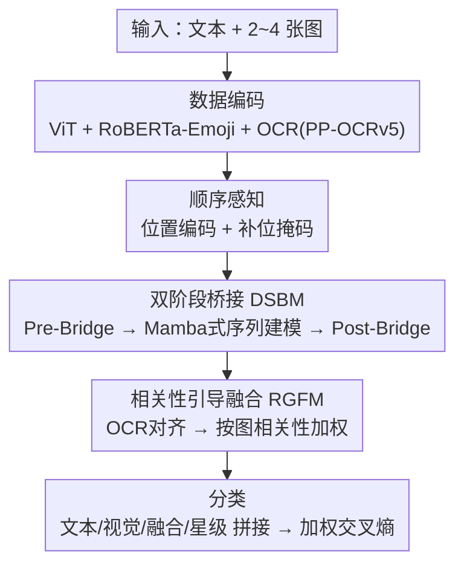

# MMSD3.0: A Multi-Image Benchmark for Real-World Multimodal Sarcasm Detection

**会议**: CVPR 2026  
**论文**: [CVF Open Access](https://openaccess.thecvf.com/content/CVPR2026/html/Zhao_MMSD3.0_A_Multi-Image_Benchmark_for_Real-World_Multimodal_Sarcasm_Detection_CVPR_2026_paper.html)  
**代码**: https://github.com/ZHCMOONWIND/MMSD3.0  
**领域**: 多模态VLM / 多模态讽刺检测 / 基准数据集  
**关键词**: 多模态讽刺检测, 多图基准, 跨图推理, OCR对齐, 数据集

## 一句话总结
作者指出现有多模态讽刺检测数据集/方法全是「单图」、抓不住跨图对比触发的讽刺，于是构建了首个全部由多图样本（每条 2–4 图）组成的真实世界基准 MMSD3.0，并配套提出跨图推理模型 CIRM（双阶段桥接 + 相关性引导融合），在 MMSD / MMSD2.0 / MMSD3.0 上都拿到 SOTA。

## 研究背景与动机

**领域现状**：多模态讽刺检测（multimodal sarcasm detection）旨在判断「图 + 文」组合是否表达讽刺。这一方向起于 Cai et al. 基于 Twitter 构建的 MMSD 基准，后续工作大多在 MMSD 上做跨模态不一致（incongruity）建模；Qin et al. 发现 MMSD 存在伪相关线索（靠 #sarcasm 标签采样导致模型过度依赖文本），推出了去偏的 MMSD2.0。

**现有痛点**：无论 MMSD 还是 MMSD2.0，**都是单图设定**——一条样本只配一张图。但现实中相当比例的推文带多张图，讽刺往往恰恰来自「图与图之间」的语义/情感对比（论文 Figure 1：左图 Laura Loomer、右图吸血鬼伯爵，少了任一张图都看不出讽刺意味）。单图数据集和单图方法无法刻画这种跨图触发的讽刺，不能真实反映现实场景的复杂度。

**核心矛盾**：讽刺的判别信号常分散在多张图的相互关系里，而现有的「单图编码器 + 跨模态融合」范式根本没有跨图关系建模的机制，视觉信号因此变得「不太有用」——这也是论文里多模态方法在多图设定下相对纯文本方法几乎没优势的原因。

**本文目标**：① 把讽刺检测从单图推向多图、真实世界设定，造一个高质量多图基准；② 设计能显式建模「跨图依赖 + 跨模态对应」的模型。

**切入角度**：作者从两点观察出发——多图讽刺靠「图间潜在语义/情感关联」，且真实社媒图里大量含 OCR 文字与 emoji（这些情感线索常被丢弃）。于是基准刻意保留 emoji、用更公平的采样源，模型刻意引入 OCR 对齐 + 图序建模。

**核心 idea**：用「全部多图」的真实数据基准 MMSD3.0 暴露多图讽刺的难度，并用一个跨图推理模型 CIRM（双阶段桥接做跨图-跨模态依赖、相关性引导融合做按图加权）系统地把这种多图关系建出来。

## 方法详解

本文是「基准 + 模型」双贡献。基准部分（MMSD3.0）放在关键设计里讲；模型部分（CIRM）是一条多模块串行的流水线，下面先给整体框架与框架图。

### 整体框架
CIRM（Cross-Image Reasoning Model）由五个模块串成：**数据编码 → 位置编码 & 掩码 → 双阶段桥接模块（DSBM） → 相关性引导融合模块（RGFM） → 分类**。输入是一条文本 $S$ 加一组图像 $I=(I_1,\dots,I_n)$（$n\le 4$，不足补空白图并掩码），输出是二分类标签 $y\in\{0,1\}$（1=讽刺）。

数据编码阶段：用 ViT 取每张图的 CLS 特征 $V_{\text{origin}}$；用 PP-OCRv5 抽每张图的 OCR 文本 $X$；正文 $S$ 和 OCR $X$ **分开**用 RoBERTa-Emoji 编码（不拼接，因为 OCR 来自图像、且要利用保留下来的 emoji），分别得到 $T$ 和 OCR 特征 $O$。随后给每张图特征按序加位置编码、用掩码区分有效图/补位图；DSBM 在「序列建模前」和「序列建模后」各做一次跨模态桥接；RGFM 用 OCR 对齐 + 自适应相关性权重把多图视觉证据加权融合；最后把文本/视觉/融合/星级评分拼一起分类。

### 关键设计

**1. MMSD3.0 基准：首个全多图、保留 emoji/OCR 的真实世界讽刺数据集**

针对「现有数据集全是单图、采样有偏」的痛点，MMSD3.0 从两个来源构建：无特定 hashtag 的推文 + 无额外限制采集的 Amazon 评论（引入域外覆盖、规避 MMSD 用 #sarcasm 当正例带来的伪相关偏置）。规模超 1 万条，每条 2–4 图（Twitter 单帖上限），平均文本长度约 31 词（远长于 MMSD/MMSD2.0 的 15/13 词，更贴近现实长文本），平均图数 ~2.6。与 MMSD 把 emoji 换成占位符不同，本数据集**保留 emoji** 以维持情感信号；超 65% 的图含可 OCR 文本、约 23–25% 样本含 emoji。标注由 9 名研究生两轮、每样本双人标注完成，Cohen's Kappa 达 0.816（高一致性），按 70:15:15 切分。此外还用 Qwen2.5-VL-32B 当生成器、GPT-4o 当评审，对 1,444 个真实样本各生成 3 个讽刺候选、按 6 项标准选最优，补充 AI 生成内容以贴合现实中的 AI 造假趋势。

**2. 双阶段桥接模块 DSBM：在序列建模前后各桥接一次，建跨图-跨模态依赖**

针对「单图编码器没有跨图关系建模」的痛点，DSBM 用 Pre-Bridge 和 Post-Bridge 夹住一个 Mamba 启发的序列建模模块。**Pre-Bridge**：序列建模之前先让两模态互相注意——$A^t_{\text{pre}}=\text{MHA}(T,V,V)$、$A^v_{\text{pre}}=\text{MHA}(V,T,T)$，再用门控残差融合 $T_{\text{pre}}=\text{LN}(T+G^t_{\text{pre}}\odot A^t_{\text{pre}})$（门 $G=\sigma(\cdot W)$ 控制残差强度）。**序列建模模块**：对每个模态内部做状态空间增强——先 LayerNorm 投影成主流 $U$ 与门控 $Z$，用深度可分离 Conv1D + SiLU 抓局部依赖 $\hat U=\text{SiLU}(\text{DWConv1D}(U))$，再用选择性状态更新 $S_t=f_\theta(S_{t-1},\hat u_t)$ 建长程依赖，最后门控融合回残差 $H_{\text{out}}=((Y+D\odot\hat U)\odot\text{SiLU}(Z))W_{\text{out}}+H$，让文本流累积上下文语义、图像流编码连贯的多图表示。**Post-Bridge**：序列建模后再做一次门控跨模态注意力 $T_{\text{post}},V_{\text{post}}=\text{CrossModalBridge}(T_{\text{seq}},V_{\text{seq}})$，重建跨模态对齐。消融显示去掉整个 DSBM 掉点最多（F1 84.42→81.41），是核心模块。

**3. 相关性引导融合模块 RGFM：先 OCR 对齐、再按图相关性加权，抑制无关/补位图噪声**

针对「多图里有的图与文本无关、补位图是纯噪声」的问题，RGFM 分两步。**OCR 对齐**：把文本/视觉特征都用 OCR 嵌入做注意力增强 $T^O=\text{Attn}(T,O,O)+T$、$V^O=\text{Attn}(V,O,O)+V$，注入图中文字的语境信号。**相关性估计**：取全局文本摘要 $\bar t^o$（对 $T^O$ 求平均），对每张图算两路得分——余弦项 $s^{\cos}_i=\cos(W_v v^O_i, W_t\bar t^o)$ 与可学习项 $s^{\text{lrn}}_i=\text{MLP}([v^O_i;\bar t^o])$，混合为 $s_i=\alpha\,s^{\cos}_i+(1-\alpha)\,s^{\text{lrn}}_i$，再经 softmax 并乘有效掩码 $c_i$ 得权重 $w_i$。**加权融合**：$f=\sum_{i=1}^{N} w_i\,(\bar t^o\odot v^O_i)$，强调语义连贯的视觉证据、压低无信息图。消融里去掉 RGFM 同样大幅掉点（F1→81.36），与 DSBM 并列最关键；超参 $\alpha$ 在 0.3 时 F1 最佳（84.42），太小偏向学习项、太大削弱几何一致性。

**4. 顺序感知：位置编码 + 补位掩码，让模型读懂图序**

多图常描述一个过程或对比叙事，图的先后顺序本身是讽刺线索。CIRM 给每张图特征按其索引加位置嵌入 $V=V_{\text{origin}}+\text{PE}(\text{index})$，并对不足 $N=4$ 的样本用掩码 $c=[1]_n\,\|\,[0]_{N-n}$ 标出有效图（1）与补位图（0），在注意力和池化时排除补位图。消融去掉位置编码 F1 从 84.42 降到 83.25；主表里把图序随机打乱（shuffled）F1 也从 84.42 降到 83.51，说明模型确实在利用图序信息且对扰动有一定鲁棒性。

> ⚠️ **框架↔关键设计一致**：框架图四个贡献相关节点——顺序感知（设计 4）、DSBM（设计 2）、RGFM（设计 3）——都在关键设计里有交代；数据编码与分类头是通用脚手架节点。设计 1（MMSD3.0 基准）是数据集贡献，不在 CIRM 推理流中。

### 损失函数 / 训练策略
分类头把三路表示合并：post-bridge 的文本/视觉全局池化 $\bar t,\bar v$（视觉池化乘掩码 $c_i$ 排除补位图）、相关性引导特征 $f$、以及可选的星级评分嵌入 $\text{Emb}(r)$，拼接后过 $\text{MLP}_{\text{fuse}}$ 得 $z$，线性分类 $\hat y=W_{\text{cls}}z+b_{\text{cls}}$，用**加权交叉熵** $\mathcal{L}=\text{CrossEntropy}(\hat y,y;w)$（$w$ 为类别权重缓解标签不平衡）训练。AdamW、学习率 2e−5、weight decay 1e−5、batch 8、20 epoch，单张 H100(80GB)。

## 实验关键数据

> 指标说明：Acc=准确率，P/R/F1 均为 Macro 级（宏平均），讽刺检测里 F1 是主指标；CIRM(shuffled) 指把图序随机打乱后的结果。

### 主实验
单图基准（MMSD / MMSD2.0）上 CIRM 同样 SOTA，验证它在单图也有效：

| 数据集 | 方法 | Acc (%) | F1 (%) |
|--------|------|---------|--------|
| MMSD | RCLMuFN (KBS'25) | 93.09 | 91.52 |
| MMSD | **CIRM** | **94.02** | **93.76** |
| MMSD2.0 | RCLMuFN (KBS'25) | 91.57 | 90.25 |
| MMSD2.0 | **CIRM** | **92.12** | **91.69** |

多图基准（MMSD3.0）上，单图方法 tiling 后退化明显、MLLM 也只是中等水平，CIRM 大幅领先：

| 模态 | 方法 | Acc (%) | F1 (%) |
|------|------|---------|--------|
| 纯文本 | RoBERTa | 79.99 | 79.67 |
| 纯图像 | ViT | 64.09 | 51.30 |
| 多模态 | Tang et al. (NAACL'24) | 82.20 | 80.91 |
| MLLM | GPT-4o | 72.62 | 71.39 |
| MLLM | Qwen2.5-VL-32B | 71.94 | 71.52 |
| Ours | CIRM (shuffled) | 84.36 | 83.51 |
| Ours | **CIRM** | **85.16** | **84.42** |

### 消融实验（MMSD3.0）

| 配置 | F1 (%) | 说明 |
|------|--------|------|
| CIRM 完整 | 84.42 | 完整模型 |
| w/o DSBM | 81.41 | 去双阶段桥接，掉最多 |
| w/o RGFM | 81.36 | 去相关性融合，与 DSBM 并列最关键 |
| w/o OCR | 81.59 | 去 OCR 线索，明显下降 |
| w/o PE | 83.25 | 去位置编码，图序信息丢失 |
| w/o Emoji | 82.31 | 去 emoji，小幅下降 |
| w/o DSBM_post | 81.99 | 仅去 Post-Bridge |

### 关键发现
- **DSBM 与 RGFM 是双核心**：去掉任一个都掉到 ~81.4 F1（−3 点），证明跨图依赖建模与按图相关性加权同等重要、互补。
- **多图设定确实更难**：纯图像方法 F1 仅 ~50%，多模态方法相对纯文本几乎没优势（因为它们用单图编码器抓不到跨图关系），连 GPT-4o / Qwen2.5-VL-32B 这类 MLLM 也只有 71–72 Acc，凸显多图讽刺的内在难度。
- **图序有用但非压倒性**：shuffled 后 F1 仅降 0.91（84.42→83.51），说明 CIRM 既利用了图序、又对顺序扰动有鲁棒性。
- **OCR/emoji 都是有效情感线索**：去 OCR 掉 ~2.8 点、去 emoji 掉 ~2.1 点，支持「保留这些社媒原生信号」的设计选择。
- **$\alpha=0.3$ 最优**：余弦项与学习项 3:7 混合时 F1 峰值（84.42），两端都略降，说明几何一致性与自适应相关性需要平衡。

## 亮点与洞察
- **发现并定义了一个新空白**：第一个指出多模态讽刺检测的「多图 gap」并造出全多图基准，问题定义本身就是核心贡献——多图对比触发的讽刺以前根本无法被现有 benchmark 衡量。
- **基准设计处处对着「真实世界」打**：保留 emoji、保留 OCR、混入 Amazon 域外数据、混入 AI 生成内容、用更长文本，每一条都是冲着「现有数据集不够真实」去的，且用 Cohen's Kappa 0.816 保证标注质量。
- **DSBM 把 Mamba 式状态空间塞进讽刺检测**：用「序列建模前后各桥接一次」的结构，让跨模态对齐既发生在融合前、又在序列建模后被重建，是个可迁移到其他多图-多模态任务的结构模板。
- **RGFM 的「按图相关性加权」直接解决多图噪声**：用余弦 + 可学习双路打分给每张图算权重，并显式乘掩码排除补位图，这套「自适应选图」机制可复用到任何变长多图输入场景。

## 局限与展望
- **CIRM 仍偏中等绝对性能**：MMSD3.0 上最优也才 85 Acc，说明多图讽刺远未解决，基准留足了提升空间。
- **依赖外部组件**：OCR（PP-OCRv5）、emoji 编码器（RoBERTa-Emoji）、以及构建期的 Qwen2.5-VL-32B/GPT-4o，质量受这些上游工具影响；OCR 抽取在低质图上可能不稳。
- **单图方法的 tiling 对比可能偏苛刻**：把多图拼成一张画布喂给单图模型本就削弱了它们，跨范式比较结论需带 caveat（不同方法的输入形态不完全对等）。
- **数据规模与覆盖**：~1 万条、最多 4 图，主要来自 Twitter + Amazon 两源，语言为英文，向其他平台/语言的泛化未验证。

## 相关工作与启发
- **vs MMSD / MMSD2.0（Cai / Qin）**: 前者奠定单图基准、后者去伪相关线索，但都停在单图；MMSD3.0 把任务推到全多图、真实世界，并保留被前作丢弃的 emoji/OCR 信号。
- **vs Multi-view CLIP / RCLMuFN（单图 SOTA 方法）**: 它们靠多视角 CLIP 对齐或关系学习 + 多重融合做单图不一致建模；CIRM 在单图基准上也超过它们，且额外具备跨图关系建模能力，在多图设定下优势被放大。
- **vs GPT-4o / Qwen2.5-VL-32B（通用 MLLM）**: 这些大模型原生支持多图输入，但在 MMSD3.0 上只有 71–72 Acc，说明通用 VL 能力不等于会做细粒度的多图讽刺推理，专门的跨图-跨模态结构（DSBM+RGFM）反而更有效。

## 评分
- 新颖性: ⭐⭐⭐⭐⭐ 首次定义并填补「多图讽刺」空白 + 全多图基准 + 专门的跨图推理模型
- 实验充分度: ⭐⭐⭐⭐ 三基准 + 丰富 baseline（含 MLLM）+ 模块/超参/打乱消融，但绝对难度高、提升空间大
- 写作质量: ⭐⭐⭐⭐ 模块公式齐全、动机清晰，DSBM 内部细节稍密
- 价值: ⭐⭐⭐⭐⭐ 基准 + 代码开源，推动讽刺检测走向真实多图场景，后续研究可直接受益

<!-- RELATED:START -->

## 相关论文

- [\[CVPR 2026\] VinQA: Visual Elements Interleaved Long-form Answer Generation for Real-World Multimodal Document QA](vinqa_visual_elements_interleaved_long-form_answer_generation_for_real-world_mul.md)
- [\[CVPR 2026\] Towards Real-World Document Parsing via Realistic Scene Synthesis and Document-Aware Training](towards_real-world_document_parsing_via_realistic_scene_synthesis_and_document-a.md)
- [\[AAAI 2026\] Conditional Information Bottleneck for Multimodal Fusion: Overcoming Shortcut Learning in Sarcasm Detection](../../AAAI2026/multimodal_vlm/conditional_information_bottleneck_for_multimodal_fusion_overcoming_shortcut_lea.md)
- [\[CVPR 2026\] Rethinking VLMs for Image Forgery Detection and Localization](rethinking_vlms_for_image_forgery_detection_and_localization.md)
- [\[CVPR 2026\] RMIR: A Benchmark Dataset for Reasoning-Intensive Multimodal Image Retrieval](rmir_a_benchmark_dataset_for_reasoning-intensive_multimodal_image_retrieval.md)

<!-- RELATED:END -->
