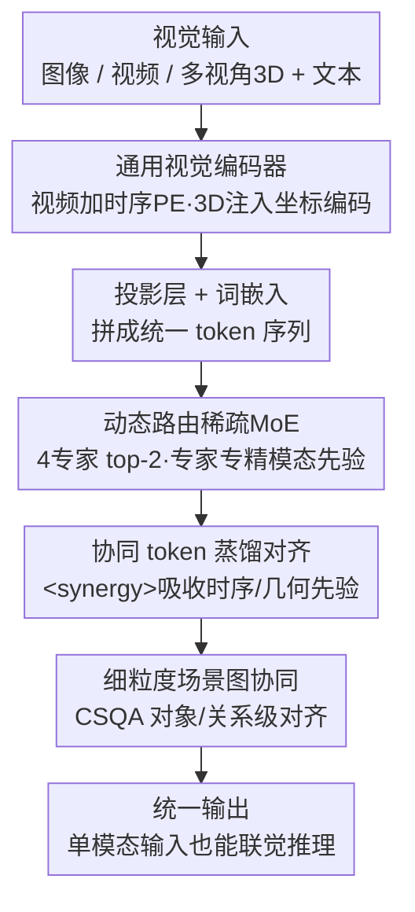

# Modeling Cross-vision Synergy for Unified Large Vision Model

**会议**: CVPR 2026  
**论文**: [CVF Open Access](https://openaccess.thecvf.com/content/CVPR2026/html/Wu_Modeling_Cross-vision_Synergy_for_Unified_Large_Vision_Model_CVPR_2026_paper.html)  
**领域**: 多模态VLM  
**关键词**: 统一大视觉模型, 跨视觉协同, 稀疏MoE, 知识蒸馏, 场景图对齐

## 一句话总结
PolyV 用「动态路由的稀疏 MoE + 协同感知训练」把图像/视频/3D 三种视觉模态拧成一个统一大视觉模型，让模型能像「联觉」一样把视频的时序先验、3D 的几何先验迁移去补静态图像的推理，在 10 个 benchmark 上相对骨干 Qwen2.5-VL-7B 平均提升超 10%。

## 研究背景与动机

**领域现状**：大视觉模型（LVM）正从「一个模态一套设计」走向统一架构——用一个模型同时吃图像、视频、3D。主流做法是给每个模态配独立编码器再把特征拼起来，或者共享一个图像编码器去处理图像和视频，又或者把视频编码器扩展去支持 3D。

**现有痛点**：作者指出这些统一模型只做到了「功能整合」（functional integration），即一个系统能处理异构输入，却没做到「跨视觉协同」（cross-vision synergy）。具体表现是两点：① 架构上只靠共享编码器或特征拼接，没有显式的跨模态交互模块，于是不同模态的特征仍然是**彼此孤立**的，推理时无法动态交换先验；② 训练上大多只是监督微调，要么各模态模块独立训（完全不共享），要么增量微调（导致灾难性遗忘和弱跨模态泛化）。

**核心矛盾**：真正的协同应该是**双向且交互**的——视频的运动/时序先验可以帮静态图像做动态推断，3D 的几何先验可以增强视频的空间推理。但现有研究偏向**单向**地把低阶模态信息搬到高阶模态（如 video→3D），忽略了反向和互相补充的本质。

**本文目标**：建一个在架构和训练两个层面都支持跨视觉协同的统一 LVM，让模型即便只看单一模态的输入，也能隐式调用其它模态学到的先验来推理。

**切入角度**：作者借用人类「联觉视觉系统」（synesthetic visual system）的类比——人看一张静态高尔夫照片能脑补球被击出后的轨迹（视觉→时序），能估出人和球的距离（视觉→空间）。模型也应该具备这种跨模态「触类旁通」的能力，因为图像、视频、3D 本质是同一视觉信号的不同层级形式，应该共享底层视觉特征。

**核心 idea**：用「稀疏 MoE + 动态路由」让每个专家专精一种模态先验、同时通过路由实现专家间双向互补，再用「协同感知训练」（模态专属预训练 → 粗粒度蒸馏 → 细粒度场景图对齐）把跨模态先验灌进一个共享的 `<synergy>` 隐 token，从而实现联觉式视觉推理。

## 方法详解

### 整体框架
PolyV 的整体结构很简洁：一个**通用视觉编码器** + 词嵌入层 + 投影层 + N 个堆叠的 LLM block（其中部分 FFN 被换成 MoE）。任意视觉输入 $I=\{I_1,\cdots,I_K\}$——图像是单帧、视频是帧序列、3D 是多视角渲染图——都过同一个视觉编码器抽成视觉 token 序列 $V\in\mathbb{R}^{P\times C}$（视频额外加时序位置编码、3D 额外注入逐像素 3D 坐标编码），再投影到 LLM 隐空间 $H\in\mathbb{R}^{P\times D}$，和文本 token $T$ 拼接后送进 LLM。

关键在于 LLM 内部：每隔 4 层就把标准 FFN 扩成 MoE 层（$M=4$ 个专家，每 token top-2 激活），由一个稀疏路由器决定 token 给哪些专家。逐层计算是标准残差结构：$X'_\ell=\mathrm{MSA}(\mathrm{LN}(X_{\ell-1}))+X_{\ell-1}$，$X_\ell=\mathrm{MoE}(\mathrm{LN}(X'_\ell))+X'_\ell$。训练分两大阶段：先让每个专家**各自学一种模态**（模态专属预训练），再把这些模态专属 FFN 整合进 MoE 层做**协同感知微调**（粗粒度蒸馏 + 细粒度场景图对齐）。训练完后，哪怕只喂单模态输入，模型也能借由所有专家学到的先验做联觉推理。

### 关键设计

**1. 动态路由稀疏 MoE：让专家分工又互补，而不是各自孤立**

针对「不同模态特征彼此孤立、推理时无法交换先验」这个痛点，PolyV 把 LLM 里每隔 4 层的 FFN 换成一组并行专家 $E=\{E_1,\cdots,E_M\}$，由一个线性路由器为每个 token 预测分配概率，只激活 top-$k$ 个专家并按归一化路由分数加权求和：$P(X_\ell)_i=\dfrac{e^{f(X_\ell)_i}}{\sum_j e^{f(X_\ell)_j}}$，$\mathrm{MoE}(X_\ell)=\sum_{i=1}^{k}P(X_\ell)_i\cdot E(X_\ell)_i$。这样每个专家能在自己擅长的模态子空间里精炼领域知识，同时路由让 token 可以跨专家流动、互相补充——专家既各管一摊（防止知识互相覆盖退化），又通过共享路由实现双向协同。作者的路由分析（Fig. 5/6）证实这种分工是自发涌现的：专家 1 主要被通用图像理解激活，专家 2 主导空间推理，专家 3 触发于时序/运动任务，专家 4 在混合推理任务上均衡激活。相比共享编码器或特征拼接的「假统一」，这里是真正让模态先验在参数层面互通。为防止 token 都挤向少数专家，每个 MoE 层还加了可微的负载均衡损失 $L_{aux}=M\cdot\sum_{i=1}^{M}F_i\cdot G_i$，其中 $F_i$ 是分给专家 $E_i$ 的 token 比例、$G_i$ 是 $E_i$ 的平均路由概率。

**2. `<synergy>` 协同 token：在产出答案前先形成跨模态「心理状态」**

光有架构上的隐式协同还不够，作者引入显式的 `<synergy>` token 充当「认知中介」（cognitive mediator），逼模型在生成最终答案之前先形成一个中间的「mental-state」表示。这个 token 之所以关键，是因为它给跨模态先验提供了一个**可被监督的落点**：粗粒度训练时，从 MoE-LLM 最后一层抽出 `<synergy>` token 的隐表示 $F_{syn}$，再用两个投影头映射成 $F^v=f^t_{mlp}(F_{syn})$、$F^g=f^g_{mlp}(F_{syn})$，分别去对齐视频/3D 基座模型的特征。换句话说，`<synergy>` token 就是那个把时序运动线索和空间几何结构「内化」成统一隐表示的容器，支撑下游的跨视觉推理。这是 PolyV 区别于纯文本监督方法的核心——后者只能学到抽象的语义对齐，学不到丰富的模态专属先验。

**3. 协同感知两阶段训练：先各自学透，再粗到细地学协同**

针对「监督微调要么不共享、要么灾难性遗忘」的痛点，PolyV 设计了由粗到细的训练范式。**Stage-1 模态专属预训练**先建立视觉-语言连接（只训投影层、captioning + 交叉熵 $L_{ce}$），再让每个专家用更复杂的指令数据专精各自模态特性（视频的时序动态、3D 的空间几何）。**Stage-2 协同感知微调**把模态专属 FFN 整合进 MoE 层，分两步走：

- **粗粒度协同蒸馏**：用知识蒸馏把强单模态基座模型的先验灌进来——视频基座（如 V-JEPA 2）提供低维时序先验 $F_{temporal}=f_{VFM}(V)$，3D 基座（如 VGGT）编码几何空间结构 $F_{spatial}=f_{3DFM}(3D)$，设计 video→image 和 3D→image 两条蒸馏路径，用 MSE 拉近投影后的 synergy 特征与教师特征：$L_{coarse}=\|F_{temporal}-F^v\|^2+\|F_{spatial}-F^g\|^2$。总目标为 $L=L_{coarse}+\alpha L_{aux}$。因为现实中内容很少同时存在于三模态，训练采用渐进策略：每模态先独立预训，再在配对的 video-image 子集上做部分联合训练。
- **细粒度协同对齐**：粗粒度只能学全局、实例级语义，学不到「对象和关系如何跨模态演化」。作者借鉴场景图思想构造 **CSQA（Cross-Vision Synergy QA）数据集**——用通用场景图（image-video、image-3D 多视角）配合 GPT-4o 自动生成对象级（如空间一致性、运动连续性）和关系级（如交互动态、视角依赖变化）的跨模态问答，共 20K 条。训练时把多模态输入和协同问题一起喂进去生成文本回答，用 $L_{ce}+L_{aux}$ 优化。这一步把推理显式 grounding 到对象和关系层面，让模型能「类比」地跨模态推理。

> 注：缓存中粗粒度蒸馏的 $F_{spatial}$ 在原文公式里曾误写为 $F_{temporal}$，此处按上下文（3D 几何特征）理解为 spatial，⚠️ 以原文为准。

## 实验关键数据

### 主实验
骨干为 Qwen2.5-VL-7B，在图像/视频/3D 共 10 个 benchmark 上评测，相对骨干平均提升超 10%。

| 任务 | 数据集 | 指标 | 骨干 Qwen2.5-VL-7B | PolyV | 提升 |
|------|--------|------|--------------------|-------|------|
| 图像通用 | MMStar | Acc | 62.5 | 71.4 | +8.9 |
| 图像空间 | 3DSRBench-real | Acc | 48.4 | 63.4 | +15.0 |
| 图像空间 | MMSI-Bench | Acc | 24.7 | 31.7 | +7.0 |
| 视频空间 | VSI-Bench | Acc | 33.0 | 52.7 | +19.7 |
| 视频空间 | CVBench | Acc | 51.3 | 59.1 | +7.8 |
| 视频通用 | VideoMME(w/o sub) | Acc | 65.1 | 69.6 | +4.5 |

3D 问答上同样全面领先骨干与专门的 3D 推理模型（含 video-based VLM 与 3DRS）：

| 数据集 | 指标 | 骨干 Qwen2.5-VL-7B | PolyV | 提升 |
|--------|------|--------------------|-------|------|
| ScanQA(val) | CIDEr | 53.9 | 105.6 | +51.7 |
| ScanQA(val) | BLEU-1 | 27.8 | 50.2 | +22.4 |
| SQA3D(test) | EM-1 | 46.5 | 64.8 | +18.3 |
| Open-EQA(HM3D) | LLM-Match | 56.6 | 63.4 | +6.8 |

值得注意的是，在和它同骨干的空间专用模型 SpaceR 对比时，PolyV 在 MMStar 上 71.4 vs 53.6，说明协同学习不仅没牺牲、反而增强了通用图像理解。

### 消融实验

| 配置 | MMStar | Open-EQA | VSI-Bench | Video-MME | 说明 |
|------|--------|----------|-----------|-----------|------|
| w/o expert（dense） | 68.9 | 60.3 | 45.8 | 66.4 | 去掉 MoE 退化为稠密模型 |
| **w/ expert（full）** | **71.4** | **63.4** | **52.7** | **69.6** | 完整 MoE |
| 专家数=2 | 69.5 | 61.2 | 48.3 | 67.5 | 专家越多越好 |
| 专家数=3 | 70.1 | 62.7 | 50.6 | 68.4 | |
| MoE 放前半层 | 69.7 | 61.0 | 49.4 | 67.6 | 位置消融 |
| MoE 放后半层 | 70.5 | 62.0 | 50.8 | 68.3 | |
| MoE 全转 | 70.2 | 61.8 | 53.5 | 68.1 | Full 无明显收益还更贵 |

训练策略与基座模型消融（指标列依次 Open-EQA / 3DSRBench-real / VSI-Bench / Video-MME）：

| 配置 | Open-EQA | 3DSRBench | VSI-Bench | Video-MME | 说明 |
|------|----------|-----------|-----------|-----------|------|
| PolyV(Full) | 63.4 | 63.4 | 52.7 | 69.6 | 完整 |
| only Coarse-grained | 61.9 | 61.0 | 51.6 | 68.2 | 擅长 3D/全局结构 |
| only Fine-grained | 62.5 | 59.8 | 50.2 | 68.9 | 擅长视频细节、空间稍弱 |
| w/ VideoFM | 62.8 | 61.4 | 52.1 | 69.3 | 只蒸馏视频基座 |
| w/ 3DFM | 63.0 | 62.7 | 51.5 | 68.8 | 只蒸馏 3D 基座 |

### 关键发现
- **MoE 是性能主引擎**：去掉专家退回稠密模型，VSI-Bench 直接从 52.7 掉到 45.8（−6.9），是所有消融里掉点最猛的，说明跨模态协同主要靠专家分工 + 路由互补实现。
- **专家数边际递增**：2→3→4 专家在 4 个 benchmark 上单调上升，但作者出于效率只取 4 个；MoE 层「每 4 层插一层」（Interval-4）比「全转 MoE」更划算——全转既不涨点又更贵。
- **粗细两种协同互补**：粗粒度蒸馏强在全局结构（3DSRBench 更高），细粒度场景图对齐强在视频细节推理（VSI/VideoMME 更好但空间稍弱），合起来才最优。
- **路由自发专精**：专家 1↔通用图像、专家 2↔空间推理、专家 3↔时序运动、专家 4↔混合推理，路由分布本身就是可解释的模态先验分配。

## 亮点与洞察
- **把「联觉」从口号做成可监督的训练信号**：`<synergy>` token + 双教师 MSE 蒸馏，让「视频时序先验 / 3D 几何先验迁移去补图像」这件抽象的事有了具体落点，而不是停留在共享编码器的「假统一」。这个「显式中介 token + 蒸馏对齐」的范式可迁移到任何想做跨模态先验注入的统一模型。
- **单向→双向的视角转换**：以往跨模态迁移几乎都是 low→high（video→3D），本文点出协同本质是双向交互，并用 MoE 路由 + 双向蒸馏路径（video→image、3D→image）把反向迁移也做出来，这是概念上最让人「啊哈」的地方。
- **场景图驱动的细粒度 QA 构造**：用通用场景图 + GPT-4o 自动生成对象/关系级跨模态问答（20K CSQA），把「跨模态对齐」从实例级推到对象/关系级，这套数据构造思路对任何需要细粒度多模态对齐的任务都有借鉴价值。
- **协同不牺牲通用能力**：同骨干下 MMStar 71.4 vs SpaceR 53.6，说明引入跨模态先验反而增强了单模态通用理解，打消了「为协同牺牲专精」的顾虑。

## 局限与展望
- **三模态真同时出现的数据稀缺**：作者自己承认现实中内容很少同时存在于图像/视频/3D 三模态，只能退化为「各模态独立预训 + 配对 video-image 子集部分联合训练」的渐进策略，真正的三模态联合协同其实没被充分训练到。
- **依赖外部强基座当教师**：粗粒度协同要靠 V-JEPA 2、VGGT 这类强单模态基座蒸馏，性能上限和可获得性受制于教师质量，教师选型敏感度（Table 4 显示换教师确有波动）值得进一步探究。
- **细粒度数据靠 GPT-4o 自动生成**：20K CSQA 由 GPT-4o 基于场景图自动造，质量和噪声未做人工核验报告，场景图本身的构造误差会传导进训练。
- **规模与开放性**：只验证到 7B 骨干、4 专家，更大规模或更多模态（音频、点云原生）下协同是否同样成立未知；可探索把 top-k、专家数随任务自适应。

## 相关工作与启发
- **vs 早期分编码器统一模型（如 LEO/各种 concat 方法）**：它们给每个模态配独立编码器再拼特征，只做到功能统一、模态特征孤立；PolyV 用共享 MoE + 路由实现参数级的跨模态先验互通。
- **vs video→3D 单向迁移（ROSS3D / Video-3D-LLM / LLaVA-3D）**：这类工作把视频知识搬去 3D，是单向的；PolyV 强调双向交互，并在 3D QA（ScanQA CIDEr 105.6）上反超它们。
- **vs 视觉 MoE（Uni3D-MoE 等）**：以往视觉 MoE 多用于单模态或单纯扩容；PolyV 把 MoE 专门用作跨图像/视频/3D 协同的载体，并配上协同感知训练把专家先验对齐进 `<synergy>` token。
- **vs 空间专用模型（Spatial-MLLM / SpaceR）**：它们专攻空间推理但牺牲通用性；PolyV 同骨干下空间和通用双赢。

## 评分
- 新颖性: ⭐⭐⭐⭐ 「双向跨视觉协同 + 显式 synergy token + 双教师蒸馏」组合新颖，把统一 LVM 从功能整合推向真协同；MoE/蒸馏/场景图都是已有组件的巧妙拼装。
- 实验充分度: ⭐⭐⭐⭐ 10 个 benchmark 覆盖图像/视频/3D，主结果 + 架构/训练/教师/路由多维消融较完整；但三模态联合训练受限、细粒度数据未人工核验略有遗憾。
- 写作质量: ⭐⭐⭐⭐ 动机（联觉类比）清晰、方法分层讲解到位、图示丰富；个别公式有笔误（spatial/temporal 混写）。
- 价值: ⭐⭐⭐⭐ 首个显式面向跨视觉协同的统一 LVM，框架通用可扩展，对统一多模态推理方向有较强参考价值。

<!-- RELATED:START -->

## 相关论文

- [\[CVPR 2026\] UNI-OOD: Unified Object- and Image-level Out-of-Distribution Detection via Cross-Context Attentive Vision-Language Modeling](uni-ood_unified_object-_and_image-level_out-of-distribution_detection_via_cross-.md)
- [\[CVPR 2026\] Think Visually, Reason Textually: Vision-Language Synergy in Abstract Reasoning](think_visually_reason_textually_vision-language_synergy_in_abstract_reasoning.md)
- [\[CVPR 2026\] Reversing the Flow: Generation-to-Understanding Synergy in Large Multimodal Models](reversing_the_flow_generation-to-understanding_synergy_in_large_multimodal_model.md)
- [\[CVPR 2026\] UARE: A Unified Vision-Language Model for Image Quality Assessment, Restoration, and Enhancement](uare_a_unified_vision-language_model_for_image_quality_assessment_restoration_an.md)
- [\[ICLR 2026\] Unified Vision-Language Modeling via Concept Space Alignment](../../ICLR2026/multimodal_vlm/unified_vision-language_modeling_via_concept_space_alignment.md)

<!-- RELATED:END -->
