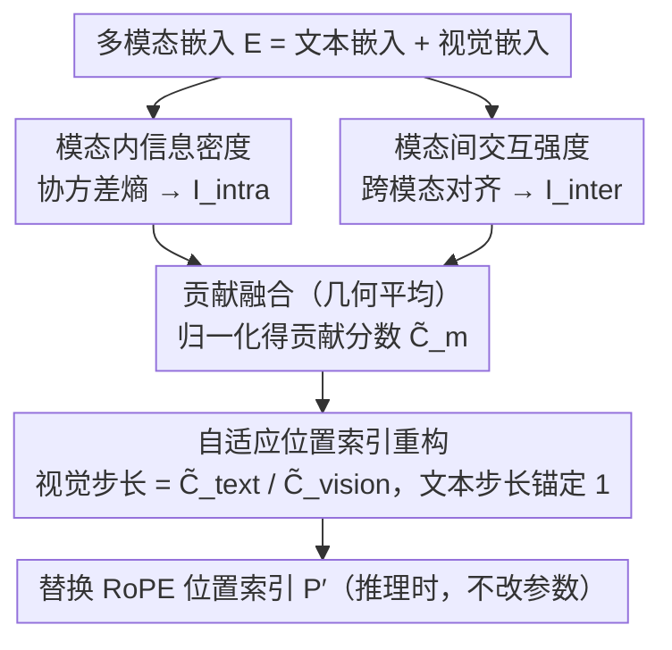

# MODIX: Training-Free Multimodal Information-Driven Positional Index Scaling for VLMs

**会议**: CVPR 2026 Highlight  
**arXiv**: [2604.12537](https://arxiv.org/abs/2604.12537)  
**代码**: 无  
**领域**: 多模态VLM  
**关键词**: 位置编码, RoPE, 信息密度, 免训练, 视觉语言模型

## 一句话总结

提出 MODIX，一个免训练框架，通过信息论分析（协方差熵+跨模态对齐）动态调整 VLM 中视觉和文本 token 的位置编码步长，将位置粒度分配给信息密集的模态以提升多模态推理。

## 研究背景与动机

**领域现状**：VLM 普遍使用 RoPE 位置编码，对所有 token 分配均匀的位置索引 $p_i = i$，无论其信息内容或跨模态重要性如何。

**现有痛点**：文本 token 语义密集（每个词贡献独特信息），但视觉 token（固定大小图像块）经常在均匀背景或重复纹理中表现出大量空间冗余。均匀位置编码在冗余内容上浪费表示能力，同时对信息丰富的区域表示不足。且模态贡献随任务剧烈变化。

**核心矛盾**：模态间和模态内的信息密度不对称，但现有 RoPE 方案以统一步长对待所有 token。

**本文目标**：将位置粒度视为隐式资源，根据信息贡献动态分配——信息密集的模态获得更细的位置分辨率。

**切入角度**：信息论分析：协方差熵衡量模态内信息密度，跨模态对齐衡量模态间交互强度。

**核心 idea**：自适应步长 $\Delta_m \propto 1/\tilde{C}_m$，信息贡献越大的模态获得越细的位置间距。

## 方法详解

### 整体框架

MODIX 在推理时分析多模态嵌入 $\mathbf{E}=[\mathbf{E}_{text};\mathbf{E}_{vision}]$，通过**两条并行路径**度量每个模态的信息贡献：模态内路径用协方差熵衡量「自身信息够不够」，模态间路径用跨模态对齐衡量「跟任务搭不搭」；两路结果融合成归一化贡献分数 $\tilde{C}_m$。文本步长锚定为 1 不动，视觉 token 的步长按贡献比自适应缩放，重构出新的位置索引 $\mathbf{P}'$，直接替换标准 RoPE 的索引，全程不改任何参数或架构。

### 关键设计

**1. 模态内信息密度估计：用协方差熵把"信息多不多"量化成一个数**

要按信息分配位置粒度，首先得有一把尺子去量每个模态到底有多少信息。MODIX 的做法是取某个模态的全部 token 嵌入，算出它们的协方差矩阵，再用特征值分布算熵。直觉很直接：如果信息只集中在少数几个维度上，特征值高度集中、熵就低，说明这堆 token 彼此高度相关、内容冗余；如果信息均匀铺在很多维度上，特征值分散、熵就高，说明每个 token 都在贡献不一样的东西。这正好对上了视觉和文本的差异——均匀背景或重复纹理的视觉块嵌入高度相关（低熵），而语义密集的文本 token 各自独立（高熵）。于是这个熵就成了"该不该多分位置分辨率"的第一来源。

**2. 模态间交互强度：信息有没有用，还要看它跟别的模态对不对得上**

光看模态自己信息多不够，因为一个模态对当前任务的价值还取决于它和其他模态的耦合程度——一段和图像内容完全无关的文字，熵再高也帮不上跨模态推理。MODIX 因此再算一条跨模态对齐分数：先把视觉、文本嵌入做 L2 归一化，算出二者之间的相似度矩阵 $S=\hat{E}_{text}\hat{E}_{vision}^{\top}$，再让**每个 token 取它对另一模态的最大相似度、然后在模态内求平均**，得到方向性的交互强度（文本→视觉、视觉→文本各一个）。直觉是：一个 token 只要能在对面模态里找到强支撑，就说明它正深度参与跨模态理解，应当在位置分配上被优待。

最后用**几何平均**把模态内密度与模态间对齐两路融合：$C_m=(I_m^{intra})^{\alpha}(I_m^{inter})^{1-\alpha}$，再归一化得到贡献分数 $\tilde{C}_m$。之所以用几何平均而非相加，是为了让一个模态**只有在「自身信息丰富」且「跨模态强相关」两者同时成立时才拿到高分**——任一路偏低都会把乘积拉下来，避免「信息多但与任务无关」的模态被错误优待。

**3. 自适应位置索引重构：信息越密，位置步长越细**

有了贡献分数 $\tilde{C}_m$，最后一步是把它翻译成 RoPE 能直接吃的位置索引。MODIX 固定文本步长 $\Delta_{text}=1$（不动语言主干预训练时学到的位置结构），只缩放视觉步长：

$$\Delta_{vision} = \frac{\tilde{C}_{text}}{\tilde{C}_{vision}}$$

即视觉贡献越低、步长越大（位置变"粗"），贡献越高、步长越小（位置变"细"），整体遵循「步长与信息贡献成反比」的原则。重构时文本 token 保留原索引 $p'_i=i$，视觉 token 从 $n_t$ 起按固定步长 $\Delta_{vision}$ 逐 token 累加，因 $\Delta_{vision}>0$ 全程严格单调（$i<j\Rightarrow p'_i<p'_j$），不破坏 RoPE 对相对顺序的依赖。

这条规则的依据来自 RoPE 的注意力机制：softmax 把每个 query 的注意力归一成「固定预算」，而 RoPE 的注意力随相对距离衰减，所以一个模态占用的位置跨度越小，它累计拿到的注意力就越多。MODIX 要做的正是让两模态拿到的注意力之比对上它们的贡献之比，反推出来的视觉步长就是上式。换句话说，把细步长（高注意力带宽）分给信息密集的模态、粗步长分给冗余的模态，等于把有限的「位置分辨率」这一隐式资源花在刀刃上。整个替换发生在推理时，不动一个参数。

举个具体的转法：一张图表问答样本里，视觉块大多是空白坐标区、信息冗余，$\tilde{C}_{vision}$ 偏低，于是视觉步长被放大（位置变"粗"）；而问题文本语义密集、与图表强对齐，保持单位步长。反过来在 DocVQA 这种文字密集的文档图里，视觉块本身承载大量文字信息、$\tilde{C}_{vision}$ 升高，视觉步长随之收细——同一套机制在不同任务上自动倒向不同模态。

### 损失函数 / 训练策略

MODIX 是完全免训练的方法，仅在推理时操作，不修改任何模型参数或架构。直接替换 RoPE 的位置索引即可使用。

## 实验关键数据

### 主实验

| 模型 | 方法 | ScienceQA↑ | DocVQA↑ | ChartQA↑ | Video-MME↑ |
|------|------|-----------|---------|----------|-----------|
| Qwen3-VL-4B | 基线 | 85.2 | 89.1 | 78.3 | 62.5 |
| Qwen3-VL-4B | +MODIX | **87.1** | **90.5** | **80.2** | **64.3** |
| InternVL3.5-8B | 基线 | 88.5 | 91.3 | 82.1 | 66.8 |
| InternVL3.5-8B | +MODIX | **90.2** | **92.6** | **83.8** | **68.5** |

### 消融实验

| 配置 | 平均提升 | 说明 |
|------|---------|------|
| 完整 MODIX | +1.8% | 模态内+模态间 |
| 仅模态内密度 | +1.2% | 不考虑跨模态交互 |
| 仅模态间对齐 | +0.9% | 不考虑内部密度 |
| 固定步长(0.5) | +0.5% | 不自适应 |

### 关键发现

- MODIX 在文本密集型任务（DocVQA）上倾向给文本更细粒度，在视觉密集型任务（图表理解）上倾向给视觉更细粒度——自动适应任务特性
- 跨三种架构（1B-8B）和七个基准一致提升，证明通用性
- 双路径分析的协同效果优于单一路径

## 亮点与洞察

- "位置粒度是隐式资源"这个视角非常新颖：现有工作从未将位置编码与信息密度关联
- 完全免训练的特性使其可以即插即用到任何基于 RoPE 的 VLM
- 自动适应任务特性的能力说明信息论分析有效捕获了模态贡献的动态变化

## 局限与展望

- 仅支持 RoPE 位置编码，不适用于绝对或可学习位置编码
- 信息密度估计依赖于嵌入的协方差结构，可能对某些层不适用
- 未评估在超长序列（如长视频）上的效果
- 可扩展到更多模态（如音频）

## 相关工作与启发

- **vs V2PE**: V2PE 通过可变视觉位置编码改善多模态长上下文，但需要训练。MODIX 免训练
- **vs CircleRoPE**: CircleRoPE 减轻跨模态位置偏差，MODIX 基于信息论自适应分配

## 评分

- 新颖性: ⭐⭐⭐⭐⭐ 将位置编码视为信息资源的思路非常新颖
- 实验充分度: ⭐⭐⭐⭐ 三架构七基准的验证
- 写作质量: ⭐⭐⭐⭐ 理论推导清晰
- 价值: ⭐⭐⭐⭐ 免训练即插即用的实用方法

<!-- RELATED:START -->

## 相关论文

- [\[CVPR 2026\] Pointing at Parts: Training-Free Few-Shot Grounding in Multimodal LLMs](pointing_at_parts_training-free_few-shot_grounding_in_multimodal_llms.md)
- [\[ICCV 2025\] Training-free Generation of Temporally Consistent Rewards from VLMs](../../ICCV2025/multimodal_vlm/training-free_generation_of_temporally_consistent_rewards_from_vlms.md)
- [\[CVPR 2026\] SoPE: Spherical Coordinate-Based Positional Embedding for 3D LVLMs](sope_spherical_positional_encoding_3d_lvlm.md)
- [\[ICML 2026\] Circle-RoPE: Cone-like Decoupled Rotary Positional Embedding for Vision-Language Models](../../ICML2026/multimodal_vlm/circle-rope_cone-like_decoupled_rotary_positional_embedding_for_large_vision-lan.md)
- [\[CVPR 2026\] PAS: A Training-Free Stabilizer for Temporal Encoding in Video LLMs](pas_a_training-free_stabilizer_for_temporal_encoding_in_video_llms.md)

<!-- RELATED:END -->
