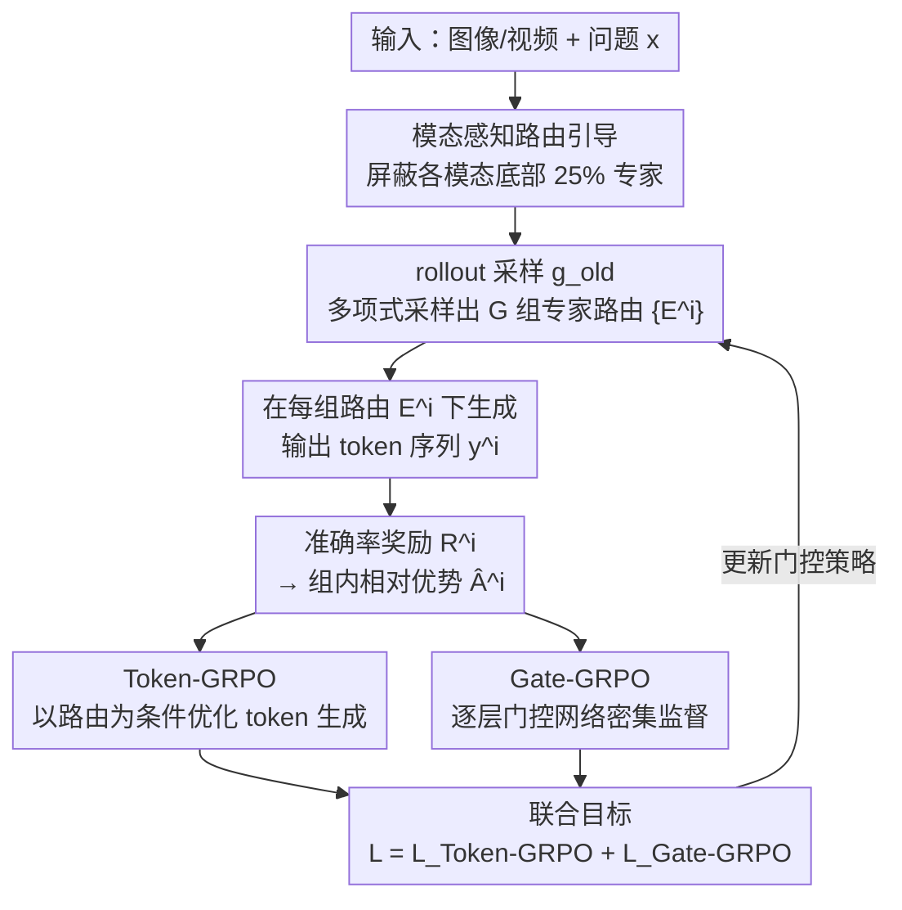

# MoE-GRPO: Optimizing Mixture-of-Experts via Reinforcement Learning in Vision-Language Models

**会议**: CVPR 2026  
**arXiv**: [2603.24984](https://arxiv.org/abs/2603.24984)  
**代码**: 无  
**领域**: 多模态VLM  
**关键词**: 混合专家, 强化学习, 路由策略优化, 视觉语言模型, GRPO

## 一句话总结

将 MoE 中的专家选择建模为序列决策问题，通过 GRPO 强化学习优化路由策略，引入模态感知路由引导，在 VLM 的图像和视频理解任务上一致超越确定性 top-K 路由及其变体。

## 研究背景与动机

**领域现状**：Mixture-of-Experts (MoE) 通过稀疏激活子集参数来降低 Transformer 的计算开销，同时保持高模型容量。近期 MoE 已被扩展到视觉语言模型（VLM），实现了高效的多模态理解。标准做法是在每层用确定性 top-K 方式贪心选择专家。

**现有痛点**：确定性 top-K 路由限制了对多样专家组合的探索，容易导致模型过拟合于少数专家子集。V-MoE 等方法通过在 gating score 上加高斯噪声引入随机性，但这种启发式扰动只能部分缓解问题，并没有显式地优化专家选择"策略"。

**核心矛盾**：现有方法要么是确定性选择（缺乏探索），要么是加噪声的随机选择（缺乏方向性），都没有真正学习一个最优的专家路由策略。专家路由本质上是一个序列决策问题，但一直被当作简单的 softmax + top-K 操作。

**本文目标** (1) 如何让 MoE 的路由器学会更优的专家组合？(2) 如何在多模态场景中高效稳定地进行路由策略探索？

**切入角度**：将专家选择显式建模为序列决策问题，借助强化学习（GRPO）通过多组 rollout 探索不同专家组合，并根据奖励反馈优化路由策略。同时观察到不同模态的 token 对专家有不同偏好，可以利用这一先验来约束探索空间。

**核心 idea**：用 GRPO 强化学习替代确定性 top-K 路由，通过 Token-GRPO + Gate-GRPO 联合优化 token 生成和层级专家选择策略，并引入模态感知引导加速收敛。

## 方法详解

### 整体框架

这篇论文要解决的是 MoE 路由器"不会探索"的问题：标准做法在每层用确定性 top-K 贪心选专家，路由器一旦定型就只会反复激活那几个专家。MoE-GRPO 的思路是把"选哪些专家"当成一个可以被强化学习优化的策略，让路由器通过试错学会更好的专家组合。

整条流程是这样转的：给定输入图像（或视频）和问题 $\boldsymbol{x}$，rollout 模块 $g_\text{old}$ 先从门控网络（gating network）采样出 $G$ 组不同的专家路由策略 $\{\boldsymbol{E}^i\}_{i=1}^G$，每一组 $\boldsymbol{E}^i$ 就是一整条跨所有层的专家选择序列。采样前先用**模态感知路由引导**屏蔽掉与当前模态不相关的专家，把探索预算收窄到有意义的范围。模型分别在这 $G$ 条路由下各生成一个输出 token 序列 $\boldsymbol{y}^i$，按答案对错算出准确率奖励 $R^i$，再用组内相对奖励算优势值 $\hat{A}^i$。最后这个优势同时驱动两个互补的目标——**Token-GRPO** 从输出端、**Gate-GRPO** 从每层门控端反向更新路由策略，把策略往高奖励的那几组专家组合方向推。换句话说，同一个问题被并行试了 8 种"专家搭配"，谁答对了就强化谁，更新后的门控网络再进入下一轮采样。

### 关键设计

**1. Token-GRPO：让任务奖励反向驱动专家选择**

光让路由器随机试不够，还得有信号告诉它哪条路由更好。Token-GRPO 把这个信号接到了输出 token 上：对每个 rollout 采样到的专家策略 $\boldsymbol{E}^i$，模型生成对应的 token 序列 $\boldsymbol{y}^i$，然后用 PPO 风格的 clipped ratio 目标，基于组内相对奖励优化每个 token 的生成概率。关键在于这里的概率是**以专家路由为条件**的——

$$r_t^i = \frac{\pi_\theta(y_t^i \mid \boldsymbol{x}, \boldsymbol{y}_{<t}^i; \boldsymbol{E}_{<t}^i)}{\pi_\text{old}(y_t^i \mid \boldsymbol{x}, \boldsymbol{y}_{<t}^i; \boldsymbol{E}_{<t}^i)}$$

也就是说，路由 $\boldsymbol{E}$ 出现在了条件里，答对题的奖励会顺着这条概率链回流到当初选出这套专家的决策上。这一项直接挂钩任务准确率，是整个方法的性能主引擎：消融里单独去掉它，平均准确率从 55.7% 直接掉到 50.9%。

**2. Gate-GRPO：给每一层路由补上密集监督**

Token-GRPO 的问题是它只从最终输出端间接影响路由，中间那么多层的专家选择拿到的信号很稀疏。Gate-GRPO 把监督直接打到每层的门控网络上：在每层 $l$、每个 token 位置 $t$ 单独算一个路由比值 $\hat{r}_{t,l}^i = g_\theta^l(E_{t,l}^i) / g_\text{old}^l(E_{t,l}^i)$，对所有层和所有 token 位置取平均后照样套 clipped 目标优化。这样每一层的路由决策都拿到了细粒度、密集的梯度，而不用等输出端的奖励一路传回来。它和 Token-GRPO 是互补的——一个负责粗粒度的目标对齐，一个负责层级的细粒度路由校正，去掉 Gate-GRPO 平均准确率会掉 1.8%。

**3. 模态感知路由引导：用模态先验砍掉无效探索**

RL 训练绕不开探索效率问题：每层 $N$ 选 $K$、再乘上所有层所有 token，组合空间大得离谱，纯靠随机采样很难收敛。这里用上了一条朴素但有效的先验——视觉 token 和文本 token 偏好的专家并不一样。具体做法是先统计每个专家分别被视觉 token、文本 token 选中的次数 $N_v(e_i)$ 和 $N_t(e_i)$，归一化成模态感知分数 $\hat{s}_v(e_i)$ 和 $\hat{s}_t(e_i)$。处理视觉 token 时，按 $\hat{s}_v$ 排序，把得分最低的底部 P%（实验取 P=25%）专家的 gating score 直接置为 $-\infty$ 屏蔽掉，再在剩下的专家里做多项式采样。这等于把探索预算集中在"这类 token 本来就常用"的专家上，不在明显不相关的专家身上浪费试错。消融显示，它比无引导的加噪采样、多项式采样分别高 1.5% 和 0.9%，且收敛更快、奖励方差更低。

### 损失函数 / 训练策略

最终目标函数为 $\mathcal{L}_\text{MoE-GRPO} = \mathcal{L}_\text{Token-GRPO} + \mathcal{L}_\text{Gate-GRPO}$。由于门控网络从头训练无预训练路由策略，不使用 KL 散度正则化（与标准 GRPO 不同）。奖励函数采用准确率奖励（正确=1，错误=0）。训练基于 InternVL3.5-1B 转换的 MoE 架构（N=8 专家，K=2 激活），总参数 2.9B，激活 1.3B。使用 100K 多选视觉指令微调样本，25K 步训练，4 GPU 约一天完成。

## 实验关键数据

### 主实验

| 模型 | 架构 | 激活/总参 | MMBench | MMStar | MLVU | LongVideoBench | Avg. |
|------|------|-----------|---------|--------|------|----------------|------|
| InternVL3.5 + Det-FT | MoE | 1.3B/2.9B | 75.8 | 45.6 | 48.6 | 45.3 | 54.0 |
| InternVL3.5 + Stoch-FT-Noise | MoE | 1.3B/2.9B | 76.3 | 46.1 | 51.1 | 45.3 | 54.3 |
| InternVL3.5 + MoE-GRPO | MoE | 1.3B/2.9B | **77.5** | 45.7 | **53.1** | **46.5** | **56.0** |
| InternVL2.5 (Dense) | Dense | 1B/1B | 70.7 | 50.1 | 57.3 | 47.9 | - |

MoE-GRPO 在 9 个 benchmark 中 7 个最优，平均准确率超过三个基线分别 2.0%、2.3%、1.7%。

### 消融实验

| 配置 | Avg. | 说明 |
|------|------|------|
| Token-GRPO + Gate-GRPO (Full) | 55.7 | 完整模型 |
| 仅 Token-GRPO | 53.9 | 去掉 Gate-GRPO 掉 1.8% |
| 仅 Gate-GRPO | 50.9 | 去掉 Token-GRPO 掉 4.8%，说明 token 级优化是核心 |
| 模态感知引导 | 55.7 | 最优 |
| 模态无关（噪声） | 54.2 | 差 1.5% |
| 模态无关（多项式） | 54.8 | 差 0.9% |

### 关键发现

- Token-GRPO 是性能的核心驱动力，Gate-GRPO 提供互补的层级细粒度监督
- 模态感知引导比无引导方式平均高 0.9-1.5%，且收敛更快、奖励方差更低
- MoE-GRPO 显著提升专家多样性：路由分布熵从 Det-FT 的 1.05 提升到 1.82
- 在跨数据集泛化实验中（CLIP-MoE），MoE-GRPO 比 Det-FT 平均高 3.1%，Det-FT 反而因过拟合而退化
- 跨域泛化中，MoE-GRPO 在所有 OOD 数据集上一致提升，比 CLIP-MoE 平均高 4.1%

## 亮点与洞察

- **RL 优化路由策略的新范式**：首次将 MoE 专家选择建模为序列决策问题并用 RL 优化，思路新颖且有效。这为 MoE 架构的路由优化开辟了新方向，未来可探索更复杂的 RL 算法
- **双层 GRPO 互补设计**：Token-GRPO 和 Gate-GRPO 分别从输出级和层级提供监督，实现了粗粒度目标对齐和细粒度路由优化的结合，这种分层优化思路可迁移到其他分层决策问题
- **模态感知约束探索空间**：利用模态-专家统计先验约束探索空间，在不引入额外复杂度的前提下显著提升训练效率和稳定性。这种用先验知识引导 RL 探索的思路在其他 RL+大模型场景也适用

## 局限与展望

- 目前仅在相对小规模模型（1.3B 激活参数）上验证，更大规模 MoE-VLM（如 DeepSeek-V3 级别）上的效果未知
- rollout 数 G=8 增加了训练计算开销（需生成 8 组输出），如何在大规模训练中保持效率是挑战
- 奖励函数仅用准确率（多选题），对开放式生成任务的适用性有待验证
- 模态感知引导基于静态统计的专家偏好，动态适应能力可能不足

## 相关工作与启发

- **vs V-MoE**：V-MoE 通过加高斯噪声引入探索，但噪声是无方向的启发式扰动，不优化"策略"。MoE-GRPO 显式优化路由策略，效果更好
- **vs Expert Choice / Optimal Transport Routing**：这些方法从负载均衡角度优化路由，MoE-GRPO 从任务奖励角度优化，且与负载均衡 loss 互补（结合后再提升 0.9%）
- **vs 标准 GRPO（DeepSeek-R1）**：标准 GRPO 只在 token 级探索，MoE-GRPO 将动作空间扩展到层级专家选择，提供更细粒度的控制

## 评分

- 新颖性: ⭐⭐⭐⭐ 首次将 RL 应用于 MoE 路由策略优化，formulation 清晰
- 实验充分度: ⭐⭐⭐⭐⭐ 图像+视频 9 个 benchmark，跨数据集泛化，域泛化，多个消融，路由分析
- 写作质量: ⭐⭐⭐⭐ 逻辑清晰，图表丰富，方法推导完整
- 价值: ⭐⭐⭐⭐ 为 MoE 路由优化提供新范式，但实际部署中 rollout 开销可能限制应用

<!-- RELATED:START -->

## 相关论文

- [\[CVPR 2026\] TTRV: Test-Time Reinforcement Learning for Vision Language Models](ttrv_test-time_reinforcement_learning_for_vision_language_models.md)
- [\[CVPR 2026\] Reading or Reasoning? Format Decoupled Reinforcement Learning for Document OCR](reading_or_reasoning_format_decoupled_reinforcement_learning_for_document_ocr.md)
- [\[CVPR 2026\] On Token's Dilemma: Dynamic MoE with Drift-Aware Token Assignment for Continual Learning of Large Vision Language Models](on_tokens_dilemma_dynamic_moe_with_drift-aware_token_assignment_for_continual_le.md)
- [\[CVPR 2026\] VisPlay: Self-Evolving Vision-Language Models](visplay_self-evolving_vision-language_models.md)
- [\[CVPR 2026\] Dr. Seg: Revisiting GRPO Training for Visual Large Language Models through Perception-Oriented Design](dr_seg_revisiting_grpo_training_for_visual_large_language_models_through_percept.md)

<!-- RELATED:END -->
