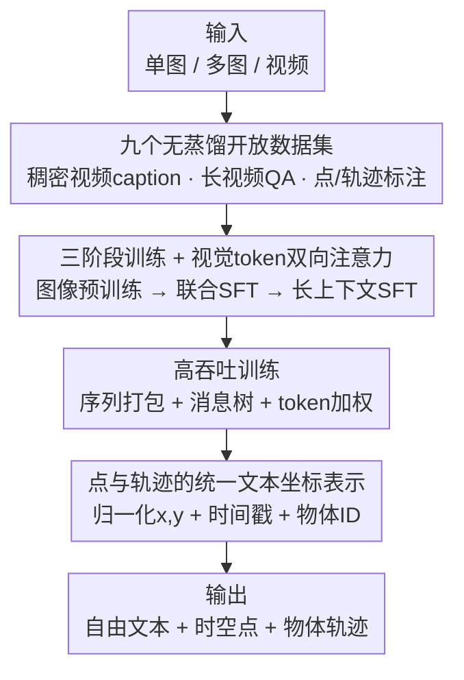

# Molmo2: Open Weights and Data for Vision-Language Models with Video Understanding and Grounding

**会议**: CVPR 2026  
**论文**: [CVF Open Access](https://openaccess.thecvf.com/content/CVPR2026/html/Clark_Molmo2_Open_Weights_and_Data_for_Vision-Language_Models_with_Video_CVPR_2026_paper.html)  
**代码**: https://allenai.org/blog/molmo2  
**领域**: 多模态VLM  
**关键词**: 视频语言模型、开放权重与数据、视频 grounding、点定位与跟踪、无蒸馏数据

## 一句话总结
Molmo2 是一个**完全开放**（权重、数据、代码、训练配方全开，且数据不从任何闭源 VLM 蒸馏）的视频-语言模型家族，靠自建的 9 个新数据集 + 三阶段训练，把"在视频里用点和轨迹做 grounding"这一连闭源模型都欠缺的能力补齐，8B 模型在视频计数、指点、跟踪上大幅超越同级开源模型，部分任务甚至压过 Gemini 3 Pro。

## 研究背景与动机
**领域现状**：当前最强的视频-语言模型（VLM）几乎都是闭源的——权重、数据、训练配方都不公开；而开源阵营里表现较好的模型，又大量依赖从闭源 VLM 蒸馏出来的合成数据，且不公布训练数据与配方。

**现有痛点**：这导致开源社区缺乏"从头改进 SOTA 视频/图像语言模型"所需要的根基。更关键的是，许多下游应用（视频检索、家用/工业机器人、辅助技术、体育分析、安防、自动驾驶）需要 **grounding**——要么用点指出"事件/物体在哪、何时发生"，要么在像素里持续跟踪某个目标。这种**时空 grounding** 能力即便在闭源系统里也只是部分支持、且形式受限。

**核心矛盾**：图像 grounding（在单张图上指点）已经是标配，但**视频 grounding**（在时间+空间上同时定位）极度稀缺，根因是没有公开的高质量训练数据——而现有大规模视频数据又大多是蒸馏来的，无法构成"干净的开放根基"。

**本文目标**：造一个全开放、能在单图/多图/视频上做 grounding 的 VLM 家族，并把"造数据 + 训模型"的全套配方公开，让社区可复现、可改进。

**切入角度**：作者认为，开源视频 VLM 真正缺的不是模型架构（架构就用标准的 ViT + connector + LLM），而是**针对性的训练数据**和**能高效消化这些数据的训练配方**。于是把主要精力放在"造 9 个新数据集（全部不蒸馏闭源模型）"+ 设计能高吞吐训练的工程方案上。

**核心 idea**：把图像里的"2D 指点"范式扩展到时间与多图域——用一种**统一的纯文本坐标格式**表示点和轨迹，再配合三阶段训练与一组训练技巧（双向注意力、token 加权、序列打包、消息树），让一个标准 VLM 学会视频里的指点/计数/跟踪。

## 方法详解

### 整体框架
Molmo2 不是一个新架构，而是"**全开放数据 + 标准 VLM + 高效训练配方**"的组合拳。模型沿用通用设计：视觉输入切成固定大小的 crop，经 ViT 编码成 patch 特征，再由 connector 池化、投影成视觉 token，与文本 token 一起喂给 LLM；视频则按 $S{=}2$ fps 采帧（每帧当单 crop），最多 $F{=}128$ 帧（长上下文训练时 $F{=}384$）。整条 pipeline 的真正贡献集中在两侧：**喂进去的数据**（9 个无蒸馏新数据集）和**怎么把数据高效训进去**（三阶段训练 + 一组工程技巧 + 统一 grounding 输出格式）。

### 关键设计

**1. 九个"无蒸馏"全开放数据集：把缺失能力一个个数据补回来**

视频 VLM 最缺的不是架构而是数据，所以作者从头造了 9 个新数据集（外加 2 个由已有学术数据改造的），全部**不从闭源 VLM 蒸馏**。其中最关键的几类：① **Molmo2-Cap**（10.4 万视频级 + 43.1 万 clip 级稠密 caption）——标注员先口述（说比打字能描述更多细节）、用 Whisper-1 转写、再用纯文本 LLM 改写通顺，并用 Molmo 生成逐帧 caption 补低层细节后合并，平均每视频 **924 词**，是同类里最稠密的（对比 ShareGPT4Video 280 词、LLaVA-Video 547 词）；② **Molmo2-AskModelAnything**（14 万人写视频 QA），刻意不收计数题（交给指点数据）；③ **Molmo2-VideoPoint**（28 万视频、65 万+ 指点 query，覆盖物体/动作/指代/空间/比较/视觉伪影 8 类），标注员先找到物体出现的帧再点击精确位置；④ **Molmo2-VideoTrack**（点形式的跟踪标注，按 Ref-VOS 范式让标注员根据已有 mask/box 轨迹写文本 query）。这套数据直接对准"开源数据里被低估的技能"，是整篇工作的根。

**2. 点与轨迹的统一文本坐标表示：让计数、指点、跟踪共用一套输出语言**

把 grounding 输出统一编码成**压缩纯文本格式**：每个点包含归一化的 $x, y$ 坐标、一个时间戳（视频）或图像索引（多图），以及一个**对每个不同物体唯一的整数 ID**——这个 ID 让"计数"（数不同 ID 的个数）和"跟踪"（同一 ID 跨帧串起来）天然统一。点按时间/图像索引、再按 $x, y$ 排序。一个有意思的发现是计数策略：**先指点再计数**比"直接预测一个数字"好得多（消融里 MVC 34.5 vs 28.1），因为指点把"数清楚"这件事落到了可定位的具体位置上。这套表示把原本割裂的三种 grounding 任务收进同一个 token 序列里，是模型能同时学会它们的前提。

**3. 三阶段训练 + 视觉 token 双向注意力：用课程把图像能力迁移到视频**

训练分三段：① **图像-only 轻量预训练**（60% 稠密 caption + 30% 指点数据 + 10% 文本，32k 步）——作者发现"指点预训练"能让 SFT 后表现更好；② **联合 SFT**（图像/视频/多图混合，按类别人工设采样率，见下表，30k 步、序列长 16384）；③ **短长上下文 SFT**（同一混合、序列长 36864、$F{=}384$、2k 步，用 Ulysses 注意力做上下文并行）。一个关键的建模改动是**允许视觉 token 之间相互前向注意**（即便来自不同帧/图），实测能显著涨点（消融里去掉双向注意力 caption F1 从 32.6 掉到 30.8）。这条课程的逻辑是：先把图像 caption/指点打牢，再在联合阶段把能力扩到视频与多图。

**4. 高吞吐训练：序列打包 + 消息树 + token 加权**

视频数据样本长度差异极大（纯文本几百 token，长视频带字幕 16k+），直接训练既浪费 padding 又容易让长样本主导 loss。三个技巧分别解决不同问题：① **序列打包**——一个 on-the-fly 算法把多个短样本拼成一条长序列、配自定义注意力 mask 防止跨样本串味；② **消息树**——把"一个视觉输入 + 多条标注"编码成树（视觉是首消息、每条标注一个分支），线性化成单序列并用 mask 隔开分支，平均每样本 4 条标注、能把 3.8 个样本塞进 16348 token，带来约 **15×** 训练效率；③ **token 加权**——长 caption 动辄 4000+ 输出 token，会淹没短答案/选择题的 loss，于是给视频 caption 固定权重 0.1、指点 0.2，其余任务用 $\frac{4}{\sqrt{n}}$（$n$ 为答案 token 数）来平衡长短输出。注意 token 加权是把双刃剑：它提升 QA 但会让 caption F1 略降（消融里去掉加权 caption F1 反而从 32.6 升到 34.0）。

> ⚠️ **框架↔关键设计一致**：框架图自上而下的"九大数据集 → 三阶段训练+双向注意力 → 高吞吐训练 → 统一文本坐标表示 → 输出"五个节点，分别对应上面 4 个关键设计（数据、统一表示、三阶段训练+双向注意力、高吞吐训练），ViT+connector+LLM 是脚手架式标准架构，不单列为设计点。

### 损失函数 / 训练策略
全程标准自回归语言建模 loss，配上面的 token 加权。预训练全参数微调、batch 128；SFT 类别内按数据集规模的平方根采样并辅以人工再平衡（下采样大型合成集）。各类别采样率：

| 数据组 | 采样率 | 数据集数 | 训练样本量 |
|--------|--------|----------|-----------|
| Captions/Long QA | 13.6% | 6 | 120 万 |
| Image QA | 22.7% | 32 | 240 万 |
| Video QA | 18.2% | 32 | 240 万 |
| Image Pointing | 9.1% | 4 | 110 万 |
| Video Pointing | 13.6% | 7 | 37 万 |
| Video Tracking | 13.6% | 22 | 80 万 |
| NLP（纯文本） | 9.1% | 1 | 99 万 |

## 实验关键数据

发布三个版本：基于 Qwen3 的 4B/8B，以及基于全开放 OLMo 的 7B（Molmo2-O）。推理用 384 帧、贪心解码；human eval 与 caption 用 top-p=0.95、温度 0.7。

**自定义指标说明**：**Caption F1** 用 LLM-as-judge 比对模型 caption 与标注 caption 里陈述句的精确率/召回率算 F1；**Count close acc.** 当 $|pred-gt|\le \Delta$（$\Delta=1+\lfloor 0.05\times gt\rfloor$）即算对；**视频指点 F1** 衡量生成点与 GT mask 的匹配；**J&F** 衡量（点转 mask 后的）分割质量、**F1@1fps** 衡量点精度、**HOTA** 衡量跟踪关联精度；**Elo** 由 10.5 万+ 人类成对偏好用 Bradley-Terry 拟合。

### 主实验（视频理解，节选）

| 模型 | 类型 | Short QA avg. | Long QA avg. | Caption F1 | Count acc. | Elo |
|------|------|--------------|-------------|-----------|-----------|-----|
| GPT-5 | 闭源 API | 73.1 | 76.3 | 50.1 | 35.8 | 1031 |
| Gemini 2.5 Pro | 闭源 API | 71.1 | 80.4 | 42.1 | 35.8 | 1096 |
| Qwen3-VL-8B | 开源权重 | 65.3 | 63.5 | 26.7 | 29.6 | 1054 |
| Eagle2.5-8B | 开源权重 | 67.0 | 65.2 | 22.8 | 28.9 | 1019 |
| **Molmo2-8B** | 全开放 | 69.9 | 64.1 | **43.2** | **35.5** | 1057 |
| **Molmo2-4B** | 全开放 | 69.3 | 64.5 | 39.9 | 34.3 | 1041 |

要点：Molmo2 在**短视频、caption、计数**上是非闭源里的 SOTA，caption F1（43.2）和计数（35.5）甚至逼近/追平最强闭源；长视频上略逊于最佳开源权重模型，作者归因为缺乏 10 分钟+的开源长视频训练数据与算力限制。

### 主实验（视频 grounding，最大亮点）

| 任务 / 指标 | Molmo2-8B | 最强对照 | 说明 |
|------------|-----------|----------|------|
| 视频计数 MVC acc. | 35.5 | Qwen3-VL-8B 29.6 | 大幅超同级开源 |
| 视频指点 Molmo2-VP F1 | 38.4 | Gemini 3 Pro 20.0 | 压过最强闭源之一 |
| BURST-VideoCount close acc. | 75.0 | GPT-5 73.7 | 略超 GPT-5 |
| 视频跟踪 Molmo2-Track J&F | 56.2 / 57.1(4B) | ⚠️ 摘要称 vs Gemini 3 Pro 41.1 | 全面超开源与专用分割模型 |

在 Table 4 的 5 个跟踪基准（MeViS / Ref-YT / Ref-Davis / ReasonVOS / Molmo2-Track）上，Molmo2 **全面超越** API 模型、开源模型乃至专用分割模型（如 Sa2VA-8B、VideoMolmo-7B），在需要复杂推理与遮挡处理的 ReasonVOS、Molmo2-Track 上增益尤其大。⚠️ 摘要里"56.2 vs 41.1 J&F"的 41.1 在 Table 4 中无法逐列对上（Gemini 系列各列在 42.5/47.9 等），疑为某种平均，以原文为准。

### 消融实验

| 配置 | QA avg. | Cap. F1 | 结论 |
|------|---------|---------|------|
| bidir + weighting（默认） | 64.8 | 32.6 | 完整设定 |
| no bidir | 64.4 | 30.8 | 双向注意力对 caption 帮助大 |
| no weighting | 64.0 | 34.0 | token 加权升 QA 但降 caption |
| 仅 academic 数据 | 62.9 | 4.7 | caption 几乎不会 |
| + QA 数据 | 64.5 | 17.2 | Molmo2-QA 有用 |
| + Cap 数据 | 65.3 | 30.3 | Molmo2-Cap 关键 |

### 关键发现
- **"先指点再计数"是计数能力的关键**：消融里 point-then-count 的 MVC 34.5 远高于直接 count 的 28.1，说明把"数数"落到可定位的点上比让模型直接吐数字靠谱得多。
- **专用模型 > 联合模型（在指点/跟踪上）**：即便上采样了视频指点数据，专精模型仍优于联合模型，说明这类任务在联合设定下难学；这是一个对"全能模型 vs 专精模型"权衡的诚实披露。
- **caption 必须用"视频+帧合并"版本**：只用人工口述转写（V）的 caption F1 只有 22.1，合并逐帧细节（VF）后涨到 33.2，但再额外混入纯视频/纯帧 caption 并不再涨。
- **视频训练反哺图像**：只用图像训的 4B 在 Molmo 11 基准上 79.8，加入视频数据的 Molmo2-4B 升到 80.7，存在正向迁移。

## 亮点与洞察
- **"全开放且不蒸馏"是真稀缺品**：在大家普遍拿闭源模型蒸数据的当下，Molmo2 坚持所有数据从头造、不蒸馏，给社区留下一个可复现、可改进的干净根基——这比单纯刷点更有长期价值。
- **统一文本坐标 + 物体 ID 把三任务收编**：用一个唯一整数 ID 同时支撑计数（数 ID）和跟踪（串 ID），是把指点/计数/跟踪塞进同一个自回归输出的巧妙黏合剂，可迁移到任何"需要时空定位"的生成式任务。
- **消息树 + 打包带来 15× 训练效率**：把"一图多标注"建模成树并打包，是处理 VLM 多标注、多长度样本的实用工程范式，值得复用到任何多任务 VLM 训练。
- **诚实的负面结果**：token 加权降 caption、联合训练不如专精、长视频仍落后——这些"不利"披露反而让这套配方更可信、更可被社区接续。

## 局限与展望
- **长视频仍落后最佳开源权重模型**：作者承认缺 10 分钟+的开源长视频训练数据、以及超长上下文训练的算力，导致 Long QA 上不及 Qwen3-VL 等。
- **联合模型在指点/跟踪上弱于专精模型**：说明当前训练配方还没完全调和"通用 + 精确 grounding"的冲突，未来需要更好的任务平衡或路由机制。
- **评测可比性 caveat**：作者自己指出，许多对照模型的 eval 细节（prompt、帧数）不公开，部分结果是自测补的，跨模型数字应谨慎解读。
- **改进思路**：补开放长视频数据、把"先指点再计数"的思路推广到更多需要离散计量的任务、探索能弥合通用与专精差距的统一训练。

## 相关工作与启发
- **vs Molmo / VideoMolmo**: 它们把 2D 指点带进图像/早期视频，本文把统一点表示扩到**时空 + 多图**并补齐跟踪/计数，且数据规模与稠密度大幅升级（跟踪基准上 Molmo2-8B Molmo2-Track J&F 56.2 vs VideoMolmo-7B 12.7）。
- **vs Qwen3-VL / InternVL3.5（开源权重）**: 它们权重开放但数据/配方不公开、且部分依赖蒸馏；本文全链路开放且在 grounding（指点 F1 38.4 vs Qwen3-VL-8B 1.5）上拉开数量级差距。
- **vs Sa2VA / VideoLISA（专用分割）**: 专用模型只做分割式跟踪，本文用一个通用 VLM 同时做语言+grounding，且在 Molmo2-Track 这类含复杂运动与遮挡的基准上反超它们。

## 评分
- 新颖性: ⭐⭐⭐⭐ 架构是标准件，但"全开放无蒸馏数据 + 统一时空点表示 + 高效训练配方"的组合在视频 grounding 上确实开了先河
- 实验充分度: ⭐⭐⭐⭐⭐ 覆盖十余个理解/计数/指点/跟踪基准 + 10 万+人类偏好 Elo + 多组诚实消融，证据非常扎实
- 写作质量: ⭐⭐⭐⭐ 数据/训练配方讲得清楚，负面结果坦诚；个别 grounding 数字（如 J&F 41.1）与表格对不齐
- 价值: ⭐⭐⭐⭐⭐ 给开源社区留下一套可复现、可改进的全开放视频 VLM 根基，长期价值高

<!-- RELATED:START -->

## 相关论文

- [\[CVPR 2025\] Molmo and PixMo: Open Weights and Open Data for State-of-the-Art Vision-Language Models](../../CVPR2025/multimodal_vlm/molmo_and_pixmo_open_weights_and_open_data_for_state-of-the-art_vision-language_.md)
- [\[CVPR 2026\] GroundVTS: Visual Token Sampling in Multimodal Large Language Models for Video Temporal Grounding](groundvts_visual_token_sampling_in_multimodal_large_language_models_for_video_te.md)
- [\[CVPR 2026\] TimeLens: Rethinking Video Temporal Grounding with Multimodal LLMs](timelens_rethinking_video_temporal_grounding_with_multimodal_llms.md)
- [\[CVPR 2026\] Enhancing Part-Level Point Grounding for Any Open-Source MLLMs](enhancing_part-level_point_grounding_for_any_open-source_mllms.md)
- [\[CVPR 2026\] TimeViper: A Hybrid Mamba-Transformer Vision-Language Model for Efficient Long Video Understanding](timeviper_a_hybrid_mamba-transformer_vision-language_model_for_efficient_long_vi.md)

<!-- RELATED:END -->
