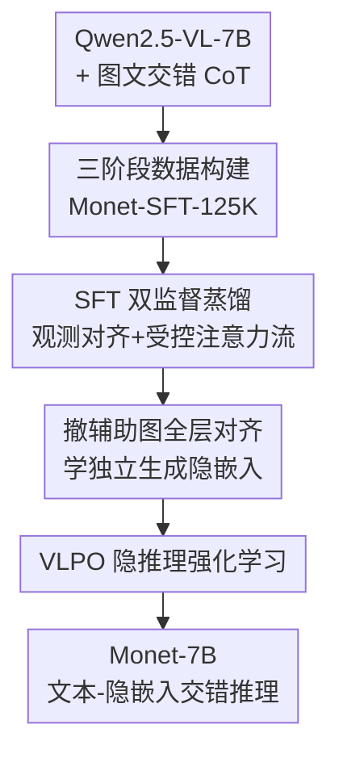

# Monet: Reasoning in Latent Visual Space Beyond Image and Language

**会议**: CVPR 2026  
**论文**: [CVF Open Access](https://openaccess.thecvf.com/content/CVPR2026/html/Wang_Monet_Reasoning_in_Latent_Visual_Space_Beyond_Image_and_Language_CVPR_2026_paper.html)  
**代码**: https://github.com/NOVAglow646/Monet  
**领域**: 多模态VLM  
**关键词**: 隐视觉推理, 多模态大模型, 蒸馏式SFT, 强化学习, 连续隐嵌入

## 一句话总结
Monet 让多模态大模型不再靠裁剪/调外部工具来"看图思考"，而是直接在连续的隐视觉空间里生成一串隐嵌入当作"中间视觉想法"，用三阶段蒸馏式 SFT 把这种能力教会模型、再用专为隐推理设计的 VLPO 强化学习把隐嵌入也纳入策略梯度，最终 7B 模型在真实感知/推理和分布外抽象视觉推理上都稳定涨点。

## 研究背景与动机
**领域现状**：「Thinking with images」是当前提升多模态大模型（MLLM）视觉推理的主流范式——在思维链（CoT）的中间步骤里注入视觉证据，而不只是纯文本推理。常见做法有三类：让模型预测关键区域坐标做裁剪/grounding、调用 grounding/深度估计等外部视觉工具、或生成可执行代码去编辑输入图（画线、加框、算深度图）。

**现有痛点**：这些方法的灵活性被外部工具死死框住。第一，为特定工具（如预测 bounding box）训练出来的模型很难泛化到需要更复杂视觉操作的任务（视觉数学、空间、图形推理）；第二，工具依赖增加了训练负担，模型经常生成不出合法的工具调用或可执行代码；第三，依赖外部工具/解释器要做异步、多轮推理，部署复杂、延迟高。这都离人类那种"在脑内感知空间里灵活想象"的视觉思维很远。

**核心矛盾**：要模仿人类的抽象视觉思维，就得让模型在**连续隐空间**里直接推理，生成超越文本描述和图像嵌入的隐嵌入当中间视觉想法。但已有的隐视觉推理工作（LVR、Mirage 等）暴露两个根本难题：（1）**对齐成本高**——把生成的隐嵌入和辅助图的成百上千个 image token 对齐，计算和显存开销巨大，而用 mean pooling 压缩 image token 又会破坏细粒度视觉特征；（2）**隐嵌入监督不足**——SFT 里只在文本 token 上加 next-token-prediction（NTP）损失，模型很容易过拟合记住后续 token 而非学好隐表示，而 RL 阶段的 GRPO 损失只能在文本 token 上计算，隐嵌入的优化被直接忽略。结果是涨点有限、且高度任务特定。

**本文目标**：训练一个文本输出的 MLLM（Qwen2.5-VL-7B）去做隐推理，分解为两个子问题——SFT 阶段如何低成本、强监督地教会模型生成有用的隐嵌入；RL 阶段如何让奖励信号真正回流到隐嵌入上。

**切入角度**：作者的关键观察是，隐嵌入的作用是"替代辅助图去帮助预测后续的观测描述"，所以监督信号不该是去硬对齐图像 token，而应该对齐**关键观测 token 的隐表示**——只要模型在"看了辅助图"和"只有生成的隐嵌入"两种条件下，对那些描述关键视觉信息的文本 token 算出的隐表示一致，就说明隐嵌入成功编码了该有的视觉线索。

**核心 idea**：用"对齐关键观测 token 表示 + 受控注意力流 + 只让隐嵌入回传梯度"的双监督蒸馏 SFT 替代昂贵的图像 token 对齐，再用把隐嵌入概率化的 VLPO 替代只管文本的 GRPO，让模型真正在隐视觉空间里推理。

## 方法详解

### 整体框架
Monet 训练一个文本输出的 MLLM，使其在推理时输出**文本-隐嵌入交错**的思维链。推理时（见原文 Figure 1 左），模型自己决定何时输出特殊 token `<latent>` 开启隐推理：解码过程被改写，让 decoder 最后一层的表示直接回灌为下一步的输入嵌入，连续生成预定数量 $K$ 个隐嵌入后插入 `</latent>` 切回文本推理（这种定长解码简单有效）。训练侧分两大块：**三阶段 SFT** 把"生成并用隐嵌入推理"的基本能力教会模型，**VLPO 强化学习**再把隐嵌入显式纳入策略优化。其中三阶段 SFT 是一条"热身 → 用教师造高质量目标隐嵌入 → 撤掉辅助图学着自己生成"的蒸馏管线，所有阶段都建立在专门构建的 Monet-SFT-125K 数据集上。

### 关键设计

**1. Monet-SFT-125K：用三级筛选保证辅助图"必要且正确"**

隐推理要学好，前提是 CoT 数据里的中间视觉步骤真的有信息、不带噪声。作者指出现有图文交错 CoT 数据集有三个毛病：很多样本只看原图就能答对（辅助图是多余的，模型会学会绕过中间视觉），中间图有时本身就不准（引入噪声），以及所有文本 token 被同等对待、忽略了那些描述关键视觉信息的 token。对应地设计了三阶段 curation：Stage 1 从 ReFocus、CogCoM、Zebra-CoT、Visual-CoT 收原始数据，**只保留 Qwen2.5-VL-7B 仅凭问题+原图答错的样本**，以确保辅助图是必要的；Stage 2 在这些样本里**只留 Qwen2.5-VL-72B 仅凭辅助图就能答对的**，确保辅助图准确可用；Stage 3 用 DeepSeek-V3.1 和 Gemini 2.5 Pro **标出 CoT 里对应关键视觉观测的文本 token**（包进 `<observation>...</observation>`），为后续学隐嵌入提供细粒度监督。最终 125K 条覆盖真实场景、文档、图表、几何，视觉操作从裁剪/grounding 到画辅助线、造全新中间视觉图都有。这一步直接决定了后面"对齐观测 token"有没有干净的监督锚点。

**2. SFT Stage 2 双监督：用观测 token 对齐 + 受控注意力流蒸出目标隐嵌入**

这是全框架最核心的设计，针对"对齐成本高 + 隐嵌入监督弱"两大痛点。Stage 1 先做一遍 vanilla SFT 热身（在图文交错 CoT 上），让模型学会真正利用中间步图像而非死记语言模式——原文 Figure 4 显示热身后"有/无辅助图"预测观测 token 的准确率差距逐渐拉大，说明模型开始依赖视觉线索。Stage 2 从热身模型 $M_\text{warm-up}$ 同时初始化**教师**和**学生**：教师吃带真值辅助图的 CoT，学生的 CoT 里每段辅助图后面跟着自回归生成的隐嵌入。它有三个互相咬合的机制：

其一，**对齐关键观测 token 表示**。隐嵌入既然要替辅助图去预测观测 token，那它在"有图（教师）"和"只有隐嵌入（学生）"两种条件下，观测 token 的隐表示就该一致。作者冻结教师、抽出各层观测 token 表示 $H^*_\text{obs}=\{h^{*(i,l)}_\text{obs}\}$，与学生对应表示 $\hat h^{(i,l)}_\text{obs}$ 做逐层余弦对齐：

$$\mathcal{L}_\text{align-obs} = \frac{1}{N}\sum_i \sum_l \left(1 - \cos\big(h^{*(i,l)}_\text{obs}.\mathrm{detach}(),\ \hat h^{(i,l)}_\text{obs}\big)\right)$$

其二，**"辅助图 → 隐嵌入 → 观测"受控注意力流**。光有对齐损失还不够（消融里 "w/o auxiliary img" 明显掉点），因为观测 token 表示本身可能没编码够视觉信息。于是在学生 CoT 里把辅助图嵌入插到每段隐嵌入之前，并用改过的注意力 mask 让**辅助图只能被隐嵌入注意到、不能被后续文本 token 看到**。这既让隐嵌入无损直取视觉特征，又强制了一条结构化信息流——视觉信息必须经隐嵌入这个瓶颈才能流向观测 token，逼隐嵌入去选择性编码相关线索。

其三，**latent-only 反传**。为防止模型走捷径（不真正改进隐嵌入也能把对齐损失降下去），$\mathcal{L}_\text{align-obs}$ 的梯度被限制**只经由生成的隐嵌入回流到参数**，其余表示 stop-gradient。消融里 "w/o latent-only BP" 让 V\* 从 82.20 暴跌到 46.07，是所有消融里掉得最狠的，印证这条捷径不堵就废。Stage 2 总损失为 $\mathcal{L}_\text{stage2}=\mathcal{L}_\text{NTP}+\alpha\mathcal{L}_\text{align-obs}$（$\alpha=2.0$），训练完的学生 $M_\text{stage2}$ 用来生成**目标隐嵌入** $h^{*(i)}_\text{latent}$，供下一阶段当蒸馏靶子。

**3. SFT Stage 3：撤掉辅助图、全层对齐，学会"自己想象"**

Stage 2 的隐嵌入仍能看到辅助图，和最终目标（推理时没有真值辅助图）有差距。Stage 3 重新用 $M_\text{warm-up}$ 初始化，在 CoT 里**移除辅助图**，训练模型生成 $\hat h^{(i)}_\text{latent}$ 去对齐 Stage 2 造的固定目标 $h^{*(i)}_\text{latent}$：

$$\mathcal{L}_\text{align-latent} = \frac{1}{N}\sum_i \sum_l \left(1 - \cos\big(h^{*(i,l)}_\text{latent}.\mathrm{detach}(),\ \hat h^{(i,l)}_\text{latent}\big)\right)$$

和前作（LVR、Mirage）只对齐最后一层不同，Monet **对齐所有层**以提供更强监督。再叠加文本 token 上的 NTP 损失让隐嵌入服务后续推理，总损失 $\mathcal{L}_\text{stage3}=\mathcal{L}_\text{NTP}+\beta\mathcal{L}_\text{align-latent}$（$\beta=2.0$），得到 $M_\text{SFT}$。这一步本质是把"有图老师"的隐嵌入蒸馏进一个"无图也能想象"的学生，闭合了训练-推理的差距。

**4. VLPO：把连续隐嵌入概率化，让奖励真正优化隐推理**

前作在 SFT 后直接套 GRPO，但 GRPO 目标只能在文本 token 上算——隐嵌入没有像文本 token 那样的显式概率分布，于是隐推理部分在 RL 里几乎没被训练到（实验也证实 GRPO 主要强化非隐推理）。VLPO 的关键想法是**估计 rollout 时采到的连续隐嵌入的输出概率**，从而像文本 token 一样给隐步算重要性比 $r_{i,t}(\theta)$。具体地，把 $\pi_\text{old}$ 在第 $t$ 步生成的隐嵌入 $h^\text{old}_{i,t}$ 看作从一个高斯分布采样，该分布的均值是当前策略 $\pi_\theta$ 在同样上下文下生成的隐嵌入 $h^\theta_{i,t}$：

$$\pi_\theta(h^\text{old}_{i,t}\mid Q,I,o_{i,<t}) = \exp\left(-\frac{1}{2\sigma^2}\lVert h^\text{old}_{i,t}-h^\theta_{i,t}\rVert^2 - \text{const}\right)$$

于是隐步的比值 $r_{i,t}(\theta)=\exp\big(-\frac{1}{2\sigma^2}\lVert h^\text{old}_{i,t}-h^\theta_{i,t}\rVert^2\big)$（$\sigma$ 为预设标量），代入 GRPO 式即得 VLPO 目标。其几何意义很直白：当优势 $\hat A_{i,t}>0$，最大化目标等价于**最小化 $\lVert h^\text{old}_{i,t}-h^\theta_{i,t}\rVert^2$**，即把策略的隐嵌入拉向那个导致正奖励的"好动作"隐嵌入；这正是 GRPO 根本做不到的——用结果奖励直接优化隐嵌入。奖励设计上只用准确率奖励（答对 1、错 0）+ 让答案放进 `\boxed{}` 的格式奖励，**刻意不奖励"是否做了隐推理"本身**，否则模型会无脑滥用隐推理。

### 损失函数 / 训练策略
SFT Stage 1 训 4 个 epoch；Stage 2、3 各约 1 个 epoch（1000 步）。RL 用 Thyme-RL 的 3.2K 子集训 1 epoch。Monet-SFT 训练时隐嵌入数固定 $K_\text{train}=8$；Monet-7B（SFT+VLPO）的 RL 用 $K_\text{train}=10$；测试时从 $\{8,10,12,16\}$ 选最佳 $K_\text{test}$。

## 实验关键数据

### 主实验
在真实感知/推理基准上，Monet-7B 全面超过同数据训练的 vanilla SFT、SFT+GRPO，以及裁剪式 DeepEyes 和隐推理前作 LVR：

| 数据集（指标 Overall） | Qwen2.5-VL-7B | vanilla SFT | SFT+GRPO | DeepEyes | Monet-7B | Δ |
|--------|------|------|------|------|------|------|
| V\* | 76.44 | 81.68 | 78.53 | 83.25 | **83.25** | +6.81 |
| HRBench4K | 68.00 | 68.38 | 70.00 | 71.25 | 71.00 | +3.00 |
| HRBench8K | 63.75 | 61.63 | 66.75 | 65.13 | **68.00** | +4.25 |
| MME-RealWorld-Lite | 45.75 | 51.28 | 52.42 | 54.28 | **55.50** | +9.75 |

分布外（OOD）抽象视觉推理 VisualPuzzles 上 Monet 拿到开源模型最佳，且明显高于 SFT/GRPO 基线，显示隐推理带来的不是死记而是可迁移的抽象推理：

| 模型 | VisualPuzzles Overall | Algorithmic | Analogical | Deductive |
|------|------|------|------|------|
| Qwen2.5-VL-7B | 32.71 | 37.02 | 21.80 | 47.50 |
| + vanilla SFT | 33.99 | 40.46 | 30.81 | 46.00 |
| + SFT + GRPO | 30.99 | 36.26 | 25.12 | 43.50 |
| DeepEyes | 32.96 | 37.79 | 27.01 | 41.00 |
| **Monet-7B** | **35.02** | **45.80** | 30.81 | **47.50** |

### 消融实验
| 配置 | V\* | HRBench8K | MME-RW-Lite | VisualPuzzles | 说明 |
|------|------|------|------|------|------|
| Monet-7B (full) | 83.25 | 68.00 | 55.50 | 35.02 | 完整模型 |
| Monet-SFT (w/o VLPO) | 82.20 | 66.00 | 52.68 | 30.48 | 去掉 VLPO，OOD 掉 4.5 |
| Monet-SFT + GRPO | 80.10 | 64.75 | 54.19 | 31.51 | GRPO 不稳，多数指标反不如纯 SFT |
| w/o latent-only BP | 46.07 | 39.00 | 38.67 | 33.65 | 不堵捷径，崩盘式下降 |
| w/o auxiliary img | 73.30 | 57.63 | 39.66 | 28.60 | 去掉受控注意力流，大掉 |
| w/o obs token align | 75.39 | 63.50 | 46.90 | 27.48 | 去掉观测对齐，单信号监督不够 |

### 关键发现
- **latent-only 反传是命门**：去掉后 V\* 从 82.20 崩到 46.07，说明若不限制梯度只走隐嵌入，模型会找捷径把对齐损失降下去却根本没改进隐表示。
- **双监督缺一不可**：观测 token 对齐（w/o obs token align）和辅助图受控注意力流（w/o auxiliary img）各自移除都大幅掉点，二者分别提供"对齐靶子"和"视觉信息源"。
- **VLPO 才是 OOD 泛化的来源**：在 OOD 的 VisualPuzzles 上，只有 VLPO 加持的模型在 $K_\text{test}>0$ 时才稳定优于 $K_\text{test}=0$；纯 SFT 诱导不出强 OOD 泛化，GRPO 主要强化非隐推理、对隐推理几乎无益。
- **隐嵌入支持测试时扩展**：分布内任务上性能常在 $K_\text{test}>K_\text{train}$ 处达峰，VLPO 还让模型对 $K_\text{test}$ 选择更鲁棒、并把这种 test-time scaling 趋势延伸到 OOD。

## 亮点与洞察
- **把"对齐图像 token"换成"对齐观测 token 表示"**，一招同时解决成本与监督两个问题：不必再和成百上千 image token 硬对齐，监督锚点变成少量关键观测 token，既省算力又更贴近"隐嵌入是为推理服务"的本质。
- **受控注意力 mask 强制信息瓶颈**：让辅助图只能被隐嵌入看到、不被后续文本看到，逼出"辅助图→隐嵌入→观测"的结构化信息流——这种"用注意力可见性当架构约束"的 trick 可迁移到任何想强制中间表示承载特定信息的蒸馏场景。
- **VLPO 用高斯假设给连续动作"算概率"**，让 PPO/GRPO 这套离散 token 的策略梯度框架能直接套到连续隐嵌入上，且优化目标退化成一个直观的"拉向好动作隐嵌入"的 L2，思路干净、可复用到其他连续潜变量 RL。
- **数据 curation 用"强模型当裁判"双向过滤**（7B 答错保难度、72B 看辅助图答对保有效性），是一个保证"中间视觉步骤真的有用且正确"的可复制配方。

## 局限与展望
- **定长解码 $K$ 是超参而非自适应**：隐嵌入数量靠人工从 $\{8,10,12,16\}$ 里选，模型不能按题目难度自己决定想多久，复杂任务可能受限。
- **依赖强外部模型造数据**：curation 用到 Qwen2.5-VL-72B、DeepSeek-V3.1、Gemini 2.5 Pro 当裁判，数据质量受这些模型能力和偏置影响，复现成本高。
- **VLPO 的高斯/固定方差假设较强**：把隐嵌入概率建模成均值为策略输出、方差 $\sigma$ 预设的高斯，$\sigma$ 怎么选、这一近似在不同任务上是否稳健，正文未深入分析。
- **规模与骨干单一**：只在 Qwen2.5-VL-7B 上验证，是否能扩到更大模型或别的 MLLM 骨干、隐推理收益是否随规模变化，仍待考察。

## 相关工作与启发
- **vs LVR / Mirage（隐视觉推理前作）**: 它们把生成隐嵌入与辅助图嵌入对齐（LVR 只对齐裁剪区域、Mirage 用 mean pooling 压缩 image token），且只对齐最后一层、RL 直接套 GRPO。Monet 改为对齐**关键观测 token 表示**、**全层对齐**、用受控注意力流注入视觉信息、并以 VLPO 替代 GRPO；优势是成本更低、监督更强、隐嵌入在 RL 里真正被优化，OOD 泛化明显更好。
- **vs DeepEyes（think with images 裁剪式）**: DeepEyes 靠裁剪强化感知，本质仍受"裁剪"这一固定工具约束、难迁到复杂视觉操作。Monet 在连续隐空间里推理、无需外部工具，灵活性更高，在抽象视觉推理 VisualPuzzles 上优势尤其明显。
- **vs GRPO（文本隐推理 RL）**: GRPO 目标只能在有显式概率的文本 token 上算，隐嵌入被晾在一边。VLPO 通过高斯概率化把隐嵌入纳入策略梯度，是把 RL 信号送进连续视觉想法的关键一步。

## 评分
- 新颖性: ⭐⭐⭐⭐⭐ 「对齐观测 token + 受控注意力流 + latent-only 反传」的蒸馏 SFT 与「把连续隐嵌入概率化」的 VLPO 都是有原创性的解法。
- 实验充分度: ⭐⭐⭐⭐ 主结果、OOD、消融、$K$ 扫描都齐全且自洽，但只在单一 7B 骨干上验证、缺更大规模佐证。
- 写作质量: ⭐⭐⭐⭐ 动机—痛点—设计的逻辑链清晰，三阶段管线和 VLPO 推导讲得明白，公式与消融对得上。
- 价值: ⭐⭐⭐⭐⭐ 给"无工具、在隐空间里做视觉推理"提供了一套可落地的训练+RL 配方，对多模态推理方向有方法论意义。

<!-- RELATED:START -->

## 相关论文

- [\[CVPR 2026\] Reasoning Palette: Modulating Reasoning via Latent Contextualization for Controllable Exploration for (V)LMs](reasoning_palette_modulating_reasoning_via_latent_contextualization_for_controll.md)
- [\[CVPR 2026\] ANTS: Adaptive Negative Textual Space Shaping for OOD Detection via Test-Time MLLM Understanding and Reasoning](ants_adaptive_negative_textual_space_shaping_for_ood_detection_via_test-time_mll.md)
- [\[CVPR 2026\] VisMem: Latent Vision Memory Unlocks Potential of Vision-Language Models](vismem_latent_vision_memory_unlocks_potential_of_vision-language_models.md)
- [\[CVPR 2026\] LASAR: Towards Spatio-temporal Reasoning with Latent Cognitive Map](lasar_towards_spatio-temporal_reasoning_with_latent_cognitive_map.md)
- [\[CVPR 2026\] R4: Retrieval-Augmented Reasoning for Vision-Language Models in 4D Spatio-Temporal Space](r4_retrieval-augmented_reasoning_for_vision-language_models_in_4d_spatio-tempora.md)

<!-- RELATED:END -->
