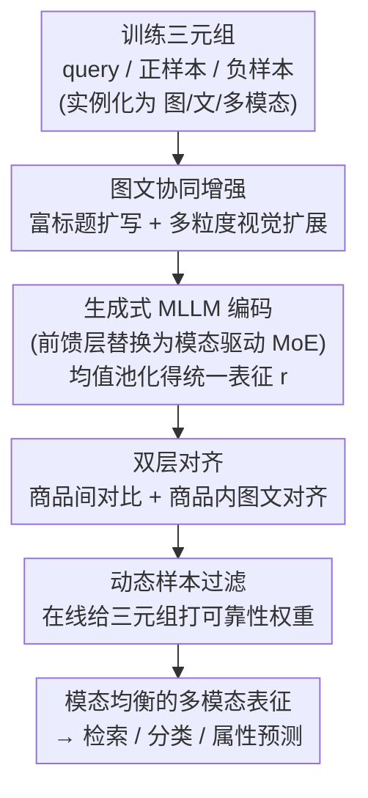

# MOON2.0: Dynamic Modality-balanced Multimodal Representation Learning for E-commerce Product Understanding

**会议**: CVPR 2026  
**论文**: [CVF Open Access](https://openaccess.thecvf.com/content/CVPR2026/html/Nie_MOON2.0_Dynamic_Modality-balanced_Multimodal_Representation_Learning_for_E-commerce_Product_Understanding_CVPR_2026_paper.html)  
**代码**: 无（开源 MBE2.0 数据集：https://huggingface.co/datasets/ZHNie/MBE2.0）  
**领域**: 多模态VLM  
**关键词**: 电商表征学习、模态不平衡、模态驱动MoE、双层对齐、对比学习

## 一句话总结
针对电商多模态表征学习中"固定比例混合训练导致模态失衡、只建模商品间关系而忽略商品内图文对齐、原始数据噪声大"三大痛点，MOON2.0 用一个模态驱动 MoE 做端到端多模态联合学习、用双层对齐同时拉齐商品间与商品内关系、再配图文协同增强与动态样本过滤净化数据，并发布了 640 万规模的 MBE2.0 基准，在多项电商检索/分类/属性预测任务上零样本刷到 SOTA。

## 研究背景与动机

**领域现状**：电商商品理解（检索、推荐、分类）越来越依赖任务无关的多模态表征学习。早期主流是双流架构（独立视觉编码器 + 文本编码器，映射到共享空间做对比/检索），近期则转向用多模态大模型（MLLM）把异构输入投到统一嵌入空间，能容纳"一个商品标题对应多张图（SKU 图、创意图）"这种电商典型的多对一关系。

**现有痛点**：作者指出现有电商 MLLM 仍有三处硬伤。其一是**训练方式**：它们普遍用固定比例的"模态混合训练"，例如前作 MOON 用 12:3:2 的图-文-多模态查询配比，而正样本永远同时含图文；这种固定混合与下游任务的真实模态分布不匹配，会诱发模态失衡——某些检索方向被系统性地训弱（论文 Fig. 2 显示图检索与文检索随混合比例此消彼长）。其二是**监督信号**：现有方法多聚焦商品**之间**（inter-product）的关系，几乎不显式建模单个商品**内部**（intra-product）的图文对齐，浪费了商品内天然的语义对齐信号。其三是**数据质量**：现有工作只做去重、类目再平衡、粗略主体检测，没有充分去噪与多样性扩展，而电商文本常冗余嘈杂、图像常杂乱且视角单一。

**核心矛盾**：固定的训练混合比例 vs. 下游任务多样的模态分布——一刀切的配比必然在某些模态方向上欠拟合，这是模态失衡的根因。

**本文目标**：拆成三个子问题——(1) 用一种自适应、单阶段端到端的训练范式消除模态失衡；(2) 把商品内图文对齐显式纳入优化目标；(3) 在训练管线里在线净化噪声三元组。

**切入角度**：与其手工调混合比例，不如让模型**按样本的模态构成自适应路由**到不同专家，并把"哪种对齐目标该用哪个专家"也学出来；同时把对比学习从纯商品间扩展到"商品间 + 商品内"双层。

**核心 idea**：用模态驱动 MoE 实现"多模态联合学习"替代固定比例混合训练，再叠加双层对齐 + 图文协同增强 + 动态样本过滤，做模态均衡的电商多模态表征。

## 方法详解

### 整体框架
MOON2.0 是一条围绕"三元组（query、正样本、负样本）"的端到端单阶段对比训练管线。每个元素都被实例化成三种输入模态：多模态（图+文 $x^{mm}$）、纯图（$x^{i}$）、纯文（$x^{t}$）；正负样本还额外带上增强后的"富标题"与"扩展图"。先用**图文协同增强**把原始标题扩写、把商品图做多粒度视觉扩展，提升数据多样性与鲁棒性；增强后的三元组喂进一个生成式 MLLM 主干，其前馈层被替换成**模态驱动 MoE**，按输入的模态构成动态路由专家、对最后一层隐状态做均值池化得到统一表征 $r\in\mathbb{R}^{D}$；表征再经**双层对齐**同时优化商品间对比目标与商品内图文对齐，并由**动态样本过滤**在线给三元组打可靠性权重、压制伪正/伪负样本。整套只需一次有监督微调。

### 关键设计

**1. 模态驱动 MoE（Modality-driven MoE）：用专家路由 + 模态感知目标耦合替代固定比例混合训练**

这一设计直击"固定混合比例诱发模态失衡"的痛点。它把 MoE 装在 LLM 主干的前馈层：给定隐状态 $h$，门控网络产生专家激活 $G=\mathrm{softmax}(W_g h)$，token 级专家输出为 $\hat h=\sum_{z=1}^{Z}\tilde G_z\cdot f_z(h)$，其中 $f_z$ 是第 $z$ 个专家 MLP、$\tilde G_z$ 是归一化路由权重。但作者强调单纯 token 级路由对"输入的模态构成"是无感知的，会导致专家在不同对齐目标（如纯图查询对多模态正样本 $q^{i}\!\to\!p^{mm}$）上分工不佳。为此引入一个可学习的**双对齐矩阵** $W^{*}\in\mathbb{R}^{Z\times M}$（$M$ 为对齐目标数），$W^{*}_{z,m}$ 量化专家 $z$ 对目标 $m$ 的内在偏好，经 softmax 归一化得 $p_{z,m}$；再把 token 级路由与学到的专家偏好聚合成目标专属权重 $\omega_m=\frac{1}{|B_m|}\sum_{b\in B_m}\sum_z p_{z,m}\cdot\tilde G_{z,b}$，反映"全体专家对优化目标 $m$ 的集体支持度"。此外在标准负载均衡项 $L_{aux}$ 之外加了一个**稀疏正则** $L_{sparsity}=\frac{1}{Z}\sum_z\big[-\sum_m p_{z,m}\log p_{z,m}\big]$，通过最小化每个专家在各目标上的偏好熵，逼专家走向"只擅长少数几个模态对齐目标"的尖峰分布。这样单阶段就能联合优化图、文、多模态查询对多模态目标的对比目标，把"配比"从超参变成了模型自学的路由策略。

**2. 双层对齐（Dual-level Alignment）：在商品间对比之外补上商品内图文对齐**

针对"只建模商品间、忽略商品内对齐"的痛点，这一目标把对比学习分两层。**商品间对齐**对三元组 $(q,p,n)$ 用对比损失 $L^{\vartheta}_{inter}=-\log\frac{\exp(r^{\vartheta}_q\cdot r^{mm}_p/\varepsilon)}{\exp(r^{\vartheta}_q\cdot r^{mm}_p/\varepsilon)+\sum_{N_q}\exp(r^{\vartheta}_q\cdot r^{mm}_n/\varepsilon)}$，其中 $\vartheta\in\{t,i,mm\}$ 表示纯文/纯图/多模态查询、$\varepsilon$ 为温度，整体 $L_{inter}=\omega^{t}_{inter}L^{t}_{inter}+\omega^{i}_{inter}L^{i}_{inter}+\omega^{mm}_{inter}L^{mm}_{inter}$。**商品内对齐**则针对单个商品内部的图文一致性：给定图 $i_\varpi$ 与其配文 $t_\varpi$、以及来自另一极性的无关文 $t_{\varpi-1}$，用 $L^{\varpi}_{intra}=-\log\frac{\exp(r^{i}_\varpi\cdot r^{t}_\varpi/\tilde\varepsilon)}{\exp(r^{i}_\varpi\cdot r^{t}_\varpi/\tilde\varepsilon)+\sum_{t_{\varpi-1}}\exp(r^{i}_\varpi\cdot r^{t}_{\varpi-1}/\tilde\varepsilon)}$ 拉近同商品图文、推开跨商品图文。两层加上 MoE 正则构成总目标 $L_{total}=L_{inter}+L_{intra}+\rho L_{aux}+\varsigma L_{sparsity}$。它的价值在实验里最直观：去掉双层对齐后，那些非传统跨模态方向（$q^{t}\!\to\!c^{i}$、$q^{i}\!\to\!c^{t}$）掉点最猛，说明商品内图文语义正是这些方向的关键支撑。

**3. 图文协同增强 + 动态样本过滤（Co-augmentation & Dynamic Sample Filtering）：先把数据喂饱、再在训练中把噪声踢掉**

这一对设计共同解决"数据噪声大、多样性不足"。**图文协同增强**用 MLLM 双管齐下：文本侧做实体感知扩写，先用内部实体抽取工具从标题 $T$ 与描述 $D$ 抽显著实体 $E$，再让 MLLM 在受控提示下把 $T$ 扩成富标题 $T^{+}=\mathrm{MLLM}_{text}(T,I,E)$；视觉侧做两阶段多粒度扩展——先编辑去除无关内容、保留核心属性得到标准化主体图 $I_m$，再以 $I_m$ 为锚做上下文引导编辑生成背景/视角/细节各异但语义一致的变体 $I^{c}_k=\mathrm{MLLM}_{edit}(I_m,T,\text{prompt}_k)$，最后用 CLIP 评图-标题一致性过滤低质样本。**动态样本过滤**则在对比管线里在线估计三元组可靠性：可靠性权重 $\phi=\sigma\big(\kappa((r_q\cdot r_p)-(r_q\cdot r_n)-\bar m)\big)$，其中 $\sigma$ 为 sigmoid、$\kappa$ 控制锐度；阈值固定 $\tau=0.6$，而边界 $\bar m$ 随训练衰减，使焦点从"高置信样本"逐步过渡到"难样本"；$\phi<\tau$ 的三元组在损失中被降权，从而压制伪正/伪负。两者一增一减，把原始电商数据净化成稳定、判别性越来越强的对比信号。

> 框架图中点名的四个贡献组件——图文协同增强、模态驱动 MoE、双层对齐、动态样本过滤——分别在设计 3、1、2、3 中交代；MLLM 编码与均值池化属于通用脚手架，不单列设计点。

### 损失函数 / 训练策略
最终目标 $L_{total}=L_{inter}+L_{intra}+\rho L_{aux}+\varsigma L_{sparsity}$。基于自研电商生成式 MLLM 做**单阶段**有监督微调；学习率 $1\times10^{-5}$、cosine 调度，64 张 A100、每卡 batch 4，约训练 18 小时。所有下游评测均为**零样本**设定（测试集不做任何文本扩写/视觉增强，保证泛化评估的公平）。

## 实验关键数据

### 主实验
在自建 MBE2.0 基准上做零样本评测，检索用 Recall@$k$（真值出现在 top-$k$ 的概率），分类/属性预测用 Acc/Prec/Rec/F1。下表节选 R@10 与 Acc（$q\!\to\!c$ 中 $t/i/mm$ 表示文/图/多模态）：

| 任务（指标） | MOON2.0 | MOON | GME | 提升(vs MOON) |
|--------------|---------|------|------|---------------|
| $q^{mm}\!\to\!c^{mm}$ R@10 | **94.21** | 80.78 | 73.90 | +13.4 |
| $q^{i}\!\to\!c^{mm}$ R@10 | **91.08** | 78.11 | 64.98 | +12.9 |
| $q^{t}\!\to\!c^{i}$ R@10 | **73.12** | 44.02 | 41.77 | +29.1 |
| 商品分类 Acc | **68.08** | 59.70 | 64.92 | +8.4 |
| 属性预测 Acc | **84.29** | 63.55 | 70.76 | +20.7 |

⚠️ 一个 caveat：在纯文检索方向 $q^{t}\!\to\!c^{mm}$ 的 R@10 上，通用检索模型 GME（64.41）略高于 MOON2.0（63.09），说明 MOON2.0 的优势主要体现在跨模态/多模态方向和分类/属性任务上，而非把每个方向都做到第一。在 M5Product、Fashion200K 两个公开基准上 MOON2.0 同样领先（如 M5Product 分类 Acc 95.50 vs MOON 73.12），验证了跨分布的泛化性。

### 消融实验
MBE2.0 上逐一去掉四个组件（R@10 / Acc）：

| 配置 | $q^{t}\!\to\!c^{mm}$ | $q^{i}\!\to\!c^{t}$ | 分类 Acc | 属性 Acc | 说明 |
|------|------|------|------|------|------|
| 完整 MOON2.0 | 63.09 | 64.91 | 68.08 | 84.29 | — |
| w/o 模态驱动 MoE | 51.29 | 56.21 | 62.55 | 75.62 | 换回普通 MLP，全面下降 |
| w/o 双层对齐 | 37.99 | 23.35 | 57.12 | 67.24 | **掉点最猛**，跨模态方向崩塌 |
| w/o 图文协同增强 | 59.69 | 58.68 | 66.21 | 77.77 | 输入信息量下降，温和下滑 |
| w/o 动态样本过滤 | 60.63 | 63.21 | 67.99 | 84.04 | 对噪声更敏感，影响最小 |

### 关键发现
- **双层对齐贡献最大**：去掉后 $q^{i}\!\to\!c^{t}$ 从 64.91 直坠 23.35，证明商品内图文对齐正是非传统跨模态检索方向的命脉。
- **MoE 是第二大支柱**：换成普通 MLP 后各方向普遍下降，说明按模态构成做专家分工确实优于单一前馈层。
- **增强与过滤是锦上添花**：两者去掉只带来温和下降（过滤影响最小），属于数据侧的稳健性增益而非性能主引擎。
- 注意力热图可视化显示，MOON2.0 把注意力从"high quality""women"等非关键词转移到"knitted cardigan""polo-neck"等核心属性与品牌词上，定性印证了更细的图文对齐。

## 亮点与洞察
- **把"训练配比"从超参变成可学路由**：模态驱动 MoE + 双对齐矩阵 + 稀疏正则，让模型自己学"哪个专家擅长哪种模态对齐"，这是消除模态失衡最巧妙的一招，思路可迁移到任何"多目标对比训练里目标间相互掣肘"的场景。
- **商品内对齐被严重低估**：一个看似简单的"同商品图文拉近"目标，在跨模态检索方向上带来碾压式收益，提醒做电商/多模态检索时别只盯着样本间关系。
- **数据增强与在线过滤配成一对**：先用 MLLM 把数据喂饱（多粒度图文扩展），再用随训练衰减边界的动态过滤把噪声踢掉，"加多样性"与"减噪声"的组合拳值得复用。
- **MBE2.0 基准本身是贡献**：640 万真实电商三元组（5,751,594 训练 + 636,241 测试），支持检索/分类/属性预测，测试集不做增强以保证零样本公平评估。

## 局限与展望
- **依赖自研 MLLM 主干与内部实体抽取工具**：核心结果建立在阿里自研电商 MLLM 与内部实体工具上，外部复现门槛高（代码未开源，仅放数据集）。
- **增强代价高**：图文协同增强要跑 MLLM 文本扩写 + 两阶段视觉编辑 + CLIP 过滤，离线增强成本不小，论文未报告这部分算力开销。
- **泛化边界**：方法面向"多对一商品-标题"的电商场景设计，迁到非电商通用多模态检索时双层对齐里的"商品内"概念是否仍成立，未做验证。
- 可改进方向：把动态样本过滤的边界衰减策略与 MoE 的稀疏正则做联合调度，或探索增强成本更低的在线增强替代离线 MLLM 编辑。

## 相关工作与启发
- **vs 双流架构（FashionCLIP / SigLIP2）**：它们用独立编码器 + $\ell_2$ 归一化嵌入做对比，难以建模"多图对一标题"的多对一关系；MOON2.0 用生成式 MLLM 统一编码异构输入，多模态检索方向大幅领先。
- **vs 前作 MOON**：MOON 用 12:3:2 固定比例混合训练，受模态失衡所累；MOON2.0 用模态驱动 MoE 做单阶段联合学习替代固定配比，并补上商品内对齐，几乎在所有任务上反超。
- **vs 通用多模态检索（GME / MM-Embed）**：它们聚焦通用检索/聚类、缺电商领域知识；MOON2.0 在分类/属性预测与跨模态检索上更强，但通用模型在纯文检索某些方向仍有竞争力。

## 评分
- 新颖性: ⭐⭐⭐⭐ 模态驱动 MoE + 双对齐矩阵把"模态配比"变成可学路由，思路新颖；但 MoE、双层对比本身都是已有组件的组合。
- 实验充分度: ⭐⭐⭐⭐⭐ 三基准 + 多任务零样本 + 四组件消融 + 热图可视化，且自建 640 万规模基准，相当扎实。
- 写作质量: ⭐⭐⭐⭐ 动机-方法-实验逻辑清晰，公式完整；但部分符号（$\bar m$、$\varpi$）定义略潦草。
- 价值: ⭐⭐⭐⭐ 对电商多模态表征有明确工业价值且开源了大规模基准，但核心模型未开源限制了学术复现。

<!-- RELATED:START -->

## 相关论文

- [\[CVPR 2026\] Towards Dynamic Modality Alignment in Multimodal Continual Learning](towards_dynamic_modality_alignment_in_multimodal_continual_learning.md)
- [\[CVPR 2026\] Guiding Diffusion-based Reconstruction with Contrastive Signals for Balanced Visual Representation](guiding_diffusion-based_reconstruction_with_contrastive_signals_for_balanced_vis.md)
- [\[ACL 2026\] AFMRL: Attribute-Enhanced Fine-Grained Multi-Modal Representation Learning in E-commerce](../../ACL2026/multimodal_vlm/afmrl_attribute-enhanced_fine-grained_multi-modal_representation_learning_in_e-c.md)
- [\[CVPR 2026\] BALM: A Model-Agnostic Framework for Balanced Multimodal Learning under Imbalanced Missing Rates](balm_a_model-agnostic_framework_for_balanced_multimodal_learning_under_imbalance.md)
- [\[CVPR 2026\] VQRAE: Representation Quantization Autoencoders for Multimodal Understanding, Generation and Reconstruction](vqrae_representation_quantization_autoencoders_for_multimodal_understanding_gene.md)

<!-- RELATED:END -->
