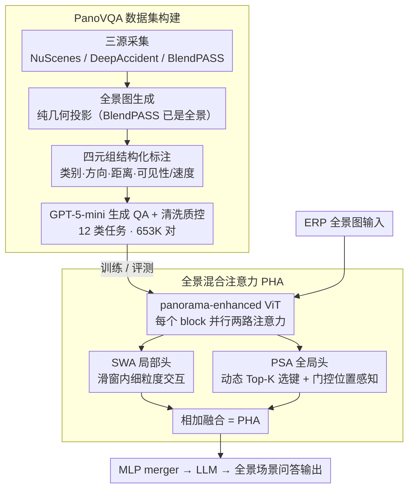

# More than the Sum: Panorama-Language Models for Adverse Omni-Scenes

**会议**: CVPR 2026  
**arXiv**: [2603.09573](https://arxiv.org/abs/2603.09573)  
**代码**: [https://github.com/InSAI-Lab/PanoVQA](https://github.com/InSAI-Lab/PanoVQA)  
**领域**: 多模态VLM  
**关键词**: 全景图理解, 360度视觉, VQA, 稀疏注意力, 自动驾驶

## 一句话总结
提出 Panorama-Language Modeling（PLM）范式和 PanoVQA 大规模全景 VQA 数据集（653K QA 对），设计即插即用的全景稀疏注意力模块让现有 VLM 无需重训练即可处理等距柱状投影全景图，在遮挡和事故等恶劣场景下实现优于多视角拼接方案的全局推理。

## 研究背景与动机

**领域现状**：VLM（LLaVA、BLIP-2 等）在针孔图像上取得了优异效果，但现实场景中全景（360°）输入越来越多——自动驾驶、机器人、AR/VR 等。当前方法采用"拼接"策略：采样多个窄视角裁剪分别处理再拼合。

**现有痛点**：多视角拼接破坏了 360° 场景的连续性，忽略全局空间关系（如左右边缘连通性），无法建模"wrap-around"特性。例如多摄像头方案会将前左方的危险车辆遗漏，因为它跨越了两个视角的边界。

**核心矛盾**：(1) 缺乏大规模全景 VQA 基准——现有数据集要么是多视角针孔 VQA，要么是全景数据但无 QA 对；(2) 架构不兼容——等距柱状投影（ERP）有严重几何畸变且分辨率远高于针孔图像，dense attention 的 $O(n^2)$ 复杂度不可承受。

**本文目标**：验证"全景语言理解 > 多视角拼接之和"的假设，为 360° VLM 建立基础设施。

**切入角度**：1 张全景图（41.42%）优于 6 张摄像头图（40.22%）的实验观察。

**核心 idea**：构建 PanoVQA 数据集 + 设计全景稀疏注意力（PSA）使现有 VLM 能直接处理全景输入。

## 方法详解

### 整体框架
这篇论文要回答一个直白的问题：把整个 360° 场景作为一张全景图喂给 VLM，是不是真的比把它切成几个窄视角再拼起来更强？为此它做了两件事。一是补上缺失的数据基础——构建 PanoVQA 数据集，用一条「多源采集 → 全景图生成 → 四元组结构化标注 → GPT 生成 QA → 清洗质控」的管线，把驾驶里最关键的正常、遮挡、事故三类场景装进 653K 个 VQA 问答对里。二是补上架构兼容性——把现有 VLM 的视觉编码器改造成 panorama-enhanced ViT：在每个 ViT block 里并行加上局部的滑窗注意力（SWA）和全局的全景稀疏注意力（PSA），二者相加构成全景混合注意力（PHA），在保留原 VLM（ViT + MLP merger + LLM 三段式）结构的前提下，让模型不必从头重训就能直接吞下等距柱状投影（ERP）的高分辨率全景图。数据负责验证假设，PHA 负责让验证在算力和畸变上都可行。

### 关键设计

**1. PanoVQA 数据集构建：给 360° 理解配上第一套大规模问答基准**

此前的尴尬是要么有多视角针孔图的 VQA、要么有全景图但没有 QA 标注，两边对不上，全景 VLM 连训练和评测的地基都没有。PanoVQA 用一条可复用的管线接上这个缺口。数据来自三个互补来源：PanoVQA-N 取自 NuScenes 的正常驾驶（N1–N4 四类任务），PanoVQA-O 取自 BlendPASS 的遮挡场景（O1–O3 三类），PanoVQA-D 取自 DeepAccident 的事故场景（D1–D5 五类），合计 12 类 VQA 任务、44.6K 帧、653K 问答对。

管线分四步：① 全景图生成——对 NuScenes 和 DeepAccident 沿用 OneBEV 的纯几何投影管线把多摄像头图像拼成全景图，BlendPASS 本身已是全景、无需拼接；② 四元组结构化标注——把每个对象解析成一个四元组 (类别, 方向, 距离, 可见性/速度)，这个格式刻意做到既机器可读又符合直觉：方向、距离支撑空间关系判断，可见性支撑遮挡推理，事故子集把可见性换成速度以服务碰撞风险评估，于是同一套标注无需改造就能横跨 12 类任务；③ QA 生成——基于结构化标注用 GPT-5-mini 批量生成问答对；④ 质控——先用关键词自动清洗，再加人工评估双重把关。最终问题平均约 19 词、答案平均约 42 词，远比"一个单词"式的答案基准更接近真实推理。

> ⚠️ GPT-5-mini 等模型名以原文为准。

**2. 全景混合注意力（PHA）：用局部+全局双路让 VLM 直接吞下 ERP 全景**

ERP 全景图分辨率远高于针孔图像，若沿用 dense attention，$O(L^2)$ 的开销直接压垮显存；而固定模式的稀疏注意力（如 SSA）又把注意力结构写死，无法贴合 ERP 独特的投影拓扑——平面上相邻的 token 在球面上未必真的相邻，纬度越高拉伸畸变越严重。PHA 不是单一模块替换，而是在每个 ViT block 里**并行跑两路注意力再相加**：

- **局部头 SWA（滑窗注意力）**：把 token 序列切成不重叠窗口、窗口内做细粒度自注意力，把复杂度从 $O(L^2)$ 降到 $O(L \cdot L_w)$（$L_w$ 为窗口大小），专管近邻细节，但窗口之间不交互。
- **全局头 PSA（全景稀疏注意力）**：让每个 query 经一个动态选择器算出与所有 key 的相关性分数，只挑 Top-K 个最相关的 key 做注意力；选择器的门控（gate）里融入可学习的位置编码 $\text{PE}_{t,s}$，使选键过程位置感知，从而顺着 ERP 拓扑连接前后、左右等真正相关的远距 token，并过滤畸变区域的无用 patch。

两路相加即 PHA，整体替换进预训练 VLM 的注意力层即可，保留 VLM 原有的 ViT + MLP merger + LLM 结构、不必从头重训——这正是"现有 VLM 无需重训练即可处理全景"这一卖点的落点。

### 训练策略
PHA 模块既可以在 PanoVQA 上微调，也可以直接插进已有的推理 pipeline 即取即用；评测则按 PanoVQA-N/O/D 三个子集分场景进行，分别考察正常、遮挡、事故下的表现。

## 实验关键数据

### 主实验

| 方法 | 输入 | PanoVQA 准确率 | 说明 |
|------|------|---------------|------|
| 现有 VLM (6-cam) | 6 张针孔图 | 40.22% | 多视角拼接 |
| PLM (1-Pano) | 1 张全景图 | **41.42%** | 全景模型 |
| 其他所有模型 | - | 低于 PLM | 所有类别均落后 |

### 场景分类表现

| 场景 | 说明 | PLM 优势 |
|------|------|---------|
| Normal (N) | 场景描述、物体识别、空间关系 | 空间推理优势明显 |
| Occlusion (O) | 遮挡关系推理 | 全局上下文帮助推断被遮挡物体 |
| Accident (D) | 碰撞风险、避让决策 | 360° 视野避免盲区遗漏 |

### 消融实验
- 去除 PSA 使用 dense attention：推理成本剧增且准确率下降
- 1-Pano 在方向判断任务上显著优于 6-cam（后者常误判方向）
- 数据集中三种场景对模型均具有挑战性，事故场景最难

## 亮点
- 首个全景 VLM 范式（PLM），实验证明全景理解 > 多视角拼接之和
- PanoVQA 是首个结合全景图和 VQA 的大规模基准，含遮挡和事故稀缺场景
- PSA 模块即插即用，不需重训练已有 VLM，降低了采用门槛
- 数据集构建管线可复用（NuScenes/BlendPASS/DeepAccident → 全景 VQA）
- 12 类 VQA 任务覆盖场景描述、空间推理、遮挡推理、碰撞评估等多维度
- 对象三元组/四元组表示格式既机器可读又直观，便于后续研究复用

## 局限与展望
- 全景图拼接质量受限于原始多摄像头对齐精度和遮挡区域处理
- PSA 的具体注意力模式选择和超参需要更多消融实验
- PanoVQA 当前以驾驶场景为主，室内/行人/AR/VR 场景覆盖不足
- 可进一步探索将 PLM 与 BEV 表征融合，结合全景图的全局优势和 BEV 的精确定位
- ERP 投影在极区（天空/地面）的严重畸变可能影响这些区域的理解
- PanoVQA-O（遮挡场景）和 PanoVQA-D（事故场景）的样本量相对较小（<1.3K 和 <144K），可能不足以训练大模型

### QA 生成质量
- 使用 GPT-5-mini 生成，经自动机器清洗和人工评估双重质控
- 问题平均长度约 19 词、答案平均长度约 42 词，远超单词答案基准

<!-- RELATED:START -->

## 相关论文

- [\[ACL 2026\] More Than Meets the Eye: Measuring the Semiotic Gap in Vision-Language Models via Semantic Anchorage](../../ACL2026/multimodal_vlm/more_than_meets_the_eye_measuring_the_semiotic_gap_in_vision-language_models_via.md)
- [\[CVPR 2026\] When Token Pruning is Worse than Random: Understanding Visual Token Information in VLLMs](when_token_pruning_is_worse_than_random_understanding_visual_token_information_i.md)
- [\[ACL 2025\] Exploring How Generative MLLMs Perceive More Than CLIP with the Same Vision Encoder](../../ACL2025/multimodal_vlm/exploring_how_generative_mllms_perceive_more.md)
- [\[CVPR 2026\] VLM-Loc: Localization in Point Cloud Maps via Vision-Language Models](vlm-loc_localization_in_point_cloud_maps_via_vision-language_models.md)
- [\[ICLR 2026\] Seeing Across Views: Benchmarking Spatial Reasoning of Vision-Language Models in Robotic Scenes](../../ICLR2026/multimodal_vlm/seeing_across_views_benchmarking_spatial_reasoning_of_vision-language_models_in_.md)

<!-- RELATED:END -->
