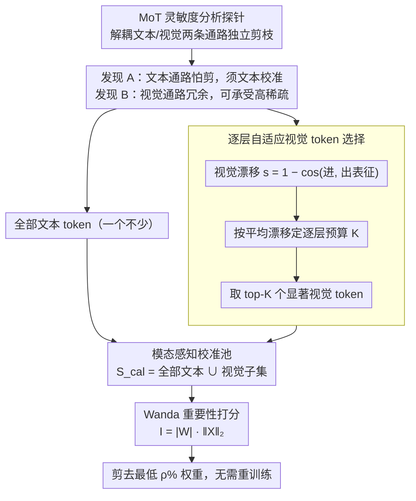

# Mostly Text, Smart Visuals: Asymmetric Text-Visual Pruning for Large Vision-Language Models

**会议**: CVPR 2026  
**arXiv**: [2603.16001](https://arxiv.org/abs/2603.16001)  
**代码**: [https://github.com/LezJ/ATV-Pruning](https://github.com/LezJ/ATV-Pruning)  
**领域**: 多模态VLM  
**关键词**: 权重剪枝, LVLM, 模态不对称, 校准策略, 稀疏化

## 一句话总结
通过 MoT 探针实验揭示 LVLM 中文本通路和视觉通路对剪枝的不对称敏感性——文本通路高度敏感必须用文本 token 校准、视觉通路高度冗余可承受 60% 稀疏度，据此提出 ATV-Pruning 使用全部文本 token + 逐层自适应选择的少量视觉 token 构建校准池。

## 研究背景与动机

**领域现状**：LVLM 参数量庞大，权重剪枝是降低部署成本的有效手段。SparseGPT 和 Wanda 在纯文本 LLM 上效果好，后者通过权重幅度 × 激活范数评估重要性。但直接应用于 LVLM 效果欠佳。

**现有痛点**：现有 LVLM 剪枝方法（如 TAMP）虽然考虑了多模态，但仍在统一框架内混合处理文本和视觉 token，忽略了两种模态在剪枝下的根本行为差异——(1) 文本和视觉激活在表征空间中占据不同聚类区域（t-SNE 可视化）；(2) 仅用文本 vs 仅用视觉校准得到的剪枝 mask IoU 分布很宽。

**核心矛盾**：模态不可知的校准策略稀释了保护文本相关权重所必需的语言信号。

**本文目标**：如何针对不同模态通路的不同敏感性设计校准策略？

**切入角度**：通过 MoT（Mixture-of-Transformer）分析探针显式解耦文本和视觉通路，独立研究各自的剪枝敏感性。

**核心 idea**：文本通路用全部文本 token 校准（保敏感性），视觉通路仅需少量高显著性视觉 token 补充（利用冗余性）。

## 方法详解

### 整体框架
这篇论文要解决的是：给 LVLM 做权重剪枝时，用哪些 token 来"校准"激活范数才不会把语言能力剪坏。Wanda 这类激活感知剪枝靠校准数据估出每列激活的范数，再用「权重幅度 × 激活范数」打分剪权重——校准数据喂什么 token，直接决定哪些权重被判为重要。ATV-Pruning 没有改打分公式，只改了校准池的成分：先用一个探针实验测出文本通路怕剪、视觉通路耐剪，再据此把全部文本 token 留下、只逐层挑少量最"活跃"的视觉 token 补进来，构成校准池 $\mathcal{S}_{cal} = \mathcal{T} \cup \mathcal{V}_{sub}$（$\mathcal{T}$ 是所有文本 token，$\mathcal{V}_{sub}$ 是逐层自适应选出的视觉 token 子集），然后照常跑 Wanda 剪枝、无需重训练。

### 关键设计

**1. MoT 灵敏度分析探针：先量出两条通路怕不怕剪，再谈怎么校准**

整个方法的依据来自这个动机实验。痛点是以前的 LVLM 剪枝把文本和视觉 token 混在一个校准池里，无从知道剪枝到底伤到了谁。作者把 Transformer block 的 QKV 投影和 FFN 复制成文本、视觉两条独立通路（Mixture-of-Transformer 的解耦形式），让文本 token 只走文本通路、视觉 token 只走视觉通路，于是可以分别用「纯文本 / 纯视觉 / 混合」三种校准源去剪同一条通路，单独观察各自的性能塌陷。结论非常干脆：文本通路极怕剪，60% 稀疏度下用文本校准还能保 84.65%，换成视觉校准直接崩到 50.92%、混合校准也只有 64.97%；视觉通路则几乎不怕，60% 稀疏度下无论拿什么校准都保 99.25% 以上。这两条发现（下文记作发现 A、发现 B）把"该重点保护谁"从直觉变成了可量化的事实。

**2. 模态感知校准池：文本 token 一个不少，视觉 token 点到为止**

有了探针结论，校准池的构成就不再对称。发现 A 说文本通路的重要权重高度依赖语言信号，所以文本 token 全部纳入校准——少喂一点都可能让保护语言能力的权重被误判成不重要而剪掉；发现 B 说视觉通路本身冗余，大量视觉 token 提供的是重复信息，因此只需补一小撮就足以覆盖视觉特异的权重。这正是标题"Mostly Text, Smart Visuals"的来历：校准池里文本占绝对多数，视觉只取精华。默认视觉 token 比例约 10% 就能拿到最佳 trade-off。

**3. 逐层自适应视觉 token 选择：用表征漂移挑出当层真正在干活的视觉 token**

视觉 token 既然只留少量，挑哪些就成了关键。作者用一个叫 visual drift 的显著性度量，定义为某个视觉 token 进出当前 block 时表征方向的变化：

$$s_v = 1 - \cos(\mathbf{X}_{in,v}, \mathbf{X}_{out,v})$$

直觉很朴素——如果一个 block 把某视觉 token 的表征改动很大（cosine 相似度低、$s_v$ 大），说明该 token 在这一层被积极加工、和这层权重的交互最充分，拿它来校准最能反映这层视觉权重的真实激活；改动小的 token 基本是"路过"，留下也是噪声。关键在于「自适应」不只是逐层重算 $s_v$，连每层留多少视觉 token 也随层而变：先把当层所有视觉 token 的 $s_v$ 取平均得到 $\bar{s}$，再按 $K=\lfloor\alpha\cdot\bar{s}\cdot n_{\text{text}}\rfloor$ 定出该层的视觉 token 预算（$n_{\text{text}}$ 为该样本的文本 token 数，$\alpha$ 为全局缩放超参）——经验上 $\bar{s}$ 在浅层很小、到中后层才变大，因此视觉处理越活跃的中后层 $K$ 越大、留的视觉 token 越多，浅层则只留极少。定好 $K$ 后取 $s_v$ 最大的 top-$K$ 个视觉 token，与全部文本 token 拼成该层校准池 $\mathcal{S}_{cal}=\mathcal{T}\cup\mathcal{V}_{sub}$，所以不同层挑到的视觉 token 数量和身份都可以完全不同。这一步几乎零额外训练成本，只是在一次校准前向里顺手记录进出表征。

### 损失函数 / 训练策略
- 沿用 Wanda 的重要性评分 $\mathbf{I}_{ij} = |\mathbf{W}_{ij}| \cdot \|\mathbf{X}_j\|_2$，其中 $\|\mathbf{X}_j\|_2$ 由上面构造的校准池估出
- 按行剪去得分最低的 $\rho\%$ 权重，得到非结构化稀疏模型
- 全程 post-hoc、无需重训练，方法的全部增益都来自校准池成分的改变

## 实验关键数据

### MoT 探针实验（LLaVA-NeXT）

| 通路 | 校准源 | 50% 稀疏度均值 | 60% 稀疏度均值 |
|------|--------|---------------|---------------|
| 文本通路 | 文本 | 98.26% | 84.65% |
| 文本通路 | 视觉 | 94.33% | 50.92% |
| 文本通路 | 混合 | 95.86% | 64.97% |
| 视觉通路 | 文本 | 100.27% | 100.05% |
| 视觉通路 | 视觉 | 99.37% | 99.25% |
| 视觉通路 | 混合 | 100.14% | 99.57% |

### 主实验（9 个多模态基准）

| 方法 | 稀疏度 | 多基准平均 | vs Wanda | vs TAMP |
|------|--------|-----------|---------|---------|
| ATV-Pruning | 50% | **最优** | 显著优于 | 超过 |
| ATV-Pruning | 60% | **最优** | 大幅优于 | 超过 |

## 亮点
- MoT 探针实验设计精巧，首次定量揭示 LVLM 中文本/视觉通路的不对称剪枝敏感性
- 方法极其简洁——在 Wanda 基础上只改了校准 token 的选取方式，实现简单但效果显著
- 发现视觉通路 60% 稀疏度下性能几乎不损失，是非常有价值的经验发现
- Visual drift 作为 token 显著性度量既直观又有效且计算开销低
- 在 9 个标准多模态基准上全面超越 Wanda、SparseGPT、TAMP 等基线
- Finding B 表明 LVLM 的视觉处理参数存在大量冗余，为模型压缩提供了新视角

### 实验补充
- 在 LLaVA-NeXT 和 Qwen2-VL 等多个模型上验证，结果一致
- 50% 稀疏度下 ATV-Pruning 在 MMBench 上保留 90%+ 性能，明显优于 vanilla Wanda
- 在 SQA-img 上的优势最为突出，因为该基准对文本推理能力要求最高
- visual token 比例从 5% 到 30% 均可工作，默认 10% 即可达到最佳 trade-off

## 局限与展望
- Visual drift 计算需要额外的前向传播开销（虽然是一次性的校准阶段）
- 视觉 token 选择的 top-k 比例需要超参调优，不同模型/任务的最优比例可能不同
- 当前仅验证非结构化稀疏，结构化剪枝（如通道剪枝）场景值得探索
- 可继续探索将不对称思想应用到量化、知识蒸馏等其他压缩技术
- MoT 探针的解耦是分析用的，实际剪枝仍是在共享权重上操作，探针与实施之间可能存在差异
- 对于视频输入的 LVLM，视觉 token 数量剧增，选择策略的可扩展性需验证
- VizWiz 上剪枝后性能反升的现象值得更深入理解

<!-- RELATED:START -->

## 相关论文

- [\[CVPR 2026\] Text-Printed Image：把文本「印」成图片来弥合图文模态鸿沟](text-printed_image_bridging_the_image-text_modality_gap_for_text-centric_trainin.md)
- [\[CVPR 2026\] TIPSv2: Advancing Vision-Language Pretraining with Enhanced Patch-Text Alignment](tipsv2_patch_text_alignment.md)
- [\[CVPR 2026\] β-CLIP: Text-Conditioned Contrastive Learning for Multi-Granular Vision-Language Alignment](b-clip_text-conditioned_contrastive_learning_for_multi-granular_vision-language_.md)
- [\[CVPR 2026\] TANGO: Text-Anchored Guided Optimization for Robust Fine-tuning Vision-Language Models under Label Noise](tango_text-anchored_guided_optimization_for_robust_fine-tuning_vision-language_m.md)
- [\[CVPR 2026\] Multimodal RewardBench 2: Evaluating Omni Reward Models for Interleaved Text and Image](multimodal_rewardbench_2_evaluating_omni_reward_models_for_interleaved_text_and_.md)

<!-- RELATED:END -->
