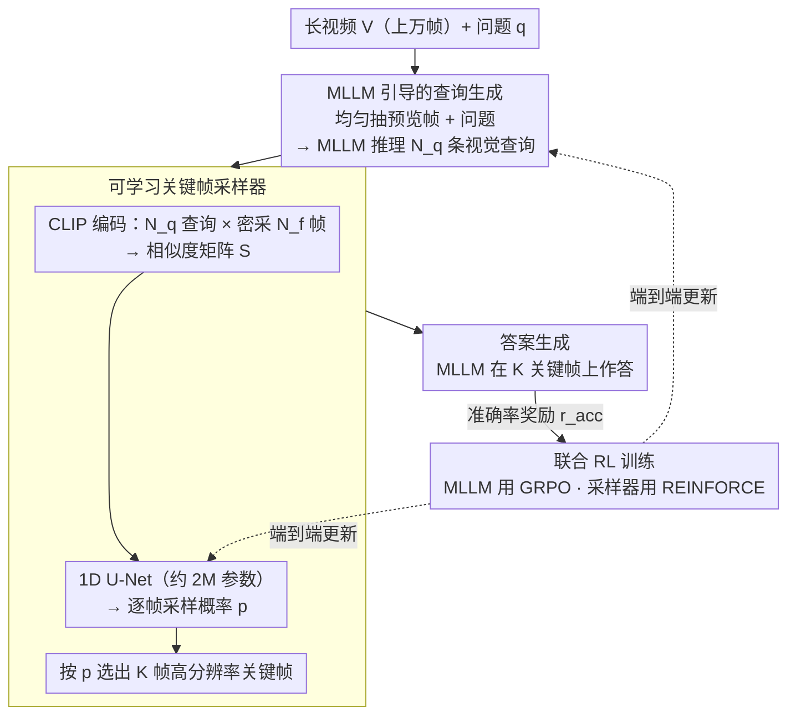

# MSJoE: Jointly Evolving MLLM and Sampler for Efficient Long-Form Video Understanding

**会议**: CVPR 2026  
**arXiv**: [2602.22932](https://arxiv.org/abs/2602.22932)  
**代码**: 待确认  
**领域**: 多模态VLM  
**关键词**: 长视频理解, 关键帧采样, 强化学习, GRPO, 联合优化

## 一句话总结
提出 MSJoE 框架，将 MLLM 和轻量关键帧采样器通过强化学习联合进化——MLLM 生成视觉查询引导帧检索，1D U-Net 采样器从 CLIP 相似度矩阵中学习选帧，两者端到端联合优化实现长视频问答中 +8% 的准确率提升。

## 研究背景与动机

**领域现状**：MLLM 在短视频理解上表现优异，但长视频场景中视觉上下文线性增长、注意力计算二次增长，均匀采样既效率低又容易遗漏关键事件。基于 CLIP 相似度的采样方法兴起（Q-Frame、AKS 等）。

**现有痛点**：三个关键问题——(Q1) 问题本身是否足以检索所有相关帧？（信息不足：问题常是疑问句，缺乏视觉线索）；(Q2) 相似度分数如何转化为采样权重？（naive top-k 选择冗余帧）；(Q3) MLLM 和采样器能否在不联合进化的情况下真正协作？（现有方法冻结 MLLM 训练采样器，缺乏双向适应）。

**核心矛盾**：采样器和 MLLM 各自独立优化，采样器不知道 MLLM 需要什么视觉证据，MLLM 不适应采样器选的稀疏帧分布。

**本文目标**：实现采样器-MLLM 的联合进化，让 MLLM 学会生成引导采样的查询，同时适应稀疏关键帧输入。

**切入角度**：RL（GRPO + REINFORCE）提供零样本反馈信号，双方同时优化。

**核心 idea**：MLLM 先推理出多个视觉查询 → CLIP 构建查询-帧相似度矩阵 → 轻量 1D U-Net 学习采样权重 → 选出的关键帧喂回 MLLM 生成答案 → 端到端 RL 联合训练。

## 方法详解

### 整体框架
MSJoE 要解决的是长视频问答里"该看哪几帧"的问题：视频可能上万帧，但只有少数几帧真正和问题相关，而问题本身（"他最后把钥匙放哪了？"）又是一句没有视觉内容的疑问句，直接拿它去检索帧效果很差。MSJoE 的思路是让 MLLM 先把问题"翻译"成几条有画面感的视觉查询，再用一个轻量采样器从这些查询和全部帧的相似度里挑出关键帧喂回 MLLM。

整条推理管线分四步串起来：先均匀抽一小批低分辨率预览帧，连同问题一起送进 MLLM，让它推理出 $N_q$ 条视觉查询；CLIP 把这些查询和密采的全部帧编码成相似度矩阵；一个约 200 万参数的 1D U-Net 把矩阵压成逐帧采样概率，据此选出关键帧；最后 MLLM 在选中的高分辨率关键帧上生成答案。关键在于采样器和 MLLM 不是各练各的，而是通过强化学习端到端联合进化——这正是后面三个设计要分别打通的三个堵点。

### 关键设计

**1. MLLM 引导的查询生成：让模型先想清楚"该找什么画面"**

长视频采样的第一个堵点（Q1）是问题信息不足——一句疑问句里几乎没有可供 CLIP 匹配的视觉线索。MSJoE 不直接拿问题去检索，而是先均匀抽 $N_{init}$ 帧做低分辨率预览（每帧只编码成 32 个 token，开销极小），把这批预览帧和问题一起交给 MLLM，让它推理出 $N_q$ 条具体的视觉查询，比如把"他最后把钥匙放哪了"展开成"一只手拿着钥匙""桌面或抽屉的特写"这类有画面感的描述。这一步等于把 MLLM 的世界知识和推理能力借来补全问题缺失的视觉语义，后续检索匹配的就是这些可见的事件，而不是抽象的疑问句。

**2. 可学习关键帧采样器：从相似度矩阵里学出选帧权重，而不是简单 top-k**

第二个堵点（Q2）是有了相似度也不知道怎么转成采样决策——naive 的 top-k 容易在同一精彩片段里反复选邻近的冗余帧。MSJoE 用 CLIP 把 $N_q$ 条查询和密采的 $N_f$ 帧编码，得到相似度矩阵 $\mathbf{S} \in \mathbb{R}^{N_q \times N_f}$，再让一个约 200 万参数的 1D U-Net 把它映射成逐帧采样概率 $\mathbf{p} \in \mathbb{R}^{N_f}$。选 U-Net 是因为它沿时间轴做密集预测、又有多尺度局部感受野，能同时看到"某帧在多条查询上的综合得分"和"邻近帧的冗余/互补关系"，从而把权重摊到真正信息互补的帧上，而不是扎堆在一个峰值附近。

**3. 联合 RL 训练：让采样器和 MLLM 在同一个奖励下互相适应**

第三个、也是最根本的堵点（Q3）是现有方法大多冻结 MLLM 只训采样器，两者缺乏双向适应。MSJoE 把它们放进同一套强化学习里联合进化：MLLM 用 GRPO 优化，对同一问题采样 $G$ 个输出、用 group-relative advantage 更新；采样器用 REINFORCE 优化，和 MLLM 共享同一个准确率奖励 $r_{acc}$，这样采样器的梯度直接来自"选这些帧能不能让 MLLM 答对"。总奖励由三部分组成：

$$r = r_{acc} + r_{format} + r_{info}$$

其中 $r_{acc}=0.8$（答对即给）是主信号，$r_{format}=0.1$ 约束输出格式，$r_{info}=0.1$ 鼓励查询的相似度分布尖锐而非平坦——也就是奖励那些能把注意力集中到少数帧上的"有信息量"的查询。直接从零联合训练并不稳定，所以采样器要先预训练，用一个难度感知奖励：对模型从未答对过的难题（通过率 $c=0$）一旦答对就给高奖励 $A=10$，否则按 $A=1/c$（答对）或 $A=-1/(1-c)$（答错）缩放，避免简单的二元 0/1 奖励让采样器在大量易题上学偏。

### 一个完整示例
设一段约 10 分钟、密采约 600 帧（1 FPS）的视频，问题是"演讲者最后展示的幻灯片标题是什么"。第一步均匀抽 8 帧低分辨率预览喂给 MLLM，它推理出 4 条视觉查询（如"投影幕布的特写""有文字的幻灯片画面"）；第二步 CLIP 把这 4 条查询和 600 帧编码成 $4 \times 600$ 的相似度矩阵；第三步 1D U-Net 把矩阵压成 600 维采样概率，据此从 600 帧里选出 32 帧高分辨率关键帧，这些帧集中落在演讲后半段出现幻灯片特写的几个时间窗；第四步 MLLM 在这 32 帧上读出标题作答。整个过程里"候选帧 600 → 选 32"的收缩由采样器一次完成，而采样器之所以知道该往哪收缩，全靠第一步 MLLM 生成的查询把"找幻灯片画面"这个意图注入了进来。

> ⚠️ 预览帧数 $N_{init}$、查询数 $N_q$、密采帧数等具体取值以原文为准。

### 训练策略与数据
联合 RL 训练前先单独预训练采样器（用上面的难度感知奖励），稳定后再端到端联合优化 MLLM 与采样器。为支撑训练，作者新构建了一个长视频 QA 数据集：约 2.8K 视频、7.1K QA 对，经多阶段过滤保证长时长、多事件推理与可控难度，难度标签由基线 MLLM 的通过率自动算出，直接用作难度感知奖励的依据。

## 实验关键数据

### 主实验（Qwen2.5-VL-7B 基础）

| 方法 | 帧数 | MLVU | LVB | VideoMME-Long | LVBench |
|------|------|------|-----|-------------|---------|
| Uniform Sampling | 32 | 61.5 | 55.0 | 49.9 | 36.5 |
| Q-Frame | 32 | 66.8 | 58.7 | 53.1 | - |
| **MSJoE** | **32** | **69.3** | **60.1** | **54.1** | **46.4** |
| Uniform Sampling | 64 | 65.3 | 57.3 | 52.2 | 39.2 |
| TSPO | 64 | 74.3 | 64.2 | 56.4 | 46.4 |
| **MSJoE** | **64** | **75.1** | **62.2** | **57.4** | - |

### 提升幅度

| 指标 | 说明 |
|------|------|
| vs 基础 MLLM | +8.0% 平均准确率 |
| vs 最强基线 | +1.1% 平均准确率 |
| LVBench 32帧 | +9.9% 提升（36.5→46.4） |

### 消融实验
- 查询生成是关键——去掉查询退化为直接用问题检索，性能显著下降
- 联合训练 vs 分别训练：联合训练在所有基准上更优
- 1D U-Net vs 简单 MLP：U-Net 更好，利润在于其多尺度局部感知

## 亮点
- 首个将 MLLM 和采样器通过 RL 联合进化的框架，真正解决了双向适应问题
- MLLM 推理生成查询的设计优雅，解决了问题缺乏视觉线索的根本问题
- 仅 2M 参数的轻量采样器实现了强大的帧选择能力
- 难度感知奖励设计有效避免了简单二元奖励对采样器训练的误导

## 局限与展望
- 推理时需要两阶段前向传播（预览生成查询 + 关键帧回答），增加时延
- CLIP 密采帧（1 FPS）的编码开销在超长视频（小时级）中较大
- 当前查询数 $N_q$ 固定，可考虑根据问题复杂度自适应调整查询数量
- 联合 RL 训练的稳定性受采样器初始化影响较大，必须预训练
- 数据集规模（2.8K 视频）相对较小，可能限制 RL 的充分探索
- 1D U-Net 采样器的设计选择（vs MLP、Transformer）的对比可以更充分

### 数据集细节
- LongVideoQA 数据集视频平均时长超过 10 分钟，最长达数小时
- 多阶段过滤保证问题质量：低难度/低质量 QA 对被去除
- 难度标签通过基线 MLLM 的通过率自动计算，用于 RL 训练中的难度感知奖励

<!-- RELATED:START -->

## 相关论文

- [\[CVPR 2026\] ReMoRa: Multimodal Large Language Model based on Refined Motion Representation for Long-Video Understanding](remora_multimodal_large_language_model_based_on_refined_motion_representation_fo.md)
- [\[ICML 2026\] FlowNar: Scalable Streaming Narration for Long-Form Videos](../../ICML2026/multimodal_vlm/flownar_scalable_streaming_narration_for_long-form_videos.md)
- [\[CVPR 2026\] Scaling the Long Video Understanding of Multimodal Large Language Models via Visual Memory Mechanism](scaling_the_long_video_understanding_of_multimodal_large_language_models_via_vis.md)
- [\[CVPR 2026\] DocSeeker: Structured Visual Reasoning with Evidence Grounding for Long Document Understanding](docseeker_long_document_understanding.md)
- [\[CVPR 2025\] Video-XL: Extra-Long Vision Language Model for Hour-Scale Video Understanding](../../CVPR2025/multimodal_vlm/video-xl_extra-long_vision_language_model_for_hour-scale_video_understanding.md)

<!-- RELATED:END -->
