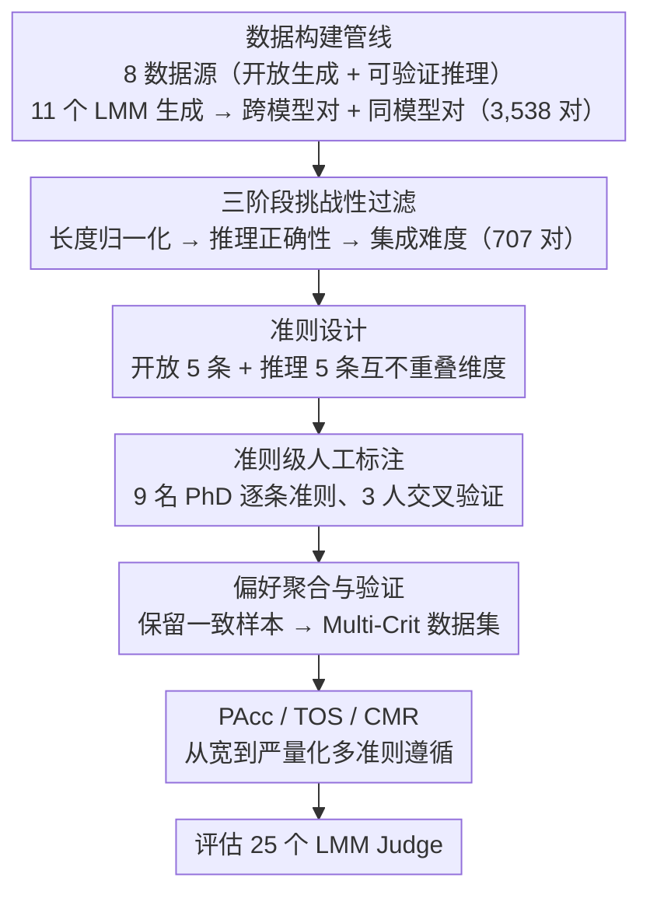

# Multi-Crit: Benchmarking Multimodal Judges on Pluralistic Criteria-Following

**会议**: CVPR 2026  
**arXiv**: [2511.21662](https://arxiv.org/abs/2511.21662)  
**代码**: [https://multi-crit.github.io](https://multi-crit.github.io)  
**领域**: 多模态VLM  
**关键词**: LMM-as-Judge, 多准则评估, benchmark, 偏好冲突, 评估可靠性

## 一句话总结

构建首个评估多模态 Judge 模型多准则遵循能力的基准 Multi-Crit，包含准则级人类标注和偏好冲突样本，配合 PAcc/TOS/CMR 三个新指标，全面评估 25 个 LMM 并揭示闭源最强模型在开放生成任务上仅 32.78% 的多准则一致性。

## 研究背景与动机

**领域现状**：LMM-as-a-Judge 范式被广泛用于自动评测和 RLHF 反馈。给定多模态 prompt、模型响应和预定义评估准则，Judge 模型输出偏好判断并附带文字理由。这一范式因可扩展性和灵活性被大量多模态 benchmark 采用，也有多项工作微调开源模型作为专用 Judge/Critic 来提供 AI 反馈。

**现有痛点**：现有多模态 Judge 基准（VL-Rewardbench、MM-RLHF Bench 等）仅提供单一总体偏好标签。这种粗粒度标注无法捕捉多维度评估的本质——两个回复会在不同准则间存在 trade-off，如一个回复简洁但有事实错误，另一个内容详尽但冗余。单一标签抹平了这些细节。

**核心矛盾**：Judge 模型的可靠性依赖两个要素：(1) 与人类判断一致；(2) 灵活遵循多样化的任务特定评估准则。现有工作关注前者但严重忽视后者。Judge 模型是否真正遵循了给定准则？面对准则间的偏好冲突时能否正确判断？这些关键问题未被系统研究。

**本文目标** (1) 如何构建包含多准则人工标注和准则间偏好冲突的评估数据？(2) 如何系统度量 Judge 模型的多准则遵循能力？

**切入角度**：多准则评估 + 冲突检测——让人类标注者独立标注每个准则下的偏好，天然暴露不同准则间的偏好冲突。

**核心 idea**：构建带准则级人工标注的挑战性基准 Multi-Crit，设计 PAcc/TOS/CMR 三个新指标，系统评估 25 个模型在多准则遵循上的表现与瓶颈。

## 方法详解

### 整体框架

Multi-Crit 想回答一个被现有 Judge 基准回避的问题：当两个回复在不同评估维度上各有胜负时，Judge 能不能逐条准则做出和人类一致的判断。为此它把传统的 pairwise preference 评估从"一个整体标签"拆细到"每条准则一个标签"。传统基准的数据格式是 $(q, l_a, l_b, y)$，一个 prompt 配一个整体偏好标签 $y$；Multi-Crit 扩展为 $(q, l_a, l_b, \{(c_i, y_i)\}_{i=1}^{K_q})$，每个 $c_i$ 是一条评估准则，$y_i$ 是这条准则下哪个回复更好。这样同一对回复在不同准则下可以指向不同的胜者，准则间的冲突就被显式地保留了下来，而不是被一个总分抹平。

整条构建链路从多来源收集 prompt 开始，用多个 LMM 生成并配对候选回复，再经三阶段过滤把"一眼能分高下"的简单样本剔掉，剩下的交给 9 名 CS PhD 按准则逐条人工标注，最后做偏好聚合与质量验证产出最终数据集。下面四个设计分别对应"数据从哪来、怎么筛、按什么维度评、用什么指标量"。

### 关键设计

**1. 数据构建管线：让评估覆盖两类截然不同的多模态任务**

单一来源的数据撑不起对 Judge 通用能力的考察，所以 prompt 横跨两大场景：开放生成（ImageInWords、DOCCI、WildVision-Bench/-Battle）和可验证推理（MathVerse、MM-K12、EMMA-mini、VisualPuzzles），共 8 个数据集。候选回复由 11 个高性能 LMM 生成，闭源（GPT-4o、Gemini-2.5-Flash 等）和开源（Qwen2.5-VL、InternVL3 等）混合，避免基准的偏好分布被某一家模型的风格带偏。配对则刻意做两种：跨模型对取两个不同模型的回复，捕捉模型之间的系统性差异；同模型对让同一模型在温度采样下生成 5 个回复、挑余弦距离最大的两个，捕捉同一模型内部的质量波动。两者互补，最终得到 3,538 个回复对。

**2. 三阶段挑战性过滤：把"答案显而易见"的样本全部滤掉**

3,538 对里大量样本对 Judge 来说是 trivial 的——差距太大，谁都能选对，留着只会稀释基准的区分度。过滤分三步逐层收紧：先做长度归一化，排除长度比落在 $[0.7, 1.4]$ 之外的回复对，否则 Judge 容易直接按"谁长选谁"走捷径；再做推理正确性过滤，对推理任务用 GPT-4o-mini 校验答案，只保留两个回复同时答对或同时答错的样本，因为答案本身的对错是一个 trivial 信号、会盖过对回复质量的考察；最后做集成难度过滤，用 GPT-4o、Gemini-2.5-Flash、Claude-3.7-Sonnet 三个强 Judge 先做整体判断，三者意见一致的丢掉，只留下它们都拿不准、产生分歧的样本。三步走下来，3,538 对收缩到 707 对真正存在细粒度准则差异的挑战性样本。

**3. 准则设计：用互不重叠的能力维度来分解"哪个回复更好"**

准则不是随手列的，而是按三条原则筛出来的：实用性（贴合 Judge 实际被用到的场景）、特异性（准则之间不重叠，避免一个差异被重复计分）、通用性（评的是基础能力维度而非具体内容）。开放生成定了 5 条——Completeness & Coverage、Visual Grounding & Details、Factuality / No Hallucination、Creativity & Expressiveness、Clarity & Coherence；可验证推理另定 5 条——Visual Grounding、Logic Coherence & Consistency、Factuality / No Hallucination、Reflection & Exploration、Conciseness & Efficiency。这套准则是从现有 MLLM-as-a-Judge 基准的评估维度多轮迭代精炼而来，保证彼此互补、合起来又能覆盖一次多模态判断的核心。

**4. PAcc / TOS / CMR：用三个从宽到严的指标刻画多准则遵循能力**

有了准则级标注，就能问三个层层递进的问题。第一个是 PAcc（Pluralistic Adherence Accuracy），要求一个 prompt 下**所有**准则都判断正确才算通过，是最整体性的要求：

$$\text{PAcc} = \frac{1}{|X|} \sum_{x \in X} \mathbb{I}\Big[\bigwedge_{c \in C_x} \hat{y}_{x,c} = y_{x,c}\Big]$$

第二个是 TOS（Trade-Off Sensitivity），只在存在准则冲突的样本上看 Judge 有没有"意识到"不同准则该指向不同的胜者——只要它对某一对冲突准则给出了方向相反的预测就算过，衡量的是灵活性而非精确度，专门用来揭穿那种对所有准则都输出同一方向的 criterion-agnostic 行为。第三个是 CMR（Conflict Matching Rate），最严格，要求 Judge 在冲突准则对上不仅察觉到冲突、解析出的方向还要和人类一致。三个指标从"全对"到"察觉冲突"再到"正确解析冲突"，正好刻画出 Judge 能力的不同层次，也让"单一准则准确率看着不低、多准则一致性却很差"的系统性缺陷暴露出来。

### 标注流程与质量保证

标注团队为 9 名 CS PhD，均有多模态 AI 和 STEM 背景。先标注 20 个种子样本（10 开放 + 10 推理）进行小组讨论和校准，对齐理解后进入正式标注。每个样本分配 3 名标注者交叉验证，标注者每次只看一个准则，判定哪个回复更好（tie 限制在 10% 以下）并写简短理由。偏好聚合仅保留全体一致或两人一致且第三人为 tie 的样本；项目负责人人工审查文字理由，丢弃不一致或冗余的样本。最终标注耗时 289 小时，Cohen's $\kappa$ 达到开放任务 0.718 和推理任务 0.805，属于 substantial agreement。

## 实验关键数据

### 主实验：开放生成任务（Open-Ended Split）

| 模型 | PAcc(%) | CMR(%) | TOS(%) | 准则均值(%) |
|------|---------|--------|--------|------------|
| o4-mini | **32.78** | **43.11** | 64.56 | **69.67** |
| Claude-3.7-Sonnet | 31.77 | 42.32 | 64.08 | 67.37 |
| GPT-4o | 31.44 | 44.91 | **66.02** | 69.57 |
| o3 | 31.10 | 42.71 | 62.62 | 69.16 |
| GPT-5 | 29.77 | 38.52 | 62.62 | 68.51 |
| InternVL3.5-38B（开源最佳） | 30.43 | 33.73 | 64.08 | 65.10 |
| InternVL3-78B | 29.10 | 32.53 | 56.31 | 64.71 |
| MiMo-VL-7B | 29.10 | 39.52 | 65.53 | 63.37 |
| Qwen2.5-VL-72B | 28.43 | 35.53 | 60.68 | 63.84 |
| R1-Reward-7B（微调最佳） | 17.73 | 20.36 | 45.63 | 55.83 |
| Qwen2.5-VL-7B | 9.41 | 17.28 | 36.14 | 54.39 |

### 主实验：可验证推理任务（Reasoning Split）

| 模型 | PAcc(%) | CMR(%) | TOS(%) | 准则均值(%) |
|------|---------|--------|--------|------------|
| o4-mini | **53.17** | **65.84** | 83.49 | **80.85** |
| GPT-5 | 45.24 | 56.58 | 78.90 | 77.41 |
| o3 | 44.44 | 62.28 | 82.57 | 77.86 |
| GPT-4o | 41.27 | 55.16 | **84.40** | 69.79 |
| Gemini-2.5-Pro | 41.27 | 52.33 | 75.93 | 73.06 |
| InternVL3.5-38B（开源最佳） | 37.30 | 47.69 | 75.23 | 69.82 |
| MiMo-VL-7B | 37.30 | 41.99 | 71.56 | 66.30 |
| Qwen2.5-VL-72B | 32.54 | 45.91 | 77.06 | 64.48 |
| InternVL3-8B | 26.98 | 39.50 | 66.06 | 66.22 |
| R1-Reward-7B | 19.05 | 24.56 | 62.39 | 54.50 |

### 消融实验：Critic 微调对各准则的影响（开放生成）

| 模型 | Completeness | Grounding | Hallucination | Expressiveness | Clarity | Avg |
|------|-------------|-----------|---------------|----------------|---------|-----|
| Qwen2.5-VL-7B (base) | 56.12 | 51.70 | 48.20 | 64.12 | 51.82 | 54.39 |
| R1-Reward-7B | 59.29 | **60.71** | 49.72 | 55.44 | 53.98 | 55.83 |
| UnifiedReward-7B | 57.96 | **52.23** | 52.49 | 57.51 | 55.68 | 55.17 |
| LLaVA-Critic-R1-7B | 55.31 | **57.59** | 46.96 | 63.73 | 55.11 | 55.74 |

所有 Qwen-based 微调 Judge 均在 Visual Grounding 准则上有一致提升（51.70→52.23~60.71），但其他准则提升不一致甚至下降。

### 关键发现

- **多准则判断极其困难**：最强的 o4-mini 在开放生成上 PAcc 仅 32.78%，在推理上也仅 53.17%，表明即使 SOTA 模型也无法在所有准则上同时做出正确判断
- **开放任务比推理任务更难**：所有模型在开放生成上的表现显著低于推理任务，反映开放任务的主观性和对细粒度视觉感知的更高要求
- **没有模型全面领先**：o4-mini 在 Logic 和 Efficiency 上最强，但在 Hallucination 上被 o3 超越（84.21% vs 79.31%），在 Grounding 上被 Gemini-2.5-Pro 超越（79.01% vs 77.78%）
- **开源模型在冲突检测上差距更大**：CMR 从闭源到开源下降约 9.4 点（开放任务）和 18.1 点（推理任务），远超准则级准确率的 4-11 点差距
- **Critic 微调仅提升 Visual Grounding**：微调 Judge 在 Grounding 上一致改善，但在其他准则和冲突解析上提升有限甚至退步，因为训练信号是 holistic 偏好而非准则级
- **推理微调削弱 trade-off 识别**：GRPO 微调模型虽然推理能力提升，但 TOS 和 CMR 反而下降，说明 holistic accuracy reward 不利于准则间冲突感知
- **Test-time scaling 效果有限**：majority vote 对 o4-mini 有稳定提升（PAcc 32.78→37.12），但对其他模型效果不一致、方差大
- **闭源模型上限与人类一致性对齐**：闭源模型最强准则准确率与 Cohen's $\kappa$ 相关性 $r=0.73, p=0.024$，而开源模型仅 $r=0.36, p=0.344$

## 亮点与洞察

- 首个多准则多模态 Judge 基准，填补准则级评估空白，数据集中 68.9%（开放）和 86.5%（推理）的样本存在准则间偏好冲突
- PAcc/TOS/CMR 三个指标形成从宽到严的能力评估层次，揭示了单一准则准确率无法反映的系统性缺陷
- 289 小时高质量人工标注（Cohen's $\kappa$ 0.718/0.805），三阶段过滤确保样本具有细粒度准则差异
- "Critic 微调仅提升 Grounding"这一发现对构建更好的 Judge 训练方法有重要指导意义——需要准则级训练信号而非 holistic 偏好
- 闭源模型上限与人类标注者一致性高度相关，暗示下一步挑战是超越人类水平的评估对齐

## 局限与展望

- 仅支持 pairwise comparison 模式，pointwise scoring 的多准则评估值得探索
- 准则设计仍较通用，领域特定准则（医疗、法律、代码）需进一步扩展
- 标注成本高（289 小时为 9 人共计），规模化扩展需要半自动标注管线
- Tie 标注被限制在 10% 以下，可能丢失真正难以区分的边界样本
- 仅评估生成式 Judge，BT-style reward model 的多准则能力也应纳入研究
- 开源模型在所有指标上全面落后，亟需准则级 critic 训练数据和多准则 RLHF 方法

## 相关工作与启发

- **LMM-as-a-Judge**：GPT-4V 最早展示与人类一致的评估能力，后续 LLaVA-Critic、R1-Reward 等微调开源替代品，但训练信号是 holistic 偏好
- **Judge 基准**：MLLM-as-a-Judge 首先评估 LMM 作为 Judge 的能力，VL-Rewardbench、MM-RLHF Bench 扩展到多场景，但均为单一偏好标签
- **准则遵循**：文本 LLM 领域已有初步探索（嵌入准则级差异或从人类理由中总结准则），Multi-Crit 将其扩展至多模态并引入冲突检测
- **启发**：多准则 Judge 训练需要准则级标注数据和准则感知的 reward signal，而非仅靠 holistic preference

## 评分

- 新颖性: ⭐⭐⭐⭐ 首个多准则多模态 Judge 基准，PAcc/TOS/CMR 三指标体系设计精巧
- 实验充分度: ⭐⭐⭐⭐⭐ 25 个模型全面评估，含微调 Judge、reasoning fine-tuning、test-time scaling、人类上限分析等丰富 ablation
- 写作质量: ⭐⭐⭐⭐ 结构清晰、数据详实、准则定义严谨
- 价值: ⭐⭐⭐⭐ 揭示了当前 Judge 系统的系统性不足，尤其是 Critic 微调仅提升 Grounding 的发现对下一步研究有重要指导意义

<!-- RELATED:START -->

## 相关论文

- [\[CVPR 2026\] CRIT: Graph-Based Automatic Data Synthesis to Enhance Cross-Modal Multi-Hop Reasoning](crit_graph-based_automatic_data_synthesis_to_enhance_cross-modal_multi-hop_reaso.md)
- [\[CVPR 2026\] GraphVLM: Benchmarking Vision Language Models for Multimodal Graph Learning](graphvlm_benchmark_vlm_graph_learning.md)
- [\[CVPR 2026\] ARGUS: Defending Against Multimodal Indirect Prompt Injection via Steering Instruction-Following Behavior](argus_defending_against_multimodal_indirect_prompt_injection_via_steering_instru.md)
- [\[ICCV 2025\] MM-IFEngine: Towards Multimodal Instruction Following](../../ICCV2025/multimodal_vlm/mm-ifengine_towards_multimodal_instruction_following.md)
- [\[CVPR 2026\] ProSoftArena: Benchmarking Hierarchical Capabilities of Multi-modal Agents in Professional Software Environments](prosoftarena_benchmarking_hierarchical_capabilities_of_multi-modal_agents_in_pro.md)

<!-- RELATED:END -->
