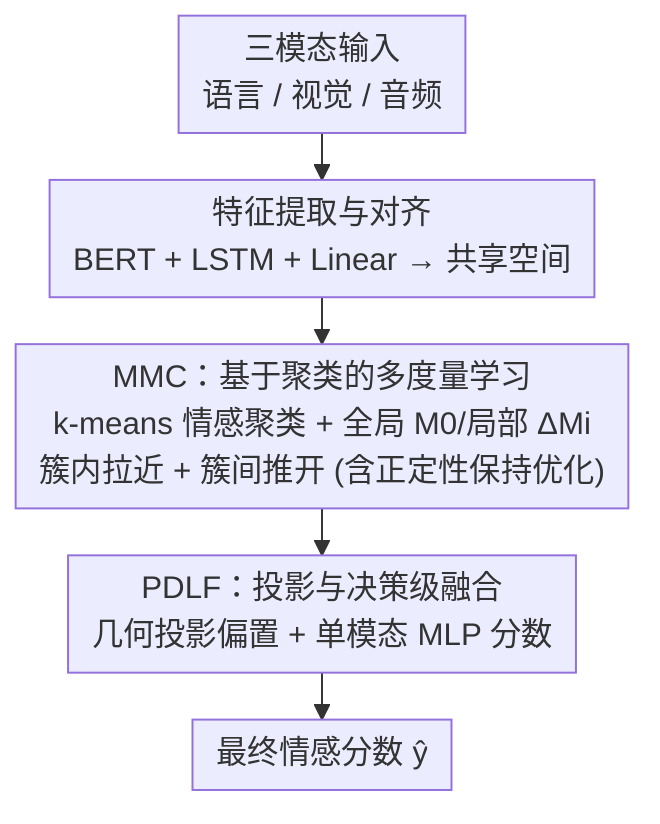

# Multi-Metric Representation Learning Strategy Based on Clustering for Fine-Grained Multimodal Sentiment Analysis

**会议**: CVPR 2026  
**论文**: [CVF Open Access](https://openaccess.thecvf.com/content/CVPR2026/html/Wang_Multi-Metric_Representation_Learning_Strategy_Based_on_Clustering_for_Fine-Grained_Multimodal_CVPR_2026_paper.html)  
**代码**: https://github.com/hurriedpi/MMRest  
**领域**: 多模态VLM  
**关键词**: 多模态情感分析、多度量学习、情感聚类、几何投影、轻量化

## 一句话总结
针对多模态情感分析中"不同模态融到同一表征空间后情感类中心相互重叠、细粒度边界模糊"的问题，MMRest 先把三模态表征做 k-means 情感聚类、再用一个全局度量 + 各簇局部度量的多度量学习拉近同情感、推开异情感，最后用投影与决策级融合（PDLF）把度量得到的几何投影偏置与单模态预测分数相加，在 CMU-MOSI/MOSEI 上以约 Transformer 方法 30% 的参数量超过 SOTA。

## 研究背景与动机

**领域现状**：多模态情感分析（MSA）通过融合语言、视觉、音频来理解人类情感，主流分两类——多模态融合策略（多用 cross-modal attention，常以文本为主导模态做模态间交互）和多模态表征学习策略（用多层对比学习设计单模态-单模态、单模态-多模态、多模态-多模态等正负样本组合学联合表征）。

**现有痛点**：作者发现一个被忽视的关键问题：当把不同模态的数据整合进同一表征空间时，**情感类中心往往相互重叠**——不同情感类别的表征聚得太近，决策边界变模糊。论文对 DMD、MCL-MCF 的多模态表征做 t-SNE 可视化，证实即便是 SOTA 也存在该重叠现象。作者认为这些模型的训练过程被"模态"主导：它们能很好地区分模态，却对区分不同**情感中心**能力偏弱。更糟的是，Transformer 与对比学习都带来高昂的计算开销。

**核心矛盾**：模型擅长"区分模态"，却不擅长"区分情感"——融合时模态信息压过了细粒度情感信息，导致情感中心在共享空间里挤成一团。

**本文目标**：需要一种能**直接建模簇内（同情感）与簇间（异情感）关系**的方法，把同情感表征拉近、异情感推开，从而缓解情感中心重叠；同时还得比 Transformer/多层对比学习更轻量。

**切入角度**：把问题转成"度量学习 + 聚类"——先在共享空间按情感做聚类、模糊掉模态信息，再为"所有簇共享的共性"学一个全局度量、为"每个情感簇的独特性"各学一个局部度量，用度量直接刻画情感间的远近。

**核心 idea**：用"基于聚类的多度量学习（全局 + 局部度量）"建模细粒度情感的簇内紧致与簇间分离，再用几何投影把度量信息以偏置形式注入最终情感分数，全程不用 cross-modal attention 以保持轻量。

## 方法详解

### 整体框架
MMRest 由两个模块串联组成：**MMC**（Multi-metric Multimodal learning on Clusters，基于聚类的多度量学习）负责重塑表征空间的情感结构，**PDLF**（Projection and Decision-Level Fusion，投影与决策级融合）负责把度量信息融进最终预测。流程是：三模态输入 $X_m\,(m\in\{L,V,A\})$ 先做特征提取——语言用 BERT 取首 token、视觉/音频用 LSTM 取末隐状态，再用线性层把语言维度对齐到 $d_1$；对齐后的表征在共享空间做 k-means 聚类（按情感标签分簇），并学一个全局度量 $M_0$ 与各簇局部度量 $\Delta M_i$，用簇内/簇间 hinge 损失把同情感拉近、异情感推开（训练时还要做特征值分解保证度量矩阵半正定）；最后 PDLF 用学好的最优度量算几何投影偏置，与单模态经 Conv1D+MLP 得到的中间分数相加，输出最终情感分 $\hat y$。整套不含 cross-modal attention，参数量显著更小。

### 关键设计

**1. MMC：基于情感聚类的多度量学习，直接拉开重叠的情感中心**

这一模块针对"情感类中心重叠"的根因。它先在共享空间做聚类：以 CMU-MOSI/MOSEI 的标签区间 $[-3,3]$ 为例，把值域切成 7 个区间、赋予簇标签 $0\!-\!6$（如 $[-3,-2.5]$ 为 0），再用 k-means 把表征分成 $k$ 个簇（$k$ 为超参），借聚类**模糊掉模态信息**。每个簇中心 $C_{e_i}$ 的感受野 $R_i$ 由最近的 $M$ 个表征定义，并按感受野内样本标签分布的投票机制给簇赋情感标签。多度量学习的精髓是：细粒度情感既有共性也有独特性，于是用一个**全局度量** $M_0$ 捕捉所有簇的共性、为每个簇学一个**局部度量** $\Delta M_i$ 捕捉独特性。簇内拉近用 hinge 损失 $L^{(i)}_{intra}=\max\big(0,\sum_{(p,q)\in S_i}d_{M_i}(C_p,C_q)-\sum_{(p,q)\in D_i}d_{M_i}(C_p,C_q)+\xi\big)$，其中度量距离 $d_{M_i}(C_p,C_q)=(C_p-C_q)^{\top}M_i(C_p-C_q)$、$M_i=M_0+\Delta M_i+\beta I$（$\beta I$ 防止 $M_0+\Delta M_i$ 病态），$S_i/D_i$ 是感受野内同/异情感对。簇间分离则用类三元组损失 $L^{(ij)}_{inter}=\sum_n\max\big(0,d_{M_i}(C_n,C_{e_i})-d_{M_j}(C_n,C_{e_j})+\rho_{ij}\big)$，要求样本到自己簇心与到他簇心的距离至少相差 $\rho_{ij}=\alpha\lVert C_{e_j}-C_{e_i}\rVert_2^2$（按簇心间距自适应的间隔）。总损失 $L_{MMC}=L_{total\text{-}intra}+v_1 L_{total\text{-}inter}+v_2\lVert M_0\rVert_F^2$。

一个不可省的训练细节是**正定性保持优化**：直接用 Adam 更新会让 $M_0$、$\Delta M_i$ 变成非半正定，破坏 Mahalanobis 距离的有效性。于是每步先把 Adam 更新对称化 $M_0^{(t+1/2)}=\tfrac12\big(\mathrm{Adam}(M_0^{(t)})+\mathrm{Adam}(M_0^{(t)})^{\top}\big)$，再做特征值分解 $Q\Lambda Q^{\top}=\mathrm{Eig}(M_0^{(t+1/2)})$，把负特征值截到 0：$M_0^{(t+1)}=Q\,\mathrm{diag}(\max(0,\lambda_1),\dots)\,Q^{\top}$，从而强制度量矩阵半正定。

**2. PDLF：用几何投影偏置把度量信息注入单模态预测，避免 cross-modal attention**

MMC 学到了最优的 $M_i$ 与簇心，但作者认为"把所有多模态数据堆一起做情感聚类会丢失单模态间的差异"。最直接的做法是把 MMC 与 PDLF 映到同一空间（需把 $M_i$ 分解成 $U^{\top}U$、用 $C_f U$ 当表征），但矩阵分解又难又会引入额外复杂度与信息损失。PDLF 的巧思是**以"偏置"的形式**把最优度量与单模态预测融合，分两部分。**Part I（几何投影偏置）**：把三模态表征拼成 $C_f$，在各度量 $M_i$ 下算它到每个簇心的 Mahalanobis 距离，找到最近簇心 $C_{e_{near}}$ 与次近簇心 $C_{e_{s\text{-}near}}$，令 $u=C_f-C_{e_{near}}$、$v=C_{e_{s\text{-}near}}-C_{e_{near}}$，计算投影 $\mathrm{bias}_{multi}=\frac{\sum(u\cdot M_0)\odot u}{\sqrt{\sum(v\cdot M_0)\odot v}}$，再按三模态分块取均值得 $\mathrm{bias}$——几何上它是 $u$ 在"最近-次近簇心连线方向"上的度量投影，既有几何可解释性又避开了 cross-attention。**Part II（决策级分数）**：对单模态表征做 Conv1D 统一维度、拼接后再过 Conv1D 与 MLP 得中间分数 $\hat y'$。最终 $\hat y=\hat y'+\gamma\,\mathrm{bias}$，总损失 $L=\eta L_{MMC}+L_{task}$（$L_{task}$ 用 L1 损失）。

> 框架图里 MMC、PDLF 两个贡献模块分别对应设计 1、2；BERT/LSTM 特征提取与维度对齐属通用脚手架，正定性保持优化作为 MMC 的训练细节并入设计 1。

### 损失函数 / 训练策略
总损失 $L=\eta L_{MMC}+L_{task}$，其中 $L_{MMC}=L_{total\text{-}intra}+v_1 L_{total\text{-}inter}+v_2\lVert M_0\rVert_F^2$、$L_{task}$ 为 L1 损失。度量矩阵每步经"对称化 + 特征值分解截负"保持半正定。在 unaligned 数据上训练，CMU-MOSI/MOSEI 的 batch size 分别为 64/128，单张 RTX 4070Ti Super（16GB）即可跑，采用 patience=10 的早停。

## 实验关键数据

### 主实验
在 CMU-MOSI（2199 段，1284/229/686 划分）与 CMU-MOSEI（22856 段，16326/1871/4659 划分）上评测，指标含 MAE、Pearson 相关系数 Corr、7/5/3/2 类准确率（Acc-7/5/3/2）、F1（Acc-2 与 F1 按"负/非负"与"负/正"两种二分法分别报告，下表取斜杠后者）。

| 数据集 | 指标 | MMRest(本文) | MCL-MCF | DEVA |
|--------|------|-------------|---------|------|
| CMU-MOSI | Acc-2↑ | **84.64/86.78** | 82.22/84.30 | 84.40/86.29 |
| CMU-MOSI | Acc-5↑ | **56.42** | 55.10 | 51.78 |
| CMU-MOSI | Acc-7↑ | **48.98** | 47.52 | 46.32 |
| CMU-MOSI | MAE↓ | **0.683** | 0.693 | 0.730 |
| CMU-MOSI | Corr↑ | 0.802 | **0.807** | 0.787 |
| CMU-MOSEI | Acc-5↑ | **56.52** | 55.93 | 55.32 |
| CMU-MOSEI | Acc-7↑ | **54.72** | 54.06 | 52.26 |
| CMU-MOSEI | MAE↓ | **0.531** | 0.539 | 0.541 |

在 MOSI 上相比次优的 MCL-MCF，Acc-5/Acc-7 分别提升 1.32%/1.46%；作者推测：在较小数据集上，MCL-MCF 那种庞大的多层对比网络过度关注模态间交互、学到大量冗余信息，反不如 MMRest 直接建模情感。⚠️ 一个 caveat：MOSI 上的 Corr（0.802）略低于 MCL-MCF（0.807），且在更大的 MOSEI 上 MMRest 的优势收窄（Acc-2 仅 +0.75%），论文也只声称"最优或次优"。

### 消融实验
（CMU-MOSI，Acc-5/Acc-7）

| 配置 | Acc-5↑ | Acc-7↑ | 说明 |
|------|--------|--------|------|
| 完整 MMRest（$L_{MMC}$+bias） | 56.42 | 48.98 | 完整模型 |
| w/o bias（去 PDLF 几何投影偏置） | 54.08 | 47.52 | 掉 2.34 / 1.46 |
| w/o $L_{MMC}$ & bias | 51.60 | 45.19 | 再去多度量聚类损失，掉 4.82 / 3.79 |
| 单度量(SM，$M_0/\Delta M_i$ 换单位阵) | 80.76(Acc-2) | — | Acc-5/7、MAE 急剧下降 ⚠️ |

模态消融：仅文本时模型仍有不错的情感预测力；仅音频或仅视觉则**无法正常训练**；三模态融合带来显著提升（最高 +4.16%），佐证 PDLF 促进模态交互的必要性。⚠️ 原文 Table 2 的模态勾选列经 OCR 后排版错乱，此处模态结论以正文文字描述为准。

### 关键发现
- **多度量聚类损失 $L_{MMC}$ 贡献最大**：去掉 $L_{MMC}$ 与 bias 后 Acc-5/Acc-7 在 MOSI 上分别掉 4.82%/3.79%，证明簇内紧致 + 簇间分离的结构约束是缓解情感中心重叠的核心。
- **几何投影偏置确有增益**：单去 bias 即掉 2.34%/1.46%，说明把最优度量以偏置注入单模态预测这一招有效。
- **多度量 > 单度量**：把可学的 $M_0/\Delta M_i$ 换成单位阵后，Acc-2/Corr 仅小幅下降，但 Acc-5/Acc-7/MAE 急剧恶化，印证多度量学习对细粒度（多类）情感建模至关重要。
- **轻量**：参数量约为最轻 Transformer 方法 MAG-BERT 的 30%；MCL-MCF 的显存与运行时约为 MMRest 的 2–3 倍，但 MMRest 在两数据集上仍更优。

## 亮点与洞察
- **把"情感中心重叠"显式当成度量学习问题**：用 k-means 聚类 + 全局/局部双度量直接刻画情感簇的内紧外离，而非靠堆 attention，思路清新且可解释。
- **几何投影偏置巧妙绕开矩阵分解**：把度量信息以"最近-次近簇心方向上的投影"注入预测，既保留几何可解释性，又避免 $M_i=U^{\top}U$ 分解带来的复杂度与信息损失。
- **正定性保持优化值得复用**：任何"端到端学 Mahalanobis 度量矩阵"的工作都会遇到非半正定问题，本文"对称化 + 特征值截负"的每步投影是个干净的可迁移 trick。
- **轻量化是真卖点**：在单张消费级 4070Ti Super 上即可训练、参数仅同类 30%，对算力受限的情感分析落地友好。

## 局限与展望
- **依赖 k 与情感分簇粒度**：簇数 $k$、值域切分（7 区间）等是手工设定的超参，对不同标注尺度的数据集需重调，论文把超参研究放在补充材料。
- **大数据集优势收窄**：在更大、更难的 CMU-MOSEI 上提升明显小于 MOSI（部分指标仅次优），说明该策略在小数据上抑制冗余的红利更大。
- **只验证了三模态情感分析**：方法绑定 L/V/A 三模态与 [-3,3] 连续情感标签，迁到其它多模态任务或离散标签时聚类与度量设计能否照搬未知。
- 可改进：把 $k$ 与簇分配做成可学/自适应，或将几何投影偏置扩展到次近以外的多个簇心以刻画更复杂的情感流形。

## 相关工作与启发
- **vs MCL-MCF（多层对比学习）**：它设计单模态-单模态、单模态-多模态、多模态-多模态多组对比，网络庞大、偏重模态间交互；MMRest 用聚类多度量直接建模情感关系，参数更省且细粒度准确率更高。
- **vs DMD / 跨模态注意力方法**：它们靠 cross-modal attention 做模态间交互、计算开销大且情感中心仍重叠（t-SNE 可证）；MMRest 完全不用 attention，靠度量学习重塑情感空间。
- **vs 传统多度量学习（CDMML / DMLCN）**：前者多只学局部度量；MMRest 属"共享型"——同时学全局 $M_0$ 与局部 $\Delta M_i$，并首次把它用于细粒度多模态情感分析。

## 评分
- 新颖性: ⭐⭐⭐⭐ 把多度量学习 + 聚类引入 MSA 来治"情感中心重叠"，角度新；但度量学习、k-means 均为成熟工具的组合。
- 实验充分度: ⭐⭐⭐⭐ 双基准 + 11 个 baseline + 模态/模块/度量三类消融 + 效率与 t-SNE 可视化，较完整；部分分析（方差、案例、超参）放在补充材料。
- 写作质量: ⭐⭐⭐⭐ 动机与几何直觉讲得清楚；但 PDLF 部分符号密集、Table 2 排版易混淆。
- 价值: ⭐⭐⭐⭐ 轻量且开源（GitHub 可得），对算力受限的情感分析有实用价值；适用范围偏窄于三模态 MSA。

<!-- RELATED:START -->

## 相关论文

- [\[CVPR 2026\] Factorize, Reconstruct, Enhance: A Unified Framework for Multimodal Sentiment Analysis](factorize_reconstruct_enhance_a_unified_framework_for_multimodal_sentiment_analy.md)
- [\[CVPR 2026\] Conflict-Aware Adaptive Cross-Reconstruction for Multimodal Sentiment Analysis](conflict-aware_adaptive_cross-reconstruction_for_multimodal_sentiment_analysis.md)
- [\[CVPR 2026\] Prototype-as-Prompt: Multimodal Sentiment Prototypes Endowing Large Language Models the Capability to Perform Multimodal Sentiment Analysis](prototype-as-prompt_multimodal_sentiment_prototypes_endowing_large_language_mode.md)
- [\[CVPR 2026\] Enhance-then-Balance Modality Collaboration for Robust Multimodal Sentiment Analysis](enhance-then-balance_modality_collaboration_for_robust_multimodal_sentiment_anal.md)
- [\[CVPR 2026\] EBMC: Enhance-then-Balance Modality Collaboration for Robust Multimodal Sentiment Analysis](ebmc_multimodal_sentiment_analysis.md)

<!-- RELATED:END -->
