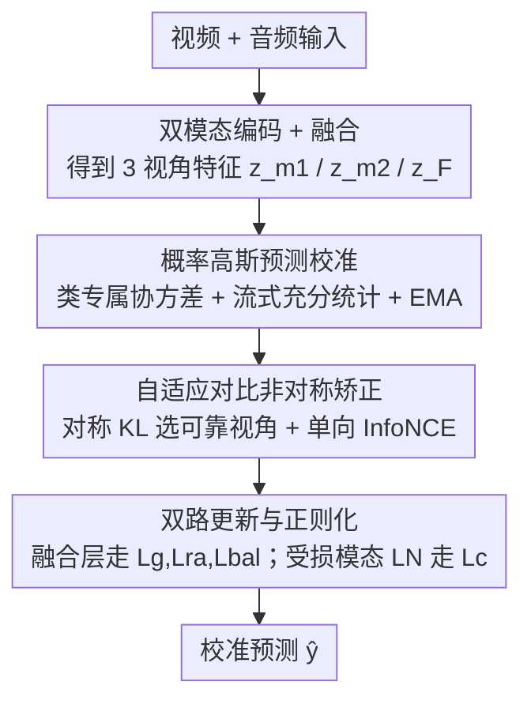

# Multi-modal Test-time Adaptation via Adaptive Probabilistic Gaussian Calibration

**会议**: CVPR 2026  
**论文**: [CVF Open Access](https://openaccess.thecvf.com/content/CVPR2026/html/Xu_Multi-modal_Test-time_Adaptation_via_Adaptive_Probabilistic_Gaussian_Calibration_CVPR_2026_paper.html)  
**代码**: https://github.com/XuJinglinn/AdaPGC  
**领域**: 多模态VLM / 测试时自适应  
**关键词**: 多模态TTA, 高斯判别分析, 类条件分布, 模态非对称, 对比矫正

## 一句话总结
针对多模态测试时自适应（TTA）中「模态分布非对称」导致类条件分布建模失效的问题，AdaPGC 用类专属协方差的概率高斯模型显式建模每个类的特征分布、并用基于对称 KL 的对比矫正抑制受损模态的偏置，在 Kinetics50-C / VGGSound-C 上多数损坏设定下取得 SOTA。

## 研究背景与动机

**领域现状**：多模态 TTA 在推理阶段用无标签的目标数据动态调整预训练多模态模型，以抵御分布偏移（如摄像头被雨雾污染、麦克风混入噪声）。代表方法 READ 通过放大高置信预测、抑制噪声预测来增强鲁棒性，SuMi、TSA 等则通过平滑、跨模态共享或选择性适配进一步改进。

**现有痛点**：这些方法大多依赖黑盒神经网络直接输出预测，**没有显式建模类条件分布** $p(x\mid y=c)$。作者用实验（原文 Figure 1）说明：缺乏显式建模会导致预测精度偏低、决策边界不规则；而显式建模类条件分布能给出更平滑的边界和更准的预测。

**核心矛盾**：单模态 TTA 已有方法（DOTA、BayesTTA）借助经典高斯判别分析（GDA）显式建模类条件分布并取得进展，但直接搬到多模态场景会失效。根因是**模态分布非对称（modality distribution asymmetry）**——真实世界的损坏因素往往只影响某一个模态（雨后湿地主要干扰 LiDAR、夜景主要干扰摄像头），导致同一批数据里只有部分模态发生偏移。经典 GDA 用类专属均值和**共享协方差**建模，把受损模态和正常模态同等对待，会让均值估计有偏、协方差离散度被污染。

**本文目标**：(1) 在无监督、无源数据的多模态 TTA 中显式建模类条件分布；(2) 化解模态非对称对该建模的破坏。

**切入角度**：把经典 GDA 的「共享协方差」换成「类专属协方差」，并对三个视角（两个单模态 + 一个融合）各自维护一套高斯参数；再通过比较单模态预测与融合预测的分布差异，自动识别哪个模态被污染，定向矫正。

**核心 idea**：用「类专属协方差的流式概率高斯模型」显式建模类条件分布、用「对称 KL 检测 + 单向对比对齐」抵消模态非对称，二者合成 AdaPGC。

## 方法详解

### 整体框架
AdaPGC 在测试时面对一个目标数据流 $D_{target}=\{x^t_i\}$，每个样本含两个模态（如视频 $m_1$、音频 $m_2$），经各自编码器 $\phi_1,\phi_2$ 和融合层 $F$ 得到三个 $d$ 维倒数第二层特征 $z_{m_1}, z_{m_2}, z_F$。整个流程分两大模块：**概率高斯预测校准**（用流式更新的类条件高斯分布给出校准 logits）和**自适应对比非对称矫正**（识别受损模态并单向对齐特征），最后在**双路更新 + 正则化**下完成一步测试时优化，输出校准后的预测 $\hat y_i$。

### 关键设计

**1. 概率高斯预测校准：用类专属协方差的流式高斯显式建模类条件分布**

针对「经典 GDA 共享协方差在多模态下失效」的痛点，本模块为每个视角 $m\in\{m_1,m_2,F\}$、每个类 $c$ 都维护一套**类专属**的高斯参数 $(\mu^t_{m,c}, \Sigma^t_{m,c}, \pi^t_{m,c})$，对应 log-posterior 评分
$$g_{m,c}(z) = -\tfrac{1}{2}(z-\mu^t_{m,c})^\top \Sigma_c^{-1}(z-\mu^t_{m,c}) + \log\pi^t_{m,c} - \tfrac{1}{2}\log|\Sigma^t_{m,c}| + \text{const}.$$
由于没有监督也没有源数据，参数无法一次估准，作者采用**流式更新**：为每个类维护软计数 $N_c$、一阶统计量 $S_c=\sum \gamma_{ic}z_i$ 与二阶统计量 $Q_c=\sum \gamma_{ic}z_iz_i^\top$（$\gamma_{ic}$ 是源模型给出的软分配责任），由此增量得到 $\mu_c=S_c/N_c$、$\Sigma_c=Q_c/N_c-\mu_c\mu_c^\top$，再用 $\alpha=0.9$ 的 EMA 平滑（式 13），既不需保存历史样本、又能数值稳定地跟踪演化分布。初始化上巧妙地把源模型线性分类头 $s_c(z)=w_c^\top z+b_c$ 等价嵌入：令 $\mu^0_{m,c}=w_c$、$\Sigma^0_{m,c}=I$、$\log\pi^0_{m,c}=b_c+\tfrac12\|w_c\|^2+\tfrac12\log|\Sigma^0_{m,c}|$，使初始 log-posterior 与源分类器预测完全对齐。最终把源 logits 与 GDA 证据融合 $l(z_F)=s(z_F)+\lambda\, g_F(z_F)$；为防两者直接相加互相干扰、引起置信震荡，再加一个**软预测对齐损失** $L_g=-\mathbb{E}[\sum_c p^{lp}_c\log p^{src}_c]$（$p^{lp}$ 取自 log-posterior 且梯度截断作为参考），把源分支决策面温和地拉向 log-posterior。

**2. 自适应对比非对称矫正：先识别受损模态，再单向把它对齐到可靠模态**

模态非对称会扭曲均值/协方差估计、进而破坏上一模块。本设计的关键是**自动判断哪个模态被污染**：由于融合预测 $p(c\mid z_F)$ 比任一单模态预测更稳健，作者用对称 KL 散度衡量各单模态预测与融合预测的差异
$$D^t_{m,i}=\mathrm{SKL}\big(p(c\mid z^t_{m,i}),\, p(c\mid z^t_{F,i})\big),\quad \mathrm{SKL}(p,q)=\tfrac12\big(\mathrm{KL}(p\|q)+\mathrm{KL}(q\|p)\big).$$
与融合预测差异更大的模态被判为发生分布偏移，据此把当前 batch 分成 $I^t_{m_1}$（$m_1$ 受损）与 $I^t_{m_2}$（$m_2$ 受损）两组。矫正时利用骨干预训练阶段已通过对比学习对齐过的特征空间，用**单向 InfoNCE**：只让不可靠的一侧接收梯度、可靠侧 stop-grad，避免互相拖拽（温度 $\tau=0.05$）。例如对 $i\in I^t_{m_1}$，把归一化后的 $\hat z_{m_1,i}$ 拉向 stop-grad 的 $\hat z_{m_2,i}$，逐样本损失取负对数 softmax 相似度，batch 内平均得 $L_c$。这样「把受损模态拉回可靠模态」而非简单加权平均，保留了正常模态信息又修正了偏置。

**3. 双路更新与正则化：把不同损失定向到不同参数，配合熵正则稳定优化**

为避免测试时优化退化，作者沿用两个轻量熵正则：置信正则 $L_{ra}=-\frac1B\sum_i u_i\log u_i$（$u_i=\max_c p_{i,c}$，抑制过尖预测）和类别平衡正则 $L_{bal}=-\sum_c q_c\log q_c$（鼓励 batch 内类别均衡）。总损失 $L=L_{ra}+L_{bal}+w_c L_c+w_g L_g$，其中只有 $L_g,L_c$ 带权重。更关键的是**严格分离更新路径**：$L_g,L_{ra},L_{bal}$ 只更新融合层注意力参数 $W_{\Theta_h},B_{\Theta_h}$（$h\in\{Q,K,V\}$），不动任何模态编码器；而对比矫正 $L_c$ **只更新被判为受损那个模态编码器里的 LayerNorm**。这种「谁受损改谁」的定向更新，呼应了模态非对称的核心观察，避免对正常模态的无谓扰动。

### 损失函数 / 训练策略
源模型采用预训练 CAV-MAE；Adam 优化器，学习率 $1\times10^{-4}$，batch size 16；超参 $w_c=0.01$、$w_g=1$、融合权重 $\lambda=1$；EMA 率 $\alpha=0.9$。实现上用两张 RTX 4090，一张存源模型并更新其参数、另一张管理 GDA 模型的存储/更新/预测。

## 实验关键数据

### 主实验
两个损坏数据集：Kinetics50-C（50 类人体动作，15 种视觉损坏 + 6 种音频损坏）与 VGGSound-C（309 类音视频事件）。指标为各损坏类型下的预测准确率及平均值（Avg.，%）。

| 数据集（损坏模态） | Source | READ | SuMi | TSA | AdaPGC |
|--------------------|--------|------|------|-----|--------|
| Kinetics50-C（视频损坏，Avg.） | 59.9 | 62.5 | 63.9 | 64.5 | **66.1** |
| Kinetics50-C（音频损坏，Avg.） | 69.3 | 71.1 | 71.9 | 71.5 | **73.2** |
| VGGSound-C（音频损坏，Avg.） | 25.6 | 32.4 | 33.2 | 34.7 | **36.8** |
| VGGSound-C（视频损坏，Avg.） | 56.0 | 56.9 | 57.3 | 56.9 | 57.0 |

AdaPGC 在 4 个设定中的 3 个取得 SOTA，在雾、像素化、风等复杂扰动上增益明显；唯一例外是 **VGGSound-C 视频损坏**（57.0 略低于 SuMi 的 57.3），说明在 309 类、视频损坏这一最难设定上增益有限，作者未单独解释，此处如实记录。

### 消融实验
在 Kinetics50-C 上逐一拆解三大组件：融合 logits（FL，式 14）、预测对齐损失（PA，式 17）、非对称矫正模块（AR）。FL+PA 对应「经典 GDA」设定，再加 AR 才是完整 AdaPGC。

| 配置 | Video-C Avg. | Audio-C Avg. | 说明 |
|------|--------------|--------------|------|
| 无（baseline） | 63.81 | 71.88 | 不加任何模块 |
| FL+PA（≈经典GDA） | 64.90 | 72.90 | 仅显式建模，无非对称矫正 |
| Full（FL+PA+AR） | **66.08** | **73.19** | 完整模型 |

### 关键发现
- **三个组件各自有效**：从 baseline 起每加一个模块，Video-C 与 Audio-C 平均精度都上升；AR 在 FL+PA 之上仍带来明显提升（Video-C 64.90→66.08），证明「矫正模态非对称」是超越经典 GDA 的关键。
- **类专属协方差是显式建模生效的前提**：作者明确把共享协方差替换为类专属协方差，因为类间差异不止体现在均值平移上。
- **超参不敏感**：对融合系数 $\lambda$、对比权重 $w_c$、对齐权重 $w_g$ 在大范围取值下精度基本平稳，仅在 $\lambda=1$、$w_g=1$ 附近略优，说明方法不依赖精细调参。

## 亮点与洞察
- **把「模态非对称」从问题诊断做成了可执行机制**：不是泛泛地说「多模态难」，而是指出损坏常只影响单模态、进而破坏共享协方差的均值/协方差估计，并用对称 KL 把「哪个模态坏了」量化出来——诊断与方法一一对应。
- **源分类头到 GDA 的等价初始化很巧**：通过把线性偏置 $b_c$ 吸收进类先验 $\log\pi^0_{m,c}$，让 GDA 起点与源分类器完全一致，相当于「零成本热启动」，再靠流式统计逐步偏离源分布。这一 trick 可迁移到任何想用源线性头初始化生成式分类器的场景。
- **单向 InfoNCE + 定向 LayerNorm 更新**体现了「谁受损改谁」的克制思想：可靠侧 stop-grad、只改受损模态编码器的 LN，避免污染正常模态，这种「最小干预」的更新路径设计值得借鉴。

## 局限与展望
- **最难设定无优势**：在 VGGSound-C 视频损坏（309 类）上仅 57.0，低于 SuMi，说明类别极多 + 视觉损坏时显式高斯建模的收益被稀释，原文未深入分析原因。
- **依赖「单模态受损」假设**：对称 KL 检测把每个样本归入「$m_1$ 坏」或「$m_2$ 坏」二选一，若两个模态同时严重损坏或都正常，这种硬划分可能误判（原文未给出双模态同损的专门实验）。
- **双 GPU 的工程成本**：源模型与 GDA 模型分置两卡，且每类要维护 $d\times d$ 协方差及 $Q_c$ 二阶统计量，类别数 $C$ 大或特征维度 $d$ 高时存储/计算开销不容忽视。
- 仅在两个合成损坏 benchmark（CAV-MAE 骨干）上验证，迁移到真实分布偏移或更多模态（如 LiDAR/雷达）尚待检验。

## 相关工作与启发
- **vs 经典 GDA（DOTA / BayesTTA / ADAPT）**：它们在单模态 TTA 里用 GDA 显式建模类条件分布，共享协方差在单模态尚可；本文指出多模态非对称会让共享协方差失效，改为类专属协方差 + 模态级矫正，是把 GDA 从单模态推广到多模态的关键补丁。
- **vs READ**：READ 通过约束输出预测维持部分稳定性，但不持续跟踪各模态特征分布；AdaPGC 用增量 GDA 持续更新类统计、动态修正决策边界。
- **vs SuMi / TSA**：SuMi 靠平滑与跨模态信息共享、TSA 选择未受损模态做修正，二者都不显式建模演化中的类条件分布；AdaPGC 在「显式分布建模 + 非对称矫正」上更彻底，因而在多数损坏设定下更优（但 VGGSound 视频损坏上 SuMi 仍略胜）。

## 评分
- 新颖性: ⭐⭐⭐⭐ 把模态非对称诊断为「共享协方差失效」并用类专属高斯 + 对称 KL 矫正，视角清晰、机制对应紧密
- 实验充分度: ⭐⭐⭐⭐ 两 benchmark、多损坏类型、组件消融与超参分析齐全，但最难设定无优势且缺双模态同损分析
- 写作质量: ⭐⭐⭐⭐ 动机推导（Figure 1）与公式推导（源头初始化、流式统计）讲得清楚
- 价值: ⭐⭐⭐⭐ 为多模态 TTA 提供了即插即用的显式分布建模 + 模态级矫正范式，开源可复现

<!-- RELATED:START -->

## 相关论文

- [\[CVPR 2026\] Decoupling Stability and Plasticity for Multi-Modal Test-Time Adaptation](decoupling_stability_and_plasticity_for_multi-modal_test-time_adaptation.md)
- [\[CVPR 2026\] Test-Time Distillation for Continual Model Adaptation](test-time_distillation_for_continual_model_adaptation.md)
- [\[CVPR 2026\] SoC: Semantic Orthogonal Calibration for Test-Time Prompt Tuning](soc_semantic_orthogonal_calibration_for_test-time_prompt_tuning.md)
- [\[CVPR 2026\] Condensed Test-Time Adaptation of VLMs for Action Recognition](condensed_test-time_adaptation_of_vlms_for_action_recognition.md)
- [\[CVPR 2026\] Dynamic Logits Adjustment and Exploration for Test-Time Adaptation in Vision Language Models](dynamic_logits_adjustment_and_exploration_for_test-time_adaptation_in_vision_lan.md)

<!-- RELATED:END -->
