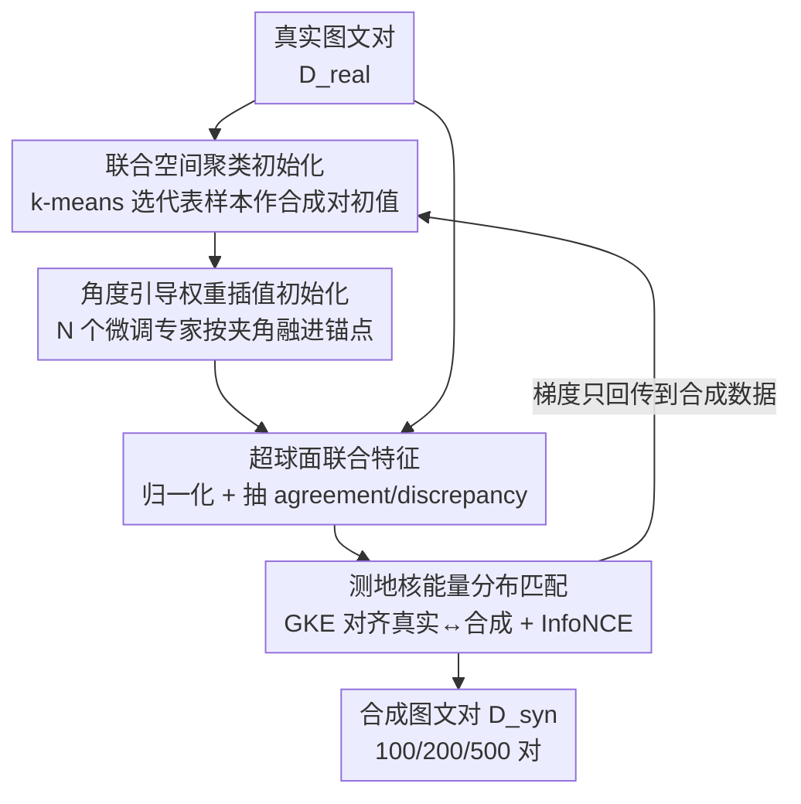

# Multimodal Distribution Matching for Vision-Language Dataset Distillation

**会议**: CVPR 2026  
**arXiv**: [2605.23482](https://arxiv.org/abs/2605.23482)  
**代码**: 有（Project Page）  
**领域**: 多模态VLM / 数据集蒸馏  
**关键词**: 数据集蒸馏, 分布匹配, 图文检索, 几何感知, 跨架构泛化

## 一句话总结
本文提出 MDM（Multimodal Distribution Matching），一个面向图文数据集蒸馏的几何感知分布匹配框架——在数据、模型、损失三个层面同时下手（联合空间聚类初始化 + 角度引导的权重插值初始化 + 单位超球面上的测地核能量匹配），用单层优化直接对齐真实与合成数据的联合分布，从而把蒸馏成本相比基于训练轨迹的 SOTA（LoRS）降低高达 98%，同时在跨架构泛化上反超基线。

## 研究背景与动机

**领域现状**：数据集蒸馏（Dataset Distillation, DD）把一个大训练集压缩成极小的合成集，让在合成集上训练的模型尽量逼近在全量数据上训练的效果。随着系统普遍处理图文配对输入，多模态数据集蒸馏（MDD）成为刚需——合成集既要保留每个模态内部的统计结构，又要维持图文之间的跨模态语义对应。

**现有痛点**：现有多模态蒸馏方法（MTT-VL、LoRS）都建立在**匹配训练轨迹**（Matching Training Trajectory, MTT）的范式上。这类方法要反复做双层优化（bi-level optimization）：先用真实/合成数据各跑出教师、学生轨迹，再用轨迹差去更新合成集。这带来两个硬伤：一是计算与显存开销巨大（LoRS 单次迭代 5–7 秒、要跑 850–2350 次迭代才收敛）；二是把合成数据优化到"匹配某个特定训练架构的训练动力学"，会注入**架构偏置**，换一套编码器就掉点严重。

**核心矛盾**：轨迹匹配范式的本质是去拟合"某个模型在某条优化路径上的动力学"，而不是去拟合"数据本身的分布"。前者天然绑定了源模型的结构与优化路径，于是高成本和差泛化是同一个根因的两面。

**本文目标**：(1) 摆脱轨迹回放，用更轻量的单层优化做蒸馏；(2) 直接在与现代编码器对齐的联合嵌入空间里匹配分布，降低对单一架构的敏感；(3) 在图文配对场景下同时保住模态内统计与跨模态对齐。

**切入角度**：单模态视觉里已经有"分布匹配"（Distribution Matching, DM）这条线——不回放轨迹，而是直接对齐真实与合成特征的分布，在可扩展性、稳定性、泛化上都更好。作者的观察是：把 DM 搬到多模态，并且让它"几何感知"地在单位超球面上操作图文联合特征，就能既省算力又强泛化。

**核心 idea**：用"在联合超球面上直接匹配真实/合成的图文联合分布"代替"回放图文训练轨迹"，并在数据/模型/损失三层都做几何感知的初始化与对齐。

## 方法详解

### 整体框架
MDM 要解决的是"如何不靠轨迹回放、只用一次单层优化，就蒸馏出一小撮（100–500 对）既保留图文语义又能跨架构泛化的合成图文对"。它把功力分摊到三个互补的层级：**数据层**用 k-means 在图文联合空间里聚类，挑出最有代表性的真实样本作为合成对的初值；**模型层**把若干个独立微调的专家模型在权重空间里按"方向一致程度"插值，得到一个既贴近真实分布、又不偏向任何单一架构的冻结教师；**损失层**把图文嵌入归一化到单位超球面，构造"一致方向"与"差异方向"两组跨模态特征，用测地核能量（Geodesic Kernel Energy, GKE）把真实集和合成集的这两组分布对齐，再叠加双向 InfoNCE 维持合成对内部的图文对齐。

整条管线是：真实图文对 → 联合空间聚类初始化合成对 → 每步迭代刷新一个角度引导插值的冻结模型 → 把真实/合成 batch 都映到超球面、抽 agreement/discrepancy 特征 → 用 GKE + InfoNCE 算梯度，**只反传到合成数据本身**（合成图文对是被优化的连续参数，模型全程冻结）。

### 关键设计

**1. 联合空间聚类初始化：让合成对从一开始就铺满图文语义模式**

针对"合成数据初值差、优化起点偏离真实流形"的痛点。作者先用编码器 $\Psi$ 把每个真实图文对的图像与文本特征投影后**拼接**成联合嵌入 $f_n$，对所有真实对跑 $K=|\mathcal{D}_{\mathrm{syn}}|$ 的 k-means，得到 $K$ 个簇心 $c_k$。每个合成对的初值取该簇内与簇心余弦相似度最大的真实样本：

$$j_k=\arg\max_{n\in\mathcal{C}_k}\frac{f_n^\top c_k}{\|f_n\|_2\,\|c_k\|_2}$$

关键在于聚类用的是**拼接后的图文联合特征**，因此反映的是多模态联合结构、而非单一模态——这让合成集广覆盖联合语义模式、避免冗余，给后续优化一个贴着真实流形的稳定起点。消融显示：从高斯噪声初始化在图文检索里几乎完全失效（Mean 0.5），随机真实样本就能反超 LoRS，而联合特征聚类比单看图像/单看文本聚类都更好。

**2. 角度引导的权重空间插值初始化：用专家之间的"方向一致度"决定向真实分布走多远**

针对"冻结教师该取在哪"的两难：太贴近预训练锚点 → 教师欠拟合真实多模态结构、监督信号弱；过度依赖某一个微调专家 → 合成数据继承该专家特有的表征几何、跨架构泛化崩。作者的做法是：只在 $N$ 个微调专家**方向一致**的范围内把模型推向真实，方向冲突时退回锚点。对锚点 $\theta_0^m$ 与各专家位移 $\Delta_{i,\ell}^m=\theta_{(i),\ell}^m-\theta_{0,\ell}^m$（$m\in\{v,t\}$ 分别是图像编码器/文本投影头），逐层融合：

$$\theta^m_{*,\ell}=\theta^m_{0,\ell}+\alpha\,t^m_\ell\cdot\tfrac{1}{2}\big(\Delta^m_{1,\ell}+\Delta^m_{2,\ell}\big),\quad t^m_\ell=\frac{2\langle\Delta^m_{1,\ell},\Delta^m_{2,\ell}\rangle}{\|\Delta^m_{1,\ell}\|_2\|\Delta^m_{2,\ell}\|_2+\langle\Delta^m_{1,\ell},\Delta^m_{2,\ell}\rangle}$$

合并比例 $t^m_\ell$ 由两个位移向量的夹角决定：**夹角越大（专家越不一致），融合后越依赖预训练锚点；夹角越小，越往真实走**。再用 $\alpha<1$（实验取 0.5）细调推移幅度以保架构鲁棒性。更妙的是每次蒸馏迭代都**随机抽一个专家在随机 epoch 的 checkpoint** 重新做插值——由于每个专家逐 epoch 的训练动力学不同，这等于在**模型层级**隐式模拟了真实分布的动力学（而 MTT 是在参数层级显式回放轨迹），既稳住又增强了跨架构泛化。

**3. 测地核能量分布匹配：在超球面上分别对齐图文的"一致方向"与"差异方向"**

这是 MDM 的损失核心，针对"如何在不回放轨迹的前提下匹配联合分布"。先把投影后的图文嵌入 $(z^v,z^t)$ 归一化到单位超球面 $\mathbb{S}^{d-1}$，再为每对构造两组跨模态特征——**一致方向**（agreement，图文共享语义）和**差异方向**（discrepancy，模态特异成分）：

$$u=\mathrm{normalize}(z^v+z^t),\qquad g=\mathrm{normalize}(z^v-z^t)$$

两点的相似度用测地（角度）距离 $\phi(a,b)=\arccos(\langle a,b\rangle)$，再过测地高斯核 $k_{\mathrm{geo}}(a,b)=\exp(-\phi(a,b)^2/2\sigma^2)$ 映成超球面亲和度。对真实集 $\mathcal{A}$、合成集 $\mathcal{B}$ 定义**测地核能量**（GKE，本质是超球面上的 MMD 型距离）：

$$\mathsf{GKE}(\mathcal{A},\mathcal{B})=\Big[\tfrac{1}{m^2}\textstyle\sum_{i,i'}k_{\mathrm{geo}}(a_i,a_{i'})+\tfrac{1}{n^2}\sum_{j,j'}k_{\mathrm{geo}}(b_j,b_{j'})-\tfrac{2}{mn}\sum_{i,j}k_{\mathrm{geo}}(a_i,b_j)\Big]^{1/2}$$

三项分别是 A 内亲和、B 内亲和、跨集亲和；最小化它会**抬高跨集亲和、同时校准两集内部的亲和模式**，外层开方让梯度更平滑。最终对一致/差异两个方向各算一次：$\mathcal{L}_{\mathrm{agr}}=\mathsf{GKE}(\mathcal{U}^r,\mathcal{U}^s)$、$\mathcal{L}_{\mathrm{dis}}=\mathsf{GKE}(\mathcal{G}^r,\mathcal{G}^s)$。把"一致"和"差异"拆开匹配是关键洞见——消融里单加差异损失比单加一致损失收益更大，说明跨模态的"差异/分离"信息比共享信息更难学也更值钱。

### 损失函数 / 训练策略
总损失把双向 InfoNCE 对齐项与两个 GKE 分布匹配项线性组合：

$$\mathcal{L}_{\mathrm{MDM}}=\mathcal{L}_{\mathrm{InfoNCE}}+\lambda_{\mathrm{agr}}\cdot\mathcal{L}_{\mathrm{agr}}+\lambda_{\mathrm{dis}}\cdot\mathcal{L}_{\mathrm{dis}}$$

其中 $\mathcal{L}_{\mathrm{InfoNCE}}$ 是对合成图文对取 image→text 与 text→image 交叉熵均值的对称对比损失，保证合成对内部图文配对一致；GKE 项负责把合成联合分布拉向真实。超参：温度 $\tau=0.07$，$\lambda_{\mathrm{agr}}=\lambda_{\mathrm{dis}}=0.8$，插值因子 $\alpha=0.5$。蒸馏用 SGD（momentum 0.5、梯度裁剪 1.0、固定学习率），最多 3000 次迭代但实际远早收敛。蒸馏的是 768 维文本嵌入而非原始 caption，图像尺寸 $3\times224\times224$；蒸馏完每个初始化模型在合成对上训 100 epoch，检索分数对 5 个独立初始化模型取平均。

## 实验关键数据

视觉编码器用 NFNet、文本编码器用 BERT（与 MTT-VL/LoRS 对齐），在 Flickr8k / Flickr30k / COCO 三个图文检索数据集、100/200/500 对预算下评测，指标为 IR@{1,5,10}（文→图）与 TR@{1,5,10}（图→文）的 Recall。

### 主实验

| 数据集 (500 对) | 指标 (Mean) | MDM (本文) | LoRS (SOTA) | MTT-VL |
|--------|------|------|----------|--------|
| Flickr8k | 检索均值 | **26.2** | 25.0 | 15.1 |
| Flickr30k | 检索均值 | 30.6 | **31.6** | 25.0 |
| COCO | 检索均值 | **15.3** | 13.5 | 12.6 |

在最大最难的 COCO 上，MDM 在所有预算下都明显超过 LoRS；Flickr8k 全面领先；Flickr30k 与 LoRS 互有胜负、整体打平。作为参考，全量数据训练的 Mean 在三个集上约为 53.8 / 55.7 / 41.2。

### 跨架构泛化（Table 2，源 NFNet+BERT 蒸馏，迁移到 5 种编码器组合取均值）

| 数据集 (500 对) | LoRS Mean | MDM Mean |
|--------|------|------|
| Flickr8k | 10.2 | **16.2** |
| Flickr30k | 14.5 | **19.3** |
| COCO | 2.4 | **9.8** |

LoRS 一换架构就大幅塌陷（COCO 仅 2.4），MDM 全面、稳定地高出一截——印证了分布匹配蒸的是"数据级多模态分布"而非"源模型优化路径"，所以不绑架构。

### 计算效率（Flickr8k，Table 3）

| 配置 | 单次迭代 (秒) | 收敛迭代数 | 总时长 (分) |
|------|------|------|------|
| LoRS / 100 | 5.43 | 850 | 76.93 |
| MDM / 100 | 1.72 | 200 | **5.73 (↓93%)** |
| LoRS / 500 | 5.27 | 2350 | 206.41 |
| MDM / 500 | 4.41 | 50 | **3.68 (↓98%)** |

单次迭代约 3× 加速（单层优化 vs 双层），加上收敛所需迭代数骤减（500 对仅 50 步），总时长最多省 98%。

### 消融实验

| 配置 | IR | TR | Mean | 说明 |
|------|----|----|------|------|
| 数据初始化: 噪声 | 0.6 | 0.5 | 0.5 | 高斯噪声在图文检索里完全失效 |
| 数据初始化: 随机真实 | 18.6 | 22.6 | 20.6 | 已超 LoRS |
| 数据初始化: 联合特征聚类 (Ours) | 19.7 | 24.2 | **21.9** | 比单图像/单文本聚类都好 |
| 模型初始化: 预训练锚点 | 5.1 | 8.4 | 6.8 | 欠拟合真实结构 |
| 模型初始化: 单个微调专家 | 14.3 | 21.3 | 17.8 | 继承专家偏置 |
| 模型初始化: 锚点+专家加权和 | 17.6 | 21.7 | 19.6 | 中间态有益 |
| 模型初始化: 多专家角度插值 (Ours) | 19.7 | 24.2 | **21.9** | 最优 |
| 损失: 仅 InfoNCE | 18.81 | 23.15 | 20.98 | 基础配对一致性 |
| + agreement | 18.82 | 23.23 | 21.02 | 一致方向收益很小 |
| + discrepancy | 19.22 | 23.84 | 21.53 | 单加差异更有效 |
| + 全部 (Ours) | 19.73 | 24.15 | **21.94** | 协同最优 |

### 关键发现
- **差异方向比一致方向更值钱**：单独加 $\mathcal{L}_{\mathrm{dis}}$（21.53）远超单独加 $\mathcal{L}_{\mathrm{agr}}$（21.02），说明跨模态的"模态特异分离"信息比共享信息更难捕捉、也更关键。
- **初始化在多模态蒸馏里极其重要**：噪声初始化直接归零（Mean 0.5），与单模态分类蒸馏的结论相反——图文检索的细粒度对齐让起点必须落在真实流形上。
- **跨架构泛化是分布匹配相对轨迹匹配的结构性优势**，不是调参得来的，在 COCO 上差距最大（9.8 vs 2.4）。

## 亮点与洞察
- **把跨模态特征拆成"一致 + 差异"两个方向分别匹配**：$u=z^v+z^t$、$g=z^v-z^t$ 这个简单分解非常巧妙，让分布匹配既管共享语义又管模态特异成分，且实验证明后者贡献更大——这个 agreement/discrepancy 拆分思路可迁移到任何需要对齐两模态分布的任务（如音视频、图文检索蒸馏之外的对齐预训练）。
- **用专家间夹角自适应决定融合强度**：方向一致就大胆往真实走、冲突就退守锚点，把"该微调多狠"这个超参问题转成了几何量，且每步随机刷新专家 checkpoint，在模型层级隐式重现了 MTT 想要的训练动力学，却省掉了轨迹回放——这是"用初始化换轨迹"的漂亮替代。
- **几何感知的超球面 + 测地核**：所有匹配都在单位超球面上用角度度量做，天然契合 $\ell_2$ 归一化的现代图文编码器，比欧氏 MMD 更贴检索的相似度结构。

## 局限与展望
- 作者承认 MDM **依赖预训练的图文编码器**，跨架构泛化的增益仍建立在这个前提上；没有强预训练编码器时方法如何退化未知。
- 评测只覆盖图文检索（Flickr8k/30k/COCO）这一类任务，未验证到 VQA、captioning 等下游或更大规模数据集（如 CC12M）上的蒸馏效果。
- 角度引导插值默认用 $N=2$ 个专家，专家数量、专家本身质量对结果的敏感性没有系统扫描；$\lambda_{\mathrm{agr}}=\lambda_{\mathrm{dis}}=0.8$ 取等值也较 ad hoc，差异项更重要的结论暗示二者也许该不对称加权。
- 改进思路：把 agreement/discrepancy 的权重做成自适应（按当前 batch 的模态分离度调），或将差异方向进一步细分多个子方向。

## 相关工作与启发
- **vs MTT-VL / LoRS（轨迹匹配范式）**: 他们回放图文训练轨迹、做双层优化来更新合成集，LoRS 还额外蒸馏一个低秩的图文相似度矩阵。本文用**单层的分布匹配**直接对齐联合分布，区别在于蒸的是"数据级分布"而非"模型优化路径"，因此 (1) 计算省下高达 98%，(2) 不继承源模型架构偏置、跨架构泛化显著更强；代价是在 Flickr30k 这类中等难度集上与 LoRS 互有胜负。
- **vs 单模态分布匹配（DM/DataDAM 系）**: 它们在单视觉模态上用 MMD/矩匹配对齐特征分布。本文把 DM 扩到多模态，关键增量是把图文嵌入拆成一致/差异方向、在超球面上用测地核做匹配，并补上数据/模型两级的几何感知初始化。
- **vs Coreset 选择（Herding / K-Center / Forgetting）**: 它们只能"挑/重加权"已有真实样本、无法合成、也不显式管跨模态对齐，因此在所有预算下都被 MDM 大幅甩开。

## 评分
- 新颖性: ⭐⭐⭐⭐ 首个把分布匹配范式系统搬到多模态蒸馏，agreement/discrepancy 拆分 + 角度引导插值都是有洞见的新设计。
- 实验充分度: ⭐⭐⭐⭐ 三数据集 × 三预算 × 跨架构 × 计算效率 × 三组消融，覆盖很全；但仅限图文检索一类任务、未上更大数据集。
- 写作质量: ⭐⭐⭐⭐ 三层结构清晰、公式严谨、Fig.2 总览到位；部分超球面几何细节推到了 Supp。
- 价值: ⭐⭐⭐⭐ 把多模态蒸馏成本压一个量级且泛化更好，对算力/存储受限场景和快速消融实验有实用价值。

<!-- RELATED:START -->

## 相关论文

- [\[CVPR 2026\] ReMatch: Boosting Representation through Matching for Multimodal Retrieval](rematch_boosting_representation_through_matching_for_multimodal_retrieval.md)
- [\[CVPR 2026\] VOLD: Reasoning Transfer from LLMs to Vision-Language Models via On-Policy Distillation](vold_reasoning_transfer_from_llms_to_vision-language_models_via_on-policy_distil.md)
- [\[CVPR 2026\] Uncertainty-Aware Knowledge Distillation for Multimodal Large Language Models](uncertainty-aware_knowledge_distillation_for_multimodal_large_language_models.md)
- [\[CVPR 2026\] RMIR: A Benchmark Dataset for Reasoning-Intensive Multimodal Image Retrieval](rmir_a_benchmark_dataset_for_reasoning-intensive_multimodal_image_retrieval.md)
- [\[CVPR 2026\] UNI-OOD: Unified Object- and Image-level Out-of-Distribution Detection via Cross-Context Attentive Vision-Language Modeling](uni-ood_unified_object-_and_image-level_out-of-distribution_detection_via_cross-.md)

<!-- RELATED:END -->
