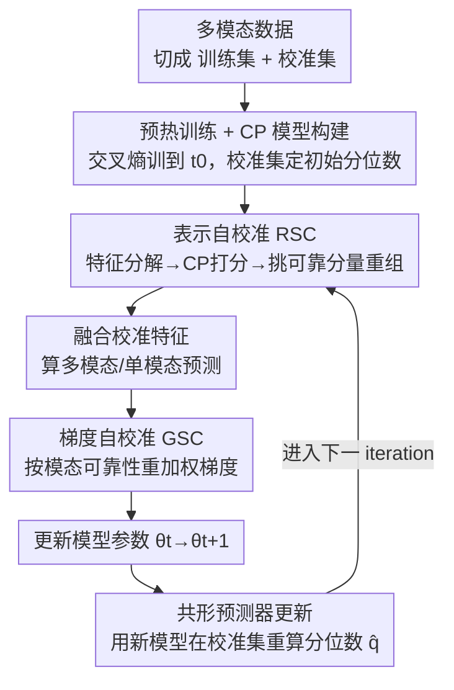

# Multimodal Learning on Low-Quality Data with Conformal Predictive Self-Calibration

**会议**: CVPR 2026  
**arXiv**: [2605.03820](https://arxiv.org/abs/2605.03820)  
**代码**: https://github.com/XunCHN/CPSC (有)  
**领域**: 多模态VLM  
**关键词**: 多模态学习, 共形预测, 模态不平衡, 噪声鲁棒, 自校准训练

## 一句话总结
本文提出 CPSC（Conformal Predictive Self-Calibration），把模态不平衡和噪声污染这两个看似独立的"低质量数据"问题归因于同一个根源——模型对各模态/各样本可靠性的预测不确定性，并用共形预测（CP）在训练过程中实时生成可靠性分数，同时在**特征层**（挑出可靠特征分量重组）和**梯度层**（按样本可靠性重加权梯度）做自校准，在 6 个数据集的不平衡与噪声设置下都刷新了 SOTA。

## 研究背景与动机
**领域现状**：现实多模态系统经常面对"低质量数据"，主要表现为两种形态——**隐式模态不平衡**（不同模态收敛速度不一致，模型偏向占主导的强模态，弱模态被忽略）和**显式噪声污染**（某些模态被高斯/椒盐噪声等动态干扰）。学界一直把这两个问题**分开处理**：不平衡这边有加权损失、梯度调制、重采样；噪声那边则做鲁棒融合、可靠性建模。

**现有痛点**：分而治之的方案各自只在自己的设定里有效，缺一个能同时管住两类问题的统一框架。更深一层，这些方法大多绑定特定架构（late fusion 加权、中间层引导）或先验假设（如贝叶斯需要 prior），不是 model-agnostic 的。

**核心矛盾**：作者指出不平衡与噪声其实**共享同一个根源**——它们都会**抬高模型的预测不确定性**（Fig.1 用预测分布的对数熵佐证）。不平衡让弱模态被忽视，噪声往学习里注入错误信息，二者最终都导致模型给出"自信但不可靠"的过自信预测。既然根源相同，就该从"量化并校准预测不确定性"这一个角度统一解决。

**本文目标**：设计一个**模型无关、分布无关**的预测不确定性量化机制，并把它嵌进训练循环，让模型一边训练一边诊断自己的不确定性、纠正学习轨迹。

**切入角度**：作者借用**共形预测（Conformal Prediction, CP）**——一个能给出带有限样本、分布无关覆盖保证的预测集合的统计框架。和贝叶斯不同，CP 不需要先验，天然 model-agnostic；但已有 CP 工作几乎都是**事后（post-hoc）**用，训练完才套个预测集。本文的新意是把 CP **拉进训练循环里动态维护**，让它和主模型协同进化。

**核心 idea**：用一个随训练动态刷新的 CP 模型，给每个特征分量、每个样本-模态对打"可靠性分数"，再用这个分数同时校准**特征表示**和**梯度流向**，把不平衡和噪声当成同一个不确定性问题一起治。

## 方法详解

### 整体框架
CPSC 在标准多模态训练管线上加一套"自校准训练循环"。给定含 $M$ 个模态的训练数据，先把它**按同分布随机切成训练集 $\mathcal{D}_{train}$ 和校准集 $\mathcal{D}_{cal}$**（校准集专门喂给 CP 模型算分位数）。整个流程分两阶段：**预热阶段**先用普通交叉熵把多模态模型 $f_\theta=\{E^1,\dots,E^M,F\}$（各模态编码器 + 融合分类器）训到 $t_0$ 个 epoch，再用校准集初始化 CP 模型（算非一致性分数、取初始分位数 $\hat{q}_{t_0}$）；之后进入**自校准循环**，每个 iteration 依次做：① 抽单模态特征并用当前 CP 模型做表示自校准（RSC），② 融合校准后的特征算预测，③ 用 CP 可靠性分数做梯度自校准（GSC）再反传，④ 更新模型参数 $\theta_t\to\theta_{t+1}$，⑤ 用更新后的模型在校准集上重算分位数刷新 CP 模型（CP Updating），形成闭环。关键在于 **CP 模型与主模型共享参数**（CP 的"分类器"就是主模型的分类器），所以模型一变，可靠性判断也跟着变，二者同步进化。

### 关键设计

**1. 共形预测器构建与协同更新：让 CP 实时跟着模型走，而不是事后套一层**

CP 的核心是**非一致性分数（nonconformity score）**：对样本 $(x,y)$，$s(x,y)=1-f(x)_y$，即模型给真标签的预测概率越低、分数越高，说明这对样本越"反常"。给定风险因子 $\alpha$，在校准集 $n$ 个分数里取第 $\lceil(n+1)(1-\alpha)\rceil/n$ 分位数 $\hat{q}$，就能构造预测集 $C(x)=\{y:s(x,y)\le\hat{q}\}$，并保证边际覆盖 $\mathbb{P}(y\in C(x))\ge 1-\alpha$。本文不把这套机制留到测试后，而是在**每个 iteration 结束后**用更新过的模型 $f_{\theta_{t+1}}$ 在校准集上重算所有 $s_i^{t+1}=1-f_{\theta_{t+1}}(x_i)_{y_i}$、刷新分位数 $\hat{q}_{t+1}$（式 16–17）。这样 CP 模型始终和当前模型状态同步，避免用"过期"的不确定性判断误导后续训练——消融显示更新间隔越长性能单调下降，正说明这一点。

**2. 表示自校准 RSC：把单模态特征拆成分量，只留 CP 认证最可靠的那几块来融合**

针对"噪声会污染部分特征、弱模态特征被淹没"的痛点，RSC 不直接用整条单模态特征，而是先**分解**：把原始特征 $h^m$ 经一个模态专属全连接 $W^m_{dec}\in\mathbb{R}^{l\times d}$（$l=n\times d$）升维并 ReLU 得 $h^m_{high}$，再切成 $n$ 个分量 $\{c^m_k\}$，每个 $c^m_k\in\mathbb{R}^d$ 捕捉表示的不同侧面。为让分量既贴近原特征又彼此有差异，加了一个 KL 散度约束 $\mathcal{L}^m_{div}=\frac{\lambda_1}{n}\sum_k D_{KL}(P(h^m)\|P(c^m_k))-\frac{\lambda_2}{n(n-1)}\sum_{i\neq j}D_{KL}(P(c^m_i)\|P(c^m_j))$（一致性项把分量拉向原特征核心，多样性项推开分量之间，$\lambda_1{=}0.8,\lambda_2{=}0.2$）。

接着用 CP 给每个分量打**可靠性分数**：把 $c^m_k$ 喂给单模态分类器 $F_m$ 得概率 $p^m_k$，算各类非一致性分数 $s(c^m_k,y)=1-p^m_k[y]$，构造预测集 $C(c^m_k)$，然后看真标签 $y$ 在按非一致性升序排序后的预测集里排第几——$r^m_k=1-\frac{\text{rank}[y,C(c^m_k)]}{|C(c^m_k)|}$（真标签排得越靠前、分越高；$y$ 不在预测集里则 $r^m_k=0$）。最后把分数 top-$K$ 的分量取平均得到校准特征 $\tilde{h}^m=\frac{1}{K}\sum_{k\in\mathcal{S}^m}c^m_k$。论文给了 Proposition 1：校准表示与理想鲁棒表示的期望偏差被选中分量的偏差上界控制，从理论上佐证"挑可靠分量"的有效性。直觉上，噪声污染的分量得分低被丢掉，弱模态里稀有但有信息的分量得分高被保留，从而抵抗噪声、缓解不平衡。

**3. 梯度自校准 GSC：按样本-模态可靠性重加权梯度，把优化往可信方向推**

RSC 管特征，GSC 管优化。拿到最终预测 $\hat{y}=F(\{\tilde{h}^m\})$ 后，同步算多模态交叉熵 $\mathcal{L}_{CE}(\hat{y},y)$ 和各单模态 $\mathcal{L}^m_{CE}$。反传**之前**先估每个模态的可靠性：注意这里**不用真标签**，而是把**多模态预测标签 $y'$** 当成"当前模型的协同判断"，再走一遍和 RSC 类似的 CP 流程，得到单模态可靠性 $\rho^m=1-\frac{\text{rank}(y',C(\tilde{h}^m))}{|C(\tilde{h}^m)|}$——它度量某模态与多模态协同判断的一致程度。然后用线性权重 $w(\rho^m)=a\cdot\rho^m+b$（$a,b$ 控制校准强度和基线）调制该模态的梯度：$\nabla_\theta\mathcal{L}^m_{GSC}=\frac{1}{|\mathcal{B}|}\sum_i w(\rho^m)\cdot\nabla_\theta\mathcal{L}^m_{CE}$。可靠性低（$\rho^m$ 小）的样本-模态梯度被压低，可靠性高的被放大。Proposition 2 论证：当 $w(\rho)$ 与梯度范数正相关时，GSC 能降低随机梯度估计的有效方差，故优化更稳。

> 训练时 RSC 与 GSC 协同；推理阶段**不做特征分解、不用 RSC**，直接用训好的模型出预测——所以 CPSC 是个只在训练期生效、不增加推理开销的 model-agnostic 框架。

### 损失函数 / 训练策略
总训练目标为多模态分类损失 + 各模态多样性约束：$\mathcal{L}=\mathcal{L}^{\text{mul}}_{CE}+\sum_{m=1}^M\mathcal{L}^m_{div}$，参数更新时再叠加 GSC 调制后的单模态梯度：$\theta\leftarrow\theta-\eta(\nabla_\theta\mathcal{L}+\nabla_\theta\mathcal{L}^m_{GSC})$。超参：预热 epoch $t_0$、CP 风险因子 $\alpha$、分量数 $n$ 与选取数 $K$、$\lambda_1{=}0.8/\lambda_2{=}0.2$、梯度权重 $a,b$。骨干网络：音视频用 ResNet18（音频转 257×1004 频谱图、视频从 10 帧片段采样）；RGB-Depth 用 ResNet18；图文 MVSA 用 ResNet152 提图像 + 预训练 BERT 提文本。

## 实验关键数据

### 主实验
**不平衡多模态学习**（Acc$_m$/Acc$_a$/Acc$_v$ 分别为多模态/音频/视觉准确率，Avg 为均值）：

| 数据集 | 指标 | CPSC | 之前SOTA(ARL/IPRM等) | 提升 |
|--------|------|------|----------|------|
| Kinetics Sounds | Acc$_m$ | 76.08 | 74.82 (IPRM) | +1.26 |
| CREMA-D | Acc$_m$ | 87.83 | 86.02 (LFM) | +1.81 |
| CREMA-D | Avg | 78.65 | 75.94 (LFM) | +2.71 |
| AVE | Acc$_m$ | 77.66 | 75.81 (MMPareto) | +1.85 |
| AVE | Avg | 63.41 | 61.85 (MMPareto) | +1.56 |

三个数据集的多模态与单模态准确率全面领先；论文称在 AVE 上多模态准确率较 ARL 提升约 5%、CREMA-D 上约 3%。

**鲁棒多模态学习**（含高斯 GS / 椒盐 SP 噪声，强度 $\epsilon$）：

| 数据集 | Clean | GS@5 | GS@10 | SP@5 | SP@10 |
|--------|-------|------|-------|------|-------|
| MVSA (CPSC) | 80.07 | 74.12 | 63.32 | 73.95 | 61.27 |
| MVSA 次优 | 79.15(EAU) | 73.34 | 61.78 | 73.69 | 60.46 |
| NYU Depth V2 (CPSC) | 73.12 | 64.15 | 57.32 | 61.22 | 47.40 |
| SUN RGB-D (CPSC) | 62.12 | 54.11 | 49.10 | 53.37 | 41.28 |

Clean 与各噪声强度下 CPSC 都最优，且噪声越强相对优势越明显（基线随噪声大幅退化、CPSC 更稳）。

### 消融实验
在 CREMA-D（不平衡）与 NYU Depth V2（噪声）上拆 RSC/GSC：

| 配置 | CREMA-D Avg | NYU SP@10 | 说明 |
|------|---------|------|------|
| 无 RSC / 无 GSC | 73.10 | 41.22 | baseline |
| 仅 GSC | 75.32 | 41.36 | 噪声下几乎无提升 |
| 仅 RSC | 76.20 | 45.94 | 噪声下提升显著 |
| Full (RSC+GSC) | 78.65 | 47.40 | 完整模型最佳 |

RSC 子约束消融（Fig.3）：去掉 $\mathcal{L}_{div}$、只留一致性、只留多样性、全约束四档，单约束都有增益、全约束最优——一致性保语义连贯，多样性增覆盖减冗余。

### 关键发现
- **噪声场景下 RSC 远比 GSC 重要**：噪声下 RSC 单独带来 2–5% 增益，GSC 单独几乎无提升；因为 RSC 能直接在特征层抑制被污染分量，而梯度重加权对显式噪声乏力。不平衡场景下二者则更接近、互补。
- **GSC 不挑优化器**：SGD/Adam/AdaGrad 叠加 CPSC 都涨，CREMA-D 上 SGD 提升超 10%、AdaGrad 超 8%、Adam 约 2%，说明它是在引导优化轨迹避开局部极小、收敛到更优解。
- **CP 更新频率越低越差、预热不可省**：更新间隔越长性能单调下降（用过期不确定性误导训练）；去掉 warm-up 明显变差（需要先建立基本表示能力，校准才有可靠基础）。
- **可靠性分布右移**：训练后可靠性分数整体向高分集中（Fig.6），t-SNE 显示类内更紧、类间更分（Fig.5），证实它确实纠正了"过自信却不可靠"的预测。

## 亮点与洞察
- **把两个分家的问题归并到同一根因**：不平衡和噪声看似无关，作者用"预测不确定性升高"把它们统一，这个 reframing 本身比具体模块更有价值——一旦统一，就能用一套机制（CP 可靠性分数）同时下两味药。
- **CP 从 post-hoc 变成训练内回路**：以往 CP 都是训完套预测集；这里让 CP 与主模型共享分类器、每个 iteration 重算分位数协同进化，是把统计保证工具"内化"进训练的巧思，可迁移到任何分类式多模态训练。
- **特征层 + 梯度层双路校准且分工明确**：RSC 管"用哪些特征"、GSC 管"信哪些样本的梯度"，消融还给出了"噪声靠 RSC、不平衡靠两者"的清晰边界，便于后人按场景裁剪。
- **用多模态预测标签而非真标签算模态可靠性**：GSC 里把 $y'$（多模态协同判断）当参照来度量单模态一致性，巧妙地把"模态间协同程度"转成可计算的可靠性，可迁移到其它需要衡量模态贡献的任务。

## 局限与展望
- **依赖校准集的同分布假设**：CP 的覆盖保证建立在校准集与测试同分布上，遇到 OOD/分布漂移时分位数可能失准，论文未讨论这种情形。
- **训练开销上升**：每个 iteration 要做特征分解 + 逐分量 CP 打分，且每轮在整个校准集上重算分位数，相比普通训练更重；论文未给训练时间/显存对比。
- **超参偏多**：$n,K,\alpha,\lambda_1,\lambda_2,a,b$ 都需调，敏感性分析只覆盖了更新频率与部分约束，$K/n$ 的选取、$\alpha$ 的影响交代不充分。
- **只验证分类任务**：方法天然绑定"分类预测集"，对回归、检索、生成等非分类多模态任务能否套用未知；作者把扩展到更多场景列为 future work。

## 相关工作与启发
- **vs 不平衡专项方法（MMPareto / InfoReg / ARL / DGL 等）**：它们用梯度调制/重采样平衡模态学习节奏，只针对不平衡；CPSC 用 CP 可靠性统一处理不平衡与噪声，且在三个不平衡数据集上全面超过它们。
- **vs 噪声鲁棒融合（EAU / ECML / NLC）**：它们设计鲁棒融合架构或显式建模模态可靠性来降权噪声模态，但绑定特定架构/先验；CPSC 是 model-agnostic、只在训练期生效，clean 与各噪声强度下都更优。
- **vs 其它 CP 工作**：以往多在训练后做 post-hoc 预测集，少数把 CP 塞进损失函数；CPSC 首次把 CP 做成动态自校准训练框架，同时调特征表示与梯度优化两个层面。
- **vs 贝叶斯不确定性方法**：贝叶斯需先验、常绑特定模型设计；CP 分布无关、模型无关，CPSC 借此实现"插到任意多模态分类模型上"的通用性。

## 评分
- 新颖性: ⭐⭐⭐⭐⭐ 用"预测不确定性"统一不平衡与噪声，并把共形预测从事后工具改造成训练内自校准回路，视角和机制都新。
- 实验充分度: ⭐⭐⭐⭐ 6 数据集双设置 + 模块/约束/优化器/更新频率/预热多维消融 + t-SNE/可靠性可视化，较完整；但缺训练开销对比、OOD 与超参敏感性分析。
- 写作质量: ⭐⭐⭐⭐ 动机递进清晰、模块分工明确、配两条命题；个别记号（CP 模型与主模型共享）需读图才完全对上。
- 价值: ⭐⭐⭐⭐ 提供了一个 model-agnostic、即插即用、只在训练期生效的多模态低质量数据通用方案，实用性强、易被复用。

<!-- RELATED:START -->

## 相关论文

- [\[CVPR 2026\] Decouple to Generalize: Context-First Self-Evolving Learning for Data-Scarce Vision-Language Reasoning](decouple_to_generalize_context-first_self-evolving_learning_for_data-scarce_visi.md)
- [\[CVPR 2026\] Proof-of-Perception: Certified Tool-Using Multimodal Reasoning with Compositional Conformal Guarantees](pop_proof_of_perception_conformal_reasoning.md)
- [\[CVPR 2026\] Predictive Regularization Against Visual Representation Degradation in Multimodal Large Language Models](predictive_regularization_against_visual_representation_degradation_in_multimoda.md)
- [\[CVPR 2026\] Improving Calibration in Test-Time Prompt Tuning for Vision-Language Models via Data-Free Flatness-Aware Prompt Pretraining](improving_calibration_in_test-time_prompt_tuning_for_vision-language_models_via_.md)
- [\[CVPR 2026\] GUI-SAGE: Enhancing GUI Automation with Self-Explanatory Learning](gui-sage_enhancing_gui_automation_with_self-explanatory_learning.md)

<!-- RELATED:END -->
