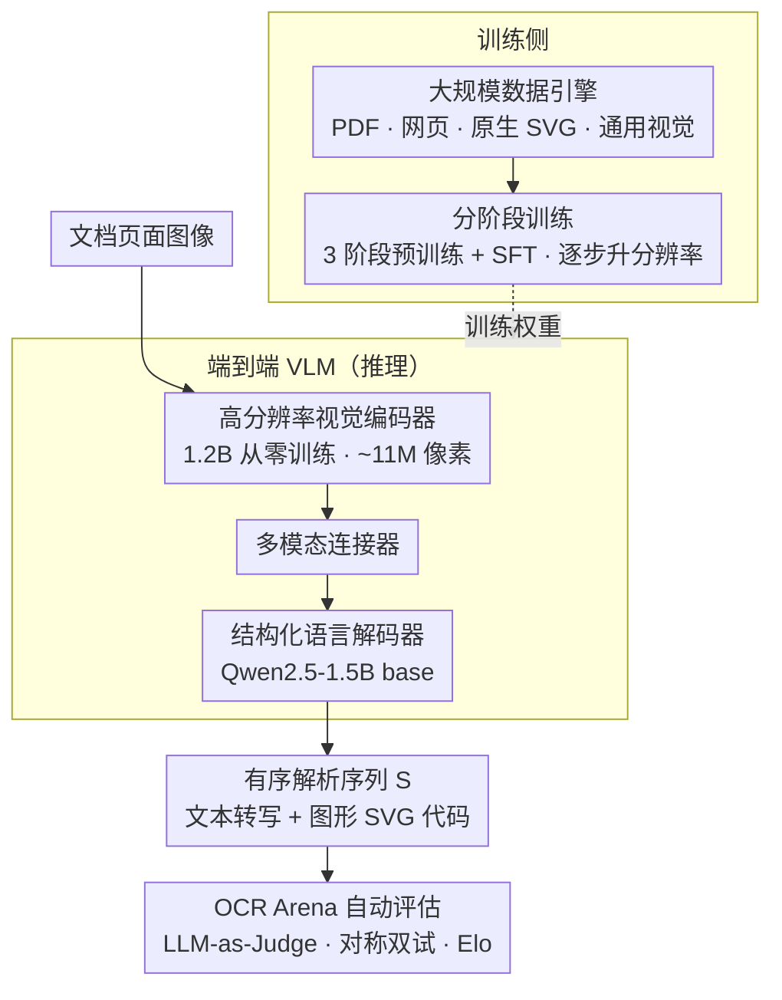

# Multimodal OCR: Parse Anything from Documents

**会议**: CVPR 2026  
**arXiv**: [2603.13032](https://arxiv.org/abs/2603.13032)  
**代码**: [https://github.com/rednote-hilab/dots.mocr](https://github.com/rednote-hilab/dots.mocr)  
**领域**: 文档解析 / 多模态VLM / OCR  
**关键词**: 文档解析, 图形解析, SVG生成, 视觉语言模型, 多模态OCR  

## 一句话总结
提出Multimodal OCR (MOCR)范式，将文档中的文本和图形（图表、图示、UI组件等）统一解析为结构化文本表示（文本+SVG代码），训练3B参数的dots.mocr模型在OCR Arena排名仅次于Gemini 3 Pro，在olmOCR Bench达到83.9 SOTA，在image-to-SVG基准上超越Gemini 3 Pro。

## 背景与动机
在大语言模型和多模态模型时代，文档解析是预训练和检索的核心数据引擎。然而文档不仅通过文本传递信息，还通过图表、图示、流程图、UI元素等图形传递信息。现有文档解析管线本质上是以文本为中心的：它们专注于文本识别和组织，而将非文本元素简单裁剪为像素保存。这导致文档图形中大量结构化和语义信息被丢弃，使得当前文档解析本质上是有损的，限制了从文档中可提取的监督信号量。近期视觉语言模型的进展使得从文档视觉元素中恢复结构化表示成为可能——不仅仅是描述，还能生成可执行的表示（如SVG代码）以实现原始结构的重建。

## 核心问题
如何将文档解析从"仅提取文本"扩展到"解析文档中的一切"——包括文本、布局结构、表格、以及图表/图示/图标/UI组件等信息密集图形？关键挑战：(1) 图形的监督信号稀缺（真实文档很少提供对齐的程序表示）；(2) 可渲染程序本质上非唯一（不同代码可产生视觉相同的输出）；(3) 任务要求精确的视觉定位与长序列结构化生成。

## 方法详解

### 整体框架
MOCR 想把文档解析从"只抠文本"扩展到"解析文档里的一切"——文本、布局、表格，以及图表/图示/图标/UI 这些信息密集的图形。它把文档页面解析定义为生成一个有序的解析元素序列 S = [(B₁,c₁,p₁),...,(Bₖ,cₖ,pₖ)]：Bₖ 是空间区域，cₖ 是语义类别，pₖ 是类型相关的载荷——文本区域的 pₖ 是文本转写（纯文本/表格 markup/LaTeX），图形区域的 pₖ 则是可渲染的结构化表示（SVG 代码），整条序列按人类阅读顺序生成。落到模型上，是一个高分辨率视觉编码器 + 结构化语言解码器的端到端 VLM，由大规模数据引擎喂养、分阶段训练而成。

### 关键设计

**1. 高分辨率视觉编码器：从零训练以原生适配文档解析**

文档既有密集文本又有几何敏感的视觉符号（图表标记、图示笔画），通用编码器难以兼顾。MOCR 用 1.2B 参数的视觉 backbone 完全从零训练，支持高达 ~11M 像素的原生高分辨率输入。从零训练让编码器形成原生优化于文档解析的特征表示，能同时处理密集文本和几何敏感的视觉符号。

**2. 结构化语言解码器：1.5B base 模型在容量与成本间折衷**

要把异构页面内容解码成长结构化序列，解码器太小撑不住、太大又贵。MOCR 用 Qwen2.5-1.5B 作自回归解码器：1.5B 是统一 MOCR 解析的容量与成本间的折衷；并刻意选 base 模型而非 chat 模型作初始化，为学习"非自然的强结构化目标序列"提供一个中性起点。

**3. 大规模数据引擎：四个互补数据源解决图形监督稀缺**

图形的对齐程序表示在真实文档里极少，监督信号稀缺。MOCR 用四个互补源构建训练数据：

- **PDF文档**：用 dots.ocr 自动标注，按语言/领域/布局复杂度分层采样
- **网页**：爬取渲染为页面图像，HTML/DOM 提供对齐的结构化信号，天然包含 SVG 原生图标/图表
- **SVG图形**：从网络收集原生 SVG 资产，经 svgo 清洗 + 去重 + 基于复杂度的平衡采样
- **通用视觉数据**：保持广泛视觉能力（grounding、counting 等）

**4. 分阶段训练策略：三阶段预训练 + SFT 逐步加难**

直接混合所有目标训练会不稳定。MOCR 走三阶段大规模预训练 + 指令微调，并随阶段逐步提升输入分辨率以匹配增长的任务难度：

- **阶段1**：通用视觉训练，建立稳定的视觉-语言接口
- **阶段2**：通用视觉 + 纯文本文档解析监督的统一混合训练，构建文本解析基础
- **阶段3**：增加 MOCR 特定目标（降低通用视觉比例，增加多模态文档解析 + 图形解析/image-to-SVG）
- **指令微调(SFT)**：用高质量策划数据集，优先监督可靠性与任务可用性；发布 dots.mocr 和 dots.mocr-svg 两个检查点（后者增加 SVG 份额和困难 SVG 程序权重）

**5. OCR Arena 自动评估：用 LLM-as-Judge 补字符匹配指标的不足**

可渲染程序本质非唯一（不同代码可产生视觉相同的输出），传统字符匹配难以公平评估。OCR Arena 基于 LLM-as-Judge 范式，用 Gemini 3 Flash 作裁判做配对比较，采用对称评估协议（正反两次呈现消除位置偏差），用 Elo 评分排名，并通过 1000 轮 bootstrap 重采样增强统计鲁棒性。

### 损失函数 / 训练策略
- 全程使用统一的自回归目标：给定输入图像和任务指令，预测结构化解析序列
- 通过混合比例重加权和课程调度控制优化稳定性
- SVG相关处理：规范化、viewBox归一化、复杂度降低作为数据引擎的一部分
- 逐阶段增加输入分辨率

## 实验关键数据

| 模型 | olmOCR-Bench总分 | Elo均分 |
|------|-----------------|---------|
| Gemini 3 Pro | - | 1210.7 |
| **dots.mocr** | **83.9** | **1124.7** |
| dots.ocr | 79.1 | 1086.2 |
| HunyuanOCR | - | 984.2 |
| MonkeyOCR-pro-3B | 75.8 | 781.1 |

**Image-to-SVG (ISVGEN重建分数)**:

| 模型 | UniSVG总分 | ChartMimic | Design2Code | ChemDraw |
|------|-----------|------------|-------------|----------|
| Gemini 3 Pro | 0.735 | 0.788 | 0.760 | 0.783 |
| OCRVerse | 0.763 | 0.799 | - | - |
| dots.mocr | 0.894 | 0.772 | 0.801 | 0.660 |
| **dots.mocr-svg** | **0.902** | **0.905** | **0.834** | **0.797** |

### 消融实验要点
- dots.mocr在OmniDocBench v1.5上TextEdit=0.031、ReadOrderEdit=0.029，均为最优
- olmOCR-Bench分类别分析：dots.mocr在ArXiv、Old scans math、Tables、Multi column上最优，但在Old scans、Headers & footers等类别仍有提升空间
- dots.mocr-svg相比dots.mocr在图形解析上有显著提升（UniSVG +0.008, ChartMimic +0.133），证实SFT阶段增加SVG训练数据的有效性
- 3B参数模型在CharXiv描述和推理任务上(77.4/55.3)表现出色，超过Qwen3-VL-4B

## 亮点
- 范式创新：将文档图形从"裁剪像素"提升为"一等解析目标"，转换为可渲染SVG代码，开辟了文档作为多模态预训练数据源的新方向
- 完整的系统工程：从数据引擎（四源+质量控制）到训练策略（三阶段+SFT）到评估框架（OCR Arena），工业级完整度
- 3B参数的紧凑模型在文档解析上与Gemini 3 Pro竞争，在SVG重建上甚至超越，体现了数据和训练策略的重要性
- OCR Arena的对称双试评估+Elo排名+bootstrap重采样是对传统字符匹配指标的有意义补充
- 代码和模型公开，可复现性好

## 局限与展望
- 当前版本的MOCR是任务条件化的，文档解析和SVG解析需要分开运行，尚未实现单次一体化输出
- 复杂真实世界图像/自然照片缺乏简洁程序描述，保留为光栅内容
- SVG目标的非唯一性虽然通过规范化缓解，但仍是训练中的基础挑战
- 部分类别（公式、表格、页眉页脚）仍有提升空间
- 评估依赖LLM裁判（Gemini 3 Flash），可能引入评估偏差
- 仅以SVG为图形表示，未来可扩展到TikZ、D3.js、CAD格式等

## 与相关工作的对比
- **vs 传统OCR管线(PaddleOCR, Marker等)**: 级联管线仅处理文本，不支持图形解析。MOCR在文本解析上也表现更优
- **vs 端到端OCR VLM(GOT-OCR, DeepSeek-OCR)**: 这些模型虽实现端到端文本解析，但不支持图形解码为结构化代码
- **vs OCRVerse**: OCRVerse试图统一多种OCR任务，但MOCR在UniSVG上高出+0.139，且覆盖更多下游基准
- **vs 专用图形解析(StarVector, OmniSVG)**: 这些是任务特定的，MOCR在单一模型中同时处理文档解析和图形解析
- **vs Gemini 3 Pro**: dots.mocr在Elo上排第二（仅次于Gemini 3 Pro），但在SVG基准上全面超越，且参数量为3B（可能比Gemini小两个数量级）

## 启发与关联
- "文档图形→可执行代码"的思路为构建大规模多模态预训练语料库提供了新路径：每个被解析为SVG的图表都可形成(image, code, text)三元组
- 数据引擎的设计（多源+质量控制+复杂度平衡采样）对大规模训练数据构建有参考价值
- OCR Arena的LLM-as-Judge评估方法论可推广到其他结构化生成任务的评估

## 评分
- 新颖性: ⭐⭐⭐⭐⭐ MOCR范式是真正的范式创新，将OCR从文本扩展到一切可结构化的文档元素
- 实验充分度: ⭐⭐⭐⭐⭐ 覆盖文档解析、图形解析、通用VQA三大方向，多个基准全面评估，OCR Arena提供互补评估
- 写作质量: ⭐⭐⭐⭐ 问题定义清晰，系统设计完整，但论文较长且部分细节在附录中
- 对我的价值: ⭐⭐⭐ 文档解析方向与当前研究方向不直接相关，但"将一切转为结构化表示作为预训练数据"的数据引擎思路有启发

<!-- RELATED:START -->

## 相关论文

- [\[CVPR 2026\] PaddleOCR-VL: Boosting Document Parsing Efficiency and Performance with Coarse-to-Fine Visual Processing](paddleocr_vl_coarse_to_fine_document_parsing.md)
- [\[CVPR 2026\] Efficient Document Parsing via Parallel Token Prediction](efficient_document_parsing_via_parallel_token_prediction.md)
- [\[CVPR 2026\] MarkushGrapher-2: End-to-end Multimodal Recognition of Chemical Structures](markushgrapher-2_end-to-end_multimodal_recognition_of_chemical_structures.md)
- [\[CVPR 2026\] MODIX: Training-Free Multimodal Information-Driven Positional Index Scaling for VLMs](modix_positional_index_scaling.md)
- [\[AAAI 2026\] Seeing Justice Clearly: Handwritten Legal Document Translation with OCR and Vision-Language Models](../../AAAI2026/multimodal_vlm/seeing_justice_clearly_handwritten_legal_document_translation_with_ocr_and_visio.md)

<!-- RELATED:END -->
