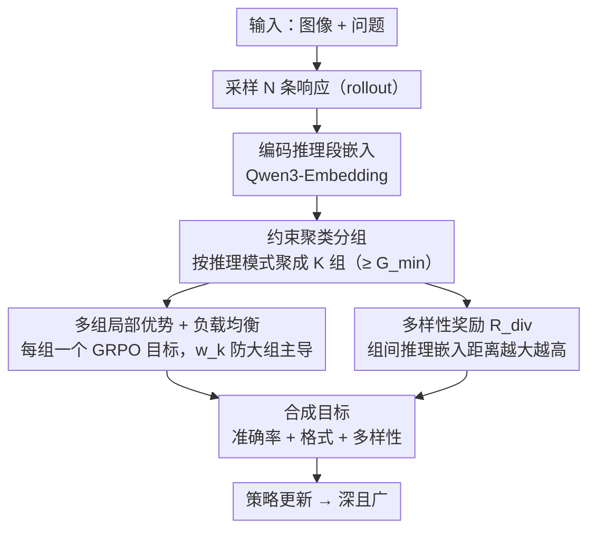

# MUPO: All Roads Lead to Rome - Incentivizing Divergent Thinking in Vision-Language Models

**会议**: CVPR 2026  
**arXiv**: [2604.00479](https://arxiv.org/abs/2604.00479)  
**代码**: [https://xytian1008.github.io/MUPO/](https://xytian1008.github.io/MUPO/)  
**领域**: LLM推理 / 多模态VLM  
**关键词**: 强化学习, GRPO, 发散思维, 推理多样性, 视觉语言模型

## 一句话总结

MUPO 揭示了 GRPO 训练导致推理多样性坍缩的问题——模型过早收敛到少数推理策略而丢弃大多数替代方案。通过将响应分组进行局部化优势估计并引入多样性奖励，MUPO 激励 VLM 保持发散思维，在多个推理基准上提升 2-7%。

## 研究背景与动机

RL（特别是 GRPO）已成为增强 VLM 推理能力的主流方法。但作者发现了一个关键矛盾：

**RL 模型深而窄，Base 模型浅而广**：RL 模型在单次尝试时准确率更高（推理更深入），但给多次尝试机会时，Base 模型能解决更多不同的问题（策略更多样）。例如几何题，RL 模型总是用方程求解（容易出逻辑错误），而 Base 模型有时会用验证式策略简洁地得到答案。

**多样性坍缩**：通过追踪 GRPO 训练过程，发现推理多样性在训练早期就急剧下降到可忽略水平。模型迅速收敛到少数"占优"策略，丢弃了大量潜在替代路径。这导致：(1) 利用优先于探索，陷入局部最优；(2) 扩展性差，收敛的推理无法覆盖广泛的问题类型。

## 方法详解

### 整体框架

MUPO（Multi-Group Policy Optimization）是 GRPO 的即插即用替代品，要治的是 GRPO 的"多样性坍缩"——训练几步后所有响应都挤到同一条推理策略上。它的思路一句话概括：对一道题采样 $N$ 条响应，先按**推理嵌入**用约束聚类把它们分成 $K$ 组（每组代表一种推理模式），再做两件事——**组内**各自局部估计优势、并用负载均衡权重防止大组主导（保证每种策略都被认真打磨 = 深度），**组间**加一个多样性奖励把不同组推开（保证维持多种策略 = 广度）。下面三个设计分别对应"怎么分组""怎么组内优化""怎么把组推开"。

### 关键设计

**1. 约束聚类分组：让每组代表一种推理模式**

MUPO 的第一步不是把响应随意均分，而是先用 Qwen3-Embedding 把每条响应的**推理段**编码成嵌入，再用**约束聚类**（constrained clustering）把轨迹相似的响应聚到一起，同时强制一个最小组大小 $G_{min}$ 保证每组样本够算出可靠的优势。这样分出来的 $K$ 组天然各自对应一种"推理模式"（比如几何题里的坐标法、相似三角形、面积法各聚成一组）。分组方式是后面"组内深耕、组间推开"的基础——只有先把不同策略归类，才谈得上分别优化与显式分离。

**2. 多组局部优势 + 负载均衡：别让一条策略淹没所有信号**

GRPO 在全部响应上算一个全局优势基线，结果是少数高奖励策略拿到极大优势值、其它策略的更新信号被压没——这正是坍缩的根源。MUPO 把目标写成 $K$ 个 GRPO 目标的加权和，每组是一块独立"试验田"：优势 $\hat{A}_i^k$ **在组内局部估计**，即便"坐标法"全局奖励最高，其它组仍按各自组内基线获得正常更新信号，不被全局主导策略碾压。同时引入负载均衡权重 $w_k=(N/(K|G_k|))^\beta$，让样本多的大组不会主导整个优化、小组也不被忽略。这一项管的是**深度**——保证每条策略都被充分打磨。

**3. 多样性奖励：把组与组真正推开**

光分组、组内优化还不够——若不加约束，各组可能仍收敛到相似策略。于是在准确率 + 格式奖励之外，再加一项**多样性奖励** $R_{div}$：对每条响应，计算它的推理嵌入与**其它所有组**响应嵌入的平均距离，距离越大奖励越高，逼着不同组代表真正不同的推理路径。这一项管的是**广度**，把"深度（组内充分优化）+ 广度（组间保持差异）"拼成发散思维的完整定义——不是简单生成不同答案，而是用不同方法思考同一题。

### 一个完整 walkthrough（解一道几何题，N=8、K=4）

1. **采样 + 聚类**：模型对同一题 rollout 出 8 条响应，按推理嵌入做约束聚类，恰好聚成 4 组——组 A 都走"坐标法"、组 B 走"相似三角形"、组 C 走"面积法"、组 D 走"辅助线"，每组对应一种推理模式。
2. **组内优势**：每组各自算局部优势——即便"坐标法"全局奖励最高，组 B/C/D 仍按各自组内基线获得正常更新信号，不被坐标法淹没；负载均衡权重再保证大组不会主导。
3. **组间多样性**：对每条响应计算它与其它三组响应嵌入的平均距离，距离大 → 多样性奖励高；若组 C 和组 D 思路趋同（嵌入贴近），该奖励变小，逼它们分化。
4. **合成梯度**：总奖励 = 准确率 + 格式 + 多样性，四种解法被同时强化。
5. **结果**：训练后模型 acc@1 高（每条策略都被打磨），acc@4 也高（保留了 4 种不同解法）——对比 GRPO 早期（<10% 训练步）就坍缩到只剩坐标法一条路。

这条链解释了为什么 MUPO 能"深且广"：组内优势管深、组间多样性管广，缺一项就退化回 GRPO 的"深而窄"或 base 模型的"浅而广"。

### 训练策略

标准 RL 流程，MUPO 仅替换 GRPO 作为策略优化算法。奖励 = 准确率奖励 + 格式奖励 + 多样性奖励。

## 实验关键数据

### 主实验

| 模型 | MathVerse | LogicVista | WeMath | HallusionBench | 平均提升 |
|------|-----------|-----------|--------|----------------|---------|
| GRPO 基线 | 基线 | 基线 | 基线 | 基线 | — |
| **MUPO-Thinker-7B** | +提升 | +提升 | +提升 | +提升 | **2~7%** |

在多个推理基准上一致提升 2-7%，建立新 SOTA。

### 消融实验

| 配置 | acc@1 | acc@4 | 多样性 | 说明 |
|------|-------|-------|--------|------|
| GRPO | 高 | 有限提升 | 低（坍缩） | 深而窄 |
| Base 模型 | 较低 | 大幅提升 | 高 | 浅而广 |
| MUPO | **最高** | **最高** | **高** | 深且广 |

### 关键发现

- acc@k 分析揭示了 RL 和 Base 模型的根本差异：k=1 时 RL 赢，k>1 时 Base 赢。这说明多样性本身就是一种能力
- GRPO 的多样性坍缩在训练极早期就发生（<10%训练步），说明这是算法层面的问题而非训练不足
- 多样性与准确率呈正相关——更多样的推理策略提高了找到正确答案的概率

## 亮点与洞察

- **发散思维 vs 收敛思维**：将心理学的发散/收敛思维概念引入 RL 训练，提供了理解 GRPO 局限性的新视角
- **多样性坍缩的诊断**：用嵌入距离量化推理多样性并追踪训练动态，是一种可复用的分析方法
- **acc@k 作为补充指标**：不仅看单次准确率，还看多次尝试能解决多少问题，这对评估推理模型更全面
- **即插即用替代 GRPO**：MUPO 可以直接替换 GRPO，不需要修改其他训练流程

## 局限与展望

- 分组数量 G 是超参数，最优值可能因任务而异
- 多样性奖励的权重需要调节，过大可能牺牲单路径准确率
- 当前主要验证在数学/逻辑推理任务，在其他任务（如开放式生成）的效果待验证
- 未来可探索自适应分组和动态多样性权重

## 相关工作与启发

- **vs GRPO/DeepSeekMath**: GRPO 追求深度推理但牺牲了广度，MUPO 同时保持两者
- **vs DAPO/GVPO**: 这些方法从采样角度优化 GRPO，但没有解决多样性坍缩问题
- **vs Best-of-N/Self-Consistency**: 这些是推理时扩展策略，MUPO 是训练时策略，两者可组合

## 评分

- 新颖性: ⭐⭐⭐⭐⭐ 对GRPO多样性坍缩的诊断和发散思维的引入非常有洞察力
- 实验充分度: ⭐⭐⭐⭐⭐ 行为分析+训练动态+多基准验证，非常全面
- 写作质量: ⭐⭐⭐⭐⭐ 分析深入，图示清晰，逻辑连贯
- 价值: ⭐⭐⭐⭐⭐ 对RL训练推理模型的方法论有重要贡献

<!-- RELATED:START -->

## 相关论文

- [\[CVPR 2026\] All Roads Lead to Rome: Incentivizing Divergent Thinking in Vision-Language Models](all_roads_lead_to_rome_incentivizing_divergent_thinking_in_vision-language_model.md)
- [\[CVPR 2026\] VisPlay: Self-Evolving Vision-Language Models](visplay_self-evolving_vision-language_models.md)
- [\[CVPR 2026\] TRivia: Self-supervised Fine-tuning of Vision-Language Models for Table Recognition](trivia_self-supervised_fine-tuning_of_vision-language_models_for_table_recogniti.md)
- [\[CVPR 2026\] MoE-GRPO: Optimizing Mixture-of-Experts via Reinforcement Learning in Vision-Language Models](moe-grpo_optimizing_mixture-of-experts_via_reinforcement_learning_in_vision-lang.md)
- [\[CVPR 2026\] R-4B: Incentivizing General-Purpose Auto-Thinking in MLLMs via Bi-Mode Annealing and Reinforce Learning](r-4b_incentivizing_general-purpose_auto-thinking_in_mllms_via_bi-mode_annealing_.md)

<!-- RELATED:END -->
