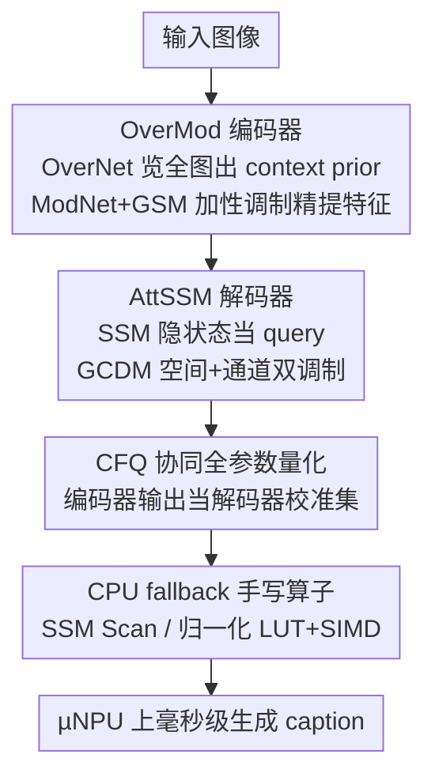

# µVLM: A Vision Language Model for µNPUs

**会议**: CVPR 2026  
**论文**: [CVF Open Access](https://openaccess.thecvf.com/content/CVPR2026/html/Chen_mVLM_A_Vision_Language_Model_for_mNPUs_CVPR_2026_paper.html)  
**代码**: 待确认  
**领域**: 多模态VLM  
**关键词**: µNPU, 端侧图像描述, 轻量 VLM, 状态空间模型, 硬件感知量化

> ⚠️ 论文原标题用希腊字母 µ（micro，微），即 **µVLM / µNPU**；stub 与 CVF 链接里写成 ASCII 的 "mVLM / mNPU" 是同一个东西，本笔记统一用 µ。

## 一句话总结
µVLM 是首个专为「µNPU」（MCU 级、mW 功耗、内存仅几十 MB 的微型神经处理单元）设计的视觉-语言模型，用全程 NPU 友好算子的 OverMod 编码器 + AttSSM 解码器替代不被硬件支持的自注意力，在 COCO Karpathy 上拿到 117.8 CIDEr 的同时，首次在 µNPU 上实现毫秒级 VLM 推理（TBT 21 ms、功耗 <300 mW）。

## 研究背景与动机

**领域现状**：智能眼镜、小型机器人等可穿戴/边缘设备越来越需要**端侧生成式 AI**（如图像描述帮助视障人士、幼教、动态场景发现），既保护隐私又免网络依赖。为此连低成本 MCU 都开始集成轻量 NPU——本文称之为 **µNPU**，它能在 mW 功耗下提供 GOPS 级算力（如 STM32N657：600 GOPS、4.2 MB SRAM）。

**现有痛点**：把 VLM 部到 µNPU 上有两道硬墙。① **内存极限**：µNPU 可用内存只有几十 MB（片上 SRAM 甚至只有几 MB），而 2015 年的早期 captioning 模型就 ~80 MB，现代 VLM 动辄上亿到上百亿参数；即便是面向手机的「轻量 VLM」，手机也比可穿戴多一到两个数量级的算力和内存。② **算子缺失**：µNPU 为卷积重度优化，**原生不支持 softmax、多头自注意力**等现代生成架构核心组件，直接堵死了 Transformer 路线；走目标检测路线又会因推理峰值 RAM 过大而不可行。

**核心矛盾**：性能提升的主流路径是「堆模型规模 + 用自注意力」，而这恰恰与 µNPU 的「内存极小 + 算子受限」两个约束正面冲突——既不能大，也不能用主流注意力。

**本文目标**：设计一个**编码器-解码器协同**的轻量 VLM，在 <32 MB 内存与受限算子集下完成实时图像描述，同时保持有竞争力的 captioning 质量。

**切入角度**：回到 CNN-解码器范式（Transformer 与检测器都不可行），但把「动态注意力」这件事用**全 NPU 兼容的算子**重新实现——既要动态自适应的表达力，又要全程硬件加速。

**核心 idea**：用「加性偏置调制」代替昂贵的核生成式动态卷积/自注意力（编码器 GSM、解码器 GCDM），把动态注意力的目标从高维卷积核张量降到低维偏置图，再配协同量化 + 手写 CPU 算子，让 VLM 第一次跑进 µNPU。

## 方法详解

### 整体框架
µVLM 是一条「图像 → 编码 → 解码出 caption」的 CNN-解码器流水线，但每个环节都围绕「µNPU 友好的轻量动态注意力」重做。输入图像先过 **OverMod 编码器**：它是「先览后看」的双分支结构，OverNet 快速扫全图产出粗粒度的全局语义先验（context prior），ModNet 在该先验引导下用 **GSM（全局空间调制）**自适应地精细提取特征；两者融合成一个 $(C,H,W)$ 张量送给解码器。**AttSSM 解码器**以 SSM（选择性状态空间模型）为核：每个时间步把 SSM 的隐状态 $h$ 当 query，用 **GCDM（全局上下文动态调制）**去调制编码器特征，调制结果投影后与词嵌入拼接喂回 SSM，逐 token 生成 caption（解码器还用 weight tying 把词嵌入矩阵与输出投影绑定以压缩+正则）。最后是**部署侧优化**：CFQ 协同全参数量化解决编解码器分离量化的精度错配，手写 CPU 算子补齐 SSM 等 µNPU 不支持的模块。

### 关键设计

**1. OverMod 编码器：先览后看的双分支 + GSM 加性调制**

针对「动态卷积自适应强但峰值 RAM 与 FLOPs 超 µNPU 上限」的痛点，OverMod 借仿生视觉「Overview-first, Look-Closely-next」原则做成双分支：**OverNet** 是由若干 Efficient Static（ES）块（残差 3×3 DWConv + Dilated RepConv + ConvFFN + Layer Scale）和下采样组成的快路径，迅速产出全局语义先验 context prior；**ModNet** 是深路径，拿 OverNet 第三阶段的 base feature，过 Efficient Dynamic（ED）块做精细感知，并由 context prior 作 top-down 信号生成输入相关参数。核心是 **GSM（Global Spatial Modulation）**——把 context prior 当 query，过一个由自适应平均池化（AAP）+ 逐点卷积（PConv）+ H-Swish 组成的轻量信号生成器产出动态偏置图 $\text{dyn\_bias}$，再用**加性**方式调制卷积特征（Value）：$\tilde{x}_{ij} = x_{conv,ij} + \text{dyn\_bias}_{ij}$。正偏置放大该位置激活（≈加注意力）、负偏置抑制，且故意不加 sigmoid 之类的有界激活以保留无界表达力。关键效率来自把调制目标从「整张卷积核张量」$P_{DynamicConv}=N\times C\times k^2$ 降到「低维偏置图」$P_{GSM}=C\times H\times W$：以 $C{=}192,N{=}256,k{=}7,H{=}W{=}7$ 为例，前者要生成 ~240 万参数、后者仅 ~9,400，**减少超 250×**；信号生成器计算量对空间 token 数 $L$ 线性 $O(L)$，避开了自注意力的 $O(L^2)$ 项。

**2. AttSSM 解码器：SSM + GCDM 空间/通道双调制**

针对「自回归生成开销大、且 µNPU 不支持自注意力」的痛点，解码器以**选择性 SSM（Mamba 式）**为核——它推理时内存常数、单 token 生成比 LSTM 省：LSTM 四个门控矩阵乘约 $8H^2$，SSM 约 $2rH^2+3HN$，在 $r{=}2,N{<}64$ 下化简为 $3N<4H$ 几乎恒成立。在 SSM 之上加 **GCDM（Global Context Dynamic Modulation）**做轻量注意力：把 SSM 隐状态当 context prior，先做空间调制 $x_{spatial}=x+\text{signal\_generator}(\text{context\_prior})$（与编码器同款加性偏置），再做 SE 式通道调制 $x_{final}=\sigma(\text{Conv}(\text{GAP}(\text{context\_prior})))\odot x_{spatial}$。相比标准 cross-attention 每步要拿单个 query 比对编码器全部 $N$ 个 token（$O(N\cdot H^2)$），GCDM 只用轻卷积与逐元素运算，复杂度降到约 $O(H^2)+O(H\cdot N)$，且每个算子都 µNPU 原生支持。

**3. CFQ 协同全参数量化：消除编解码器接口的精度错配**

针对「编码器、解码器被分成两个模型独立量化时，接口处分布漂移导致严重掉点」的痛点，本文提出 **CFQ（Coordinated Full-parameter Quantization）**：先用原始校准集量化编码器，再把原始数据过一遍量化后编码器，用其**输出当作解码器的新校准集**去量化解码器。这样解码器的量化参数对齐了它在端侧真正会收到的数据分布，从而抹掉编解码器分离部署时的精度断层——这是把双模型可靠落地的前提，而非可选项。

**4. CPU fallback 手写算子：补齐 µNPU 不支持的 SSM 等模块**

针对「SSM、GRN、LayerNorm 等模块 µNPU 无原生支持、走 CPU fallback 会成瓶颈」的痛点，本文为这些算子手写硬件感知的 C 实现（见下表）。工作流是：先写出数值正确的 C 基线（如 SSM Scan 递推 $h_t=\bar{A}h_{t-1}+\bar{B}x_t$），再做低层优化——离散化里的 $\exp()$ 用查找表（LUT）替代、SSM Scan 用 CMSIS-DSP/NN 与内联汇编吃 SIMD、归一化里的 $\sqrt{}$ 与除法换成定点算法；最后把优化后的 C 函数填进 STM32Cube.AI 为未知算子生成的「custom layer stub」，用 JSON 配置定义每层签名把 ONNX 图正确链接到 C 实现。正是这套手写算子让 AttSSM 解码器（21 ms）反而比 LSTM+Bahdanau 基线（32 ms）更快。

### 损失函数 / 训练策略
四阶段渐进训练：① 在 ImageNet-1K 上预训练 OverMod 编码器，OverNet 输出接辅助分类头，损失 $L=L_{final}+\lambda_{aux}\cdot L_{aux}$ 鼓励两分支都学到有意义特征；② 冻结编码器，在 COCO Karpathy 训练集上训 AttSSM 解码器；③ 解冻编码器端到端微调整个 µVLM；④ 再冻编码器、用 SCST 以 CIDEr 当强化学习奖励微调。评测用 beam size 3 的 beam search，词表剪掉出现 <5 次的词。

## 实验关键数据

### 主实验
COCO Karpathy 测试集上与轻量 VLM 基线对比。µVLM-b 在仅 **29.6 MB**、全程算子被 µNPU 支持且做了硬件感知设计的前提下，CIDEr 达 117.8，逼近体积大十几倍的 SmallCap（872 MB / 121.8）：

| 模型 | 大小(MB) | 算子支持 | 硬件感知 | BLEU-4 | METEOR | SPICE | CIDEr |
|------|----------|----------|----------|--------|--------|-------|-------|
| SmallCap | 872 | 否 | 否 | 28.3 | 21.5 | — | 121.8 |
| RFNet | ~500 | 是 | 否 | 27.7 | 21.1 | — | 121.9 |
| Up-Down | ~400 | 是 | 否 | 27.7 | 21.4 | — | 120.1 |
| NIC | ~80 | 是 | 否 | 28.6 | 23.8 | 17.7 | 92.0 |
| **µVLM-b** | **29.6** | 是 | 是 | 36.1 | 26.9 | 20.8 | **117.8** |
| µVLM-s | 21.2 | 是 | 是 | 32.2 | 25.7 | 19.1 | 109.1 |
| µVLM-t | 13.8 | 是 | 是 | 29.4 | 24.4 | 18.2 | 96.4 |

编码器 OverMod 在 ImageNet-1K（224×224）上也很能打：OverMod-t 仅 5.2M 参数即达 79.2% Top-1，与两倍大的模型相当；OverMod-b 18.1M 达 82.4%。

### 消融实验
µVLM 各组件对 CIDEr 的逐项贡献（Table 6）：

| 配置 | CIDEr | 说明 |
|------|-------|------|
| 仅动态卷积 | 95.5 | 基线 |
| + 多尺度融合 | 101.4 | +5.9 |
| + 空间调制 | 107.1 | +5.7 |
| + 通道调制（完整 µVLM） | 117.8 | 再 +10.7，四件套齐全最高 |

编码器 OverMod 消融（Table 4）：ED 块、Dilated RepConv、GRN、Layer Scale 逐项加分到 79.2%；但**给 OverNet/ModNet 加 SE 通道注意力反而掉到 79.0%**——因为 SE 的通道注意力与 OverMod 的动态调制功能冗余且冲突。

### 关键发现
- **同一个 SE/通道调制在编码器有害、在解码器有益**：编码器里 SE 与动态调制冗余冲突（掉点），但解码器 GCDM 里通道调制带来 +10.7 CIDEr——作者归因于解码器自回归结构缺复杂卷积，通道调制此时能与空间调制协同细化每步特征。
- **AttSSM 比 LSTM 更快**：在 STM32N657 上 AttSSM 解码器 21 ms、LSTM+Bahdanau 32 ms，且 SSM 内存常数，证明轻量注意力 + 硬件友好算子的组合有效。
- **首次在 µNPU 上跑通毫秒级 VLM**：TTFT 208 ms、TBT 21 ms、功耗 <300 mW，全部满足端侧实时生成的约束。

### 部署侧（STM32N657，4.2 MB SRAM / 600 GOPS）
| 组件 | 大小(MB) | 延迟(ms) | 功耗 |
|------|----------|----------|------|
| OverMod-b 编码器 | 21.4 | 187 | <300 mW |
| AttSSM 解码器 | 8.2 | 21 | <300 mW |
| LSTM(Bah Atten) 基线 | 9.3 | 32 | — |

## 亮点与洞察
- **把动态注意力的代价从「生成卷积核」降到「生成偏置图」**：GSM 用加性偏置 $\tilde{x}=x_{conv}+\text{dyn\_bias}$ 把参数量从 $N\cdot C\cdot k^2$ 降到 $C\cdot H\cdot W$（实测 >250×），是「想要动态自适应又受不了核生成开销」场景的可复用 trick。
- **不加有界激活反而更好**：GSM 故意省掉 sigmoid 让偏置无界，换更强表达力——与常见「注意力权重必须归一化」直觉相反，值得借鉴。
- **CFQ 的「用前级输出当后级校准集」**：解决任何「分模块独立量化导致接口分布漂移」问题的通用思路，不限于 VLM。
- **算子级硬件工程很扎实**：LUT 替 exp、SIMD 吃 SSM Scan、定点替 sqrt/除法，再用 STM32Cube.AI 的 custom stub + JSON 签名链接——给「在受限工具链上落地非标准算子」提供了完整范式。

## 局限与展望
- **任务面窄**：只验证了图像描述（captioning）这一项，作者明确把大规模预训练与零样本/免训练能力留作未来工作，当前不是通用 VLM。
- **依赖特定工具链与芯片**：算子工程深度绑定 STM32Cube.AI / STM32 平台，换其他 µNPU（MAX78000、Himax WE2 等）需重做 CPU fallback 算子，迁移成本不低。
- **CIDEr 仍低于不受约束的大模型**：µVLM-b 的 117.8 略低于 SmallCap 的 121.8、I-Tuning 的 119.4，是「换内存/算子合规」付出的质量代价，差距虽小但存在。
- **编码器仍占大头**：OverMod-b 编码器 21.4 MB、187 ms，是整体延迟与体积的主要来源；进一步压缩编码器是明显的改进方向。

## 相关工作与启发
- **vs NIC / Up-Down（经典 captioning）**: NIC 确立 CNN-LSTM 编解码范式但 ~80 MB；Up-Down 引入检测器区域特征把参数推过亿、峰值 RAM 超 µNPU 上限。µVLM 回到 CNN-解码器但用 SSM + 轻量动态注意力，做到既小又合规。
- **vs SmallCap / I-Tuning / LightCap（轻量 VLM）**: 它们面向手机量级（约 1 GB 或多模型流水线），且多用不被 µNPU 支持的算子或易受量化精度错配影响；µVLM 是首个从算子层就对齐 µNPU 约束的设计。
- **vs Transformer/mPLUG 路线**: 多头自注意力在 µNPU 上无原生支持也无高效 CPU fallback，直接不可行；µVLM 用 GSM/GCDM 的加性+通道调制近似注意力效果，复杂度更低且全程硬件加速。
- **vs 标准动态卷积 [29]**: 概念相近但 [29] 非硬件感知，用了 µNPU 不支持的算子且峰值 RAM 超限；µVLM 的 GSM 把核生成换成偏置图生成，复杂度与内存都大幅下降。

## 评分
- 新颖性: ⭐⭐⭐⭐⭐ 首个面向 µNPU 的 VLM，GSM/GCDM 把动态注意力降到偏置图级别是实打实的新设计。
- 实验充分度: ⭐⭐⭐⭐ 编码器/整模型双层消融 + 真机部署延迟功耗齐全，但任务仅限 captioning、未做多任务或零样本。
- 写作质量: ⭐⭐⭐⭐ 动机与算子工程交代细致、公式清楚；µ 与 ASCII m 混用、部分图依赖原文 Figure 略增阅读成本。
- 价值: ⭐⭐⭐⭐⭐ 首次在 mW 级 µNPU 上跑通毫秒级 VLM，为可穿戴/小机器人端侧生成式 AI 打开了工程可行性。

<!-- RELATED:START -->

## 相关论文

- [\[CVPR 2026\] RE-VLM: Event-Augmented Vision-Language Model for Scene Understanding](re-vlm_event-augmented_vision-language_model_for_scene_understanding.md)
- [\[CVPR 2026\] G$^2$VLM: Geometry Grounded Vision Language Model with Unified 3D Reconstruction and Spatial Reasoning](g2vlm_geometry_grounded_vision_language_model_with_unified_3d_reconstruction_and.md)
- [\[CVPR 2026\] TimeViper: A Hybrid Mamba-Transformer Vision-Language Model for Efficient Long Video Understanding](timeviper_a_hybrid_mamba-transformer_vision-language_model_for_efficient_long_vi.md)
- [\[CVPR 2026\] VL-RouterBench: A Benchmark for Vision-Language Model Routing](vl-routerbench_a_benchmark_for_vision-language_model_routing.md)
- [\[CVPR 2026\] Enhancing Video Vision Language Model with Hippocampal Sensing](enhancing_video_vision_language_model_with_hippocampal_sensing.md)

<!-- RELATED:END -->
