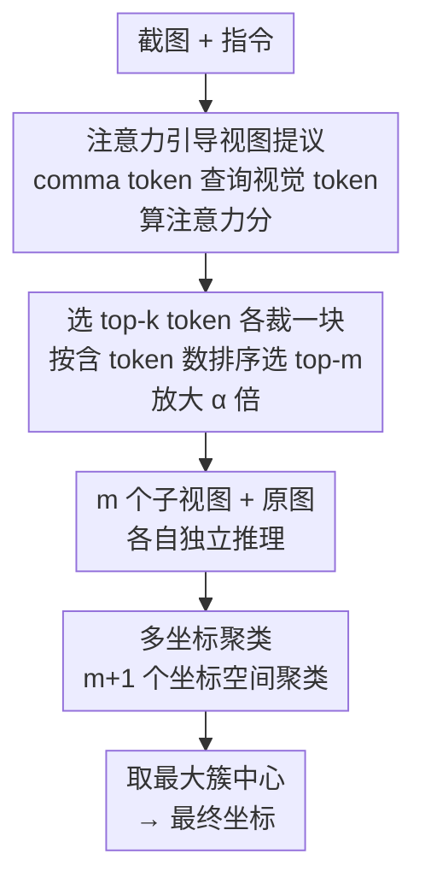

# MVP: Multiple View Prediction Improves GUI Grounding

**会议**: CVPR 2026  
**论文**: [CVF Open Access](https://openaccess.thecvf.com/content/CVPR2026/html/Zhang_MVP_Multiple_View_Prediction_Improves_GUI_Grounding_CVPR_2026_paper.html)  
**代码**: https://github.com/ZJUSCL/MVP （有）  
**领域**: 多模态VLM / GUI Agent  
**关键词**: GUI定位、多视图推理、免训练、注意力裁剪、坐标聚类

## 一句话总结
针对 GUI 定位模型「截图轻微扰动就让坐标预测剧烈跳变」的不稳定性，提出免训练的 MVP 框架：用指令-视觉注意力裁出多个子视图各自独立预测，再把这些坐标做空间聚类、取最大簇中心作为最终输出，在 ScreenSpot-Pro 上把 Qwen3VL-32B 从 55.3 拉到 74.0。

## 研究背景与动机
**领域现状**：GUI grounding（定位）要把自然语言指令翻译成屏幕上的像素坐标（如「保存为特定格式」→ `(1843,532)`），是 GUI agent 落地的底座。主流做法是把它当成一个生成任务：基于大视觉语言模型（LVLM），让模型把坐标当成文本 token 直接吐出来（`x=123, y=456`），靠 SFT / RL 在大量 GUI 截图上训练。

**现有痛点**：作者发现这些模型存在严重的**预测不稳定性**——给截图加一圈仅 28 像素的黑边（远小于图像分辨率），同一个模型对同一张图的坐标预测就会发生剧烈漂移，平均偏移高达 193 像素，远超 ScreenSpot-Pro 里典型 UI 元素的尺寸。更要命的是这种漂移直接换算成精度损失：在两次预测里只要有一次对就算对（pass@2）时准确率有 57.5%，而单次预测只有 49.8%——这 7.7 个点的差距说明模型**本来有能力定位**，只是单视图推理没把这份能力稳定地释放出来。

**核心矛盾**：作者进一步拆解发现不稳定性会随两个因素急剧放大——**高分辨率截图**和**小尺寸目标**。原因一方面在架构：RoPE 在高分辨率上做位置外推时，位置索引超出训练分布，微小空间变化就让 token 序列天差地别；视觉投影器把视觉特征压成 token 时又会丢掉细粒度空间信息，让小目标更难被准确感知。另一方面在数据：当前训练集里高分辨率截图和小 UI 元素样本太少，测试时泛化不足。

**本文目标**：在**不重新训练、不依赖外部 agent 反馈**的前提下，把模型「偶尔能预测对」这个潜力稳定地兑现出来。

**切入角度**：既然单视图不可靠、但模型有时能对，那么把多个视图的预测**聚合**起来，就有机会用「多数一致」把正确坐标从离群点里分离出来。预实验也佐证了这点：从原截图随机裁出多个含目标框的 1280×720 子区域分别推理，pass@N 随视图数单调上升。

**核心 idea**：用「多视图独立预测 + 空间聚类投票」代替「单视图一锤定音」——正确预测会聚在目标框附近形成密集簇，错误预测则四散，取最大簇的中心即可滤掉离群点。

## 方法详解

### 整体框架
MVP 是一个完全免训练的推理期框架，输入是一张 GUI 截图 + 一条用户指令，输出一个像素坐标，中间不改模型权重、只改「怎么喂图、怎么聚合输出」。它由两个串行模块组成：先用 **Attention-Guided View Proposal** 借助指令到视觉 token 的注意力，裁出 $m$ 个大概率包含目标、且分辨率被降低、小目标被放大的子视图；再用 **Multi-Coordinate Clustering** 让模型对这 $m$ 个视图加上原图共 $m+1$ 次独立推理，把得到的 $m+1$ 个坐标做空间聚类，取最大簇中心作为最终预测。前者解决「单张高分辨率全图喂不好」，后者解决「单次预测不稳」。

### 关键设计

**1. Attention-Guided View Proposal：用注意力告诉裁剪框该去哪**

直接把高分辨率全图喂给模型既不稳又看不清小目标；但盲目随机裁又可能裁不到目标。MVP 的做法是借 LVLM 自身「中深层注意力能定位指令相关区域」的能力来引导裁剪。具体分三步：**第一步算注意力分**——用预测坐标格式里的居中逗号 token `","` 作为 query（作者发现逗号 token 的区域定位性能最好），视觉 token 作为 key，算交叉注意力 $A=\mathrm{Softmax}\!\left(\frac{T_{\text{comma}}V^{T}}{\sqrt{d}}\right)$，再对所有注意力头求平均得到每个视觉 token 的分数 $\text{scores}=\frac{1}{H}\sum_{i=1}^{H}A[i,:]$。**第二步选候选区**——取分数最高的 top-$k$ 个视觉 token（实验里 $k=100$），围绕每个 token 对应的 patch 中心 $(x_i,y_i)$ 裁一个 $h\times w$ 的子区域 $R_i=\mathrm{Crop}(I,x_i-\frac{w}{2},y_i-\frac{h}{2},w,h)$，得到 $k$ 个候选。**第三步排序与放大**——按「区域内落入了多少个 top-$k$ token 中心」给候选打分 $\text{rank}(R_i)=\sum_{j=1}^{k}\mathbb{I}[(x_j,y_j)\in R_i]$，含 token 越多越可能套住目标框，取 top-$m$ 个区域，再各放大 $\alpha>1$ 倍（实验里 1280×720 放大到 2560×1440，即 2×）：$R_i^{\text{resized}}=\mathrm{Resize}(R_i,\alpha h,\alpha w)$。放大这一步直接针对「小目标更不稳」的诊断——把小 UI 元素拉大，模型才看得清。

**2. Multi-Coordinate Clustering：用空间共识把对的坐标投出来**

有了 $m$ 个视图后，逐个加上原图独立推理，拿到 $m+1$ 个坐标预测。关键洞察是：正确预测都会落在目标框内、彼此空间一致；错误预测则随机散开。于是用基于距离的聚类把一致的坐标抱团——两点距离 $d(p_i,p_j)=\sqrt{(x_i-x_j)^2+(y_i-y_j)^2}$，用一个贪心的「种子 + 阈值吸附」过程（阈值 $\tau=14$ 像素）反复把离当前簇心不超过 $\tau$ 的点并进来，直到簇不再增长，遍历所有点形成若干簇。最终取**最大簇**的中心为预测：$G^{*}=\arg\max_{G_k}|G_k|$，$(x_{\text{final}},y_{\text{final}})=\frac{1}{|G^{*}|}\sum_{p_i\in G^{*}}p_i$。当出现多个并列最大簇时，回退到第 1 个模块的注意力排序做决断——选「簇内各点对应裁剪区累计含最多 top-$k$ token」的那个簇 $G^{*}=\arg\max_{G_k\in G}\sum\text{rank}(R_i)$。这一聚合是 MVP 稳定性的来源：它不靠任何一次预测，而靠「多次预测在哪儿达成空间共识」。

**3. 两条性质：训练-free + 并行避免误差累积**

值得单独点出 MVP 区别于同类方法的两条机制性质。其一，整套流程不动模型权重、不需任何外部 agent 反馈，纯推理期即插即用，因此能直接套在 UI-TARS、GTA1、Qwen3VL 等各种现成定位模型上。其二，与「迭代放大（Iterative Zoom-in）」这类把定位拆成多步决策、逐步缩小区域的串行方法不同——串行方法一旦早期某步裁错，错误会沿后续阶段累积——MVP 采用**并行多视图 + 聚类**：各视图彼此独立预测，互不污染，再用投票化解分歧，从机制上规避了误差传播；相比纯注意力法（直接输出注意力最高 patch 的中心、强依赖注意力精度且跨指令泛化差），MVP 保留了标准文本生成范式，泛化性更好。

### 损失函数 / 训练策略
无训练。MVP 是纯推理期框架，不引入任何可学习参数、不做微调。关键超参：视图尺寸 $(h,w)=1280\times720$ 再放大到 2560×1440；视图数 $m=4$（GTA1-7B、UI-TARS-1.5-7B）或 $m=2$（Qwen3VL-8B/32B）；top-$k=100$ 个视觉 token；K-means 阈值 $\tau=14$ 像素；注意力取自语言模型第 20 层（GTA1-7B、UI-TARS-1.5-7B）、第 24 层（Qwen3VL-8B）、第 48 层（Qwen3VL-32B）。对低于 720P 的截图改用加 28 像素黑边的方式生成视图。

## 实验关键数据

### 主实验
评测在三个高难度 GUI 定位基准上：ScreenSpot-Pro（高分辨率专业软件截图）、UI-Vision（83 个应用 6 个领域的密集指代）、OS-World-G（564 张真实 OS 交互截图）。ScreenSpot-Pro 上 MVP 对四个不同架构/规模的模型都带来一致且可观的提升：

| 模型 | ScreenSpot-Pro Overall | + MVP | 提升 |
|------|------|------|------|
| UI-TARS-1.5-7B | 41.9 | 56.1 | +14.2 |
| GTA1-7B | 49.8 | 61.7 | +11.9 |
| Qwen3VL-8B-Instruct | 55.0 | 65.3 | +10.3 |
| Qwen3VL-32B-Instruct | 55.3 | **74.0** | +18.7 |

其中 Qwen3VL-32B + MVP 的 74.0 刷新了榜单，超过所有现有开源与闭源模型（含 UI-TARS-1.5 的 61.6、Seed1.5-VL 的 60.9）。提升在 OS-World-G 上较小（如 GTA1-7B 仅 67.5→68.7、Qwen3VL-32B 71.7→72.0），作者解释这是因为 OS-World-G 分辨率较低（720P/1080P），本身不稳定性小、提升空间有限——这一解释与「不稳定性随分辨率放大」的诊断自洽。UI-Vision 上四个模型平均提升 +3.4～+7.7，Qwen3VL-32B + MVP 以 44.1 反超 72B 的 UI-Venus-Ground-72B（36.8）。

### 消融实验
三组消融均在 ScreenSpot-Pro / GTA1-7B 上做，逐一验证每个设计的必要性：

| 配置 | SS-Pro Avg. | 说明 |
|------|---------|------|
| 单张全图基线 | 49.8 | 不做任何处理 |
| 视图提议：Border Padding | 57.3 | 仅加黑边造视图 |
| 视图提议：Attention-Guided（本文） | 61.7 | 注意力引导裁剪，比加黑边再 +4.4 |
| 聚合：坐标平均 | 46.6 | **比基线还低** |
| 聚合：随机选一个 | 55.7 | 比基线高，但弱于聚类 |
| 聚合：多坐标聚类（本文） | 61.7 | 空间共识，最优 |
| 视图不放大 | 59.1 | 去掉 2× resize |
| 视图放大（本文） | 61.7 | resize 贡献 +2.6 |

### 关键发现
- **聚合方式是成败关键**：直接对所有坐标取平均（46.6）反而比单图基线（49.8）更差——因为离群点会把平均拉偏；随机选一个（55.7）已经因为多视图本身更好而高于基线；只有聚类取最大簇（61.7）才真正兑现多视图的潜力。这说明 MVP 的核心不是「多裁几张图」，而是「用空间共识滤离群」。
- **注意力引导显著优于盲目加边**：Attention-Guided（61.7）比 Border Padding（57.3）高 4.4 点，证明「裁哪里」要靠注意力而非随机扩边。
- **放大小目标确有用**：2× resize 贡献 +2.6 点，与「小目标更不稳」的诊断闭环。
- **视图数并非越多越好**：增加视图数不能持续涨点，因为不同视图的预测倾向于聚在几个固定位置，加更多视图对最终聚类结果影响有限，反而徒增推理耗时——这也解释了为何默认 $m$ 只取 2～4。

## 亮点与洞察
- **把"模型不行"重新诊断成"模型不稳"**：作者用一个极简扰动实验（加 28 像素黑边）配合 pass@2 与单次精度的 7.7 点差，干净地证明了模型其实有定位能力、只是单视图释放不出来。这个视角的转换比任何复杂方法都更有说服力，是全文最"啊哈"的地方。
- **免训练 + 即插即用**：MVP 不碰权重、不要外部反馈，能直接挂到任意现成定位模型上稳定涨点（四个模型一致提升），工程落地成本极低。
- **用模型自己的注意力当"裁剪导航"**：拿坐标格式里的逗号 token 当 query 去定位目标区域，是把 LVLM 内部信号反向利用来指导输入构造，这个 trick 可迁移到其他需要 ROI 提议的视觉-语言任务（如高分辨率文档/图表问答的区域聚焦）。
- **并行投票优于串行放大**：相比迭代 zoom-in 会误差累积，MVP 的并行多视图 + 聚类从机制上避免了错误传播，这是一个值得在「需要多步搜索」的任务里借鉴的范式选择。

## 局限与展望
- **推理成本翻倍**：要对 $m+1$ 个视图各跑一次模型，推理开销随视图数线性增长；作者也承认视图数加多收益饱和却更慢，实际是用算力换稳定性。
- **依赖注意力可定位**：视图提议建立在「中深层注意力能对齐指令-区域」的假设上，需要为不同模型手工选层（第 20/24/48 层），对注意力本身就很弱或不可取的模型可能失效。
- **超参与任务相关**：$\tau=14$ 像素、视图尺寸、放大倍率等都按当前基准调好，换到分辨率分布差异大的场景可能要重调；低分辨率场景（OS-World-G）增益本就有限。
- **可改进方向**：能否自适应决定视图数（按聚类是否已收敛早停）以省算力，或用更轻量的单次前向近似多视图共识，是降低成本的自然方向。

## 相关工作与启发
- **vs 迭代放大（Iterative Zoom-in）**：它们把定位拆成多步决策、逐步缩小区域，依赖 agent 执行反馈或模型自身推理，缺点是早期裁错会沿后续阶段累积、且常需额外训练/反馈；MVP 是并行多视图 + 聚类，免训练、无外部反馈，机制上规避误差传播。
- **vs 纯注意力定位法**：它们直接取注意力最高 patch 的中心当坐标，强依赖注意力精度、跨指令泛化差；MVP 只把注意力用于"提议裁哪里"，最终坐标仍走标准文本生成，泛化更稳。
- **vs Border Padding（本文消融基线）**：单纯加黑边造视图能涨（57.3）但不如注意力引导（61.7），说明"造多视图"只是必要条件、"造对视图"才是关键。

## 评分
- 新颖性: ⭐⭐⭐⭐ 把 GUI 定位失败重新诊断为"预测不稳定"并用免训练多视图聚类化解，视角和方案都干净有力。
- 实验充分度: ⭐⭐⭐⭐ 三个基准 × 四个模型一致涨点，三组消融逐一拆开每个设计，证据链完整。
- 写作质量: ⭐⭐⭐⭐ 诊断—假设—方法—验证的逻辑链清晰，图表与正文数据自洽。
- 价值: ⭐⭐⭐⭐ 免训练即插即用、对现成定位模型直接涨点，对 GUI agent 落地实用性强。

<!-- RELATED:START -->

## 相关论文

- [\[CVPR 2026\] DRS-GUI: Dynamic Region Search for Training-Free GUI Grounding](drs-gui_dynamic_region_search_for_training-free_gui_grounding.md)
- [\[CVPR 2026\] VGent: Visual Grounding via Modular Design for Disentangling Reasoning and Prediction](vgent_visual_grounding_via_modular_design_for_disentangling_reasoning_and_predic.md)
- [\[CVPR 2026\] GUI-SAGE: Enhancing GUI Automation with Self-Explanatory Learning](gui-sage_enhancing_gui_automation_with_self-explanatory_learning.md)
- [\[ICML 2026\] Learning GUI Grounding with Spatial Reasoning from Visual Feedback](../../ICML2026/multimodal_vlm/learning_gui_grounding_with_spatial_reasoning_from_visual_feedback.md)
- [\[CVPR 2026\] Concept-Aware Batch Sampling Improves Language-Image Pretraining](concept-aware_batch_sampling_improves_language-image_pretraining.md)

<!-- RELATED:END -->
