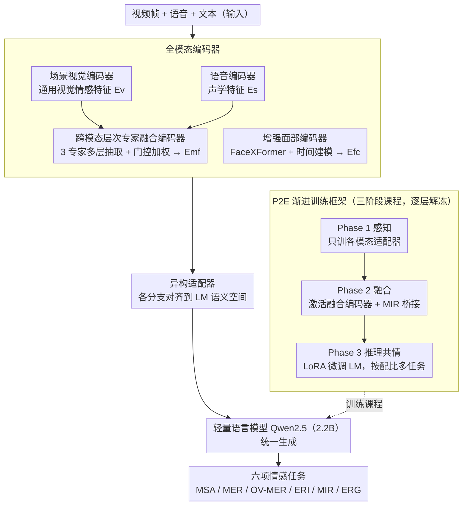

# Nano-EmoX: Unifying Multimodal Emotional Intelligence from Perception to Empathy

**会议**: CVPR 2026  
**arXiv**: [2603.02123](https://arxiv.org/abs/2603.02123)  
**代码**: [https://github.com/waHAHJIAHAO/Nano-EmoX](https://github.com/waHAHJIAHAO/Nano-EmoX)  
**领域**: 多模态VLM  
**关键词**: 情感计算, 多模态语言模型, 认知层次, 情绪识别, 共情交互

## 一句话总结
Nano-EmoX 提出认知启发的三级情感任务层次（感知→理解→交互），是首个以2.2B紧凑参数统一六项核心情感任务的多模态语言模型，通过P2E渐进式训练框架从基础感知逐步培养到高层共情能力。

## 研究背景与动机
1. **领域现状**：情感多模态语言模型（MLM）的发展受限于低层感知与高层交互之间的鸿沟，导致情感能力碎片化和泛化有限。
2. **现有痛点**：（i）现有模型多为单一层次专家——要么做感知（情绪识别），要么做理解（原因推理），要么做交互（共情回复），缺乏统一；（ii）模型规模大（7-9B），实际部署困难。
3. **核心矛盾**：情感智能是从感知到共情的连续谱，但现有方法将其割裂为独立任务，缺乏跨层次知识迁移。
4. **本文目标**：设计紧凑的统一模型（<3B参数），跨越感知-理解-交互三个认知层次完成六项核心情感任务。
5. **切入角度**：受感知-行动模型启发，按认知深度组织情感任务，从低到高渐进式训练。
6. **核心idea**：全模态编码器（增强面部编码器+融合编码器）+ P2E渐进训练框架（感知→融合→多任务指令微调）。

## 方法详解

### 整体框架
Nano-EmoX 要解决的是「一个紧凑模型同时做完整的情感链路」这件事：从认出表情、听出语气，到推理情绪原因、生成共情回复，过去往往要靠多个专精模型分别完成。它的做法是把四个模态分支（场景视觉、面部、语音、融合）各自编码后，经异构适配器对齐到同一语义空间，再喂给一个仅 2.2B 的轻量语言模型（Qwen2.5）统一生成答案。所有交互都被改写成「指令 + 多模态输入 → 文本输出」的形式，因此六项任务——多模态情感分析(MSA)、多模态情绪识别(MER)、开放词汇 MER(OV-MER)、情绪原因推理(ERI)、多模态意图识别(MIR)、共情回复生成(ERG)——共享同一套参数，知识可以跨层次迁移。而这套统一模型并非一次性混训得来，而是由 P2E 渐进训练框架按「感知→融合→推理共情」的认知顺序、逐层解冻地一步步培养出来。其中面部编码器与融合编码器是为情感线索专门设计的两个贡献模块，P2E 则决定了它们如何被训练。

### 关键设计

**1. 增强面部编码器：让模型读懂随时间变化的细微表情**

面部表情是情感感知里信息密度最高的视觉线索，但通用视觉编码器（如 SigLIP）只看整帧语义，抓不住嘴角、眉头这类细粒度变化，也不会建模一段视频里表情如何起伏。这里换上专门的 FaceXFormer 从视频帧抽多尺度面部特征 $E_f$，再用一个时间建模模块把帧间动态显式接回来：用一组可学习的时间查询 token 作为 $Q$，对面部特征做交叉注意力 $E_f^c = \text{CrossAttention}(Q, E_f^K, E_f^V)$，最后经两层全连接对齐到语言模型维度。这样得到的是「身份无关、只关情绪」的表征——同一张脸的微笑和皱眉被区分开，而不同人的同种表情被拉近。

**2. 跨模态层次专家融合编码器：按任务深度自适应地融合视听信息**

视觉和语音携带互补的情感信号，但难点在于不同任务想要的「融合层次」并不一样——判断音调高低靠的是底层声学特征，推理一句话背后的情绪则要高层语义。固定一种融合方式必然顾此失彼。这里设三个权重独立的融合专家，分别在视觉与语音编码器的不同深度抽特征（语音第 16/18/22 层、视觉第 12/16/22 层）做交叉注意力，得到三路融合结果 $E_{mf}^i$；再由一个门控网络按当前输入动态分配三者权重：

$$E_{mf} = G_1 \odot E_{mf}^1 + G_2 \odot E_{mf}^2 + G_3 \odot E_{mf}^3$$

于是低层任务自动偏向浅层专家、高层任务偏向深层专家，融合方式随任务自适应，而不是一刀切。

**3. P2E 渐进训练框架：按认知发展规律从感知一步步养到共情**

情感智能本质是从感知到共情的连续谱，若一上来就把六个任务混在一起多任务训练，模型还没建立感知基础就被逼着学高层推理，容易学崩。P2E（Perception-to-Empathy）把训练拆成三段课程，逐层解冻。Phase 1 只训各模态适配器打地基——视觉与面部在 FERV39K/CAER 上对齐、语音在 CREMA-D/M3ED 上对齐；Phase 2 激活并训练融合编码器，在 MIntRec/MIntRec2.0 上学跨模态融合，这一步把「意图识别」放在感知与推理之间当桥梁，因为推断意图本就需要综合多模态线索；Phase 3 才解冻 LoRA 微调语言模型，按一份调好的数据配比（MER:OV-MER:MIR:ERI:ERG = 18:28:5:31:18）同时训练全部六项任务。这条「先感知、再融合、后推理共情」的路径，正是模型能用 2.2B 撑起六项任务的关键。

### 损失函数 / 训练策略
三阶段统一用最大似然目标 $\theta^{MLE} = \arg\max_\theta \sum \log P(Y|T;\theta)$，区别只在每一阶段解冻哪些模块（适配器 → 融合编码器 → LoRA+LM），其余冻结，从而把感知、融合、推理能力分层注入。

## 实验关键数据

### 主实验

| 任务 | Nano-EmoX (2.2B) | AffectGPT (8.3B) | EmoLLMs (7B) | 说明 |
|------|-----------------|------------------|-------------|------|
| MSA | 有竞争力 | SOTA | - | 隐式学习 |
| MER | SOTA/竞争力 | 次优 | 次优 | 核心感知任务 |
| OV-MER | SOTA | 次优 | N/A | 开放词汇 |
| ERI | SOTA/竞争力 | 次优 | N/A | 原因推理 |
| MIR | SOTA | N/A | N/A | 意图识别 |
| ERG | SOTA/竞争力 | N/A | N/A | 共情回复 |

### 消融实验

| 配置 | 关键指标 | 说明 |
|------|---------|------|
| Full Nano-EmoX | 最优 | 完整框架 |
| w/o 面部编码器 | 下降 | 面部线索对情绪感知重要 |
| w/o 融合编码器 | 下降 | 跨模态融合有效 |
| w/o P2E (直接多任务) | 显著下降 | 渐进训练很关键 |

### 关键发现
- 2.2B参数即可在六项任务上匹配或超越7-9B模型，证明了架构效率和训练策略的有效性。
- P2E渐进训练比直接多任务训练提升显著，说明认知层次的课程设计有价值。
- 面部编码器对情绪感知的贡献大于通用视觉编码器的增强。

## 亮点与洞察
- **三级认知层次**的框架不仅是任务组织方式，更是训练策略的指导原则。
- **首次以<3B参数统一六项情感任务**，在效率和能力间取得了出色平衡。
- **意图识别作为感知-推理桥梁**的Phase 2设计有理论基础——意图推理需要跨模态综合。

## 局限与展望
- 小模型在复杂推理任务上可能仍逊于大模型。
- 训练数据主要覆盖英语/中文，多语言泛化未验证。
- MSA任务未显式训练而是隐式从相关任务中获取，可能不够最优。

## 相关工作与启发
- **vs AffectGPT**: 8.3B参数支持四项任务，Nano-EmoX以2.2B支持六项且性能相当或更优。
- **vs EmoLLMs**: 仅做文本级情感任务，Nano-EmoX扩展到完整的多模态情感智能。

## 评分
- 新颖性: ⭐⭐⭐⭐ 认知层次框架和P2E训练策略有新意
- 实验充分度: ⭐⭐⭐⭐⭐ 六项任务全面评测，消融深入
- 写作质量: ⭐⭐⭐⭐ 框架清晰，认知理论基础扎实
- 价值: ⭐⭐⭐⭐⭐ 紧凑高效的统一情感AI，实际部署价值高

<!-- RELATED:START -->

## 相关论文

- [\[CVPR 2026\] Downscaling Intelligence: Exploring Perception and Reasoning Bottlenecks in Small VLMs](downscaling_intelligence_exploring_perception_and_reasoning_bottlenecks_in_small.md)
- [\[CVPR 2026\] Scaling Spatial Intelligence with Multimodal Foundation Models](scaling_spatial_intelligence_with_multimodal_foundation_models.md)
- [\[CVPR 2026\] EMO-R3: Reflective Reinforcement Learning for Emotional Reasoning in Multimodal Large Language Models](emo-r3_reflective_reinforcement_learning_for_emotional_reasoning_in_multimodal_l.md)
- [\[CVPR 2026\] SpatialScore: Towards Comprehensive Evaluation for Spatial Intelligence](spatialscore_towards_comprehensive_evaluation_for_spatial_intelligence.md)
- [\[CVPR 2026\] Medic-AD: Towards Medical Vision-Language Model's Clinical Intelligence](medic-ad_towards_medical_vision-language_models_clinical_intelligence.md)

<!-- RELATED:END -->
