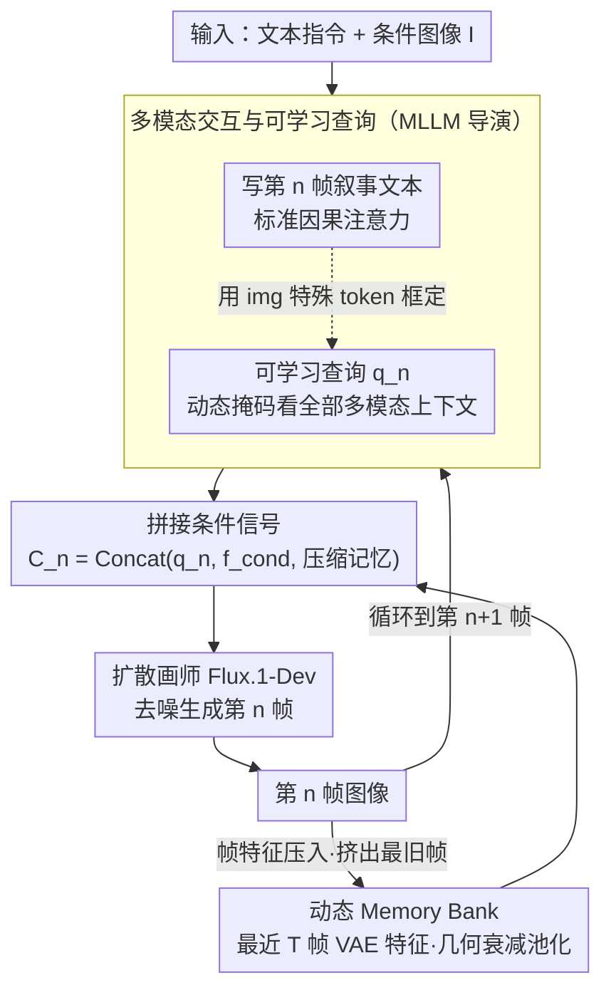

# Narrative Weaver: Towards Controllable Long-Range Visual Consistency with Multi-Modal Conditioning

**会议**: CVPR 2026  
**arXiv**: [2603.06688](https://arxiv.org/abs/2603.06688)  
**代码**: 待确认  
**领域**: 多模态VLM  
**关键词**: 长程视觉一致性, 叙事生成, AR+Diffusion, Memory Bank, 电商广告

## 一句话总结
提出 Narrative Weaver 框架，结合 MLLM 的叙事规划与扩散模型的精细生成，通过可学习查询和动态 Memory Bank 实现多模态条件下的长程视觉一致性生成，并构建首个电商广告视频分镜数据集 EAVSD（330K+ 图像）。

## 研究背景与动机

**领域现状**：Sora、Veo、Midjourney 等生成式 AI 在短片段图像/视频生成上表现优异，但长程叙事生成（保持角色、背景、风格跨帧一致性）仍是重大挑战。

**现有痛点**：(1) 视频生成在短片段后一致性迅速退化；(2) 图像生成限于单帧操作，无法规划多帧叙事；(3) 已有规划方法依赖纯文本条件，无法实现可控的视觉基础输出。

**核心矛盾**：缺乏统一框架将叙事规划、精细控制和长程一致性三项能力融为一体。同时缺乏大规模多模态条件生成数据集。

**本文目标**：实现 (text, image) → (text, {Image_i}) 的多模态条件长序列一致性生成。

**切入角度**：AR 模型做规划 + 扩散模型做生成的混合架构，关键帧间通过 Memory Bank 传递一致性信息。

**核心 idea**：MLLM 作为"导演"规划叙事并压缩上下文为可学习查询，Memory Bank 锚定初始视觉条件防止漂移，三阶段渐进训练实现数据高效学习。

## 方法详解

### 整体框架
Narrative Weaver 要做的是把一段 (文本, 图像) 指令展开成一整条视觉叙事序列，而且要让角色、背景、风格跨几十帧都不漂。它走的是 AR + Diffusion 的混合路线：前半段是一个 MLLM（Qwen2.5-VL-3B）当"导演"，逐帧规划下一镜该拍什么文本剧情，同时把当前该画什么压缩成一组查询向量；后半段是扩散模型（Flux.1-Dev）当"画师"，拿着查询和历史视觉记忆把这一帧真正画出来。导演和画师之间靠一个动态 Memory Bank 传递"前面几帧长什么样"，让画师每次落笔都对齐已经定下来的视觉基调。整条序列逐帧滚动：每画完一帧，它的特征就被压回 Memory Bank、最旧的一帧被挤出窗口，再回到导演规划下一帧。

### 关键设计

**1. 多模态交互与可学习查询：让同一个 MLLM 既能写剧本、又能把视觉意图打包成查询，还互不干扰**

难点在于，导演要在一条序列里交替做两件性质不同的事——生成下一段叙事文本、以及凝练出"这一帧画什么"的高层视觉指令。如果让两者在注意力里自由互看，查询向量会把文本生成带偏。作者的解法是一张**动态因果注意力掩码**：文本 token 仍走标准因果注意力（只看前面的文本），而可学习查询 $q_n$ 被特许关注全部多模态上下文——输入 $\mathbf{I}$、此前所有叙事文本 $\{t_j\}$、以及之前生成的查询 $\{q_k\}$。这样查询能充分吸收多模态信息，却不会反过来污染纯文本的因果链。

序列里用 `` / `</img>` 这对特殊 token 把查询段框起来，等于教模型自己判断"什么时候该停下规划、插一帧图像，画完再继续写剧情"。正因为掩码把规划和视觉聚合解耦得干净，这套生成时机的判断只用了约 5K 条数据就学会了。

**2. 动态 Memory Bank：用有界的几何衰减记忆把"长程一致"和"算得起"两个矛盾的目标同时摁住**

长序列生成最常见的坏死法是视觉漂移——画到第十几帧时，主角的脸、衣服、场景已经和开头对不上了。直接把所有历史帧的特征都喂给扩散模型当然一致，但内存和算力会随帧数二次膨胀。Memory Bank 的做法是只缓存最近 $T$ 帧的 VAE 特征，并对它们做**几何衰减的平均池化**：越靠后的历史帧压得越狠，第 $k$ 帧保留的特征长度是

$$l / \lambda^{k-1}$$

于是整段记忆的总长度被一个常数卡住：

$$L < l \cdot \lambda / (\lambda - 1)$$

第 $n$ 帧最终拿到的条件信号就是把当前查询、初始条件特征和这串压缩记忆拼起来：

$$\mathbf{C}_n = \text{Concat}(q_n,\, f^{cond},\, \hat{f}_{n-1},\, \dots,\, \hat{f}_{n-T})$$

这个安排让近期帧保留高分辨率细节（衔接要紧）、远期帧只留粗粒度轮廓（提供大方向就够），既锚住了初始视觉条件防漂移，又因为记忆长度有界，把 DiT 的计算复杂度从随帧数二次增长压成了线性增长——瓶颈反而转移到了更好优化的 MLLM 一侧，推理时规划和生成还能并行。

### 一个完整示例：生成第 5 帧

假设要画一条 8 帧的电商广告分镜，已经画到第 5 帧。导演 MLLM 先看着输入条件图 $\mathbf{I}$ 和前 4 帧的剧情文本，写出第 5 帧的叙事（"模特把口红涂在手背试色，镜头拉近"），随后吐出一段被 ``…`</img>` 框住的可学习查询 $q_5$——这组查询透过动态掩码已经看过了输入图、全部历史剧情和前几帧的查询，把"该画什么"压成了向量。接着 Memory Bank 上场：取最近 $T$ 帧（如 $T=4$）的 VAE 特征，第 4 帧几乎原样保留、第 3/2/1 帧依次按 $1/\lambda,\,1/\lambda^2,\,1/\lambda^3$ 压缩，拼成 $\mathbf{C}_5 = \text{Concat}(q_5, f^{cond}, \hat{f}_4, \hat{f}_3, \hat{f}_2, \hat{f}_1)$。扩散模型 Flux.1-Dev 拿这个条件信号去噪，画出第 5 帧——口红色号、模特的脸和手、背景布光都和前几帧对齐。画完后第 5 帧的特征又被压进 Memory Bank，第 1 帧则被挤出窗口，循环到第 6 帧。

### 训练策略
分三阶段渐进训练，让有限数据和算力下也能学起来：

- **Stage 1（叙事规划）**：只训 MLLM，让它学会写文本叙事和判断"何时插图"，用标准交叉熵损失。
- **Stage 2（语义一致生成）**：训练可学习查询和投影器，先在 30M 低分辨率文本-图像对上预训练打底，再在 60K 高质量样本上微调，目标换成 Flow Matching。
- **Stage 3（精细一致对齐）**：全面训练扩散模型，正式引入条件图像的 VAE 特征和 Memory Bank 特征，继续用 Flow Matching 目标，把细粒度一致性磨出来。

## 实验关键数据

### GPT-4o 评估（一致性视觉生成）

| 方法 | 文本控制 | ITC | RGC | MSSC | MSCC | IMQ |
|------|---------|-----|-----|------|------|-----|
| StoryDiffusion | ✗ | 6.54 | 5.86 | 7.48 | 6.00 | 6.80 |
| IP-Adapter | ✗ | 7.11 | 6.10 | 8.57 | 7.57 | 6.65 |
| Flux.1-kontext | ✗ | 7.06 | 9.41 | 8.11 | 7.28 | 6.94 |
| **Narrative Weaver** | **✓** | **7.54** | 8.86 | **8.67** | **7.91** | **7.35** |

### 自动评估（DreamSim↓ / CLIP Score↑）

| 方法 | DreamSim↓ (Avg) | 说明 |
|------|----------------|------|
| StoryDiffusion | 56.33 | 多场景生成方法 |
| IP-Adapter | 33.30 | 参考图像方法 |
| Flux.1-kontext | 3.71 | 编辑方法（但有复制粘贴问题） |
| Narrative Weaver | **12.18** | 在多场景生成中最优 |

### 用户研究
- 180+ 份用户偏好调查确认模型优势
- Flux.1-kontext 虽指标好但存在"复制粘贴"行为，用户不偏好

## 亮点
- 首个将叙事规划、精细控制、长程一致性统一的生成框架，填补了重要空白
- 动态因果注意力掩码设计精妙，仅用 ~5K 数据即可学会文本规划
- Memory Bank 的几何衰减压缩保证了有界内存且偏重近期帧
- EAVSD 填补了电商广告分镜数据集的空白（330K+ 图像）
- 三阶段训练策略在有限计算和数据下实现 SOTA，实用性强
- 计算复杂度从二次增长降为线性增长，允许生成更长叙事序列

## 局限与展望
- 当前以关键帧生成为主，关键帧间的过渡视频片段一致性尚未解决
- Qwen2.5-VL-3B 的规划能力可能限制叙事复杂度，更大 MLLM 可能提升上限
- EAVSD 数据集的生成依赖商业模型（Qwen-Image、Flux.1-kontext），可能引入生成偏差
- 可考虑引入人物 ID 保持的专用模块（如 face ID embedding）进一步提升角色一致性
- Memory Bank 的几何衰减率 $\lambda$ 的选择对不同叙事长度的影响需更多消融
- Stage 3 仅训练 1-2 epoch，更充分的训练可能进一步提升细粒度一致性

<!-- RELATED:START -->

## 相关论文

- [\[CVPR 2026\] Wan-Weaver: Interleaved Multi-modal Generation via Decoupled Training](wan-weaver_interleaved_multi-modal_generation_via_decoupled_training.md)
- [\[ACL 2025\] Mitigating Visual Forgetting via Take-along Visual Conditioning for Multi-modal Long CoT Reasoning](../../ACL2025/multimodal_vlm/tvc_mitigating_visual_forgetting.md)
- [\[CVPR 2026\] DocSeeker: Structured Visual Reasoning with Evidence Grounding for Long Document Understanding](docseeker_long_document_understanding.md)
- [\[CVPR 2026\] Decoupling Stability and Plasticity for Multi-Modal Test-Time Adaptation](decoupling_stability_and_plasticity_for_multi-modal_test-time_adaptation.md)
- [\[CVPR 2026\] Multi-Modal Image Fusion via Intervention-Stable Feature Learning](multi-modal_image_fusion_via_intervention-stable_feature_learning.md)

<!-- RELATED:END -->
