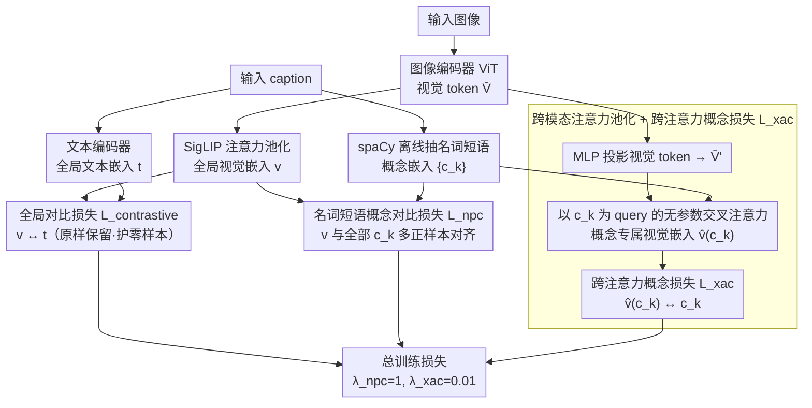

# No Hard Negatives Required: Concept Centric Learning Leads to Compositionality without Degrading Zero-shot Capabilities of Contrastive Models

**会议**: CVPR 2026  
**arXiv**: [2603.25722](https://arxiv.org/abs/2603.25722)  
**代码**: [https://github.com/SamsungLabs/concept_centric_clip](https://github.com/SamsungLabs/concept_centric_clip)  
**领域**: 多模态VLM / 对比学习  
**关键词**: 组合性理解, 对比学习, CLIP微调, 名词短语, 零样本泛化

## 一句话总结

C2LIP 提出不依赖 hard negatives 的对比学习微调方案：通过将文本拆解为名词短语概念并引入跨模态注意力池化，在 SugarCrepe/SugarCrepe++ 组合性基准上达到 SOTA，同时保持甚至提升零样本和检索性能。

## 研究背景与动机

1. **领域现状**：对比式视觉-语言模型（CLIP、SigLIP）是计算机视觉的基石，支持零样本分类、检索等开放世界任务。

2. **现有痛点**：
    - **组合性理解差**：CLIP 倾向于学习 Bag-of-Words (BoW) 表示，无法区分"一只红色沙发"和"一只沙发旁有红色物体"，不能正确绑定名词和属性
    - **Hard negative 方法的局限**：现有方法（NegCLIP、DAC、SLVC 等）通过生成 hard negatives 微调来改善组合性，但(a) 仅在特定 benchmark 上有效，泛化差；(b) 严重损害零样本分类和检索性能；(c) 需要复杂的数据生成 pipeline（LLM、文生图模型）
    - **架构问题**：文本和视觉编码器最终的全局池化操作混合了不同区域的名词和属性信息，导致绑定关系彻底丢失

3. **核心矛盾**：长描述性 caption 天然不需要组合性表示就能完成对比学习（BoW 即可），而全局池化又破坏了绑定信息——两个根本原因使得组合性无法通过简单的后置 hard negative 训练解决。

4. **本文目标** 在不使用 hard negatives 的前提下，同时提升组合性理解能力和保持零样本/检索性能。

5. **切入角度**：(a) 用短名词短语替代长 caption 进行对比学习，迫使模型学习细粒度绑定；(b) 在全局池化之前用跨模态注意力提取概念特定的视觉表示，将组合性学习信号传递到池化前的特征。

6. **核心 idea**：用名词短语概念做对比、用跨模态注意力在池化前学绑定，不需要 hard negatives 就能获得组合性。

## 方法详解

### 整体框架

在 SigLIP 基础上微调，保持原始的全局对比损失 $\mathcal{L}_{contrastive}$ 不变，额外引入两个辅助损失：(1) 名词短语概念对比损失 $\mathcal{L}_{npc}$ 将全局视觉表示与每个名词短语对齐；(2) 跨注意力概念损失 $\mathcal{L}_{xac}$ 用名词短语作为 query 从视觉 token 中提取概念特定表示并对齐。三项损失按悬殊权重汇总成总训练目标。推理时无任何额外开销，流程与原始 SigLIP 完全一致。

### 关键设计

**1. 名词短语概念对比损失 $\mathcal{L}_{npc}$：让短到 BoW 失效的概念逼模型学绑定**

第一个根因是长 caption 根本不需要组合性——一句话里塞十几个词，模型把它们当作词袋（Bag-of-Words）匹配就能对上图片，永远学不会"红色"该绑到"沙发"。C2LIP 的对策是换掉对比的文本侧：用 spaCy 从每条 caption 里离线抽出名词短语（如 "a red couch"），把对应的 text token 池化成概念嵌入 $\{c_k\}$，再让每张图的全局视觉嵌入 $v$ 与它自己的全部名词短语做多正样本对比。短语足够短，"a red couch" 没法靠词袋蒙混——它必须和"沙发旁的红色物体"区分开，模型于是被迫把属性真正绑到名词上。这里把 SigLIP 的 sigmoid 损失扩展成支持多个正例的形式，正例全部来自真实 caption 拆出来的短语，而不是 LLM 或文生图合成的 hard negatives，因此不会引入合成数据常见的分布偏移。

**2. 跨模态注意力池化 + 跨注意力概念损失 $\mathcal{L}_{xac}$：把绑定信号送到全局池化之前**

第二个根因是全局池化本身会把不同区域的名词和属性搅在一起，绑定关系在池化那一步就丢了——光改对比目标还不够，得在池化前就让特征学会概念对应。做法是复用 SigLIP 注意力池化层已有的 value 投影和 MLP，把视觉 token 投到联合空间得到 $\bar{V}'$，然后以名词短语概念嵌入 $c$ 当 query，对 $\bar{V}'$ 做一次交叉注意力，抽出概念专属的视觉嵌入：

$$\hat{v}(c) = \bar{V}'^{\top} \cdot \text{attn}(c, \bar{V}')$$

再用和 $\mathcal{L}_{npc}$ 同款的对比损失把 $\hat{v}(c_k)$ 对齐到 $c_k$。关键在于这层注意力池化**不引入任何可学参数**——它只是个加权读出，于是"哪个 token 属于哪个概念"的梯度信号会直接回传到池化前的视觉表示，逼编码器内部就把绑定关系学出来。无参数还顺带保证了推理时零额外开销。

**3. 总训练损失：两个辅助损失权重悬殊的原因**

三项合起来就是

$$\mathcal{L}_{total} = \mathcal{L}_{contrastive} + \lambda_{npc}\mathcal{L}_{npc} + \lambda_{xac}\mathcal{L}_{xac}$$

其中原始全局对比损失 $\mathcal{L}_{contrastive}$ 原封不动保留，保证零样本能力不被破坏。两个辅助权重设得很不对称：$\lambda_{npc}=1$ 而 $\lambda_{xac}=0.01$。差两个量级不是随手调的——跨注意力损失自身的梯度信号已经很强，给小权重就够推动池化前特征学绑定；权重一旦放大，反而会把全局表示带偏、拖累零样本和检索。

### 损失函数 / 训练策略

- 在 CC3M (DreamLIP 版本) 上微调预训练 SigLIP ViT-B/16，仅 5 个 epochs
- Adam 优化器，学习率 1e-5，8 张 A40 GPU，有效 batch size 768
- 用 spaCy 离线提取 caption 的名词短语
- 推理流程与原始 SigLIP 完全相同，无额外参数或计算

## 实验关键数据

### 主实验

组合性 + 零样本 + 检索综合评估（ViT-B/16）：

| 方法 | SC Add | SC Replace | SC Swap | SC++ Replace I2T | SC++ Swap I2T | ImNet1K | Flickr30k | MSCOCO | 平均 |
|------|--------|-----------|---------|-------------------|---------------|---------|-----------|--------|------|
| SigLIP (原始) | 86.5 | 84.1 | 65.8 | 73.8 | 62.8 | 76.1 | 95.2 | 78.9 | 70.0 |
| NegCLIP | 85.8 | 85.0 | 75.3 | 69.1 | 70.9 | 55.7 | 92.4 | 73.9 | 67.7 |
| DAC-LLM | 93.7 | 89.5 | 74.6 | 53.7 | 59.6 | 51.1 | 83.7 | 59.0 | 57.2 |
| FG-CLIP | 84.7 | 85.1 | 69.9 | 75.8 | 67.5 | 69.0 | 95.8 | 78.4 | 70.7 |
| SigLIP (CC3M ft) | 87.9 | 85.6 | 69.7 | 73.5 | 67.9 | 75.9 | 95.6 | 80.3 | 71.5 |
| **C2LIP** | **94.2** | **88.3** | **73.1** | **79.7** | **75.3** | 73.5 | **97.0** | **82.7** | **75.0** |

### 消融实验

属性绑定细分（SugarCrepe + SugarCrepe++ 属性子集）：

| 方法 | SC Replace | SC Swap | SC++ Replace I2T/TOT | SC++ Swap I2T/TOT | 平均 |
|------|-----------|---------|----------------------|-------------------|------|
| SigLIP | 86.7 | 71.5 | 75.5 / 64.2 | 56.3 / - | - |
| NegCLIP | 85.3 | 80.0 | 66.1 / - | 73.2 / - | - |
| **C2LIP** | **89.3** | **77.6** | **82.5** / - | **78.2** / - | - |

### 关键发现

- **C2LIP 是唯一在所有 benchmark 上都排名前列的方法**：组合性方法（NegCLIP/DAC）在零样本/检索上严重退化（ImageNet 降至 40-55%），而 C2LIP 仅微降 2.6%（76.1→73.5）
- **CC3M 微调本身对组合性帮助有限**（SigLIP ft 仅从 70.0→71.5），但加上 C2LIP 的概念损失后跃升至 75.0
- **无参数跨模态注意力池化**是关键——它将梯度信号直接传到池化前的特征表示，使编码器内部学会绑定
- Flickr30k 检索从 95.2 提升至 97.0，MSCOCO 从 78.9 提升至 82.7，说明概念对齐也有利于检索任务

## 亮点与洞察

- **问题分析精准**：识别出 BoW 捷径和全局池化信息丢失两个根因，对症下药。比"暴力"添加 hard negatives 更本质
- **极简设计**：无额外可学参数、无推理开销、仅需 5 epochs 微调、不需要 LLM 或文生图模型。仅用 spaCy 提取名词短语 + 标准注意力操作
- **$\lambda_{xac} = 0.01$ 的超参设置**说明跨注意力损失的梯度信号非常有效，少量权重就够
- **通用性**：虽然在 SigLIP 上验证，但方法原理适用于任何 CLIP-like 模型
- 实际部署友好：推理完全zero-cost，不引入任何推理开销

## 局限与展望

- ImageNet 零样本分类下降 2.6%，作者归因于训练数据域窄 + 场景中心表示与 ImageNet 物体中心任务冲突，但这仍是一个未完全解决的权衡
- 仅在 CC3M (3M 规模) 上微调，更大规模数据上的表现未验证
- spaCy 名词短语提取质量受限于 NLP 工具的准确性
- 未探索 ViT-L 及更大模型的效果
- 跨模态注意力池化仅在训练时使用，若推理时也使用是否能进一步提升概念级检索？

## 相关工作与启发

- **vs NegCLIP/DAC**：这类 hard negative 方法在特定 benchmark 上可以很强（DAC 在 SugarCrepe Add 上 93.7），但严重损害零样本能力（ImageNet 51.1）。C2LIP 在所有任务上均衡优秀
- **vs CLIC**：CLIC 在 SugarCrepe++ Swap-I2T 上表现好，但 text-only (TOT) 任务表现极差，说明其文本编码器并未真正学会组合性
- **vs FG-CLIP**：FG-CLIP 在 LAION-2B 上预训练+大量硬样本数据，平均 70.7；C2LIP 仅在 CC3M 微调 5 epochs 就达到 75.0
- **vs Assouel et al.**：也用交叉注意力做概念绑定，但需要 LLM 分解场景图 + 多次前向传播，训练推理成本极高；C2LIP 无参数、无额外前向传播

## 评分

- 新颖性: ⭐⭐⭐⭐ 根因分析深入且解决方案优雅简洁，但思路并非完全出乎意料
- 实验充分度: ⭐⭐⭐⭐⭐ 组合性、零样本、检索、细粒度检索全覆盖，大量 baseline 公平比较
- 写作质量: ⭐⭐⭐⭐⭐ 论文写作教科书级别，问题定义清晰、实验设计严谨
- 价值: ⭐⭐⭐⭐⭐ 极其实用的后训练方案，无推理开销，可直接应用于工业场景

<!-- RELATED:START -->

## 相关论文

- [\[CVPR 2026\] FALCON: False-Negative Aware Learning of Contrastive Negatives in Vision-Language Alignment](falcon_false-negative_aware_learning_of_contrastive_negatives_in_vision-language.md)
- [\[CVPR 2026\] FlowComposer: Composable Flows for Compositional Zero-Shot Learning](flowcomposer_composable_flows_for_compositional_zeroshot_learning.md)
- [\[CVPR 2026\] AGFT: Alignment-Guided Fine-Tuning for Zero-Shot Adversarial Robustness of Vision-Language Models](agft_alignment-guided_fine-tuning_for_zero-shot_adversarial_robustness_of_vision.md)
- [\[CVPR 2026\] Concept-wise Attention for Fine-grained Concept Bottleneck Models](coat_cbm_concept_wise_attention.md)
- [\[CVPR 2026\] Beyond Heuristic Prompting: A Concept-Guided Bayesian Framework for Zero-Shot Image Recognition](beyond_heuristic_prompting_a_concept-guided_bayesian_framework_for_zero-shot_ima.md)

<!-- RELATED:END -->
