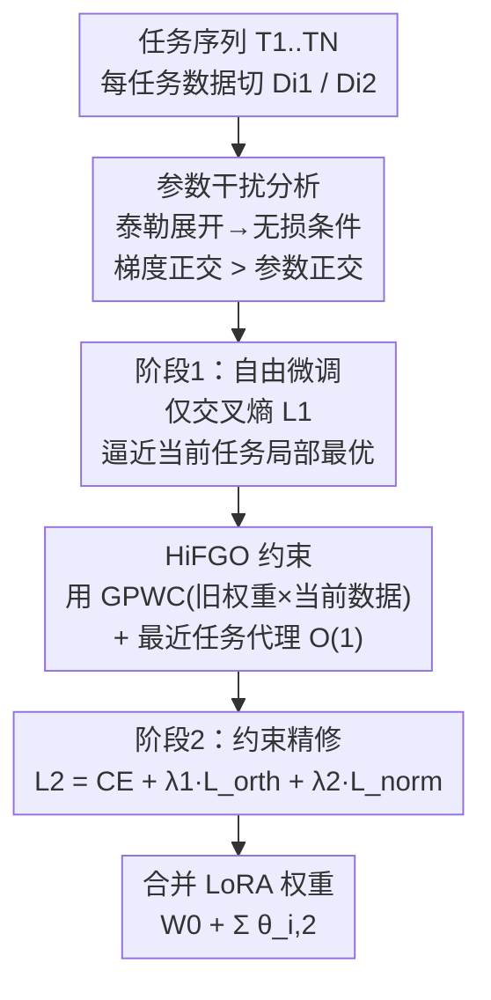

# Octopus: History-Free Gradient Orthogonalization for Continual Learning in Multimodal Large Language Models

**会议**: CVPR 2026  
**论文**: [CVF Open Access](https://openaccess.thecvf.com/content/CVPR2026/html/Liu_Octopus_History-Free_Gradient_Orthogonalization_for_Continual_Learning_in_Multimodal_Large_CVPR_2026_paper.html)  
**代码**: https://fxmangd26.github.io/Octopus/ (项目页)  
**领域**: 多模态VLM / 持续学习 / MLLM 微调  
**关键词**: 持续学习, 多模态大模型, 梯度正交, 无历史数据, 两阶段微调

## 一句话总结
针对多模态大模型持续学习中"既不想存历史数据、又要防灾难性遗忘"的难题，Octopus 证明比参数正交更该做的是梯度正交，提出只用历史权重（不用历史数据）的 History-Free 梯度正交（HiFGO），再配一个先自由适配后约束精修的两阶段微调，在 UCIT 基准上 Avg / Last 分别超过前 SOTA 2.14% / 6.82%。

## 研究背景与动机
**领域现状**：持续学习让多模态大模型（MLLM）按任务序列增量吸收知识，主流分三派——架构派（给每个任务分 LoRA 模块）、回放派（存历史数据/激活做重放）、正则派（约束参数更新落在不伤旧任务的子空间）。

**现有痛点**：三派各有硬伤。架构派给每任务塞 LoRA 会损害对未见任务的泛化、推理时还增开销；回放派要存历史数据，现实中常因隐私/存储受限拿不到；正则派虽无上述包袱，但已有工作大多只**强制参数正交**，而模型合并领域的研究表明——**参数正交不足以完全消除参数干扰**。

**核心矛盾**：要彻底防干扰其实该约束的是**梯度正交**而非参数正交；但现有梯度正交方法（OGD 一类）又都**依赖历史任务数据**来算旧梯度，回到了回放派的隐私/存储老问题。而且实验发现，正则约束会和当前任务的优化目标"打架"，硬加正则会拉低微调性能。

**本文目标**：(1) 在不碰历史数据的前提下实现梯度级正交；(2) 化解正则约束与任务适配之间的竞争。

**切入角度**：对两任务做泰勒展开推"无损条件"——只要 Task 2 的参数更新与 Task 1 在其数据上的**梯度**正交，就能（一阶近似下）不损害 Task 1。关键观察是：旧任务参数已收敛到局部最优，其在**当前数据**上的梯度方向既编码了可复用的共享知识、又暴露了任务间冲突，因此可用"旧权重 + 当前数据"近似出所需梯度，绕开历史数据。

**核心 idea**：用"旧参数在当前数据分布上的梯度（GPWC）"代替"旧梯度"，把当前更新约束到与之正交；再用两阶段微调把"先适配、后约束"解耦，兼顾塑性与稳定性。

## 方法详解

### 整体框架
Octopus 基于 LoRA 做持续微调，对任务序列 $T_1,\dots,T_N$ 逐个学习。它先给出理论依据说明为何要做梯度正交（而非参数正交），再据此设计无历史数据的 HiFGO 约束，最后用两阶段微调缓解约束与适配的冲突。具体到单个任务 $i$：把数据切成 $D_{i1}/D_{i2}$ 两份；**第一阶段**只用交叉熵损失自由微调、让 LoRA 先逼近当前任务局部最优；**第二阶段**计算所有历史任务的 GPWC（旧参数在当前数据上的梯度），在交叉熵之外叠加梯度正交损失 + L2 正则，做约束精修。整条管线全程**不存任何历史任务数据**，仅靠历史权重。

### 关键设计

**1. 参数干扰分析：证明梯度正交比参数正交更该被约束**

针对"参数正交不足以防干扰"这一痛点。设 $\theta_1',\theta_2$ 为两任务优化后的 LoRA 权重（$\theta_1'=W_0+\theta_1$），要求 Task 2 训练不损害 Task 1，即**无损条件** $L_{D_1}(\theta_1')=L_{D_1}(\theta_1'+\theta_2)$。在 $\theta_1'$ 处做泰勒展开 $L_{D_1}(\theta_1'+\theta_2)=L_{D_1}(\theta_1')+\langle\frac{\partial L_{D_1}(\theta_1')}{\partial\theta_1'},\theta_2\rangle+\mathcal{O}(\|\theta_2\|^2)$，由于 LoRA 权重幅度远小于预训练权重，高阶项可忽略，于是无损条件化简为 $\langle\frac{\partial L_{D_1}(\theta_1')}{\partial\theta_1'},\theta_2\rangle=0$——即**当前参数与旧任务梯度正交**。作者由此指出 OLoRA 那种**参数正交**（约束 $\theta_2\perp\theta_1$）不保证无损：$\theta_1$ 是从预训练点走到局部最优的整条轨迹方向，而非 $\theta_1'$ 处的瞬时梯度方向，二者语义不同。这一分析把"该约束什么"从参数层面纠正到梯度层面，是全文的理论基石。

**2. HiFGO：用 GPWC 代替历史梯度，再用最近任务做 $O(1)$ 代理**

针对"梯度正交需要历史数据"的痛点。理想的正交损失 $L_{orth}(\theta_i)=\sum_{j=1}^{i-1}\big(\frac{\partial L_{D_i}(\theta_j')}{\partial\theta_j'}\big)^T\theta_i$ 需要对每个历史任务都算梯度，且若在历史数据上算就回到隐私问题。作者提出 **GPWC（Gradients of Previous parameters Within Current data distribution，旧参数在当前数据分布上的梯度）**：因为旧参数已在各自域收敛到局部最优，它们在**当前数据**上的梯度既反映了跨任务共享的可复用知识（有益更新方向），又揭示了"当前更新会不会伤旧任务"的冲突方向——于是只用旧权重 + 当前任务数据就能算出约束所需梯度，彻底甩掉历史数据。进一步，逐个历史任务算会让成本随任务数线性增长（$O(t)$）；作者据"训练好的持续学习模型在每阶段后仍保留早期任务性能、即最新参数隐式编码了历史知识"这一观察，用**最近任务参数 $\theta_{i-1}'$ 当整段历史的代理**，把损失简化为 $L'_{orth}(\theta_i)=\big(\frac{\partial L_{D_i}(\theta_{i-1}')}{\partial\theta_{i-1}'}\big)^T\theta_i$，把正交损失成本从 $O(t)$ 压到 $O(1)$。

**3. 两阶段微调：先自由探索再约束精修，化解正则与适配的竞争**

针对"硬加正则会拉低微调性能"的痛点。作者发现直接把正则项和任务损失一起优化会出两个问题：约束大幅压缩有效参数搜索空间、多损失目标互相干扰易陷次优局部最小，结果偏离标准微调解很远。受退火思想启发，把训练拆成两段。**第一阶段**关掉所有正则，只用交叉熵 $L_1=\frac{1}{|D_i|}\sum L_{ce}(f_{\theta_{i,1}'}(x_k),y_k)$ 让模型自由逼近当前任务的局部最优区域（$\theta_{i,1}$ 由上一任务 $\theta_{i-1,1}$ 初始化）。**第二阶段**同时开启任务损失与正则，$L_2=\frac{1}{|D_i|}\sum\big(L_{ce}+\lambda_1 L_{orth}(\theta_{i,2})+\lambda_2 L_{norm}(\theta_{i,2})\big)$，其中 $L_{norm}$ 是 L2 正则，$\theta_{i,2}$ 由 $\theta_{i,1}$ 初始化——相当于在已接近最优的解附近做"约束式精修"，把更新轨迹圈进保留旧知识的子空间。这种"先适配后约束"的解耦让正则方法的性能天花板逼近甚至超过多任务联合训练。

### 损失函数 / 训练策略
单任务两阶段：阶段一 $L_1$ 纯交叉熵；阶段二 $L_2 = L_{ce} + \lambda_1 L_{orth} + \lambda_2 L_{norm}$。合并输出为 $W_0+\sum_{i=1}^N\theta_{i,2}$。正交损失含两种实现：标准版用 GPWC，带 † 的版本用"最近任务代理近似"（Eq.8）。骨干为 LoRA 微调的 MLLM ⚠️（论文正文未明确给出具体 MLLM 名称，以原文为准）。

## 实验关键数据

> **指标说明**：UCIT 基准用 **Avg**（训练全程各阶段平均精度）和 **Last**（学完所有任务后在各任务上的平均精度，更能反映遗忘程度）；消融里 **Imd.**（Immediate，刚学完该任务时的即时精度）与 **BWT**（Backward Transfer，后续训练对旧任务的反向影响，正值表示不仅没忘还提升）。Zero-shot / Multi-task / Sequential Finetune 分别给出下界、上界与基线。

### 主实验
UCIT 含 ImageNet-R、ArXivQA、VizWiz、IconQA、CLEVR-Math、Flickr30k 六个多模态指令任务。Octopus（无回放，% = 不存历史数据）在 Avg 和 Last 上均居榜首：

| 设置 | 回放 | Avg | Last |
|------|------|-----|------|
| Multi-task（上界） | - | 72.53 | - |
| Sequential Finetune（基线） | - | 57.52 | 48.12 |
| Vanilla Rehearsal | ✓ | 69.90 | 68.44 |
| HiDe-LLaVA（架构，前 SOTA） | ✗ | 68.94 | 64.19 |
| O-LoRA（参数正交） | ✗ | 64.54 | 58.36 |
| **Octopus (ours)** | ✗ | **71.08** | **71.01** |
| Octopus (ours)† 代理版 | ✗ | 71.33 | 70.45 |

Octopus 的 Avg 71.08 / Last 71.01，比前 SOTA（论文记 HiDe-LLaVA 一系，UCIT [17]）的 Avg / Last 分别高 **+2.14% / +6.82%**；尤其 Last 几乎与 Avg 持平，说明学到最后几乎不掉旧任务——遗忘被有效压住，甚至超过需要存数据的 Vanilla Rehearsal。

### 消融实验
**(a) 约束对象 + 梯度来源（Table 2，Oxford 六任务平均）**：

| 配置 | Average | BWT |
|------|---------|-----|
| 正交于旧参数 (Last) | 66.71 | -2.51 |
| 正交于 GPWC (Last，本文) | 71.01 | +0.41 |
| 旧参数 & GPWC (Last) | 71.04 | +0.45 |

**(b) 两阶段微调（Table 3，Last）**：

| 配置 | Average | BWT |
|------|---------|-----|
| w/ 两阶段微调 | 71.01 | +0.41 |
| w/o 两阶段微调 | 61.18 | -1.29 |

### 关键发现
- **梯度正交完胜参数正交**：约束"正交于 GPWC"的 Last 71.01、BWT +0.41，而约束"正交于旧参数"只有 66.71、BWT -2.51——后者会负迁移（越学越忘），前者反而正迁移，直接验证理论分析。
- **两阶段是性能命门**：去掉两阶段微调，Average 从 71.01 暴跌到 61.18（-9.83），BWT 从 +0.41 转为 -1.29，证明"先自由适配后约束"对兜住微调天花板至关重要。
- **最近任务代理几乎无损还更省**：代理版（†）Avg 71.33 甚至略高于标准版，却把正交损失成本从 $O(t)$ 降到 $O(1)$，"最新参数隐式编码历史"的假设站得住。
- **BWT 随任务数演化**：参数正交方法的 BWT 随任务增多持续走负（到第 6 任务 -2.51），GPWC 方法始终维持在 0 附近（+0.41/+0.46），稳定性优势随序列变长越发明显。

## 亮点与洞察
- **一行泰勒展开把"该约束什么"讲透**：从无损条件推到"当前参数 ⊥ 旧任务梯度"，顺手点破参数正交的语义错位（轨迹方向 ≠ 瞬时梯度方向），理论简洁有力，可直接迁移到任何 LoRA 持续学习设定。
- **GPWC 这个"换数据不换权重"的视角很巧**：以往要么存旧数据算旧梯度，要么存旧梯度本身；本文反过来"用旧权重 × 新数据"算梯度，既绕开隐私又自然捕捉跨任务共享子空间，是个可复用的去历史化思路。
- **两阶段 = 退火式解耦**：把"塑性（自由适配）"和"稳定（约束精修）"在时间上拆开而非空间上硬调权重，避免多损失打架，这个"先放后收"的训练范式对其他正则冲突场景也有启发。
- **Last 逼近 Avg**：持续学习里 Last 通常远低于 Avg（学到后面忘前面），Octopus 让二者几乎齐平，是遗忘被真正治住的强信号。

## 局限与展望
- 理论建立在"LoRA 权重幅度远小、高阶项可忽略"的一阶近似上，若 LoRA 秩/幅度增大或任务差异极大，二阶残差是否仍可忽略存疑。
- "最近任务参数代理整段历史"依赖"每阶段后旧任务性能都保住"的前提；若中途某任务严重退化，代理可能失真（论文未压测极端退化场景）。
- 仅在 UCIT 单一基准 + 六任务序列上验证，更长序列、更多模态、不同 MLLM 骨干下的可扩展性待考；正文对所用 MLLM 具体型号交代不详 ⚠️。
- 两阶段需要把每任务数据切成 $D_{i1}/D_{i2}$ 两份，切分比例对结果的影响未见敏感性分析。

## 相关工作与启发
- **vs OGD / 梯度正交派**：同样追求梯度正交，但 OGD 必须存历史数据算旧梯度；Octopus 用 GPWC 仅靠旧权重 + 当前数据，去掉历史数据依赖，隐私/存储友好。
- **vs O-LoRA / BiLoRA（参数正交）**：它们用参数向量替代存储梯度但只做参数正交；本文理论与实验都表明参数正交不足以防干扰（BWT -2.51 vs +0.41），梯度正交才对。
- **vs HiDe-LLaVA / MoELoRA（架构/MoE 派）**：架构派给任务分专家/模块，推理或存储有额外开销且泛化受损；Octopus 是推理高效、无回放的正则方法，Avg/Last 反超前 SOTA。
- **vs 多任务联合训练（上界）**：两阶段微调让正则方法的天花板逼近甚至局部超过 Multi-task，说明"持续学好"未必输给"一次学全"。

## 评分
- 新颖性: ⭐⭐⭐⭐⭐ "梯度正交 > 参数正交"的理论 + GPWC 去历史数据，切口清晰且有理论支撑。
- 实验充分度: ⭐⭐⭐⭐ UCIT 主表 + 正交对象/梯度来源/两阶段三组消融 + BWT 曲线扎实，但只一个基准、骨干交代略含糊。
- 写作质量: ⭐⭐⭐⭐ 泰勒推导到方法落地链条顺，OCR 导致部分公式排版凌乱但逻辑可还原。
- 价值: ⭐⭐⭐⭐ 无回放、推理高效、隐私友好的 MLLM 持续学习方案，落地价值明确。

<!-- RELATED:START -->

## 相关论文

- [\[CVPR 2026\] Multimodal Continual Instruction Tuning with Dynamic Gradient Guidance](multimodal_continual_instruction_tuning_with_dynamic_gradient_guidance.md)
- [\[ICLR 2026\] KeepLoRA: Continual Learning with Residual Gradient Adaptation](../../ICLR2026/multimodal_vlm/keeplora_continual_learning_with_residual_gradient_adaptation.md)
- [\[CVPR 2026\] Re-evaluating Continual VQA: Toward Fair and Robust Evaluation for Multimodal Continual Learning](re-evaluating_continual_vqa_toward_fair_and_robust_evaluation_for_multimodal_con.md)
- [\[CVPR 2026\] Enhancing Continual Learning of Vision-Language Models via Dynamic Prefix Weighting](enhancing_continual_learning_of_vision-language_models_via_dynamic_prefix_weight.md)
- [\[CVPR 2026\] On Token's Dilemma: Dynamic MoE with Drift-Aware Token Assignment for Continual Learning of Large Vision Language Models](on_tokens_dilemma_dynamic_moe_with_drift-aware_token_assignment_for_continual_le.md)

<!-- RELATED:END -->
