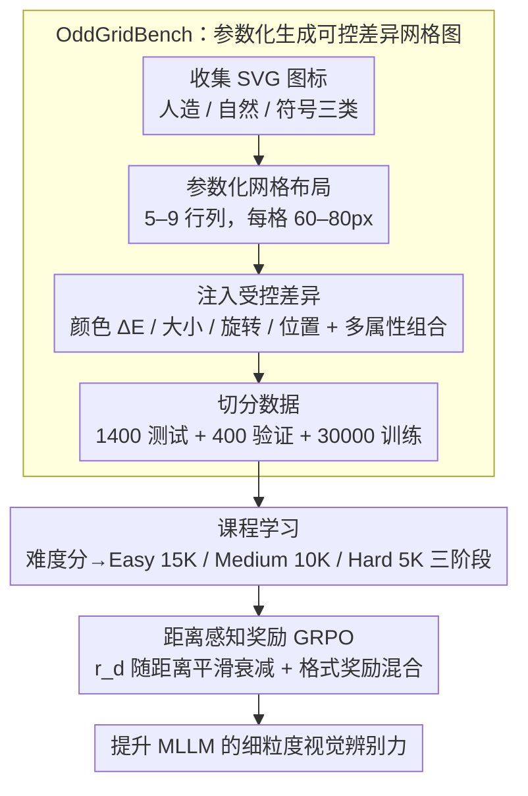

# OddGridBench: Exposing the Lack of Fine-Grained Visual Discrepancy Sensitivity in Multimodal Large Language Models

**会议**: CVPR 2026  
**arXiv**: [2603.09326](https://arxiv.org/abs/2603.09326)  
**代码**: [https://wwwtttjjj.github.io/OddGridBench/](https://wwwtttjjj.github.io/OddGridBench/)  
**领域**: 多模态VLM  
**关键词**: 视觉差异感知, benchmark, GRPO, 课程学习, 细粒度感知

## 一句话总结
提出 OddGridBench 评估 MLLM 的细粒度视觉差异感知能力（找出网格中与其他元素在颜色/大小/旋转/位置上不同的那个），发现所有 MLLM 远低于人类水平，进而提出 OddGrid-GRPO（课程学习 + 距离感知奖励）显著提升模型的视觉辨别力。

## 研究背景与动机
**领域现状**：MLLM 在高层语义理解（图像描述、VQA、数学推理等）上表现出色，但对底层视觉感知的评估和研究不足。

**现有痛点**：现有 benchmark 主要关注高层语义推理，忽视了人类视觉系统中非常基础的能力——细粒度视觉差异感知（Just Noticeable Difference / Pop-out Effect）。这种底层感知是空间推理、物体理解的前提。

**核心矛盾**：没有系统化、可控的 benchmark 来量化评估 MLLM 在不同感知维度（颜色、大小、旋转、位置）上的敏感度，也缺乏针对性的训练方法来弥补这一短板。

**本文目标**：(1) 构建可控的细粒度视觉差异感知 benchmark；(2) 揭示 MLLM 在此任务上的系统性失败模式；(3) 提出训练方法提升感知能力。

**切入角度**：借鉴认知心理学的 Odd-One-Out 范式，构建参数化控制的网格图像，精确量化差异程度。

**核心idea**：用参数化的网格图像（单元素在颜色/大小/旋转/位置上有细微差异）构建 benchmark，结合课程学习和距离感知奖励的 GRPO 来提升 MLLM 的感知敏感度。

## 方法详解

### 整体框架
这篇论文做两件事：先造一个能精确控制差异幅度的评测集 OddGridBench，把 MLLM 在「找不同」上的短板量化出来；再用 OddGrid-GRPO 把模型练上去。OddGridBench 借的是认知心理学里的 Odd-One-Out 范式——给一张网格图，里面绝大多数图标一模一样，只有一个在颜色、大小、旋转或位置上有细微差异，模型要把那个「异类」点出来。因为整张图是参数化生成的，差异幅度可以从「几乎察觉不到」连续调到「一眼能看出」，于是能像心理物理实验那样画出模型的感知敏感度曲线。训练侧则把这批数据按难度排好序喂给 GRPO，并把「点得准不准」从对/错的二元判断换成随距离平滑衰减的连续奖励。

整条 pipeline 是「数据构建 → 课程训练」两段串联：前半段把网格图从图标一路参数化造出来并切分，后半段把这批数据按难度排序、用改造过奖励的 GRPO 训练模型。

### 关键设计

**1. OddGridBench：参数化生成可控差异的网格图**

整套评测的关键在于差异能被精确量化，而不是凭感觉标「难/易」。作者从 IconFont 和 Material Design Icons 收集 SVG 图标（分人造物、自然、符号三类，SVG 保证缩放旋转后分辨率无关），铺成 5–9 行列、每个 60–80px 的网格，然后只在其中一个单元上注入受控扰动。四个维度各有明确的物理刻度：颜色用 CIE-Lab 色差 $\Delta E \in [5,20]$、大小缩放 85%–115%、旋转 $\pm5°$ 到 $\pm25°$、位置偏移 5%–12%。差异还能叠加成 2-Type / 3-Type / 4-Type 的多属性组合，最终切成 1400 测试 + 400 验证 + 30000 训练。这样的设计让「差异从不可察觉过渡到显著」成为一个连续轴，是传统离散难度标注的 benchmark 做不到的。

**2. 课程学习：按连续难度先易后难，避免 RL 早崩**

直接把模型扔进困难样本里跑 GRPO 很容易不稳定——奖励稀疏、梯度噪声大，训练会过早收敛到瞎猜。作者给每个样本算一个连续难度分数，由网格大小、叠加的属性数量、扰动幅度三者综合决定，再据此切成 Easy(15K) / Medium(10K) / Hard(5K) 三档，分三阶段渐进训练。先在容易的样本上让模型建立起「找不同」的基本能力，再逐步加码到难样本，整个过程模拟的是人类感知能力由粗到细的发展轨迹。

**3. 距离感知奖励：把空间邻近性写进奖励信号**

标准 GRPO 对定位类任务用二元奖励（点对了给 1、点错了给 0），但这对「找位置」很浪费——点到目标隔壁格和点到对角线另一头，得到的反馈一样是 0，模型学不到「越靠近越好」。作者把奖励换成随欧几里得距离平滑衰减的形式：

$$r_d = \max\!\big(\exp(-d^2/2\sigma^2) - \beta,\, 0\big)$$

其中 $d$ 是预测位置到真实异类位置的距离，$\sigma$ 随网格大小自适应缩放（大网格容差更大），$\beta$ 是一个阈值用来把太远的预测奖励直接压到 0、避免给离谱的猜测发糖。最终奖励再和格式奖励 $r_f$ 加权混合：$r_{overall} = (1-\omega)r_d + \omega r_f$。比起二元奖励，这个连续信号让「差一点」和「差很多」有了区分度，监督密度更高，这套思路也能迁移到其他需要空间定位的 VLM 任务。

### 损失函数 / 训练策略
整体是基于 GRPO 的强化学习，训练目标即上面的总奖励 $r_{overall}$，配合三阶段课程调度逐档加难，无监督微调阶段。

## 实验关键数据

### 主实验

| 模型 | Color | Size | Rotation | Position | Total |
|------|-------|------|----------|----------|-------|
| Random | 2.00 | 2.00 | 2.00 | 2.00 | 2.43 |
| Qwen3-VL-32B | 85.00 | 39.50 | 52.50 | 39.00 | 68.07 |
| Gemini-2.5-Pro | 82.50 | 9.50 | 26.00 | 6.50 | 49.29 |
| GPT-5 | 56.50 | 9.50 | 21.00 | 5.00 | 28.93 |
| **Human** | **91.33** | **69.33** | **82.67** | **78.00** | **87.47** |

### 关键发现

| 观察 | 说明 |
|------|------|
| 颜色维度最易 | 多数模型在颜色差异上表现最好，但仍远低于人类 |
| 位置/大小最难 | 几乎所有模型在位置和大小感知上接近随机 |
| 人类vs最强MLLM | 人类 87.47% vs Qwen3-VL-32B 68.07%，差距近20% |
| 模型规模效应 | 同系列大模型比小模型好，但提升有限 |

### 关键发现
- 颜色是 MLLM 最敏感的维度，大小和位置最弱，说明 MLLM 的视觉编码器在空间几何感知上存在根本性缺陷
- OddGrid-GRPO 中课程学习和距离感知奖励都有明显贡献，去掉任一组件都会掉点
- 差异幅度越大，准确率越高，呈单调递增趋势，符合人类感知的心理物理规律

## 亮点与洞察
- **参数化控制的 benchmark 设计**：类比心理物理学实验，可以精确控制每个感知维度的差异幅度，实现从"不可察觉"到"显著"的连续过渡，这是传统 benchmark 做不到的
- **距离感知奖励**：将空间邻近性编码到 RL 奖励中，比二元奖励提供更丰富的学习信号，这一设计可迁移到其他需要空间定位的 VLM 任务
- **暴露了 MLLM 的根本短板**：GPT-5 在位置感知上仅 5%，几乎是随机水平，说明当前视觉编码器在底层感知上严重不足

## 局限与展望
- Benchmark 仅用合成 SVG 图标，未涉及自然图像中的细粒度差异检测
- 仅评估了单图场景，实际应用中需要在复杂背景下检测差异
- OddGrid-GRPO 的效果主要在该 benchmark 上验证，在其他细粒度视觉任务上的迁移性待考察
- 训练数据量（30K）相对较小，扩大规模可能进一步提升

## 相关工作与启发
- **vs 传统 Odd-One-Out**：传统方法针对视觉编码器设计，不适用于 MLLM 架构；本文首次为 MLLM 设计系统化的感知差异评估
- **vs GRPO (DeepSeek-V3)**：标准 GRPO 用二元奖励，本文扩展为连续的距离感知奖励，提供更细粒度的空间监督信号

## 补充分析

- OddGrid-GRPO 的三阶段训练对应样本数 15K→15K(5K easy+10K medium)→15K(10K easy/medium+5K hard)，总训练量固定为 30K
- 网格图像中图标均为 SVG 格式，保证了缩放/旋转的分辨率无关性
- 4-Type 组合任务中人类准确率高达 97.67%，而 GPT-5 仅 46.00%，差距超过 50%，是所有条件中差距最大的
- 该 benchmark 的生成代码开源，可以自由定制新的差异维度（如纹理、透明度等）
- 论文还发现标注 grid 标签后（LabeledAcc），模型准确率大幅提升，说明问题不完全在视觉感知，也在空间推理和索引理解上

## 评分
- 新颖性: ⭐⭐⭐⭐ Benchmark 设计巧妙，暴露了重要问题
- 实验充分度: ⭐⭐⭐⭐ 19个模型评估，分析深入
- 写作质量: ⭐⭐⭐⭐ 逻辑清晰，图表精美
- 价值: ⭐⭐⭐⭐ 揭示了MLLM底层感知的系统性缺陷

<!-- RELATED:START -->

## 相关论文

- [\[CVPR 2026\] DiG: Differential Grounding for Enhancing Fine-Grained Perception in Multimodal Large Language Models](dig_differential_grounding_for_enhancing_fine-grained_perception_in_multimodal_l.md)
- [\[CVPR 2026\] CropVLM: Learning to Zoom for Fine-Grained Vision-Language Perception](cropvlm_learning_to_zoom_for_fine_grained_vision_language_perception.md)
- [\[CVPR 2026\] ReasonMap: Towards Fine-Grained Visual Reasoning from Transit Maps](reasonmap_towards_fine-grained_visual_reasoning_from_transit_maps.md)
- [\[CVPR 2026\] Chart-FR1: Visual Focus-Driven Fine-Grained Reasoning on Dense Charts](chart-fr1_visual_focus-driven_fine-grained_reasoning_on_dense_charts.md)
- [\[CVPR 2026\] CoVFT: Context-aware Visual Fine-tuning for Multimodal Large Language Models](covft_context-aware_visual_fine-tuning_for_multimodal_large_language_models.md)

<!-- RELATED:END -->
