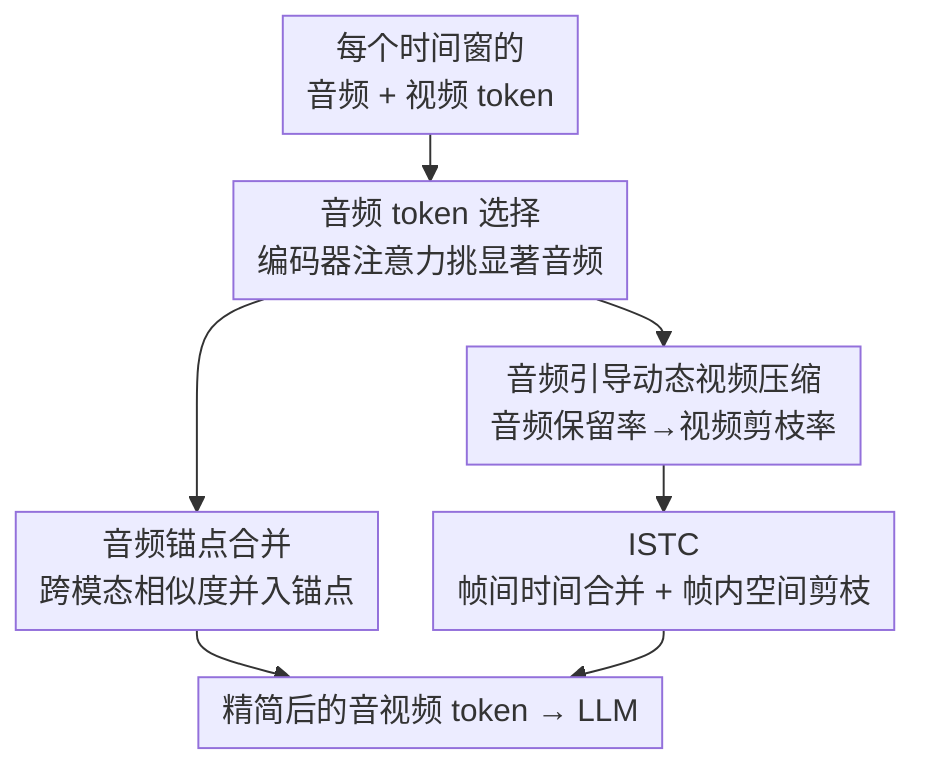

# OmniZip: Audio-Guided Dynamic Token Compression for Fast Omnimodal Large Language Models

**会议**: CVPR 2026  
**arXiv**: [2511.14582](https://arxiv.org/abs/2511.14582)  
**代码**: https://github.com/KD-TAO/OmniZip (有)  
**领域**: 多模态VLM / LLM效率  
**关键词**: 全模态大模型, Token 压缩, 音频引导, 免训练加速, 音视频理解

## 一句话总结
OmniZip 是首个面向全模态大模型（OmniLLM）音视频联合理解的**免训练** token 压缩框架：它用音频 token 的注意力分布作为「信息密度 / 事件边界」先验，在每个时间窗内动态地决定视频 token 的剪枝率，再用交错时空压缩模块（ISTC）压缩视频 token，在 Qwen2.5-Omni 上实现 3.42× prefill 加速、1.4× 显存下降，且几乎不掉点。

## 研究背景与动机
**领域现状**：OmniLLM（如 Qwen2.5-Omni）把视觉、音频、文本统一进一个 LLM，能同时「看视频 + 听声音」回答问题。它的输入序列把音频流和视频流按**固定时长的时间窗**切段，每个窗内的音频 token 和视频 token 对齐后拼成一个跨模态块，再按时间顺序串成一条超长序列喂给 LLM。一段视频通常产生 1–2 万个 token。

**现有痛点**：这条超长序列叠加注意力的二次复杂度，使 OmniLLM 推理在算力和显存上成为瓶颈。现有的 token 压缩方法几乎全是**纯视觉视角**（图像或视频单模态），没有人处理「音频 + 视频联合压缩」这个新需求；而且很多方法依赖访问视频编码器或 LLM 内部的注意力矩阵，这和 FlashAttention 等现代优化不兼容，必须显式物化整个注意力矩阵，在超长视觉 token 序列下极易 OOM。

**核心矛盾**：音频流和视频流的时间尺度、稀疏度都不同——音频信息密度高但 token 少、视频 token 多却大量冗余；二者既冗余又互补，使联合剪枝对「剪哪个、剪多少」格外敏感。简单地对所有 token 一视同仁地剪，会破坏时间窗结构和跨模态对齐。

**切入角度**：作者先做了一项注意力分析（论文 Fig. 2）：注意力热图里**周期性出现的竖亮带恰好对齐音频 token 的位置**，说明各层都给音频 token 远高于视频 token 的注意力——音频在推理中处于主导地位，而大片视频 token 注意力极低、冗余巨大；放大看注意力是「块状局部」的，token 主要在**同一时间窗内**互相注意、跨窗迅速衰减。

**核心 idea**：既然音频既「重要」又「便宜」，那就**「听音剪视频」（listen-to-prune）**——用音频 token 的保留情况衡量每个时间窗的信息密度，音频信息密的窗少剪视频、信息稀的窗多剪视频，并在**时间窗粒度**内分别压缩，全程免训练。

## 方法详解

### 整体框架
OmniZip 是一个推理时（inference-time）的压缩器，插在投影器之后、LLM 之前，对已经对齐好的音视频 token **逐时间窗**处理。设第 $t$ 个时间窗内有 $n_a$ 个音频 token、$n_v$ 个视频 token。整条流水线分三个阶段串行：① **音频 token 选择**——用音频编码器最后一层的注意力挑出显著音频 token；② **音频锚点合并**——把次要音频 token 按跨模态相似度并入锚点，保住语义和上下文；③ **音频引导的动态视频压缩**——把每窗音频保留率映射成视频剪枝率，信息密的窗少剪、稀的窗多剪。视频 token 的实际压缩由独立的 **ISTC（交错时空压缩）模块**完成：先按帧间相似度做时间合并，再在帧内用密度聚类做空间剪枝。最终输出的精简 token 序列直接交给 LLM 生成回答。

### 关键设计

**1. 音频 token 选择：用编码器自注意力定位「显著音频」，绕开 LLM 注意力矩阵**

痛点是：既要给音频排重要性，又不能像 FastV/VisionZip 那样去物化 LLM 或视觉编码器里的大注意力矩阵（会 OOM、和 FlashAttention 冲突）。OmniZip 改用**音频编码器最后一层**的注意力——音频编码器本身轻量。它先算音频自注意力 $A = \mathrm{Softmax}(QK^\top/\sqrt{d}) \in \mathbb{R}^{B\times N_a\times N_a}$，再把每个音频 token「被其他所有音频 token 注意到」的均值作为重要性分数 $a_{avg}\in\mathbb{R}^{B\times N_a}$，均值越大越显著。由于很多模型会对音频 token 做池化，这里对 $a_{avg}$ 施加同样的平均池化以对齐池化后的索引，得到重要性图，最后取分数最高的 $\rho_a\%$ 作为「信息密集」的代表 token，其余视为非显著。这样既拿到了可靠的音频重要性，又天然兼容 FlashAttention、不增加额外算力/显存，可扩展到更大模型。

**2. 音频锚点合并：把次要音频 token 按跨模态相似度并入锚点，而非直接丢弃**

音频 token 数量少、剪枝敏感，直接丢掉非显著音频会损失语义和上下文覆盖。OmniZip 对每个时间窗，从非显著音频 token 中**均匀采样若干锚点**，然后用音视频**跨模态相似度**挑选要合并进锚点的候选：先对音频/视频 token 序列做 L2 归一化 $\hat{H} = \mathrm{Diag}(\sqrt{\mathrm{diag}(HH^\top)}+\varepsilon)^{-1}H$（$\varepsilon=10^{-6}$），再算余弦相似度矩阵 $S_{cross}=\hat{H}_a\hat{H}_v^\top$，对每个锚点选出与配对视频段最相关的 top-$G$ 个音频 token 合并进去（$G$ 为每锚点合并 token 数），剩余非显著 token 才丢弃。用「跨模态相似度」而非纯音频自身分数来挑合并对象，是为了保证合并后的音频锚点仍与对应视频内容语义一致，维持多模态对齐能力。

**3. 音频引导的动态视频压缩：把每窗音频保留率当信息密度，反向分配视频剪枝率**

这是「听音剪视频」的核心。纯单模态剪枝很难判断关键信息/事件发生在哪几帧，而音频恰好提供了这种线索。OmniZip 把第一阶段的音频选择结果映射回时间窗，得到每窗的**音频保留分数** $S_a(i)\in[0,1]$（$i$ 为时间窗/时间组索引），并把它解释为该窗的**信息密度与事件边界先验**：音频保留高的窗信息密、是事件边界，应保守剪视频；音频保留低的窗冗余多，可激进剪视频。给定全局视频剪枝预算 $\rho_v$，每窗初始视频剪枝率为

$$\rho_v'(i) = \rho_{max} - (\rho_{max}-\rho_{min})\cdot S_a(i),$$

其中 $\rho_{max}, \rho_{min}$ 是剪枝率上下界（论文设 $0.75/0.35$），防止任何一窗剪得过狠。这些初始率再被**归一化**，使最终的 $\rho_v$ 严格满足全局预算，从而在保持「整体剪枝率恒定」的前提下做到时间自适应——便于和其他方法公平对比，同时保住关键帧和时间对齐线索。整体上音频剪得更保守、视频剪得更激进且随时间动态变化。

**4. ISTC（交错时空压缩）：交替消除帧间时间冗余与帧内空间冗余**

确定了每窗视频剪枝率后，具体「剪哪些视频 token」由 ISTC 完成。它在每个时间窗内独立做、以**四帧**为最小处理单元，把时间冗余和空间冗余**交错评估**：对相邻帧的同位置 token 算余弦相似度 $S_{vid}=\cos(\theta)=\frac{h_v^i\cdot h_v^j}{\|h_v^i\|\|h_v^j\|}$，在第 2、4 帧上把与前帧高度相似的 token 当作时间冗余合并掉；对第 1、3 帧则用**密度峰值聚类 + k 近邻（DPC-KNN）**做空间剪枝——对每个 token 计算局部密度 $\rho_i=\exp\!\big(-\frac{1}{k}\sum_{h_v^j\in kNN(h_v^i)} d(h_v^i,h_v^j)^2\big)$ 以及它到更高密度 token 的最近距离 $\delta_i$，用密度分 $\delta_i\times\rho_i$ 决定保留谁，剪掉空间冗余的 token。这种「时间帧 / 空间帧」交错的设计，既能压住两类冗余，又避免沿单一维度过度削减导致信息塌缩。

### 损失函数 / 训练策略
**完全免训练**。OmniZip 是纯推理时后处理，不引入任何可学习参数、不微调 OmniLLM，因而可直接套在已有模型上、保留多轮对话能力、并与各类推理框架（含 FlashAttention）兼容。剪枝步本身开销极低——论文称单次剪枝 < 40 ms，几乎不拖慢推理。

## 实验关键数据

### 主实验
在 Qwen2.5-Omni 7B/3B 上，跨 AVUT、VideoMME、ShortVid-Bench、WorldSense 四个音视频理解基准评测。Tab. 1 把基线满 token 准确率归一化为 100%，以 **FLOPs 比例**统一各方法的压缩力度做公平对比。

| 模型 / 设置 | 保留率 | FLOPs比 | AVUT | VideoMME | ShortVid | 归一化均分 |
|------|------|------|------|------|------|------|
| Qwen2.5-Omni-7B 满 token | 100% | 100% | 64.5 | 66.0 | 70.5 | 100% |
| Random | 55% | 48% | 61.0 | 65.4 | 68.3 | 96.9% |
| FastV | 50% | 54% | 58.4 | — (OOM) | 68.0 | 94.3% |
| DyCoke (V&A) | 50% | 44% | 62.0 | 65.5 | 68.5 | 97.5% |
| **OmniZip** | **45%** | **39%** | **63.0** | **66.3** | **69.9** | **99.1%** |
| **OmniZip** | 35% | 29% | 61.0 | 66.1 | 69.0 | 97.6% |

要点：OmniZip 在更低保留率下取得最高均分——即便 FLOPs 砍掉 60%（保留 45%、FLOPs 39%），归一化准确率仍达 **99.1%**；在 WorldSense 上（Tab. 2），OmniZip 用 35% 保留率就超过其他方法 50% 保留率的表现。FastV 在 7B 上因需显式算注意力矩阵而 OOM（标 `—`，且不计入均分）。

效率对比（WorldSense，单张 A6000，Tab. 3）：

| 方法 | 显存↓ | Prefill 时间↓ | 准确率 | 单样本延迟↓ |
|------|------|------|------|------|
| 7B 满 token | 35G | 291ms (1.00×) | 46.8 | 4.52s (1.00×) |
| DyCoke (V&A) | 31G | 184ms (1.58×) | 44.6 | 3.64s (1.24×) |
| **OmniZip (45%)** | 28G | 116ms (2.51×) | 45.9 | 3.40s (1.33×) |
| **OmniZip (35%)** | 25G | 85ms (**3.42×**) | 45.3 | 3.18s (**1.42×**) |

OmniZip 同时拿下最低显存（省 10G）、最高加速（prefill 3.42×、整体 1.42×）和最优精度。Fig. 6 进一步显示：视频越长加速越明显，VideoMME 上 prefill 可达 3.8×，而 FastV 在该设置直接 OOM。

### 消融实验
| 配置 | AVUT | WorldSense | ShortVid | 说明 |
|------|------|------|------|------|
| Full（45% 保留，DP+AC 全开） | 63.0 | 45.9 | 69.9 | 完整模型 |
| w/o DP（去掉动态剪枝分配） | 62.0 (-1.0) | 45.0 (-0.9) | 69.3 (-0.6) | 视频改用固定剪枝率 |
| w/o DP & AC（再去音频锚点合并） | 61.7 (-1.3) | 44.8 (-1.1) | 69.0 (-0.9) | 两个核心组件都去掉 |

token 选择方法对比（Tab. 4，7B）：

| 选择方式 | AVUT | WorldSense | ShortVid | 说明 |
|------|------|------|------|------|
| 基线满 token | 64.5 | 46.8 | 70.5 | — |
| ISTC + Random 音频 | 60.0 | 45.1 | 69.0 | 视频用 ISTC、音频随机 |
| DyCoke + Ours 音频 | 62.1 | 45.0 | 69.2 | 视频换 DyCoke |
| VisionZip（全局选择 GS）+ Ours 音频 | 61.4 | 44.2 | 68.0 | 全局选择破坏时窗结构 |
| **OmniZip（ISTC + Ours 音频）** | **63.0** | **45.9** | **69.9** | 完整方法 |

### 关键发现
- **动态剪枝分配（DP）贡献最大**：去掉 DP 改用固定率，三个基准均掉点（AVUT -1.0），证明「按音频信息密度反向分配视频剪枝率」确实抓到了关键帧。
- **全局选择（GS）不适合全模态**：VisionZip 这类把音/视频 token **各自独立全局选**的策略，忽略了语义对齐、打乱了时间窗结构，反而更差，还常因算视觉注意力矩阵 OOM——印证了「必须在时间窗粒度内联合压缩」的设计判断。
- **音频该比视频剪得更轻**：Fig. 4 的 $\rho_a$/$\rho_v$ 敏感性分析显示，任一模态剪过头都明显掉点，且音频剪枝率应低于视频剪枝率；论文据此把 45%/35% 保留率分别设为 $\rho_a{=}0.3,\rho_v{=}0.6$ 与 $\rho_a{=}0.4,\rho_v{=}0.7$。
- **小模型更耐压**：3B 比 7B 在相同保留率下掉点更少，与既有研究一致。

## 亮点与洞察
- **「听音剪视频」是个很省的杠杆**：音频 token 少、编码器轻，却在注意力上主导推理，用它当信息密度先验去指导海量视频 token 的剪枝，等于用便宜信号撬动昂贵决策——这个跨模态「以小博大」的思路可迁移到任何「一个模态稀疏但信息密、另一个模态稠密却冗余」的场景。
- **刻意绕开 LLM/视觉注意力矩阵**：只用音频编码器自注意力定显著性，从根上规避了 FastV/VisionZip 在长序列下 OOM、与 FlashAttention 不兼容的通病，这让方法真正能上大模型、长视频。
- **时间窗粒度 + 交错时空压缩**：先从注意力分析得出「块状局部、跨窗衰减」的结构事实，再据此把压缩限制在时间窗内、并交错处理帧间/帧内冗余，避免单维过剪——是「先观察规律再设计机制」的范例。
- **恒定全局预算下的动态分配**：$\rho_v'(i)$ 先按音频自适应、再归一化回全局预算，既做到时间自适应又能和别人公平比，这个「动态但守恒」的归一化技巧值得复用。

## 局限与展望
- **依赖音频质量与音视频对齐**：当音频缺失、噪声大或与视觉弱相关（如静音/配乐 vs 画面）时，「音频保留率 = 信息密度」的假设可能失效，论文未深入讨论这类退化场景。⚠️ 以原文为准。
- **超参偏经验**：$\rho_{max}/\rho_{min}/k/G$ 以及不同保留率下的 $\rho_a/\rho_v$ 都是按数据集手调的（如 AVUT 用 $G{=}15$、其余 $G{=}3$），缺乏自动选取机制；论文也建议「按任务对音/视频的依赖动态调」，但未给出自适应方案。
- **仅在 Qwen2.5-Omni 上验证**：只测了一个 OmniLLM 家族的 3B/7B，对其他全模态架构（不同时窗拼接方式、不同音频编码器）的普适性待考。
- **绝对精度仍有微降**：虽接近无损，但在高压缩率下个别子任务（如 AVUT EL/OM）仍有可见波动，对精度极敏感的应用需斟酌。

## 相关工作与启发
- **vs FastV**：FastV 在 prefill 阶段用第 L 层 LLM 注意力矩阵给 token 排序剪枝；本文不碰 LLM 注意力矩阵，改用轻量音频编码器自注意力。FastV 因显式算注意力矩阵在 7B/长视频上直接 OOM，且只看视觉、忽略音视频时窗结构——OmniZip 正是针对这两点设计。
- **vs DyCoke**：DyCoke 是面向 VideoLLM 的首个动态压缩，用其 TTM 模块只压时间维冗余、保留时间窗结构；但它为单模态视频设计、忽略空间冗余，搬到全模态后次优。OmniZip 的 ISTC 同时处理时间与空间冗余，并由音频引导分配剪枝率。
- **vs VisionZip**：VisionZip 做**全局**视频 token 选择（GS），需算视觉注意力矩阵、易 OOM，且独立选音/视频 token 会破坏语义对齐与时间结构；消融（Tab. 4）显示 GS 在全模态下明显逊于 OmniZip 的时窗内联合压缩。
- **启发**：本文坐实了「单模态 token 压缩方法不能直接搬到全模态」这一判断，并示范了如何把「模态间的注意力主导关系」转化为压缩调度信号——对后续 OmniLLM 高效推理是一个可直接对标的 baseline 与设计模板。

## 评分
- 新颖性: ⭐⭐⭐⭐⭐ 首个面向 OmniLLM 音视频联合 token 压缩，「听音剪视频 + 时窗内交错时空压缩」组合新颖
- 实验充分度: ⭐⭐⭐⭐ 四个基准 × 两个模型规模 + 充分消融/敏感性/效率分析，但仅限 Qwen2.5-Omni 一个家族
- 写作质量: ⭐⭐⭐⭐ 动机由注意力分析自然推出，方法分阶段清晰、公式完整
- 价值: ⭐⭐⭐⭐⭐ 免训练即插即用、3.42× 加速 + 省 10G 显存近无损，对 OmniLLM 实际部署价值高

<!-- RELATED:START -->

## 相关论文

- [\[CVPR 2026\] EvoComp: Learning Visual Token Compression for Multimodal Large Language Models via Semantic-Guided Evolutionary Labeling](evocomp_learning_visual_token_compression_for_multimodal_large_language_models_v.md)
- [\[CVPR 2026\] ApET: Approximation-Error Guided Token Compression for Efficient VLMs](apet_approximation-error_guided_token_compression_for_efficient_vlms.md)
- [\[CVPR 2026\] On Token's Dilemma: Dynamic MoE with Drift-Aware Token Assignment for Continual Learning of Large Vision Language Models](on_tokens_dilemma_dynamic_moe_with_drift-aware_token_assignment_for_continual_le.md)
- [\[CVPR 2026\] Dynamic Token Reweighting for Robust Vision-Language Models](dynamic_token_reweighting_for_robust_vision-language_models.md)
- [\[CVPR 2026\] UniCompress: Token Compression for Unified Vision-Language Understanding and Generation](unicompress_token_compression_for_unified_vision-language_understanding_and_gene.md)

<!-- RELATED:END -->
