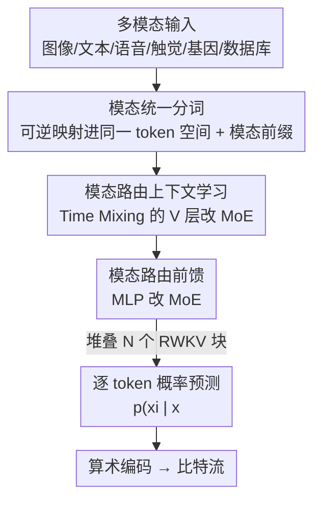

# OmniZip: Learning a Unified and Lightweight Lossless Compressor for Multi-Modal Data

**会议**: CVPR 2026  
**论文**: [CVF Open Access](https://openaccess.thecvf.com/content/CVPR2026/html/Zhao_OmniZip_Learning_a_Unified_and_Lightweight_Lossless_Compressor_for_Multi-Modal_CVPR_2026_paper.html)  
**代码**: https://github.com/adminasmi/OmniZip-CVPR2026  
**领域**: 多模态VLM / 无损压缩  
**关键词**: 无损压缩, 多模态, RWKV, 混合专家(MoE), 轻量化

## 一句话总结
OmniZip 用一个仅几 M~百 M 参数的 RWKV 骨干，配上"模态统一分词 + 模态路由 MoE"，做到一个模型无损压缩图像/文本/语音/触觉/基因/数据库七种模态，比 gzip 高 42%~62% 压缩率，还能在 MacBook CPU、iPhone NPU 上跑到约 1MB/s 的近实时速度。

## 研究背景与动机
**领域现状**：现代无损压缩的主流思路是"概率模型估计似然 + 熵编码（算术编码）逼近香农下界"——给定符号的负对数概率就是它的最优码长。近年用神经网络、甚至大语言模型来估计 $p(x_i\mid x_{<i})$ 已能显著超越 gzip/bzip2 这类经典压缩器。

**现有痛点**：作者点出两个具体问题。其一，基于 LLM 的方法（如用 LLaMA3-8B 做压缩）参数量动辄数十亿，远超被压缩数据本身——因为压缩速度由模型推理速度决定，压一张 1080p 图要 30 分钟以上、压 1GB 文本要好几天，完全无法实际部署。其二，绝大多数学习型压缩器只为单一模态设计，多模态系统里就得为每种模态各部署一个压缩器，软件复杂度和硬件成本都上去了。

**核心矛盾**：多模态无损压缩难，根子在模态异质性——文本是离散序列、图像是二维空间结构、语音是连续平滑频谱、数据库是结构化类别字段、基因是带 motif 的符号序列。少数尝试统一压缩的工作（如把一切转成 ASCII 文本喂给预训练 LLM）在非文本模态上效果很差。

**本文目标**：做一个既"统一"（一个模型覆盖多模态）又"轻量"（能在边缘设备近实时跑）的无损压缩器。

**切入角度**：与其堆大模型，不如选一个本身高效的自回归骨干（对比 Transformer/Mamba/RWKV 后选 RWKV），再在它内部用"按模态路由"的稀疏专家来吸收模态异质性——每个 token 只激活一小撮专家，参数省、速度快。

**核心 idea**：把不同模态可逆地映射进同一 token 空间，再在轻量 RWKV 骨干里用模态路由 MoE 替换原本的 V 投影和 MLP，让一个小模型按模态自适应地建模上下文与非线性变换。

## 方法详解

### 整体框架
OmniZip 把"压缩"拆成三步标准流水线：任意模态数据先经**模态统一分词**变成统一、完全可逆的 token 序列 $\{x_1,\dots,x_n\}$；再送进一个轻量 RWKV-7 预测模型，逐 token 估计上下文概率 $p(x_i\mid x_{<i})$；最后用**算术编码**把数据编到接近其熵下界 $H(p)=\mathbb{E}\big[\sum_i -\log_2 p(x_i\mid x_{<i})\big]$ 的比特流。解压时反向跑同一套即可比特级精确还原。

预测模型才是创新所在：它堆叠 $N$ 个 RWKV 块，每块包含一个 Time Mixing 模块和一个 MLP，OmniZip 把这两处分别换成**模态路由上下文学习**（Time Mixing 里的 V 投影改 MoE）和**模态路由前馈**（MLP 改 MoE），让模型按 token 所属模态稀疏地选专家。训练时还叠加重参数化分支增容、推理时合并回主路。

### 关键设计

**1. 模态统一分词：把七种异质数据可逆地塞进一个 token 空间**

痛点是模态格式天差地别，又必须保证可逆才能无损。OmniZip 按数据形态分三类处理：**文本类**（自然语言/基因/数据库）用 16K 词表的 SentencePiece BPE，并把领域符号显式加进词表（基因的 A/T/G/C 碱基、数据库的 `select`/`and`/`or` 等关键词）以提效；**图像类**（自然图/医学图/触觉）先切 $16\times16\times3$ patch 保留局部空间相关性，patch 内按光栅顺序把每个像素的 RGB 子像素 $(R_1,G_1,B_1,R_2,\dots)$ 各当一个 token，词表 256，灰度医学图则每个像素强度一个 token，触觉力数据先从 3D $(x,y,z)$ 映成 RGB 图再走图像流程；**语音**直接读原始字节流、每字节一个 token，词表也是 256。各模态词表合并成统一 token 集后，每条序列前面拼一个模态前缀 `<image>/<text>/<speech>/<gene>/...`；在 softmax 和算术编码前再做**模态掩码**，把非目标模态的 token 概率清零，从而减小估计误差、提升压缩率。这套设计的关键在于"统一"与"可逆"同时成立——不像把一切转 ASCII 的做法那样牺牲非文本模态。

**2. 模态路由上下文学习：只在 RWKV 的 V 层上做 MoE**

不同模态的上下文依赖结构不同，单一 Time Mixing 难以兼顾。作者把混合专家（MoE）只接在 Time Mixing 的 **V 投影层**上，K、R 层在所有 V 专家间共享。动机来自 RWKV 的内在机制：K 层像语义索引、R 层像记忆门控，而 V 层承载具体的记忆内容，多模态下 V 层的多样性最关键。一个可学习路由器给 token $x_i$ 对每个专家 $e$ 打分

$$g_{i,e}=\mathrm{softmax}(x_i W_g)_e=\frac{\exp(x_i W_{g,e})}{\sum_{e'=1}^{E}\exp(x_i W_{g,e'})},$$

取 top-$k$ 个专家加权输出 $V(x_i)=\sum_{e\in\text{top-}k}\hat{g}_{i,e}\cdot e(x_i)$，$\hat{g}_{i,e}$ 是重归一化分数。实现用 4 个专家、top-$k{=}2$，每个 Time Mixing 模块只多 3 个 V 层的开销，相对整模型几乎可忽略——这是"轻量"与"模态自适应"的折中点。

**3. 模态路由前馈：把通用 MLP 换成 MoE，补上非线性表达的模态灵活性**

RWKV 每块的前馈 MLP 负责增强非线性表达，但通用 MLP 抓不住各模态的差异。OmniZip 用 MoE 前馈替换它，路由策略同设计 2，区别在于专家是小 MLP 而非 V 投影层。每个 MLP 专家用 $2\times$ 隐藏因子（仅为原始大 MLP 的一半），配 4 专家、top-$k{=}2$，于是每 token 激活参数量与原 MLP 大致持平，却换来面向多模态的更强灵活性。设计 2 管"上下文怎么建模"、设计 3 管"非线性怎么变换"，两路 MoE 互补。

> 论文还观察到（图 6）：上下文路由的专家利用更不均衡、某些专家会主导特定模态，而前馈路由专家使用更均衡——提示上下文路由更多捕捉模态特异动态、前馈路由更倾向学通用表示。

### 损失函数 / 训练策略
**重参数化训练**：受 L3TC 启发，训练时给 RWKV Time Mixing 的 R/K/V 层加额外分支扩容（并对新增分支做高秩矩阵分解进一步增容），推理时把分支合并回主路，于是推理复杂度不变。**三阶段训练**稳定 MoE 优化：① 冻结前馈路由、训其余 2 epoch（lr $1\times10^{-4}$）；② 冻结上下文路由、训其余 2 epoch；③ 全解冻、用余弦退火训 20 epoch（$1\times10^{-4}\!\to\!1\times10^{-5}$）。**损失**为交叉熵主损 + MoE 辅助正则：路由器 Z-loss（惩罚 gating 大 logit、防训练不稳）与负载均衡损失（用平方变异系数 $\mathrm{CV}^2$ 惩罚专家重要性与分配方差），权重 $\lambda{=}0.001$、$\mu{=}0.01$。各模态训练集均控制在 1GB 并用均衡批采样器保证每个 batch 模态均衡。

## 实验关键数据
评测指标 **bits/Byte**（每字节压成多少比特，越低越好；括号里的百分比是相对 gzip 的压缩率提升）；复杂度看 **MACs** 与各平台推理速度 **KB/s**。共 16 个数据集、七种模态。模型分 OmniZip-S/M/L 三档（4.8M / 38M / 152M 参数）。

### 主实验
图像类（自然图 Kodak、触觉 TouchandGo、医学 Coronal）：

| 压缩器 | 参数 | Kodak | TouchandGo | Coronal | 多模态? |
|--------|------|-------|-----------|---------|---------|
| gzip | – | 4.349 | 2.298 | 4.563 | ✓ |
| JPEG-XL | – | 2.902 | 0.739 | 3.891 | ✗ |
| P2LLM | 8B | 2.830 | – | – | ✗ |
| Llama3 (预训练LLM) | 8B | 4.862 | 2.455 | 4.832 | ✓ |
| **OmniZip-S** | 4.8M | 3.307 (-24%) | 1.338 (-42%) | 4.179 (-8%) | ✓ |
| **OmniZip-L** | 152M | 2.925 (-33%) | 0.987 (-57%) | 3.837 (-16%) | ✓ |

文本/语音类（enwik9 文本、WikiSQL 数据库、LibriSpeech 语音）：

| 压缩器 | 参数 | enwik9 | WikiSQL | LibriSpeech | 多模态? |
|--------|------|--------|---------|-------------|---------|
| gzip | – | 2.590 | 1.672 | 6.511 | ✓ |
| FLAC（语音专用） | – | – | – | 4.961 | ✗ |
| Llama3 (预训练LLM) | 8B | 0.722 | 0.645 | 3.616 | ✓ |
| **OmniZip-S** | 4.8M | 1.370 (-47%) | 1.170 (-30%) | 4.155 (-36%) | ✓ |
| **OmniZip-L** | 152M | 0.980 (-62%) | 0.787 (-53%) | 3.810 (-42%) | ✓ |

要点：OmniZip 用百 M 级（甚至几 M 级）参数，在多数模态上追平或超过专用学习型压缩器，且作为**唯一兼顾"多模态 + 轻量 + 高压缩"**的方法，比同样多模态的 8B 预训练 LLM 路线（Llama3/RWKV-7B）压缩率更好、速度快一个数量级以上（A100 上 OmniZip-S 约 1223KB/s vs Llama3 约 20KB/s）。在纯文本上略逊于 NNCP/CMIX 这类专用文本压缩器（它们在 enwik9 到 0.85 左右），但那些方法又慢又只管单模态。

### 消融实验
在 OmniZip-S 上逐件拆解（bits/Byte，MacBook CPU、batch 128）：

| 配置 | enwik9 | Kodak | TouchandGo | 速度(KB/s) | 说明 |
|------|--------|-------|-----------|-----------|------|
| 仅骨干 | 1.658 | – | – | 856 | 不支持多模态 |
| + 重参数化 | 1.590 | – | – | 856 | 单文本即提升 |
| + 统一分词 | 1.660 | 3.383 | 1.453 | 856 | 解锁多模态 |
| + 前馈路由 | 1.424 | 3.352 | 1.431 | 633 | 文本大幅提升 |
| + 上下文路由 | 1.419 | 3.339 | – | 780 | 完整模型 |

### 关键发现
- 去掉任一路由模块（上下文路由 / 前馈路由）多模态压缩率都明显下降，证明两路 MoE 各有贡献；前馈路由对文本（enwik9 1.660→1.424）的提升尤其显著。
- 重参数化只在训练期增容、推理零额外开销，单文本就能从 1.658 降到 1.590。
- 骨干选型实验里 RWKV-7 在压缩率与 CPU 推理速度上同时优于同规模 Transformer（如 0.2M 时 RWKV-7 达 2292KB/s、Transformer 仅 714KB/s），Mamba 适配 CPU 后太慢被排除。
- 推理速度随 batch 增大提升、约在 batch 512 饱和；A100 上三档模型都到 MB/s，边缘端（MacBook CPU / iPhone NPU）OmniZip-S 近实时约 1MB/s。

## 亮点与洞察
- **"轻量骨干 + 模态路由 MoE"是性价比极高的组合**：不靠堆大模型，而是用稀疏专家按 token 模态激活子网络，既吸收模态异质性又把激活参数压到可在手机 NPU 跑——这套思路可迁移到任何"一个模型服务多类异质输入"的边缘部署场景。
- **只在 V 层上 MoE 的取舍很巧**：从 RWKV "K=索引、R=门控、V=内容"的机制推断 V 层多样性最关键，于是把专家算力集中在最该多样化的地方，K/R 共享省开销——这是有机制解释、而非盲目加专家的设计。
- **模态前缀 + 模态掩码**：用一个前缀 token 告诉模型"现在是什么模态"，再在熵编码前把非目标模态概率清零，等于把多模态联合词表"剪"回当前模态，简单却直接降估计误差。
- **重参数化把"训练容量"和"推理成本"解耦**：训练加分支、推理合并回主路，几乎免费地提升小模型能力，对边缘压缩器尤其值。

## 局限与展望
- 纯文本压缩率仍逊于 NNCP/CMIX 等专用文本压缩器，统一性是以单模态极致性能为代价换来的。
- 评测主要在 bits/Byte 与吞吐，没有给端到端"压缩 + 解压"的端侧能耗/内存占用细账；真实边缘部署还涉及算术编码实现的工程开销。
- MoE 专家数（4）、top-$k$（2）等是经验设定，是否对模态数更多/分布更偏的场景仍最优未充分探究。
- 语音直接按字节当 token，未利用其连续频谱结构，语音模态的提升空间（相对 FLAC 仅 15~23%）可能因此受限。
- 改进思路：把语音换成更结构化的可逆表示、按模态自适应调专家数、或引入跨模态共享专家以进一步压参数。

## 相关工作与启发
- **vs 经典通用压缩器（gzip/bzip2/zstd）**：它们无领域假设、速度快但压缩率有限；OmniZip 用学习型概率模型把多模态压缩率整体抬高 24%~62%，速度在 GPU 上同样达 MB/s 级。
- **vs 预训练 LLM 多模态压缩（Deletang et al. 用 Llama3/RWKV-7B）**：那条路线把一切转 ASCII 喂 LLM，非文本模态吃亏且参数达数十亿、速度仅 ~20KB/s；OmniZip 显式建模模态异质性，参数小两三个数量级、速度快数十倍，多数模态压缩率反而更好。
- **vs 单模态专用学习压缩器（DLPR/L3C/P2LLM 图像、NNCP/CMIX 文本、FLAC 语音）**：它们在本模态强但跨模态泛化差、需各部署一套；OmniZip 用一个统一模型在多数模态追平它们，省下多压缩器部署成本。
- **vs L3TC**：OmniZip 沿用其重参数化思路，但把它从纯文本扩展到多模态，并新增模态路由两路 MoE。

## 评分
- 新颖性: ⭐⭐⭐⭐ "统一多模态 + 轻量 + 模态路由 MoE"的组合在无损压缩里少见，但 MoE/重参数化/RWKV 都是已有零件的巧妙拼装。
- 实验充分度: ⭐⭐⭐⭐⭐ 16 数据集七模态、三档模型、多平台速度、骨干选型与逐件消融都齐，证据扎实。
- 写作质量: ⭐⭐⭐⭐ 结构清晰、机制解释到位；个别符号（如 OmniComp-S 疑为 OmniZip-S 笔误）略有瑕疵。
- 价值: ⭐⭐⭐⭐ 边缘端近实时多模态无损压缩有明确落地价值，代码开源，利于复现与部署。

<!-- RELATED:START -->

## 相关论文

- [\[ICLR 2026\] Multi-modal Data Spectrum: Multi-modal Datasets are Multi-dimensional](../../ICLR2026/multimodal_vlm/multi-modal_data_spectrum_multi-modal_datasets_are_multi-dimensional.md)
- [\[CVPR 2026\] Multi-Modal Image Fusion via Intervention-Stable Feature Learning](multi-modal_image_fusion_via_intervention-stable_feature_learning.md)
- [\[CVPR 2026\] CRIT: Graph-Based Automatic Data Synthesis to Enhance Cross-Modal Multi-Hop Reasoning](crit_graph-based_automatic_data_synthesis_to_enhance_cross-modal_multi-hop_reaso.md)
- [\[CVPR 2026\] MM-SeR: Multimodal Self-Refinement for Lightweight Image Captioning](mm-ser_multimodal_self-refinement_for_lightweight_image_captioning.md)
- [\[CVPR 2026\] Socratic-Geo: Synthetic Data Generation and Cross-Modal Geometric Reasoning via Multi-Agent Interaction](socratic-geo_synthetic_data_generation_and_cross-modal_geometric_reasoning_via_m.md)

<!-- RELATED:END -->
