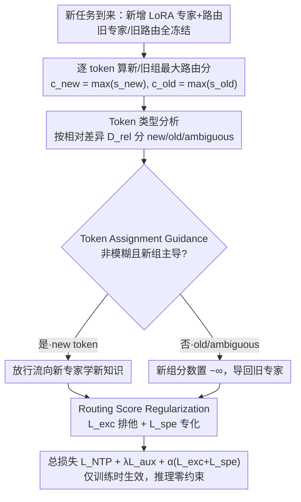

# On Token's Dilemma: Dynamic MoE with Drift-Aware Token Assignment for Continual Learning of Large Vision Language Models

**会议**: CVPR 2026  
**arXiv**: [2603.27481](https://arxiv.org/abs/2603.27481)  
**代码**: [https://zhaoc5.github.io/DyMoE](https://zhaoc5.github.io/DyMoE)  
**领域**: 多模态VLM / 持续学习  
**关键词**: 持续学习, 混合专家, 路由漂移, 大视觉语言模型, Token分配

## 一句话总结

揭示了动态 MoE 持续学习中"token 困境"——新任务数据中的模糊和旧 token 对新知识贡献微弱却会导致路由漂移和灾难性遗忘，提出 LLaVA-DyMoE 通过 Token Assignment Guidance 和 Routing Score Regularization 缓解路由漂移，在 CoIN 基准上 MFN 提升超 7%，遗忘降低 12%。

## 研究背景与动机

1. **领域现状**：大视觉语言模型（LVLM）如 LLaVA 在多种视觉语言任务上表现出色。多模态持续指令微调（MCIT）旨在让 LVLM 增量学习新任务，同时保持旧任务性能。MoE（混合专家）架构因其动态模块化和参数隔离特性成为 MCIT 的主流方案。

2. **现有痛点**：（1）固定大小的 MoE 共享专家和路由器会导致任务间干扰；（2）增量扩展 MoE 并冻结旧专家的方法虽实现了参数隔离，但仍遭受**路由漂移**（routing-drift）：旧任务 token 被错误吸引到新专家，导致遗忘；（3）现有方法通过任务级路由器来规避，但需要繁重的任务识别计算，且牺牲了 MoE 固有的 token 级路由灵活性。

3. **核心矛盾**：即使旧专家和旧路由参数被冻结，训练新添加组件仍会导致遗忘。问题的根源在于：**不是所有新任务 token 都携带真正的新模式**——part of them 与旧任务模式相似或在老/新专家间具有模糊亲和力。

4. **本文目标**（1）在 token 层面精确分析路由漂移的成因；（2）设计针对不同 token 类型的差异化路由策略来缓解遗忘。

5. **切入角度**：通过受控二任务实验，根据 token 对新/旧专家组的路由分数分布，将 token 分为三类（new/old/ambiguous），发现模糊 token 是路由漂移的主要元凶——它们既不帮助新任务学习，又在被路由到新专家时训练路由器吸引旧任务模式。

6. **核心 idea**：识别 token 类型并引导模糊/旧 token 远离新专家，同时用软正则化促进 token-专家组的排他路由和新专家专化。

## 方法详解

### 整体框架

这篇论文要解决的是动态 MoE 在多模态持续学习里"冻结了旧专家却还是会遗忘"的怪现象。LLaVA-DyMoE 的做法是：在 LLaVA 的 LLM backbone 每一层挂一组 MoE（LoRA 专家），新任务来了就新增一批专家和对应的路由参数，旧专家、旧路由器全部冻结，只训练新增的部分。表面看参数已经隔离，但训练新组件的过程本身仍会把旧任务的 token 拽到新专家上——遗忘正是从这里漏进来的。

整篇方法因此分两步走：先用一组受控实验把"到底是哪些 token 在制造漂移"看清楚，把 token 按路由倾向分成三类；再针对这三类的不同脾气下两道约束——Token Assignment Guidance (TAG) 在训练时直接改写路由分数、把可疑 token 挡在新专家门外，Routing Score Regularization (RSR) 用软损失从梯度上进一步推动"非此即彼"的排他路由。两道约束都只在训练时生效，推理时完全撤掉。

### 关键设计

**1. Token 类型分析与 Token 困境：先搞清楚到底是谁在制造遗忘**

直接给方法之前，作者先做了一组受控的二任务实验，把"冻结旧参数仍遗忘"这件事拆到 token 粒度去看。对每个新任务 token，比较它对新专家组和旧专家组的路由倾向，据此分成三类：**new token** 明显偏向新组，是真正携带新模式、驱动新知识获取的主力，遗忘代价很小；**old token** 明显偏向旧组，对新任务几乎没贡献，但它残留的那一点新组亲和力会被路由器吸收，慢慢把路由器往旧模式上带偏；**ambiguous token** 对新旧两组的亲和力几乎打平，既不帮新任务学东西、也不保护旧知识，却恰恰是漂移的主要元凶。

所谓"token 困境"就是这三类 token 的价值和代价错位了：学习价值最低的 ambiguous/old token，一旦不加引导地被放进新专家训练，反而会通过路由器的训练信号造成最大的遗忘。把因果定位到这一层，后面的解法才有的放矢——不是去压制所有 token，而是只拦住该拦的那一批。

**2. Token Assignment Guidance：在分配的源头就把可疑 token 挡回旧专家**

TAG 针对的正是上面那个困境：既然 ambiguous/old token 才是污染源，那就在训练时实时识别它们、不让它们碰新专家。具体做法是对每个 token 取新旧两组的最大路由分数 $c_\text{old} = \max(\mathbf{s}_{t-1})$、$c_\text{new} = \max(\mathbf{s}_{t,\text{new}})$，再算一个相对差异

$$D_\text{rel} = \frac{|c_\text{new} - c_\text{old}|}{\max(|c_\text{new}|, |c_\text{old}|) + \epsilon}$$

只有当这个 token 足够"不模糊"（$D_\text{rel} > \tau$）**且**确实是新组主导（$c_\text{new} > c_\text{old}$）时，才允许它流向新专家；其余情况一律把新组的路由分数置为 $-\infty$，强制它回到旧专家组。这等于在 token 分配的源头加了一道闸门：new token 自然流进新专家去学新知识，ambiguous/old token 被安全地导回旧专家，路由器再也收不到它们的"污染梯度"。举个直观的例子，若某 token 的 $c_\text{new}=0.52$、$c_\text{old}=0.50$，$D_\text{rel}\approx0.04$ 远低于阈值 $\tau=0.2$，它会被判为 ambiguous 直接 mask 回旧组；而一个 $c_\text{new}=0.8$、$c_\text{old}=0.4$ 的 token，$D_\text{rel}=0.5$ 且新组主导，才放行去新专家。

**3. Routing Score Regularization：用软损失把"非此即彼"的路由习惯训出来**

TAG 是一道硬 mask，管的是"该不该路由到新专家"这个离散决定；RSR 则从梯度层面补一刀，让路由器自己养成排他、专化的倾向。它由两个损失项组成。**排他性损失** $\mathcal{L}_\text{exc} = g_\text{old} \cdot g_\text{new}$ 直接惩罚旧新两组门控权重的乘积——只要一个 token 同时点亮了两组专家，这一项就为正，逼着路由把权重收敛到二选一。**专化损失** $\mathcal{L}_\text{spe}$ 以 $y = 1 - \max\{w_i\}_{i \in \mathcal{S}_{t-1}}$ 为软目标、用 BCE 去鼓励新专家拿到更高的路由权重 $g_\text{new}$：旧专家越不该管的 token，越要推给新专家专门处理。两项一软一稳，正好把稳定性（别遗忘旧知识）和可塑性（学得动新知识）这对矛盾分摊开来。和 TAG 互补的地方在于，TAG 是离散的 mask、RSR 是连续的梯度信号，前者卡住硬边界、后者塑形分数分布，覆盖了路由空间里不同的面。

### 损失函数 / 训练策略

总目标把三部分加在一起：

$$\mathcal{L} = \mathcal{L}_\text{NTP} + \lambda\mathcal{L}_\text{aux} + \alpha(\mathcal{L}_\text{exc} + \mathcal{L}_\text{spe})$$

其中 $\mathcal{L}_\text{NTP}$ 是标准自回归交叉熵，$\mathcal{L}_\text{aux}$ 是只作用于新专家的标准负载均衡损失，$\alpha$ 控制 RSR 的强度。关键是 TAG 和 RSR 都只在训练时生效，推理时不带任何额外约束，因此可以无缝叠到其他 MCIT 方法上。backbone 用的是未经指令微调的 LLaVA-v1.5-7B，每来一个新任务就新增一批新 LoRA 专家。

## 实验关键数据

### 主实验

CoIN 基准（8个 VQA 任务序列学习）上的对比：

| 方法 | MFN↑ | MAA↑ | BWT↑ |
|------|------|------|------|
| LoRA | 41.79 | 43.99 | -23.12 |
| MoELoRA | 43.93 | 43.92 | -22.18 |
| O-LoRA | 49.53 | 46.65 | -17.54 |
| IncMoELoRA | 49.68 | 49.50 | -16.67 |
| **LLaVA-DyMoE** | **57.03** | **57.70** | **-4.67** |

### 消融实验

| 配置 | MFN↑ | MAA↑ | BWT↑ |
|------|------|------|------|
| IncMoELoRA (baseline) | 49.68 | 49.50 | -16.67 |
| + $\mathcal{L}_\text{aux}$ | 50.76 | 51.17 | -15.44 |
| + TAG | 54.44 | 52.18 | -7.04 |
| + $\mathcal{L}_\text{exc}$ | 55.18 | 54.38 | -6.83 |
| + $\mathcal{L}_\text{spe}$ (完整) | 57.03 | 57.70 | -4.67 |

模糊阈值 $\tau$ 的影响：

| $\tau$ | MFN↑ | BWT↑ |
|--------|------|------|
| 10% | 56.87 | -4.94 |
| **20%** | **57.03** | **-4.67** |
| 30% | 56.27 | -5.21 |
| 50% | 55.32 | -5.54 |

### 关键发现

- TAG 是最关键的组件：仅添加 TAG 就使 BWT 从 -15.44 改善到 -7.04，MFN 从 50.76 提升到 54.44（+3.68%）
- 排他性损失和专化损失分别贡献了额外 0.74% 和 1.85% 的 MFN 提升
- 最优模糊阈值 $\tau=20\%$，过低（10%）则部分模糊 token 未被截获，过高（50%）则过度限制新专家的学习
- LLaVA-DyMoE 在所有 8 个单任务上都取得了最佳或次佳的最终准确率
- 在 ImageNet 任务上提升尤为显著（95.80% vs IncMoELoRA 的 68.42%），可能是因为该任务的视觉特征与其他 VQA 任务差异最大，路由漂移最严重

## 亮点与洞察

- **Token 困境的发现非常有价值**：将持续学习中的稳定性-可塑性困境精确到 token 粒度，发现模糊 token 是遗忘的主要元凶。这一洞察可以迁移到所有基于 MoE 的动态扩展方法
- **分析驱动的方法设计**：先做受控实验揭示因果关系，再据此设计针对性解法。三组 mask 实验清楚展示了三类 token 的不同作用，让方法设计有理有据
- **训练时正则化、推理时零开销**：TAG 和 RSR 仅影响训练时的路由分数，推理时无任何约束，不影响效率且可与任何其他 MCIT 方法正交组合
- 这种"分析 token 路由分布→针对性正则化"的范式可以推广到其他 MoE 场景（如多任务学习、领域适应）

## 局限与展望

- 仅在 CoIN 基准（8个 VQA 任务）上评估，未验证更多样的任务类型（如生成、检测等）
- 每个新任务添加新专家导致参数量线性增长，长期扩展的效率值得关注
- TOKEN 类型的判定完全基于路由分数的瞬时快照，可能存在训练早期判定不准确的问题
- 未探索 token 类型随训练进程的动态变化——ambiguous token 可能随训练逐渐变为 new/old token
- 缺少与最近的任务级路由方法（如 ProgLoRA）的组合实验来验证正交性声称

## 相关工作与启发

- **vs MoELoRA**: 共享路由器和专家导致任务间干扰严重（MFN 43.93 vs 57.03），LLaVA-DyMoE 通过参数隔离+路由正则化根本性解决
- **vs IncMoELoRA**: 直接增量扩展虽有参数隔离但仍有路由漂移（BWT -16.67 vs -4.67），证明了仅冻结旧参数不够——需要主动管理新参数的训练过程
- **vs O-LoRA**: O-LoRA 在 LoRA 子空间做正交约束，LLaVA-DyMoE 在路由层面做约束，两者思路互补
- **vs ProgLoRA**: ProgLoRA 通过渐进式 LoRA 池和任务隔离来缓解干扰，LLaVA-DyMoE 做 token 级细粒度管理，可以组合使用

## 评分

- 新颖性: ⭐⭐⭐⭐⭐ Token 困境的发现和分析非常深入，三类 token 的区分既符合直觉又有实验支撑
- 实验充分度: ⭐⭐⭐⭐ 消融全面且逐步叠加验证了每个组件，超参分析充分，但仅在一个 benchmark 上
- 写作质量: ⭐⭐⭐⭐⭐ 分析驱动的论文结构非常清晰，受控实验的设计和可视化都很优秀
- 价值: ⭐⭐⭐⭐⭐ 对 MoE 持续学习有深刻的机理洞察，方法简洁有效且泛化性好

<!-- RELATED:START -->

## 相关论文

- [\[CVPR 2026\] Enhancing Continual Learning of Vision-Language Models via Dynamic Prefix Weighting](enhancing_continual_learning_of_vision-language_models_via_dynamic_prefix_weight.md)
- [\[CVPR 2026\] Dynamic Token Reweighting for Robust Vision-Language Models](dynamic_token_reweighting_for_robust_vision-language_models.md)
- [\[CVPR 2026\] TransPrune: Token Transition Pruning for Efficient Large Vision-Language Model](transprune_token_transition_pruning_for_efficient_large_vision-language_model.md)
- [\[CVPR 2026\] OmniZip: Audio-Guided Dynamic Token Compression for Fast Omnimodal Large Language Models](omnizip_audio-guided_dynamic_token_compression_for_fast_omnimodal_large_language.md)
- [\[CVPR 2026\] MoE-GRPO: Optimizing Mixture-of-Experts via Reinforcement Learning in Vision-Language Models](moe-grpo_optimizing_mixture-of-experts_via_reinforcement_learning_in_vision-lang.md)

<!-- RELATED:END -->
