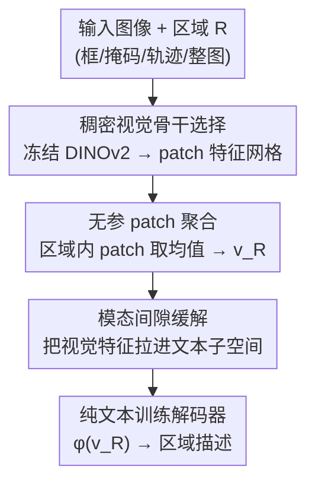

# One Patch to Caption Them All: A Unified Zero-Shot Captioning Framework

**会议**: CVPR 2026  
**论文**: [CVF Open Access](https://openaccess.thecvf.com/content/CVPR2026/html/Bianchi_One_Patch_to_Caption_Them_All_A_Unified_Zero-Shot_Captioning_CVPR_2026_paper.html)  
**代码**: https://paciosoft.com/Patch-ioner/  
**领域**: 多模态VLM  
**关键词**: 零样本描述, 区域级captioning, patch聚合, DINOv2, 模态间隙

## 一句话总结
把零样本图像描述从"以整图为单位"改成"以 patch 为原子单位"，用冻结的稠密视觉骨干（DINOv2 系）抽 patch 特征、按区域做无参聚合、再喂给纯文本训练的解码器，从而在不用任何区域级标注的前提下，用一个统一框架同时干掉单 patch / 框 / 鼠标轨迹 / 整图等多粒度描述任务。

## 研究背景与动机

**领域现状**：近年的"零样本 captioner"（DeCap、CapDec、CLOSE、ViECap 等）走的是同一条路——借 CLIP 把图像和文本压进同一个共享语义空间，然后**只用纯文本**训练一个文本解码器，让它学会从文本嵌入还原句子；推理时把图像嵌入当成"伪文本嵌入"直接解码。这样不需要成对的图文数据就能造出 captioner。

**现有痛点**：这类方法全都停留在**整图（global）表示**上——拿的是 CLIP 的 CLS token，描述的是"整张图"。一旦你想描述图里的某个**区域**（一个框、一组框、甚至一条鼠标轨迹），它们要么束手无策，要么只能把区域抠出来（crop）单独喂进去，结果丢掉了全局上下文、对区域产生误判。而传统的区域级 captioning（dense captioning、controllable captioning）虽然能做，却需要**每个框配一句人工 ground-truth 描述**这种昂贵到无法规模化的监督。

**核心矛盾**：想要区域级描述的灵活性，就得付出区域级标注的代价；想零样本免标注，又只能困在整图粒度。两者之间没有桥。

**切入角度**：作者抓住一个被忽视的事实——现代 ViT 架构里，图像表示的**原子单位本来就是 patch**。如果能为单个 patch 生成描述，那任意区域（框/掩码/轨迹/整图）都不过是"一堆 patch 的集合"，把它们的特征聚合起来就行。问题随之收敛成一个尖锐的提问：**在没有任何 patch 级 ground-truth 的情况下，怎么造一个能描述单 patch 的模型？**

**核心 idea**：用 **patch-to-caption** 取代 image-to-caption。把描述对象从整图下移到 patch，区域表示=区域内 patch 特征的无参聚合，再套一个纯文本解码器——只要视觉骨干能产出**语义有意义的稠密 patch 特征**（这正是 DINO 而非 CLIP 的强项），整套零样本机制就能从"整图描述"平滑迁移到"任意区域描述"。

## 方法详解

### 整体框架

框架（作者称 Patch-ioner）建立在三条假设上：训练时**没有区域-文本配对**、视觉骨干**全程冻结**、解码器**只用纯文本训练**（连图文对都没有）。在这些约束下，一张图的处理被拆成三步串行：① 冻结的视觉-语言骨干 $\psi_v$ 把整图编码成稠密的、语言对齐的 patch 嵌入网格 $V=\{v_i\}$；② 给定一个区域 $R$（无论它是框、掩码、轨迹还是整图），选出落在 $R$ 内的那些 patch，对它们的特征做**无参聚合**得到区域嵌入 $v_R$；③ 一个纯文本训练的解码器 $\phi$ 把 $v_R$ 解码成自然语言。

关键在于公式上的解耦：传统方法是 $t=D(I,R)$，图像编码和区域指定纠缠在一起、必须用区域标签端到端训练；本文把它重写为

$$t=\phi\big(\mathrm{agg}_R(\psi(I),\,R)\big)$$

——视觉编码 $\psi(I)$ 与区域 $R$ 无关、只跑一次；区域选择被推迟成一个**无参数的固定聚合** $\mathrm{agg}_R$；真正可学的解码器 $\phi$ **不直接看区域**，因此训练它不需要任何区域标签。这一拆分让整图骨干只前向一次，就能复用同一份 patch 特征去描述图里任意多个区域，互不重跑。

### 关键设计

**1. patch 为原子、区域作集合：late region selection 的重表述**

针对"要灵活区域描述就得要区域标注"这个死结，作者把描述的最小单元从整图降到 patch，并把"区域"定义成 patch 索引的集合。形式上，图被切成 $P\times P$ 的不重叠 patch，骨干编码出网格 $V=\psi_v(I)=\{v_i\}$；一个区域 $R$ 只是选出一个子集 $S$，区域嵌入按 $v_S=\sum_{i\in S}w_i v_i$ 得到。这一步之所以关键，是因为它把"区域指定"从**模型内部的可学操作**变成了**推理时的纯几何选择**——解码器永远只看一个聚合后的向量、不知道也不关心它来自一个 patch 还是一组框，于是训练它就彻底摆脱了区域标签。所有任务（dense / region-set / trace / image captioning）的差异只剩"怎么选 patch"，框架本身一字不改。

**2. 无参 patch 聚合：用集合算子换取任意区域的统一表示**

聚合权重 $w_i$ 怎么定？作者试过均匀、高斯、注意力加权等多种方案，发现**具体选哪种对区域描述影响很小**，于是默认就用最简单的均值 $w_i=1/|S|$。这看似平淡，却正是统一性的来源：用一个**集合算子**而非可学模块去聚合，意味着框、掩码、轨迹、单点、整图网格全都能被表达成"对某个 patch 子集取平均"。例如整图描述就是对全部 patch 取均值 $v_I=\mathrm{avg}_i(v_i)$；region-set 描述则把多个框覆盖的 patch 一起平均（同一 patch 落进多个框时自然被加权更多次，见原文式 (1)）；轨迹描述把轨迹经过的点映射到对应 patch 索引再取均值 $v_T=\frac{1}{L}\sum_{j=1}^{L}v_{i_j}$。无参也意味着零额外训练成本，且骨干特征只需算一次即可复用。

**3. 稠密语义骨干选择：为什么必须是 DINO 而不是 CLIP**

整套方案的命门是 $\psi_v$ 能否产出**逐 patch 有意义**的特征。CLIP 虽然图文对齐，但它的 patch token 缺乏空间细节（局部 patch 与细粒度语义存在错配），直接拿来做区域描述效果很差。作者据此大量探索 DINOv2 系骨干——DINO 用稠密局部对比目标预训练、局部语义建模能力强，但缺一座通往语言的桥。于是采用 DINO.txt、Talk2DINO 这类把 CLIP 文本表示映射到 DINOv2 patch 空间、从而让稠密特征"语言对齐"的变体，其中 Talk2DINO 表现最好，被定为默认骨干。这条设计把"零样本区域描述能不能成立"直接归因到骨干的稠密局部语义质量上，是全文最有说服力的实证主张。

**4. 模态间隙缓解：让纯文本解码器读懂视觉特征**

即便图文在同一个多模态空间，文本嵌入和图像嵌入实际占据**互相分离的子空间**（modality gap），一个只在文本嵌入上训练的解码器直接吃视觉嵌入往往读不懂。作者对比了三种缓解策略：(i) **记忆库投影**——推理时把区域表示 $v$ 投到文本子空间，写成对一组文本嵌入记忆 $M$ 的相似度加权组合 $v_{proj}=M\alpha$，其中 $\alpha=\mathrm{softmax}(\frac{1}{\tau}M^\top v)$，$\tau$ 控制权重分布的锐度；(ii) **噪声注入**——训练解码器时往输入加扰动，逼它对"位于另一个子空间的视觉嵌入"也保持鲁棒（对应 CLOSE / CapDec 的思路）；(iii) **扩散桥**——用一个在文本流形上训练的扩散模型，把 patch 表示迭代地"refine"向文本子空间靠拢。主实验默认采用记忆库投影，因为它既能与同架构的既有工作直接对比，实测也最优。

## 实验关键数据

评测覆盖四个不同粒度的任务，主指标用 CIDEr（C，句法重叠）和 RefPAC-S（P，语义相似度），整图任务额外报 CLIP-Score。

### 主实验：本文框架（Talk2DINO 骨干）vs 零样本 captioner

| 任务 (数据集) | 指标 | 本文 (Talk2DINO) | ViECap | MeaCap | DeCap |
|------|------|------|------|------|------|
| Trace (COCO) | C | **27.9** | 24.3 | 22.5 | 20.5 |
| Dense (VG v1.2) | C | **31.9** | 26.4 | 28.6 | 24.6 |
| Region-Set (COCO Entities) | C | **109.1** | 102.7 | 97.9 | 95.1 |
| Image (COCO) | C | 69.2 | 75.6 | 77.8 | 79.3 |

在强调局部内容的 **trace / dense / region-set** 三类任务上，patch-centric 框架全面领先所有基线，甚至超过依赖掩码监督的 AlphaCLIP、用 crop 模拟区域的适配版；只有在**整图描述**上略逊于 MERCap、EntroCap 这类专门为整图设计的架构（整图本就是 global 方法的主场）。⚠️ 表中 ViECap/MeaCap/DeCap 的 dense 列为 crop 适配版数值，以原文 Table 2 为准。

### 消融：骨干选择（同一框架，仅换 $\psi_v$）

| 视觉骨干 | Trace-C | Dense-C | Region-Set-C | Image-C |
|------|------|------|------|------|
| CLIP B/16 | 10.9 | 10.9 | 41.6 | 42.1 |
| DenseCLIP | 18.6 | 19.9 | 51.0 | 28.0 |
| INViTE | 13.8 | 16.8 | 43.3 | 21.3 |
| SigLIP2 | 18.3 | 19.8 | 47.2 | 27.7 |
| DINO.txt | 23.2 | 23.4 | 91.8 | 67.8 |
| **Talk2DINO** | **27.9** | **31.9** | **109.1** | **69.2** |

### 关键发现
- **骨干是决定性变量**：普通 CLIP 在 region-set 上只有 41.6 CIDEr，换成 DINOv2 系的 Talk2DINO 直接飙到 109.1，差距巨大——印证"稠密局部语义质量"才是零样本区域描述能否成立的根。强化 CLIP 局部性的 DenseCLIP / INViTE 居中，也支持这一假设。
- **聚合方式不敏感**：均匀/高斯/注意力聚合对区域描述影响很小，因此默认用最简单的均值，统一性与简洁性兼得（整图任务上注意力加权偶尔略好，作者按需使用）。
- **新任务 Trace Captioning**：作者基于 Localized Narratives 用 LLM（LLaMA 3）清洗鼠标轨迹+语音转录，构建了 4,949 张 COCO 图 / 14,283 条描述、1,000 张 Flickr30K 图 / 26,614 条描述的轨迹描述基准，专门展示 patch 表示对自由形状区域的灵活性。

## 亮点与洞察
- **"区域=patch 集合"是极简却强大的视角切换**：它把多个原本各自为政、各需专门监督的区域描述任务（dense / controllable / trace / image）统一进一个零改动框架，差别仅在"怎么选 patch"，工程上极其干净。
- **把零样本能力的瓶颈精确归因到骨干**：本文最"啊哈"的地方是用一张消融表说清"为什么 CLIP 做不了、DINO 能做"——稠密局部语义而非全局对齐才是区域描述的关键，这个结论对其他需要 patch 级语义的零样本任务（开放词表检测/分割）有直接借鉴价值。
- **特征算一次、区域描述任意多**：骨干前向与区域选择解耦，意味着同一张图缓存一份 patch 特征后可零成本地描述任意多个区域，天然适合交互式标注场景。

## 局限与展望
- **依赖外部区域来源**：dense captioning 里作者直接用 ground-truth 框、省略了定位子任务；真实落地仍需额外的 region-proposal 模型来给出框，框架本身不做定位。
- **天花板受骨干钳制**：整个方法不训练骨干，因此 patch 特征的语义上限完全由 DINO.txt / Talk2DINO 这类现成桥接模型决定，骨干的对齐误差会原样传导到描述质量。
- **整图任务仍落后专用模型**：在 image captioning 上略逊于 MERCap / EntroCap，说明纯靠 patch 均值聚合在需要全局抽象与取舍的整图描述上不如专门设计的架构；引入外部知识/检索（ViECap/MeaCap 风格）能补流畅度，但与记忆库解码器相比并无压倒优势。
- ⚠️ 均值聚合对"哪些 patch 真正属于该区域"的边界比较粗糙，对小目标或非紧凑区域可能引入背景 patch 噪声，原文未深入量化这一点。

## 相关工作与启发
- **vs DeCap / CapDec / CLOSE（纯文本零样本 captioner）**：它们共享"CLIP 共享空间 + 纯文本解码"的底座，但只在整图 CLS 表示上工作；本文把同一套机制下移到 patch 级，并指出换成稠密骨干后就能解锁区域描述，相当于给这一整类方法补上了"区域维度"。
- **vs DenseCLIP / RegionCLIP（区域级增强 CLIP）**：它们靠额外的区域级监督（pixel-to-text 损失、region-proposal 构造区域-文本对）来强化局部对齐；本文完全不要区域监督，靠骨干自带的稠密语义 + 无参聚合达成，定位在"no-region-label"设定内。
- **vs Talk2DINO / DINO.txt（语言对齐稠密表示）**：本文不是和它们竞争，而是把它们当作即插即用的视觉骨干——它们负责"让 DINO patch 会说话"，本文负责"把会说话的 patch 聚合成区域并解码"，是清晰的上下游分工。

## 评分
- 新颖性: ⭐⭐⭐⭐⭐ 把 image-to-caption 重述为 patch-to-caption，统一多粒度零样本区域描述，视角切换干净且有力。
- 实验充分度: ⭐⭐⭐⭐ 覆盖四任务八数据集、骨干消融充分，但部分关键消融（聚合算子/模态间隙策略）放在补充材料。
- 写作质量: ⭐⭐⭐⭐ 公式解耦讲得清楚，主张-证据对应明确；表格密集需对照原文阅读。
- 价值: ⭐⭐⭐⭐⭐ 用免标注方式解锁任意区域描述，并把瓶颈归因到稠密骨干，对零样本区域级理解有普适启发。

<!-- RELATED:START -->

## 相关论文

- [\[CVPR 2026\] OneThinker: All-in-one Reasoning Model for Image and Video](onethinker_all-in-one_reasoning_model_for_image_and_video.md)
- [\[AAAI 2026\] Plug-and-Play Clarifier: A Zero-Shot Multimodal Framework for Egocentric Intent Disambiguation](../../AAAI2026/multimodal_vlm/plug-and-play_clarifier_a_zero-shot_multimodal_framework_for_egocentric_intent_d.md)
- [\[CVPR 2026\] Beyond Heuristic Prompting: A Concept-Guided Bayesian Framework for Zero-Shot Image Recognition](beyond_heuristic_prompting_a_concept-guided_bayesian_framework_for_zero-shot_ima.md)
- [\[CVPR 2026\] FlowComposer: Composable Flows for Compositional Zero-Shot Learning](flowcomposer_composable_flows_for_compositional_zeroshot_learning.md)
- [\[CVPR 2026\] Training-Only Heterogeneous Image-Patch-Text Graph Supervision for Advancing Few-Shot Learning Adapters](training-only_heterogeneous_image-patch-text_graph_supervision_for_advancing_few.md)

<!-- RELATED:END -->
