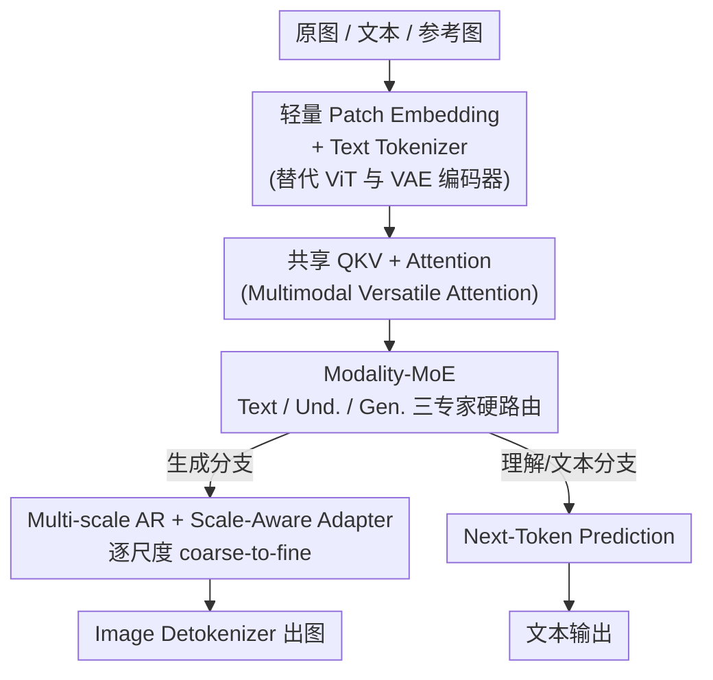

# OneCAT: Decoder-Only Auto-Regressive Model for Unified Understanding and Generation

**会议**: CVPR 2026  
**论文**: [CVF Open Access](https://openaccess.thecvf.com/content/CVPR2026/html/Li_OneCAT_Decoder-Only_Auto-Regressive_Model_for_Unified_Understanding_and_Generation_CVPR_2026_paper.html)  
**代码**: https://onecat-ai.github.io/ （项目页）  
**领域**: 多模态VLM / 统一理解与生成  
**关键词**: 统一多模态、Decoder-only、自回归生成、Modality-MoE、Next-Scale Prediction

## 一句话总结
OneCAT 把"理解 + 生成 + 编辑"塞进**同一个 decoder-only Transformer**，靠一个按模态硬路由的 MoE（文本/理解/生成三类专家）实现 encoder-free 推理，并首次把**多尺度自回归生成**搬进 LLM（配 Scale-Aware Adapter），在统一模型里同时拿到 SOTA 性能和约 10× 于扩散模型的生成速度。

## 研究背景与动机
**领域现状**：当下的多模态系统大多走"模块化"路线——理解用一套（ViT + LLM）、生成用扩散模型、编辑又另起一套 pipeline。即便号称"统一"的模型（如 BAGEL、Mogao）也常用 Mixture-of-Transformers（MoT）：AR 分支管理解、diffusion 分支管生成，外挂 ViT 当视觉编码器、外挂 VAE tokenizer 做生成，本质上还是"几个模型拼在一起"。

**现有痛点**：这种多模块设计有两个硬伤。其一，跨模态的深度早期融合被架构卡死——视觉先被独立编码器压成语义特征，再喂给 LLM，文本和像素在底层根本没机会交互。其二，外挂组件（尤其 ViT 编码器和扩散去噪）带来巨大推理延迟，高分辨率输入/输出时尤其要命。

**核心矛盾**：要"统一"，就得让一个模型同时学会两种性质相反的任务——理解需要把图像**压成抽象语义**（连续 token），生成需要把语义**铺成像素细节**（离散 token）。共享同一套参数会让两个目标在训练早期抢梯度、互相打架；可一旦拆成两套子网络，又退回了模块化的老路。

**本文目标**：造一个**纯 decoder-only、纯自回归、推理时不挂任何 ViT / VAE 编码器**的统一架构，既要早融合、又要避免理解与生成互相干扰，还要快。

**切入角度**：作者赌的是"纯自回归足以撑起统一多模态智能"。视觉输入不再过重编码器，而是用一层轻量 Patch Embedding 直接打成连续 token 进 LLM；生成则把视觉 AR 从"逐 token"换成 VAR 的"逐尺度"（coarse-to-fine），既绕开扩散的高延迟，又天然契合 next-token 范式。

**核心 idea**：用**按模态硬路由的 MoE**让同一个 decoder 在共享注意力的同时为不同模态准备专用 FFN，再用**统一 AR 目标**把理解、生成、编辑统一成"预测下一个（token 或尺度）"。

## 方法详解

### 整体框架
OneCAT 从预训练的 Qwen2.5 LLM 初始化，整个系统就是**一个 decoder-only Transformer**：注意力（QKV + Attention）全模态共享，只在 FFN 处按模态分叉成三个专家。推理时输入有三种 token——文本 token（经 Text Tokenizer）、连续视觉 token（原图经 Patch Embedding，用于理解和编辑的参考图）、离散视觉 token（生成时由模型自己产出）。输出端：文本走 Text Detokenizer，生成图走 Image Detokenizer（多尺度 VAE 的解码器）。关键在于**推理时不需要 ViT，也不需要 VAE 编码器**——VAE 只在训练时用来把目标图编码成多尺度离散 token 当 ground-truth，推理时只用它的 detokenizer 还原图像。

理解走 **Next-Token Prediction**，生成走 **Next-Scale Prediction**（图像从最低分辨率到最高分辨率逐尺度生成）。编辑则把参考图过 Patch Embedding 得到连续 token、路由进理解专家当视觉条件，再让 LLM 自回归地吐出新图的离散 token，整个过程不改任何架构。

### 关键设计

**1. Modality-MoE：让一个 decoder 同时擅长理解与生成，又不互相抢参数**

理解和生成对 token 的需求是相反的（语义压缩 vs 细节铺陈），共享一套 FFN 会让两者在训练时争夺同一批参数。OneCAT 在每个 Transformer block 里把 Qwen2.5 原来的 FFN 复制三份，构成三个专家：**Text. FFN**（文本 token，做语言理解）、**Und. FFN**（连续视觉 token，做视觉理解）、**Gen. FFN**（离散视觉 token，做图像生成）。路由用的是**硬路由（hard routing）**——不学门控，直接按 token 的模态和任务类型派给对应专家。注意力层（QKV + Attention）三类模态全共享，这样既保证了参数效率，又能在注意力层完成跨模态早期对齐、利于指令遵循。这是它能"encoder-free 还统一"的根基：视觉不再被独立编码器隔离，原始 patch embedding 直接进共享注意力和模态专属 FFN，文本与像素从第一层就开始融合。

**2. 多尺度视觉自回归 + Scale-Aware Adapter（SAA）：把 VAR 搬进 LLM 并按尺度分治**

逐 token 生成图像又慢又难，扩散又有高延迟。OneCAT 借用 Infinity 的多尺度 VAE（下采样率 16、latent 通道 32、bitwise quantizer 扩词表）把图像编码成**层级化的多尺度离散 token**，让 LLM 用 **Next-Scale Prediction** 从低分辨率到高分辨率逐尺度生成。问题是这些 token 性质差异很大：低尺度 token 编码颜色、光照、粗结构等低频全局信息，高尺度 token 编码纹理、细节等高频信息——用同一个 Gen. FFN 平等处理会限制表达力。为此作者提出 **SAA**：在 Gen. FFN 的每个线性层上并联一组**尺度专属**的旁路（skip connection），SAA 数量与 VAE 尺度数相等，推理时按 scale index 把离散 token 路由到对应尺度的 adapter。每个 adapter 用 LoRA 式低秩分解（秩 $r=64$）保证参数高效，但**和 LoRA 不同，SAA 是端到端联合训练、作为 LLM 永久组件存在**，不是事后微调插件。消融显示去掉 SAA 后 GenEval 从 81.2 掉到 78.1。

**3. 多模态多用途注意力（Multimodal Versatile Attention）：一套注意力适配四类任务**

不同模态/任务对注意力的需求不同，硬塞一种掩码会损性能。基于 FlexAttention，OneCAT 给三类 token 配不同掩码：文本 token $T$ 用**因果注意力**（自回归生成必需）；连续视觉 token $U$（理解输入或编辑参考图）用**全注意力**做全局交互；多尺度离散视觉 token $G$ 用**块因果注意力（block causal）**——同一尺度内 token 互相自由注意，跨尺度之间遵循因果顺序。这样文本对话、多模态理解、文生图、图像编辑四种场景能在同一个 LLM 里用同一套注意力实现，不必为每个任务改架构。

**4. 三阶段训练 + 理解蒸馏：用定制教师把视觉感知高效灌进理解专家**

Und. FFN 是从 LLM 纯文本 FFN 初始化的，"暖启动"利于抽象推理但缺视觉知识，从零学视觉极其耗数据。OneCAT 设计了三阶段管线来分阶段建能力、最小化冲突。**Stage 1（多模态预训练）** 分两步：Stage 1-1 先**定制一个 MLLM 教师**——把预训练 ViT（InternViT）和 Qwen2.5 用两层 MLP 连起来，冻住 ViT 和 LLM、只在小规模图文对上用 NTP loss 训 MLP connector（仅 5B token），关键是教师和学生共用同一 LLM backbone 以保证参数一致、提升蒸馏稳定性；Stage 1-2 冻住 QKV/Attention/Text FFN，**分别**预训练 Und. FFN（理解蒸馏）和 Gen. FFN（生成预训练），避免两个专家早期抢共享参数。理解蒸馏的目标是

$$L_{Und} = L_{NTP} + \lambda L_{Distill}, \quad L_{Distill} = \sum_{n=1}^{N}\mathrm{MSE}\big(h_S^{(n)}, h_T^{(n)}\big)$$

即在 NTP 交叉熵之外，对**每一层** Transformer 的隐状态做学生-教师特征级 MSE 对齐（$\lambda=0.02$）。作者强调对齐**全层隐状态**而非只对最后一层 logits——消融里"全层隐状态蒸馏"平均分 35.3，明显高于"只蒸最后一层 logits/hidden"的 33.9。**Stage 2（统一中训）** 解冻全模型，跨四类任务（图→文、文→图、编辑、纯文本对话）联合训练，此阶段加入 SAA 并引入原生分辨率策略。**Stage 3（统一 SFT）** 在高质量数据上做监督微调，把生成图边长扩到 288–1776。

### 损失函数 / 训练策略
理解侧用 $L_{Und}=L_{NTP}+\lambda L_{Distill}$；生成侧用 next-scale prediction 的交叉熵；推理用 CFG（训练时随机丢弃条件文本/参考图 token）提升生成质量。数据量：5.19 亿理解样本、6300 万生成样本、4000 万纯文本，训练 token 比例 文本:理解:生成 = 1:6:7。两个变体：OneCAT-1.5B（总 4.5B、激活 1.5B）、OneCAT-3B（总 9B、激活 3B）。

## 实验关键数据

### 主实验

理解 benchmark（encoder-free 统一模型里刷出 SOTA，"/"表示无需外挂视觉组件）：

| 模型 | 视觉组件 | DocVQA | ChartQA | AI2D | MME-P | MMB | MMVet |
|------|---------|--------|---------|------|-------|------|-------|
| Janus-Pro-7B（统一） | SigLIP | - | - | - | 1567 | 79.2 | 50.0 |
| HoVLE-2.6B（encoder-free 理解专用） | / | 86.1 | 78.6 | 73.0 | - | 71.9 | 44.3 |
| Qwen2.5-VL-3B（encoder-based 理解专用） | 0.6B ViT | 93.9 | 84.0 | 81.6 | - | 79.1 | 61.8 |
| **OneCAT-3B** | **/** | **91.2** | **81.2** | **77.8** | **1630** | **78.8** | **52.2** |

生成 benchmark（GenEval / DPG，†=用 LLM 改写 prompt；OneCAT 不改写）：

| 模型 | GenEval Overall↑ | Counting | Color Attri. | DPG Overall↑ |
|------|------------------|----------|--------------|--------------|
| Janus-Pro-7B | 0.80 | 0.59 | 0.66 | 84.19 |
| BAGEL-7B† | 0.88 | 0.84 | 0.77 | - |
| Mogao-7B† | 0.89 | 0.83 | 0.80 | 84.33 |
| OneCAT-1.5B | 0.85 | 0.83 | 0.75 | 81.72 |
| **OneCAT-3B** | **0.90** | 0.84 | 0.80 | **84.53** |

编辑（ImgEdit-Bench）OneCAT-3B Overall 3.43，超过 BAGEL-7B（3.20）和 OmniGen2（3.44 持平），在 Adjust/Extract/Background 等需精细调整的类目领先。

推理效率（H800，encoder-free 的核心收益）：

| 任务 | 对比对象 | 分辨率 | 基线 | OneCAT-3B | 降幅 |
|------|---------|--------|------|-----------|------|
| 理解 TTFT | Qwen2.5-VL-3B | 1792² | 0.583s | 0.225s | 61%↓ |
| 文生图 | BAGEL-7B | 1024² | 26.29s | 2.85s | 89%↓ |
| 图像编辑 | BAGEL-7B | 1024² | 46.44s | 4.61s | 90%↓ |

### 消融实验

| 配置 | 关键指标 | 说明 |
|------|---------|------|
| 全层隐状态蒸馏（Full） | Avg. 35.3 | 完整蒸馏策略 |
| 只蒸最后一层 logits | Avg. 33.9 | 掉 1.4 |
| 无蒸馏 | Avg. 31.4 | 掉 3.9，证明蒸馏必要 |
| 定制教师 | Avg. 35.3 | 教师/学生共用 backbone |
| Qwen2.5-VL 当教师 | Avg. 33.7 | 现成教师反而更差 |
| w/ SAA | GenEval 81.2 / DPG 74.9 | 完整 |
| w/o SAA | GenEval 78.1 / DPG 74.0 | GenEval 掉 3.1 |

### 关键发现
- **全层隐状态蒸馏 > 末层 logits 蒸馏**：把视觉知识从教师灌进理解专家时，对齐每一层的内部计算模式比只对齐最终输出更有效（35.3 vs 33.9）。
- **定制教师 > 现成教师**：让教师和学生共用同一 LLM backbone，比直接拿 Qwen2.5-VL 当教师高 1.6 分——参数一致性带来更稳的蒸馏。
- **生成 token 配额有边际效应**：文本:理解:生成 从 5B:10B:10B 加到 30B，GenEval 81.2、DPG 微涨，再加到 45B 收益趋平，说明生成能力不必无限堆数据。
- **encoder-free 的速度优势在高分辨率/大输出时最明显**：1792² 理解省 61% 首 token 延迟，1024² 生成/编辑约 10× 于扩散基线。

## 亮点与洞察
- **"推理时丢掉编码器"是真省**：训练用 VAE/ViT，推理只留 detokenizer 和轻量 Patch Embedding，把统一模型最贵的两块（ViT 编码、扩散去噪）一次性砍掉——这是工程上最可复用的洞察。
- **硬路由 MoE 的极简主义**：不学门控、纯按模态派专家，却足以在统一 AR 目标下让理解与生成共存，说明"统一"不一定要复杂的 MoT 双 Transformer。
- **SAA = 把"尺度分治"做成永久低秩旁路**：借 LoRA 的低秩形式但端到端常驻，给不同频率信息的尺度配专用通路，思路可迁移到任何多尺度/多分辨率的 AR 生成。
- **Next-Scale Prediction 进 LLM**：用 coarse-to-fine 的逐尺度生成替代逐 token，既保住自回归范式又拿到接近扩散的质量、远快于扩散的速度。

## 局限与展望
- 理解上对顶级 encoder-based 模型（Qwen2.5-VL-3B）仍有差距，作者归因于训练数据规模/质量（OneCAT 理解仅用 0.5T token，Qwen2.5-VL 用 4T），认为可靠扩数据 + 高质量长 CoT 指令弥补——⚠️ 这是作者的解释，是否纯数据问题待更大规模验证。
- 生成依赖外部多尺度 VAE（Infinity）的 detokenizer，画质上限部分受 VAE 约束。
- 硬路由按模态分专家，跨模态/混合任务（如图文交错生成）是否需要更灵活的路由，文中未深入。
- 仅在 1.5B/3B 规模验证，更大 LLM backbone 下 Modality-MoE 与统一 AR 的扩展性还需观察。

## 相关工作与启发
- **vs MoT 统一模型（BAGEL、Mogao）**：它们用分离的 Transformer 分别做 AR 理解和 diffusion 生成、外挂 ViT/VAE；OneCAT 用单 decoder + 模态 MoE 的纯 AR 设计，推理更快（约 10×），且证明"简单 MoE 在统一 AR 目标下就够用"。
- **vs encoder-free 理解专用模型（EVE、VoRA、Mono-InternVL）**：它们只做理解；OneCAT 额外提出"定制教师 + 全层隐状态蒸馏"提升训练效率（同设定下优于把 EVE/VoRA 蒸馏法搬过来），并把能力扩到生成与编辑。
- **vs VAR / Infinity（多尺度视觉 AR）**：OneCAT 把 next-scale prediction 从纯视觉模型搬进 LLM，并用 SAA 解决"不同尺度 token 性质差异"被共享 FFN 抹平的问题。

## 评分
- 新颖性: ⭐⭐⭐⭐⭐ 首个 encoder-free 的统一 MLLM，把多尺度视觉 AR 搬进 LLM + 模态 MoE，范式上很干净
- 实验充分度: ⭐⭐⭐⭐⭐ 理解/生成/编辑三类 benchmark 全覆盖，效率与蒸馏/SAA 消融都到位
- 写作质量: ⭐⭐⭐⭐ 架构与训练管线讲得清晰，部分动机句有笔误但不影响理解
- 价值: ⭐⭐⭐⭐⭐ 统一多模态的强 baseline，encoder-free + 纯 AR 的工程收益对后续系统很有参考价值

<!-- RELATED:START -->

## 相关论文

- [\[CVPR 2026\] HBridge: H-Shape Bridging of Heterogeneous Experts for Unified Multimodal Understanding and Generation](hbridge_h-shape_bridging_of_heterogeneous_experts_for_unified_multimodal_underst.md)
- [\[CVPR 2026\] Rosetta Stone for Unified MLLMs: A Unified Tokenizer to Decipher Understanding and Generation](rosetta_stone_for_unified_mllms_a_unified_tokenizer_to_decipher_understanding_an.md)
- [\[CVPR 2026\] DuetSVG: Unified Multimodal SVG Generation with Internal Visual Guidance](duetsvg_unified_multimodal_svg_generation_with_internal_visual_guidance.md)
- [\[CVPR 2026\] UniCompress: Token Compression for Unified Vision-Language Understanding and Generation](unicompress_token_compression_for_unified_vision-language_understanding_and_gene.md)
- [\[ICCV 2025\] GenDoP: Auto-regressive Camera Trajectory Generation as a Director of Photography](../../ICCV2025/multimodal_vlm/gendop_auto-regressive_camera_trajectory_generation_as_a_director_of_photography.md)

<!-- RELATED:END -->
