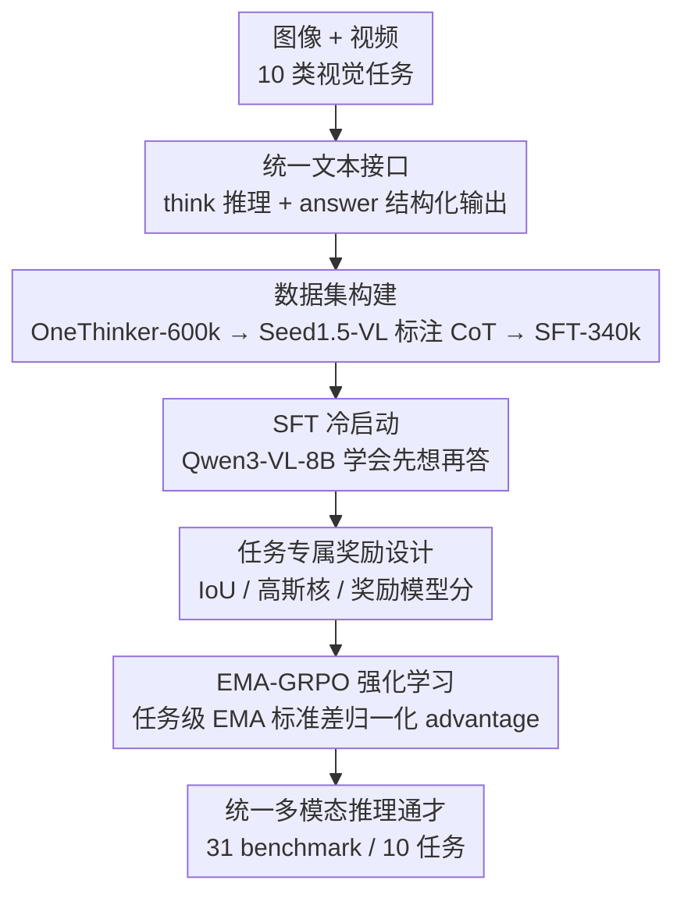

# OneThinker: All-in-one Reasoning Model for Image and Video

**会议**: CVPR 2026  
**arXiv**: [2512.03043](https://arxiv.org/abs/2512.03043)  
**代码**: https://github.com/tulerfeng/OneThinker (有)  
**领域**: 多模态VLM / LLM推理  
**关键词**: 多模态推理通才, 强化学习, GRPO, 多任务奖励归一化, 图像视频统一

## 一句话总结
用一个 8B 模型同时把图像和视频上的 10 类基础视觉任务（问答、描述、时空 grounding、跟踪、分割）统一成「先 think 再结构化输出」的推理范式，靠新提出的 EMA-GRPO 解决多任务 RL 里不同任务奖励量纲/密度差异巨大导致的优化失衡，在 31 个 benchmark 上全面超越同规模专用模型。

## 研究背景与动机

**领域现状**：DeepSeek-R1 之后，用规则奖励 + GRPO 做 RL 来激发推理能力的范式被大量搬到多模态大模型（MLLM）上：Vision-R1 做图像问答、Video-R1 做视频问答、VLM-R1 做检测、Seg-R1 做分割、Time-R1 做时序定位……每个工作都在自己那一个任务、自己那一种模态上把推理能力刷得很高。

**现有痛点**：这些「思考模型」几乎都是**单任务 + 单模态**的。要么只吃图像、要么只吃视频；要么只会 QA、要么只会 grounding。少数尝试多任务的工作（如 VideoChat-R1）也被限制在很窄的子集里——它只在 3 个时空感知任务、共 18k 样本上做联合训练，而且完全锁死在视频模态。这种割裂一方面让模型在实际部署里通用性极差（一个场景得挂一堆专用模型），另一方面也切断了任务之间、模态之间本可以互相促进的知识迁移。

**核心矛盾**：要把异构视觉任务塞进**同一个**模型做多任务 RL，会撞上一个绕不开的奖励失衡问题。不同任务的奖励**量纲和密度天差地别**：数学 QA 是稀疏的 0/1 奖励，grounding 是连续且范围很窄的 IoU 奖励。标准 GRPO 用「每个 prompt 组内的标准差」做归一化，会偏向低方差样本（任务内失衡 intra-task imbalance）；而 Dr.GRPO 那样干脆去掉标准差归一化，又会让稀疏奖励任务（数学）主导梯度、把密集小幅奖励任务（检测）压制掉（任务间失衡 inter-task imbalance）。两条路各踩一个坑。

**本文目标**：训一个真正的「**多模态推理通才**」——单个模型同时处理图像和视频上一系列基础视觉任务，并且让训练过程在异构奖励下保持稳定平衡。这分解为两个子问题：(1) 如何构造覆盖所有这些任务、且模态平衡的大规模数据；(2) 如何设计一个同时解决任务内和任务间失衡的 RL 算法。

**切入角度**：作者把「视觉天然同时包含静态图像和动态视频」当成出发点——既然真实世界要求对各种视觉任务做统一推理，那就把所有任务都铸成同一个文本接口（`<think>` 推理 + `<answer>` 结构化结果），让它们能在同一个 RL 框架里共训。

**核心 idea**：用**任务级别的奖励标准差 EMA**（指数滑动平均）替代 GRPO 里的「组内即时标准差」做 advantage 归一化——每个任务用自己一条平滑且自适应的归一化尺度，同时根治任务内和任务间两种失衡。

## 方法详解

### 整体框架
OneThinker 要解决的是「一个 8B 模型干 10 类异构视觉任务」。整体分三步走：先**构数据**（OneThinker-600k 覆盖图像/视频的 8 大类任务，再用商用大模型 Seed1.5-VL 标注并过滤出 340k 条高质量 CoT 子集）；再用这 340k CoT 做 **SFT 冷启动**，让基座 Qwen3-VL-Instruct-8B 先学会「先思考再回答」的格式；最后在 600k 全量语料上跑 **EMA-GRPO 强化学习**，把推理能力真正打磨上去。

关键在于所有任务都被统一进同一个文本接口：模型先在 `<think>...</think>` 里写内部推理，再在 `<answer>...</answer>` 里给出任务专属结果。对感知类任务（grounding/跟踪/分割），`<answer>` 里是预定义 JSON schema 的结构化表示（时间区间、bounding box、稀疏点），这样既能自动解析、又能算可验证的规则奖励。每类任务都设计了专属的 accuracy 奖励（见下），统一形式 $R = R_{\text{acc}} + R_{\text{format}}$。RL 阶段则用 EMA-GRPO 处理这些奖励的异构性。

### 关键设计

**1. 统一文本接口 + 任务专属可验证奖励：把 10 类异构任务铸成同一种「思考→结构化输出」格式**

多任务 RL 的前提是所有任务都能算出可比较、可自动验证的奖励，否则没法共训。OneThinker 让模型对每个任务都输出 `<think>` 推理 + `<answer>` 结构化结果，并为每类任务定制 accuracy 奖励：规则 QA（选择/数值/数学/OCR）用答案是否等价判对错，回归类用 Mean Relative Accuracy（多个容差阈值下预测与参考值的相对接近度），OCR 用 Word Error Rate；开放式 QA 与 caption 没有唯一答案，改用外部奖励模型 POLAR-7B 给相似度分 $R_{\text{acc}}=\mathrm{RM}(q,\hat a,a)$；时序 grounding 用时间 IoU $R_{\text{acc}}=\mathrm{tIoU}([\hat s,\hat e],[s,e])$，空间 grounding 用框 IoU $\mathrm{sIoU}(\hat b,b)$，时空 grounding 则把两者相加 $\mathrm{tIoU}+\overline{\mathrm{sIoU}}$，跟踪用整条轨迹的平均框 IoU $\overline{\mathrm{sIoU}}$。

分割任务最巧妙：模型不直接吐 mask，而是预测一个 bounding box + 一组正/负点，喂给 SAM2 生成最终 mask（视频分割还要额外预测一个关键帧时间 $\hat t$ 指示这些框/点应用在哪一帧）。由于在所有 rollout 上跑 SAM2 算 mask 奖励延迟太高，作者直接省掉 mask 奖励，改用一个**高斯核** $\mathcal{G}(d)=\exp(-d^2/2\sigma^2)$ 把「预测点到真值点的最小匹配距离」归一化到 $[0,1]$ 当奖励（空间 $\sigma=50$、时间 $\sigma=1$）。图像分割奖励为 $R_{\text{acc}}=\mathrm{sIoU}(\hat b,b)+\mathcal{G}(\mathrm{dis}_+)+\mathcal{G}(\mathrm{dis}_-)$，视频分割再加一项 $\mathcal{G}(|\hat t-t|)$ 约束关键帧时间。正负点各取 3 个。这套设计让分割也变成了「框+点+时间」的结构化预测，从而被纳入同一个规则 RL 框架。

**2. OneThinker-600k 数据集 + Seed1.5-VL CoT 标注：撑起多模态通才的训练语料**

要让单模型同时掌握逻辑推理、知识推断、空间感知、时序理解、因果推断等多种能力，必须有足够大、足够多样、且模态平衡的数据。作者从大量公开训练集里收集并精筛，构造出约 60 万条的 OneThinker-600k，覆盖图像/视频两种模态下的规则 QA、开放式 QA、caption、空间/时序/时空 grounding、跟踪、分割八大类任务，且刻意做了模态与难度的平衡。

为了给 SFT 冷启动提供「会思考」的种子，作者用强商用模型 Seed1.5-VL 在 600k 上生成 CoT 标注，并对不同任务设不同的过滤阈值保证保留下来的 CoT 轨迹准确，经规则校验和质量筛选后得到 34 万条的 OneThinker-SFT-340k。这一步是后续 RL 能稳定起步的基础：直接对基座做 RL 往往冷启动困难，先用高质量 CoT 把「先想再答」的格式和基本推理习惯灌进去，RL 才好接着优化。

**3. EMA-GRPO：用任务级 EMA 标准差同时根治任务内与任务间失衡**

这是全文的算法核心。标准 GRPO 的 advantage 用**当前 prompt 组内的即时标准差**做归一化，问题是组内方差极小或极大的样本会拿到更强的更新，而中等难度样本（rollout 方差通常大）反而被欠优化——这是**任务内失衡**。Dr.GRPO 干脆去掉标准差归一化，避免了任务内偏置，却让不同任务因奖励尺度/密度不同而互相挤压：稀疏奖励任务（数学）主导信号、密集小幅奖励任务（grounding）被压低——这是**任务间失衡**。两者是互补的两个坑。

EMA-GRPO 的做法是：为每个任务 $\tau$ 维护其奖励一阶矩、二阶矩的 EMA。设当前 batch 中属于任务 $\tau$ 的奖励为 $\{R_i\}$，记 $\mu^\tau(t)=\mathrm{mean}(\{R_i\})$、$\nu^\tau(t)=\mathrm{mean}(\{R_i^2\})$，则按衰减因子 $\beta=0.99$ 更新

$$m_1^\tau(t)=\beta\,m_1^\tau(t-1)+(1-\beta)\,\mu^\tau(t),\quad m_2^\tau(t)=\beta\,m_2^\tau(t-1)+(1-\beta)\,\nu^\tau(t).$$

任务级标准差由 $\sigma^\tau(t)=\sqrt{m_2^\tau(t)-(m_1^\tau(t))^2}$ 给出，advantage 改为用这条平滑的任务级标准差归一化：

$$A_i^\tau(t)=\frac{R_i-\mathrm{mean}(\{R_j\})}{\sigma^\tau(t)}.$$

为什么这样能同时治两个病：在**同一任务内**，所有 rollout 共用同一个归一化尺度 $\sigma^\tau(t)$，不再因单组方差大小而偏置某些样本，中等难度样本不再被欠优化（治任务内）；**跨任务**之间，每个任务用自己独立、反映自身奖励动态的 $\sigma^\tau(t)$，梯度贡献被各自的尺度拉平，稀疏奖励任务不再淹没密集任务（治任务间）。EMA 的平滑性还让这个尺度既稳定又能随训练中奖励分布漂移自适应。初期 $\sigma^\tau(t)$ 尚未稳定时，把 advantage clip 到 $[-5,5]$ 保数值稳定。最终 policy 更新就是把这个 EMA 归一化的 $A_i^\tau(t)$ 套进标准 GRPO 的裁剪目标 + KL 正则。

### 损失函数 / 训练策略
RL 阶段采用标准 GRPO 目标，只是 advantage 换成 EMA 归一化版本：

$$\mathbb{E}_{q,\{o_i\}}\Big[\tfrac{1}{G}\sum_{i=1}^{G}\big(\min(r_i A_i^\tau, \mathrm{clip}(r_i,1-\epsilon,1+\epsilon)A_i^\tau)-\beta_{\mathrm{KL}}D_{\mathrm{KL}}(\pi_\theta\|\pi_{\mathrm{ref}})\big)\Big],$$

其中 $r_i=\pi_\theta(o_i|q)/\pi_{\theta_{\text{old}}}(o_i|q)$。训练用 32 张 H800，基座 Qwen3-VL-Instruct-8B：SFT batch 32、lr $1\times10^{-5}$；RL batch 128、lr $2\times10^{-6}$、组大小 8、$\beta_{\mathrm{KL}}=0.01$、$\beta=0.99$、最大响应 4096 token、视频最多 128 帧。SFT/RL 都按图像-视频平衡采样，RL 里丢弃全对或全错的 rollout。整个训练约 10 天。

## 实验关键数据

在 31 个 benchmark、10 类任务上评测，基座对照统一用复现的 Qwen3-VL-Instruct-8B。

### 主实验

图像/视频问答（部分代表性指标）：

| 任务 | benchmark | 指标 | Qwen3-VL-8B | OneThinker-8B |
|------|-----------|------|------|------|
| 图像 QA | MMMU | acc | 60.2 | **70.6** |
| 图像 QA | MathVerse | acc | 58.1 | **64.3** |
| 图像 QA | ScienceQA | acc | 92.0 | **96.5** |
| 视频 QA | LongVideo-Reason | acc | 71.5 | **79.2** |
| 视频 QA | VideoMathQA | acc | 24.3 | **35.0** |
| 视频 QA | VideoHolmes | acc | 40.9 | **48.7** |

感知类任务（grounding / 跟踪 / 分割）：

| 任务 | benchmark | 指标 | Qwen3-VL-8B | OneThinker-8B |
|------|-----------|------|------|------|
| 时序 grounding | ActivityNet | mIoU | 29.1 | **45.9** |
| 空间 grounding | RefCOCO testA | acc | 92.2 | **93.7** |
| 时空 grounding | STVG | sIoU | 13.6 | **36.7** |
| 跟踪 | GOT-10k | AO | 33.7 | **73.0** |
| 跟踪 | GOT-10k | R@0.5 | 28.9 | **84.4** |
| 视频分割 | ReasonVOS | J&F | 19.6 | **54.9** |
| 视频分割 | MeViS | J&F | 22.9 | **52.7** |

感知任务的提升尤其惊人：跟踪 AO 从 33.7→73.0、视频分割 J&F 翻了一倍多。值得注意的是跟踪用 32 帧预测（比 VideoChat-R1 的 8 帧难得多）仍大幅领先。

### 消融实验

去掉/替换关键组件（各任务取组内 benchmark 平均）：

| 配置 | QA | 时序grd | 空间grd | 时空grd | 跟踪 | 分割 | 说明 |
|------|----|---------|---------|---------|------|------|------|
| Qwen3-VL-8B | 65.0 | 30.8 | 86.6 | 19.5 | 33.7 | 50.0 | 基座 |
| OneThinker-SFT | 67.0 | 31.8 | 87.8 | 27.1 | 48.1 | 62.8 | 只 SFT 无 RL |
| OneThinker-GRPO | 67.2 | 46.9 | 86.5 | 34.5 | 65.5 | 62.3 | RL 换原始 GRPO |
| OneThinker-DrGRPO | 67.6 | 46.3 | 88.2 | 34.0 | 67.8 | 61.2 | RL 换 Dr.GRPO |
| **OneThinker-8B** | **69.8** | **49.7** | **89.2** | **38.1** | **73.0** | **64.2** | 完整 EMA-GRPO |

### 关键发现
- **EMA-GRPO 是涨点主力**：把它换成原始 GRPO 或 Dr.GRPO，所有任务都掉点（如 QA 69.8→67.2/67.6、跟踪 73.0→65.5/67.8），印证同时治任务内/任务间失衡的必要性；只 SFT 不 RL 则在感知类任务上落后更多。
- **跨任务/跨模态知识迁移真实存在**：选择性删数据的分析（表 10）显示，删掉时序 grounding 数据会显著拖累视频 QA 和跟踪（说明时序定位增强了时序感知与序列推理）；删掉空间 grounding 会拉低图像 QA 和分割（空间定位提供结构/位置线索）；删掉图像 QA 竟严重拖垮**视频** QA（视频 QA 61.1→58.2），说明高质量图像 QA 学到的通用推理能跨模态迁移到视频。
- **初步零样本泛化**：在训练中未见过的任务（取自 MMT-Bench 的点跟踪、图像质量评估、GUI、旋转目标检测等）上，OneThinker 仍明显超过 Qwen3-VL-8B，显示统一推理带来的迁移性。

## 亮点与洞察
- **把「奖励异构性」当成多任务 RL 的头号敌人来正面解决**，而不是简单混数据。EMA-GRPO 的洞察很干净：任务内失衡和任务间失衡是同一枚硬币的两面（用不用组内 std 各踩一个坑），而「每个任务一条平滑自适应的标准差」恰好一招制两敌——这个思路可直接迁移到任何「奖励量纲差异大」的多任务 RL（不限视觉）。
- **分割任务的「框+点+时间→SAM2」转化很巧**：把本来要算 mask IoU（跑 SAM2 太慢）的分割，降维成结构化的框/点/关键帧预测 + 高斯核距离奖励，既规避了 rollout 阶段的高延迟，又让分割融进统一规则 RL 框架。这种「用可验证的结构化代理目标替代昂贵的最终目标」是可复用的 trick。
- **「图像 QA 数据反哺视频 QA」的发现有实操价值**：当视频高质量推理数据稀缺时，堆图像 QA 也能涨视频推理——给做视频模型的人指了一条数据捷径。

## 局限与展望
- **视频分割省掉了 mask 奖励**：因 SAM2 在 rollout 上延迟太高，作者直接用框/点/关键帧的代理奖励，没有真正优化 mask 质量，可能限制分割上限；如何低成本引入 mask 级反馈是后续方向。
- **重度依赖商用模型与外部组件**：CoT 标注、grounding/分割点标注都来自 Seed1.5-VL，开放式 QA/caption 奖励来自 POLAR-7B，分割 mask 来自 SAM2——数据与奖励质量受这些外部黑盒约束，复现成本和上限都被它们牵制。
- **泛化仍是「初步」**：零样本只在 MMT-Bench 少量任务上验证，作者自己也只敢称 preliminary；规模、模态（音频/3D）、任务种类的进一步扩展，以及 EMA-GRPO 在更多任务并存时是否仍稳定，都还没回答。

## 相关工作与启发
- **vs Video-R1 / Vision-R1（单任务单模态 R1）**：它们各自把图像 QA 或视频 QA 刷到很高，但只会一种任务一种模态；OneThinker 用一个模型覆盖 10 类任务两种模态，且在 LongVideo-Reason 等上反超 Video-R1（79.2 vs 67.2），优势是通用性与知识迁移，代价是数据/训练成本巨大。
- **vs VideoChat-R1（小规模多任务）**：它在 3 个时空任务、18k 样本、纯视频上做联合训练；OneThinker 把规模拉到 600k、八大类任务、图像+视频，并在 grounding/跟踪上全面领先，证明「多任务通才」需要足够大且模态平衡的语料才立得住。
- **vs 标准 GRPO / Dr.GRPO（RL 算法）**：GRPO 的组内 std 归一化致任务内失衡、Dr.GRPO 去 std 致任务间失衡；EMA-GRPO 用任务级 EMA std 同时绕开两者，是对 GRPO 在异构多任务场景下的针对性改进，消融里稳定优于两者。

## 评分
- 新颖性: ⭐⭐⭐⭐⭐ EMA-GRPO 对「任务内/任务间失衡」的统一刻画清晰，把 10 类异构视觉任务统一进单模型的尝试也少见
- 实验充分度: ⭐⭐⭐⭐⭐ 31 benchmark / 10 任务全覆盖，含算法消融 + 跨任务删数据分析 + 零样本泛化，证据链完整
- 写作质量: ⭐⭐⭐⭐ 方法与奖励定义交代清楚，公式齐全；部分表格指标密集、个别表述略冗
- 价值: ⭐⭐⭐⭐⭐ 多模态推理通才方向 + 可迁移的多任务 RL 归一化方法 + 全量代码/模型/数据开源，落地与复用价值高

<!-- RELATED:START -->

## 相关论文

- [\[CVPR 2026\] One Patch to Caption Them All: A Unified Zero-Shot Captioning Framework](one_patch_to_caption_them_all_a_unified_zero-shot_captioning_framework.md)
- [\[CVPR 2026\] MUPO: All Roads Lead to Rome - Incentivizing Divergent Thinking in Vision-Language Models](mupo_all_roads_lead_to_rome_incentivizing_divergent_thinking_in_vlms.md)
- [\[AAAI 2026\] ClearAIR: A Human-Visual-Perception-Inspired All-in-One Image Restoration](../../AAAI2026/multimodal_vlm/clearair_a_human-visual-perception-inspired_all-in-one_image_restoration.md)
- [\[CVPR 2026\] PhysInOne: Visual Physics Learning and Reasoning in One Suite](physisinone_visual_physics_learning_and_reasoning_in_one_suite.md)
- [\[CVPR 2026\] MSJoE: Jointly Evolving MLLM and Sampler for Efficient Long-Form Video Understanding](msjoe_jointly_evolving_mllm_and_sampler_for_efficient_long-form_video_understand.md)

<!-- RELATED:END -->
