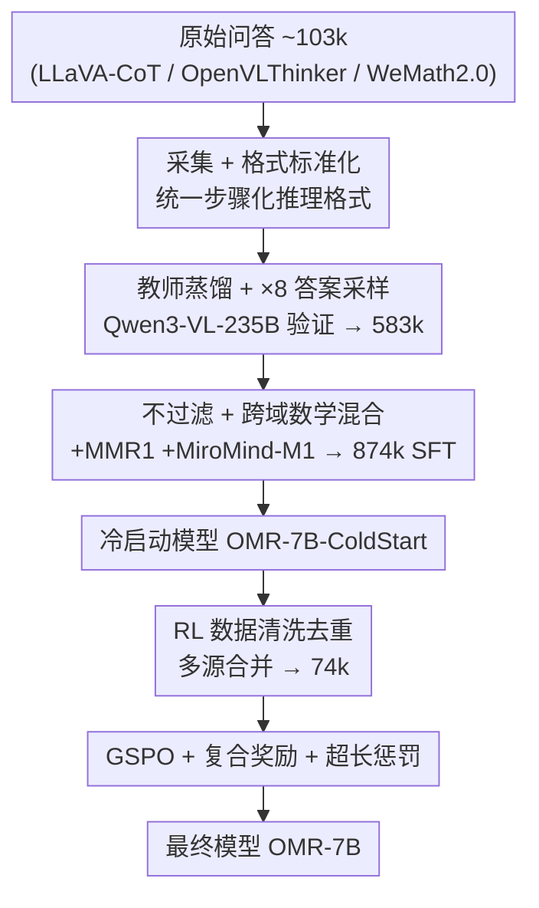

# OpenMMReasoner: Pushing the Frontiers in Multimodal Reasoning with an Open and General Recipe

**会议**: CVPR 2026  
**论文**: [CVF Open Access](https://openaccess.thecvf.com/content/CVPR2026/html/Zhang_OpenMMReasoner_Pushing_the_Frontiers_in_Multimodal_Reasoning_with_an_Open_CVPR_2026_paper.html)  
**代码**: https://github.com/EvolvingLMMsLab/OpenMMReasoner  
**领域**: 多模态VLM / LLM推理  
**关键词**: 多模态推理, SFT冷启动, 强化学习, 数据蒸馏, GSPO

## 一句话总结
OpenMMReasoner 给"如何把开源多模态大模型训成强推理模型"提供了一套**全透明、可复现的两阶段配方**：先用 874k 高质量蒸馏数据做 SFT 冷启动，再用 74k 数据做 RL（GSPO）打磨，在 Qwen2.5-VL-7B 基础上九个多模态推理基准平均提升 11.6%。

## 研究背景与动机
**领域现状**：RLVR（带可验证奖励的强化学习）在 DeepSeek-R1、OpenAI o1/o3 等文本模型上证明了"多步推理 + 自我验证"可以纯靠大规模 RL 涌现。社区自然想把这套能力迁移到多模态大模型（LMM），让模型在看图算数学、读图表、解谜题这类任务上也会"想"。

**现有痛点**：尽管多模态推理进展很快，但**训练管线极不透明**。大多数工作只报告"我们做了 SFT 和 RL"，却不公开数据是怎么筛的、teacher 怎么选的、各阶段哪个设计真正起作用，也很少有完整消融。这让结果难以复现，也让人看不清"一个会推理的 LMM 到底是怎么炼出来的"。

**核心矛盾**：现有努力要么只覆盖 SFT（如部分纯文本工作），要么 SFT/RL 都碰但**给不出一套能跨任务、跨模态泛化的统一配方**（作者点名 Open Vision Reasoner / OVR 属于后者）。缺的不是某个单点技巧，而是一条"从原始数据到强推理模型"的端到端、可复制的链路。

**本文目标**：在开源 LMM（Qwen2.5-VL-7B-Instruct）上，系统性地回答"SFT 数据怎么造、RL 怎么调"两个子问题，并把每一步的设计依据用消融实验讲清楚。

**切入角度**：作者把整件事当成一个**数据工程 + 训练策略的实证研究**来做——不发明新算法，而是穷举对比 teacher 选择、答案采样倍数、过滤策略、域混合、RL 算法、奖励设计等关键变量，找出真正有效的组合。

**核心 idea**：用"强 teacher 蒸馏 + 答案多样性放大 + 不过度过滤 + 跨域混合"造出高质量 SFT 冷启动数据，再用 GSPO + 复合奖励 + 超长惩罚做 RL 稳定打磨，并把全部数据/代码/权重开源。

## 方法详解

### 整体框架
OpenMMReasoner 是一条串行的两阶段管线：**SFT 冷启动阶段**先把模型从"普通指令模型"调成"会写步骤化推理链的基础推理模型"，**RL 阶段**再在这个冷启动模型上进一步锐化和稳定推理能力。SFT 数据从 103k 原始问答出发，经三步演化（采集格式化 → 蒸馏放大 → 跨域混合）长成 874k；RL 数据则单独清洗去重得到 74k。

整条流程清晰、阶段分明，且每个贡献节点都对应后面一个关键设计：

### 关键设计

**1. 教师蒸馏 + 答案多样性：用更强 teacher 反复采样，把"答案多样性"当成独立的扩数据轴**

SFT 冷启动的质量直接决定 RL 的上限，但单纯堆题目数量收益有限。作者的做法分两步：先**选 teacher**——用多个候选模型对同一批题生成推理链，只保留同时通过规则验证器和 LLM-as-judge 的样本（约 59k verified traces）；对比发现更强的 teacher 一致更好，Qwen3-VL-235B-Instruct 把平均分从 baseline 的 45.3 拉到 50.5，故选它做 teacher。第二步是**答案多样性放大**：在同一批题目上让 teacher 重复采样 $\times1/\times2/\times4/\times8$ 条不同的验证推理链，平均分从 $\times1$ 的 50.5 单调升到 $\times8$ 的 55.2。这说明"同一道题给模型看多种正确解法"本身就是一条独立于"题目多样性"的提升轴——最终采用 $\times8$，把数据从 59k 扩到约 583k。

**2. 不过滤 + 跨域混合：少做减法、多做加法，保住答案多样性并补齐数学短板**

直觉上 SFT 前要按难度/长度过滤掉"差样本"，但作者实测两种过滤都**掉点**：长度过滤把平均分从 55.2 降到 54.2，难度过滤更是降到 51.3。原因是过滤砍掉了答案多样性，而多样性恰恰是质量来源，因此最终采用 **no-filter** 策略，保留完整 583k。另一方面，蒸馏数据对数学推理覆盖不足，于是再混入 MMR1（图像数学）和 MiroMind-M1（文本数学）两类监督，图文数学一起加时平均分从 55.2 升到 56.3（MathVision 从 34.6 → 36.6），跨域知识带来了可迁移的推理增益。两步合起来得到最终 874k SFT 配方。

**3. RL 配方：GSPO 算法 + 复合奖励 + 超长惩罚，在锐化推理的同时控制"过度思考"**

RL 阶段先在统一设定下对比 GRPO、DAPO、GSPO 三种算法。GSPO 用**序列级**重要性比率替代 GRPO 的 token 级比率、并用更小的裁剪阈值，表现出更快收敛、更高奖励、更稳定的训练动态；DAPO 虽做了在线过滤但早期就熵坍缩、且 rollout 需求大导致进展慢——故选 GSPO。奖励是**任务正确性 + 格式一致性**的加权组合 $R = (1-\lambda_{fmt})\cdot R_{acc} + \lambda_{fmt}\cdot R_{fmt}$，取 $\lambda_{fmt}=0.1$。此外针对 OVR 那种"推理链过长但效率低"的问题，借鉴 DAPO 的**超长惩罚**抑制 overthinking，在 MMMU/We-Math 上以更短的推理预算达到更高准确率。值得注意：作者还试了课程学习（按 pass rate 从易到难采样），但消融显示它**不优于**直接混合采样，故最终采用 no-sampling。

### 损失函数 / 训练策略
- **SFT**：以 Qwen2.5-VL-7B-Instruct 为初始 checkpoint，用 LMMs-Engine 训练，online packing + Liger-Kernel 加速，训到收敛。
- **RL**：用 verl + vllm 加速，温度 1.0，从 SFT 最优 checkpoint（$\times8$ 采样 + 图文数学混合那版）起步；GSPO 目标 $J_{GSPO}$ 基于序列似然的重要性比率 $s_i$ 做裁剪优化，复合奖励系数 $\lambda_{fmt}=0.1$。

## 实验关键数据

### 主实验
九个多模态推理基准（MathVista / MathVision / MathVerse / DynaMath / WeMath / LogicVista / MMMU / MMMU-Pro / CharXiv）上，对比同规模 7B 模型（指标越高越好，下表取代表性子项）：

| 模型 | 阶段 | MathVista | MathVision | LogicVista | 备注 |
|------|------|-----------|------------|------------|------|
| Qwen2.5-VL-7B（baseline） | — | 69.2 | 25.5 | 53.1 | 起点 |
| OMR-7B-ColdStart（本文 SFT） | 874k SFT | 74.8 | 36.6 | 67.2 | 仅冷启动已大幅领先 |
| OVR-7B | 2M SFT + 300k RL | 72.1 | 51.8 | 64.8 | 强 RL baseline |
| **OMR-7B（本文 full）** | 874k SFT + 74k RL | **79.5** | 43.6 | **79.0** | 多数基准 SOTA |

作者强调：相对 Qwen2.5-VL-7B-Instruct，OMR-7B 在九个基准上**平均提升 11.6%**，且用的 SFT/RL 数据量（874k / 74k）远小于 OVR 的 2M / 300k，体现出配方的数据效率。⚠️ 缓存表头与数值存在 OCR 串列，个别次级列（如 MMMU-Pro 各子项）对应关系以原文 Table 6 为准。

### 消融实验

| 消融维度 | 配置 | 平均分 | 结论 |
|----------|------|--------|------|
| Teacher 选择 | baseline → Qwen2.5-VL-72B → Qwen3-VL-235B | 45.3 → 49.8 → 50.5 | teacher 越强越好 |
| 答案采样 | $\times1$ → $\times8$ | 50.5 → 55.2 | 答案多样性是独立增益轴 |
| 过滤策略 | no-filter / length / difficulty | 55.2 / 54.2 / 51.3 | 过滤反而掉点 |
| 域混合 | no-mix → Img+TxtMath | 55.2 → 56.3 | 跨域提升泛化 |
| RL 算法 | DAPO×16 / GRPO×16 / GSPO×16 | 48.9 / 51.1 / 54.3 | GSPO 最稳最优 |

### 关键发现
- **答案多样性比题目数量更值钱**：同一批题目靠 $\times8$ 重复采样就能从 50.5 涨到 55.2，提示"造数据时多保留正确解法的多样性"是性价比最高的轴。
- **过滤是把双刃剑**：常规的难度/长度过滤在这里都掉点，因为它们牺牲了多样性；本文反直觉地选择不过滤。
- **GSPO 的序列级比率更适合多模态 RL**：相比 GRPO/DAPO 收敛更快、训练更稳；而温度调到 1.4 时 GSPO 会崩（缓存中 GSPO+×16+temp1.4 平均分仅 7.4，疑似训练发散 ⚠️）。
- **课程学习未必有用**：按难度从易到难的采样不优于直接混合采样，最终弃用。

## 亮点与洞察
- **把"配方"本身当作贡献**：不发明新算法，而是把 teacher 选择、采样倍数、过滤、域混合、RL 算法、奖励逐一做对照消融，给出一份可照抄的工程清单——对想复现多模态推理模型的人极有参考价值。
- **"答案多样性是独立扩数据轴"这个观察很可迁移**：在任何蒸馏式 SFT 里，对同题多次采样正确解都可能比单纯加题更划算。
- **全透明开源**（数据管线 + SFT/RL 数据 + 权重）：相比只放权重的工作，它让"训练动态如何演化"变得可研究。
- **效率视角**：用超长惩罚显式压制 overthinking，在更短推理预算下超过 OVR，提醒社区"更长的推理链 ≠ 更好"。

## 局限与展望
- **规模与骨干单一**：全部实验围绕 Qwen2.5-VL-7B 单一骨干、单一规模，配方在更大/更小模型或别的骨干上是否同样成立未验证。
- **结论依赖具体基准**：九个基准多偏数学/图表/谜题类推理，对开放式视觉推理、长视频等任务的泛化性未充分检验；不同任务难度下"平均提升 11.6%"不可直接外推。
- **奖励与超参经验性强**：$\lambda_{fmt}=0.1$、$\times8$ 采样、no-filter 等都是实证最优，缺乏理论刻画，换数据分布可能需重新调。
- **改进方向**：把"答案多样性"显式建模进数据选择目标、探索自动 teacher 选择、以及在 RL 中自适应调节推理长度预算。

## 相关工作与启发
- **vs OVR（Open Vision Reasoner）**：OVR 也覆盖 SFT+RL，但用了 2M/300k 的更大数据且推理链过长、效率低；本文用 874k/74k 更小数据 + 超长惩罚，在多数基准上反超并更高效。
- **vs ThinkLite-VL / MM-Eureka**：它们主要在 RL 数据构造上给出清晰方法，但未提供统一覆盖 SFT+RL 的可泛化配方；本文补上了从冷启动到 RL 的端到端链路。
- **vs 纯文本 RLVR 工作（DeepSeek-R1 / o1）**：本文把 RLVR 范式迁移到多模态，并实证了 GSPO 在跨模态场景的稳定性优势。

## 评分
- 新颖性: ⭐⭐⭐⭐ 不是新算法，但"系统化全透明配方 + 答案多样性轴"的实证组合有真价值。
- 实验充分度: ⭐⭐⭐⭐⭐ 九基准主实验 + 多维度细致消融，结论都有数据支撑。
- 写作质量: ⭐⭐⭐⭐ 逻辑清晰、消融讲得透；个别表格在缓存里 OCR 串列需对照原文。
- 价值: ⭐⭐⭐⭐⭐ 全开源数据/代码/权重，是复现多模态推理模型的高可用参考配方。

<!-- RELATED:START -->

## 相关论文

- [\[CVPR 2026\] GThinker: Towards General Multimodal Reasoning via Cue-Guided Rethinking](gthinker_towards_general_multimodal_reasoning_via_cue-guided_rethinking.md)
- [\[CVPR 2026\] R-C2: Cycle-Consistent Reinforcement Learning Improves Multimodal Reasoning](r-c2_cycle-consistent_reinforcement_learning_improves_multimodal_reasoning.md)
- [\[CVPR 2026\] R-4B: Incentivizing General-Purpose Auto-Thinking in MLLMs via Bi-Mode Annealing and Reinforce Learning](r-4b_incentivizing_general-purpose_auto-thinking_in_mllms_via_bi-mode_annealing_.md)
- [\[CVPR 2026\] From Indoor to Open World: Revealing the Spatial Reasoning Gap in MLLMs](from_indoor_to_open_world_revealing_the_spatial_reasoning_gap_in_mllms.md)
- [\[CVPR 2026\] UI-Lens: Assessing General MLLMs' Potential to Automate UI Display Quality Assurance](ui-lens_assessing_general_mllms_potential_to_automate_ui_display_quality_assuran.md)

<!-- RELATED:END -->
