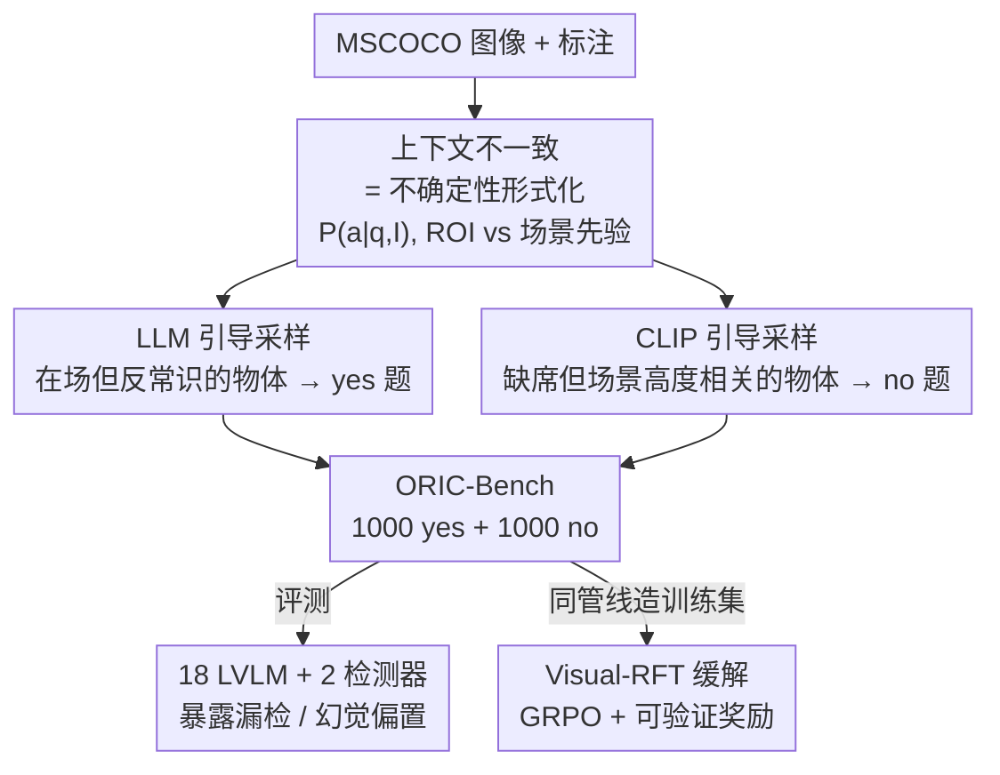

# ORIC: Benchmarking Object Recognition under Contextual Incongruity in Large Vision-Language Models

**会议**: CVPR 2026  
**论文**: [CVF Open Access](https://openaccess.thecvf.com/content/CVPR2026/html/Li_ORIC_Benchmarking_Object_Recognition_under_Contextual_Incongruity_in_Large_Vision-Language_CVPR_2026_paper.html)  
**代码**: https://github.com/ZhaoyangLi-1/ORIC  
**领域**: 多模态VLM  
**关键词**: 物体识别, 上下文不一致, 幻觉, 不确定性, 基准测试

## 一句话总结
ORIC 把"物体出现在不该出现的场景 / 该出现却缺席"这种**上下文不一致**形式化为一种不确定性来源，用 LLM 引导和 CLIP 引导两种采样策略从 MSCOCO 造出专门考验这种情形的二分类基准 ORIC-Bench，揭示 18 个主流 LVLM 在此场景下宏 F1 从近满分跌到约 60–80，并用 600 条 ORIC 风格样本做 Visual-RFT 微调把表现拉回来且更贴近人类判断。

## 研究背景与动机

**领域现状**：大视觉语言模型（LVLM）在视觉问答、图像描述、机器人等任务上靠"看图说话"取得了大量进展，其底座能力之一是准确的物体识别——回答"图里有没有某个物体"。在 POPE、AMBER、HallusionBench 等现有基准上，顶尖模型的存在性判断已接近满分。

**现有痛点**：这些基准几乎都保持"物体—场景"语义一致：问的物体要么是场景里常见的（棒球场问棒球棒），要么虽不存在但和场景无关。可现实里 LVLM 真正栽跟头的，是**反常识的组合**——办公室里摆了一列火车却没认出来（漏检），棒球场上没有球却硬说有（幻觉）。这类"弱局部证据 vs 强场景先验"对抗的高不确定性区域，被现有基准系统性地忽略了。

**核心矛盾**：作者借用"语言模型在二元打分下倾向于猜而非弃权"的理论，把存在性判断写成估计 $P(a\mid q, I)$，其中图像 $I=(\text{ROI}, \text{context})$ 由待查物体所在区域和周围场景组成。当 ROI 的局部证据很弱时，场景先验 $P(a\mid q,\text{context})$ 会主导推断：场景强烈暗示某物该在 → 偏向答"yes"（幻觉）；场景暗示某物不该在 → 自信答"no"（漏检）。一致性基准只采样了这个联合分布 $P(o,c)$ 的高频头部，把困难的尾部留白了。

**本文目标**：(1) 证明上下文不一致确实是一种被忽略的视觉不确定性，会显著拉低识别性能；(2) 造一个可控构造这种情形的诊断基准；(3) 给出能缓解这类错误的训练方案。

**切入角度**：既然问题源于"局部证据弱、场景先验强"，那就反着造数据——**故意挑那些场景先验会误导模型的物体**：存在但反常识难认的（造 yes 题），不存在但场景高度暗示的（造 no 题）。

**核心 idea**：用 LLM 找"在场却被场景先验否定"的物体，用 CLIP 找"缺席却与场景高度相关"的物体，二者拼出最大化上下文不一致的二分类题，既当评测集又当训练集。

## 方法详解

### 整体框架
ORIC 是一条"构造—诊断—缓解"的流水线。输入是带标注的 MSCOCO 图像，输出是一套二分类存在性问题（ORIC-Bench 评测集 + ORIC 风格训练集），以及一个用这些数据 Visual-RFT 微调过的更鲁棒的 LVLM。中间分两条互补的采样支路：正样本（label yes）走 LLM 引导采样，挑出**在场但反常识、场景先验会让模型误判为不存在**的物体；负样本（label no）走 CLIP 引导采样，挑出**缺席但与场景视觉高度相关、容易诱发幻觉**的物体。两支合流成基准后，一边评测 18 个 LVLM + 2 个开放词表检测器暴露其弱点，一边把同一套构造管线应用到训练集，做 Visual-RFT（GRPO + 可验证奖励）的针对性缓解。

### 关键设计

**1. 把上下文不一致重铸为一种不确定性来源**

这是全文的概念地基，也是 ORIC 区别于以往幻觉基准的根本所在。作者把"图里有没有物体 $o$"写成后验估计 $P(a\mid q, I)$，并把图像显式拆成 $I=(\text{ROI}, \text{context})$。训练分布 $P(o,c)$ 在常见、一致的物体—场景对上密度高，此时 $P(a_{gt}\mid q,\text{ROI})$ 和 $P(a_{gt}\mid q,\text{context})$ 都高、不确定性低，共现启发就够用；而上下文不一致正好落在 ROI 证据与场景先验**互相打架**的高不确定性区——ROI 给出的后验弥散（yes/no 概率相近），场景先验却强烈偏向其中一方，于是模型被先验牵着走，造成幻觉或过度否定。作者用一个对照实验坐实这点：在 POPE 上取 25 道 yes、25 道 no，**固定图像和标签、只替换被问物体**为反常识对象，四个代表性 LVLM 的宏 F1 从 96–100 直接掉到约 60。由于图像没变，这种崩塌不能归因于低层视觉难度，只能是"破坏物体—场景一致性"本身造成的。他们进一步用 CLIPScore——把图像与物体名各自编码、归一化后取余弦再 ×100，$\text{CLIPScore}(I,O)=\hat{f}_I^\top \hat{f}_O \times 100$——量化这种错位：yes 题里原物体（23.83）比反常识替换（20.77）对齐度更高，no 题里反常识物体（22.87）反而比原物体（20.18）更"像"场景，说明背景在强烈暗示一个其实不存在的物体。

**2. LLM 引导采样造正样本：挑在场却反常识的物体**

正样本要考的是"明明在图里，模型却因为它不该出现在这个场景而漏检"。机制上，先按包围盒覆盖面积把图中物体二分：每个物体的并集面积 $A_i=\text{area}\big(\bigcup_{j=1}^{m_i} B_{ij}\big)$，以全图物体面积的 50 百分位 $M_{50}(A)$ 为界，小于中位数的归为 ROI（待识别的小目标），大于等于的归为 non-ROI（构成背景语境的大物体）。然后把 non-ROI 物体的类别名喂给 GPT-5，让它**仅凭常识和共现去预测每个 ROI 物体在不在**：$f(o)=1$ 当且仅当 $\text{LLM}(o, O_{\text{nonROI}})=\text{"no"}$。被 LLM 判为"不该在"的 ROI 物体，恰恰是场景先验最会误导的，把它们收进正候选集 $C$，随机取 $k$ 个（如 $k=3$）生成 yes 题。这一步的巧妙在于：用 LLM 的常识偏见**反向定位**模型最可能漏检的真实物体——LLM 越觉得它不该在，模型就越容易看漏。

**3. CLIP 引导采样造负样本：挑缺席却场景高度相关的物体**

负样本要考的是"明明不在图里，模型却因为场景太像而幻觉出来"。要让"不存在物体"和"场景"的相关性尽可能高，作者借 CLIP 的视觉相似性做检索式构造：先用 CLIP 图像编码器为查询图 $I$ 找视觉最相似的另一张图 $I'$，相似度用余弦距离 $D(I_q, I_i)=1-\frac{e_q\cdot e_i}{\|e_q\|\|e_i\|}$，取最小者。$I'$ 里出现、但 $I$ 里其实没有的物体，天然就是"和当前场景很搭却缺席"的候选。对每个这类候选物体 $n_i$，构造文本"an image contains $n_i$"，算它与 $I'$ 的 $\text{CLIPScore}$，按分数排序取 top-$k$ 生成 no 题。论文给的例子里 oven 拿到 57.46、microwave 21.79，正是厨房场景下最容易被脑补出来的电器。人工抽检 150 yes + 150 no 题，标注错误率仅 2%，验证了管线可靠性。

**4. Visual-RFT 针对性缓解：用可验证奖励纠偏**

光暴露问题不够，作者把同一套构造管线应用到 COCO-2014 训练集，造 600 条 ORIC 风格题（300 yes + 300 no），对 Qwen3-VL-8B-Instruct 做 Visual-RFT。之所以选强化微调而非监督微调，是因为它更省数据、在小样本下更稳，且 ORIC 的二分类答案天然可自动校验。具体用 GRPO：去掉 PPO 的 critic，对同一问题采 $G$ 个候选回答 $\{o_1,\dots,o_G\}$，每个拿两个可自动核对的二元奖励——答案正确性 $r_{acc}\in\{0,1\}$ 和格式合规性 $r_{fmt}\in\{0,1\}$，合成 $r_i=r_{acc,i}+r_{fmt,i}$，再组内 z-score 归一化 $\hat{r}_i=\frac{r_i-\text{mean}(\{r_j\})}{\text{std}(\{r_j\})+\varepsilon}$ 作为常数优势 $\hat{A}_{i,t}=\hat{r}_i$，优化带裁剪和 KL 正则的 GRPO 目标。R1 风格的标签约束 prompt 强制模型先写 `<REASONING>` 再给 `<SOLUTION>` 的 yes/no，让奖励作用在"有证据的推理"而非单纯背标签上。

### 损失函数 / 训练策略
缓解阶段对 Qwen3-VL-8B-Instruct 做全参数 Visual-RFT，组大小 $G=8$，训练 15 个 epoch，4×H100；推理沿用 ORIC-Bench 协议，对 4 个 prompt 变体取平均。评测阶段所有 LVLM 在单张 H100、temperature 0、1024 token 上限下跑，每个模型测 4 个 prompt 取均值；检测器以置信度 ≥0.25 记为"yes"。

## 实验关键数据

### 主实验

POPE 一致性子集 vs 反常识对照（固定图像与标签，只换被问物体），宏指标（macro）：

| 模型 | POPE 子集 F1 | 反常识 F1 | 跌幅 |
|------|------|------|------|
| Janus-Pro-7B | 95.99 | 57.98 | −38.0 |
| Qwen3-VL-8B-Instruct | 98.00 | 58.33 | −39.7 |
| GPT-5-08-07 | 100.0 | 60.79 | −39.2 |

图像没变、F1 却腰斩，直接证明是上下文不一致而非视觉难度导致失败。

ORIC-Bench 主结果（1000 yes + 1000 no，宏指标 + YP=yes 预测占比）：

| 模型 | 类别 | 总 F1 | YP(%) | yes F1 | no F1 |
|------|------|------|------|------|------|
| Qwen3-VL-8B-Instruct | 视觉编码器 | 79.55 | 44.94 | 78.51 | 80.59 |
| GPT-5-08-07 | 闭源 | 78.61 | 42.12 | 76.92 | 79.35 |
| InternVL3-9B | 视觉编码器 | 76.87 | 44.60 | 75.60 | 78.13 |
| Janus-Pro-7B | 视觉编码器 | 74.83 | 56.42 | 76.71 | 72.95 |
| Grounding DINO 1.5 Pro | 检测器 | 72.48 | 68.30 | 77.51 | 67.44 |
| Emu3-Chat | 无编码器 | 64.78 | 33.41 | 58.90 | 70.67 |
| Llama-3.2-11B-Vision | 视觉编码器 | 33.33 | 0.00 | 0.00 | 66.67 |

最强模型也就 79.55 封顶，多数落在 60–77，说明任务确实难；Llama-3.2-11B-Vision 因过拟合的身份安全启发式系统性答"no"（YP=0），暴露极端类别偏置。

Visual-RFT 缓解效果（ORIC-Bench 标准评测）：

| 配置 | 总 F1 | yes F1 | no F1 | no recall |
|------|------|------|------|------|
| Base w/o CoT | 79.55 | 78.51 | 80.59 | 84.68 |
| Base w/ 0-shot CoT | 78.46 | 77.64 | 79.28 | 82.28 |
| Visual-RFT | 82.79 | 81.59 | 83.99 | 89.83 |

### 消融实验

| 配置 | 关键指标 | 说明 |
|------|---------|------|
| 人工标注 GT 上 Base | 总 F1 78.63 | 用 200 道人工重标题做"另一套真值" |
| 人工标注 GT 上 Visual-RFT | 总 F1 83.62 | 更贴近人类判断，no recall 80.75→88.75 |
| HallusionBench 跨基准 | 宏 F1 69.37→69.81 | 几乎不变，说明没过拟合 ORIC 风格 |
| AMBER 跨基准 | 宏 F1 87.48→90.49 | 组合推理上显著泛化 |

物体尺寸召回（yes 题，COCO 大/中/小三档）显示 ORIC-Bench 在各尺寸都掉点：Emu3-Chat 小目标 68.22→38.73（−29.49 ⚠️ 跨 POPE/ORIC 比较），GPT-5 大目标相对稳（94.30→84.34，−9.96），证明不确定性来自上下文不一致而非单纯尺度。

### 关键发现
- **场景先验主导是失败根因**：图像不变、仅换被问物体就让 F1 腰斩，说明错误是先验压过弱局部证据，而非看不清。
- **架构差异明显**：带 ViT 编码器的模型整体领先（Qwen3-VL 79.55），无编码器模型最好的 Emu3-Chat 才 64.78；开放词表检测器因缺乏对"物体缺席"的整体建模，在不一致场景更易幻觉。
- **缓解可迁移**：仅 600 条 ORIC 训练样本做 Visual-RFT，不仅在 ORIC-Bench 涨到 82.79，还在 AMBER 上 +3 点、HallusionBench 不退步，且更贴人类判断，说明针对性数据 + 可验证奖励能真正纠偏而非过拟合。

## 亮点与洞察
- **用"模型自己的偏见"反向造难题**：LLM 觉得越不该在的物体、CLIP 觉得越该在的缺席物体，恰好是 LVLM 最会错的，把生成模型的先验当成"对抗样本探照灯"，思路非常可复用。
- **理论—构造—缓解闭环**：先用不确定性框架解释为什么会错，再据此造数据暴露错，最后用可验证奖励纠错，三步逻辑自洽，不是单纯堆一个新数据集。
- **CLIPScore 当"不一致度量"**：把同一张图换不同被问物体、对比 yes/no 题的 CLIPScore 走向，定量证明 ORIC 比 POPE 更不一致，这种"用对齐分数刻画错位"的做法可迁到别的语义对抗基准设计。

## 局限与展望
- **只基于单一数据集 MSCOCO**：作者自己承认局限于一个数据集，场景和物体类别受 COCO 词表约束，未必覆盖更开放域的不一致情形。
- **依赖 GPT-5 / CLIP 的先验质量**：正负样本的"难度"由 GPT-5 的常识判断和 CLIP 的相似性决定，这些模型自身的偏置会渗进基准，可能引入难以察觉的系统性偏差。
- **缓解规模有限**：Visual-RFT 只在 600 条样本、单一模型（Qwen3-VL-8B）上验证，是否在更大模型 / 更多样不一致类型上同样有效仍待验证。
- **改进方向**：把构造管线推广到多数据集与更丰富语境，探索更强的纠偏方法，以及把"上下文不一致"扩展到属性、关系等更复杂的存在性判断之外。

## 相关工作与启发
- **vs POPE**：POPE 在强统计/文本先验下测识别，但保持物体—场景一致；ORIC 专攻一致性被打破的高不确定性区，并用 CLIPScore 证明自己构造的题比 POPE 更不一致。
- **vs AMBER / HallusionBench**：AMBER 测存在性/属性/关系，HallusionBench 测视觉错觉与图表，都不破坏物体—场景兼容性；ORIC 用受控的物体替换显式制造不兼容，同时覆盖漏检和幻觉两类错误。
- **vs Visual-RFT / RLHF-V**：本文沿用 Visual-RFT 的可验证奖励范式，但把它专门接到"上下文不一致下的存在性判断"上，用 GRPO 推动基于证据的决策来纠正先验驱动的错误。

## 评分
- 新颖性: ⭐⭐⭐⭐⭐ 把上下文不一致首次系统形式化为不确定性，并用 LLM/CLIP 先验反向造对抗样本，角度新颖
- 实验充分度: ⭐⭐⭐⭐ 评了 18 LVLM + 2 检测器、含尺寸/类别细分和缓解实验，但缓解只在单模型单数据集验证
- 写作质量: ⭐⭐⭐⭐ 理论—构造—缓解逻辑清晰，图表丰富；个别附录指标需翻原文
- 价值: ⭐⭐⭐⭐ 提供可控诊断基准 + 现成纠偏方案，对评估和提升 LVLM 可靠性有直接用处

<!-- RELATED:START -->

## 相关论文

- [\[CVPR 2026\] Visual Funnel: Resolving Contextual Blindness in Multimodal Large Language Models](visual_funnel_resolving_contextual_blindness_in_multimodal_large_language_models.md)
- [\[CVPR 2026\] Mechanisms of Object Localization in Vision-Language Models](mechanisms_of_object_localization_in_vision-language_models.md)
- [\[CVPR 2025\] COUNTS: Benchmarking Object Detectors and Multimodal Large Language Models under Distribution Shifts](../../CVPR2025/multimodal_vlm/counts_benchmarking_object_detectors_and_multimodal_large_language_models_under_.md)
- [\[CVPR 2026\] Benchmarking Vision-Language Models under Contradictory Virtual Content Attacks in Augmented Reality](benchmarking_vision-language_models_under_contradictory_virtual_content_attacks_.md)
- [\[CVPR 2026\] SVHalluc: Benchmarking Speech-Vision Hallucination in Audio-Visual Large Language Models](svhalluc_benchmarking_speech-vision_hallucination_in_audio-visual_large_language.md)

<!-- RELATED:END -->
