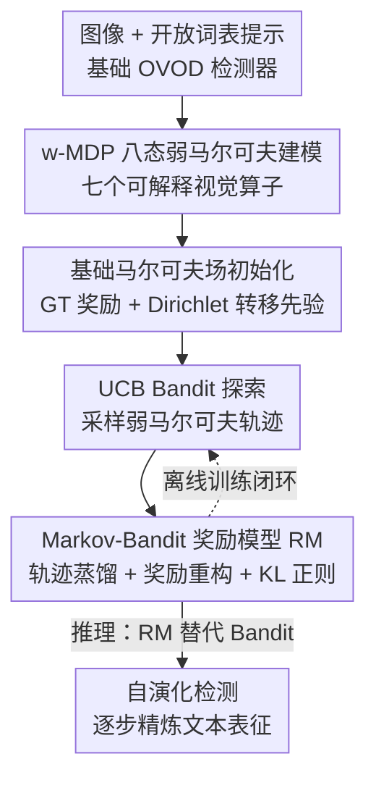

# OVOD-Agent: A Markov-Bandit Framework for Proactive Visual Reasoning and Self-Evolving Detection

**会议**: CVPR 2026  
**论文**: [CVF Open Access](https://openaccess.thecvf.com/content/CVPR2026/html/Wang_OVOD-Agent_A_Markov-Bandit_Framework_for_Proactive_Visual_Reasoning_and_Self-Evolving_CVPR_2026_paper.html)  
**代码**: 待确认  
**领域**: 多模态VLM / 开放词表检测  
**关键词**: 开放词表检测, 视觉链式推理, 弱马尔可夫决策过程, Bandit探索, 自演化奖励模型

## 一句话总结
把开放词表目标检测（OVOD）从"文本与区域的一次性静态匹配"改造成一个**无大模型依赖**的主动视觉推理过程：用八态弱马尔可夫决策过程（w-MDP）刻画视觉状态转移，用 UCB Bandit 在不确定区域采样推理轨迹，再用 Markov 转移统计联合训练一个轻量奖励-策略模型（RM）形成自演化闭环，在 COCO / LVIS 上稳定提升稀有类检测且推理开销极小。

## 研究背景与动机

**领域现状**：OVOD 依靠大规模视觉-语言预训练得到的语义先验，把检测器扩展到任意类别。近年区域-文本对齐与大词表建模显著提升了开放集识别能力。已有大量工作（prompt learning、属性描述、类名自动优化、LLM 生成先验）反复证明：**文本空间对 OVOD 性能的影响远比想象中大，且远未饱和**。

**现有痛点**：尽管训练时是多模态监督，推理阶段却退化为对一组固定类别名的**单模态匹配**——检测变成简单的查表对齐，造成"多模态训练 vs 单模态推理"的错位。模型因此难以在视觉歧义下推理、难以适应陌生语境、难以检测稀有/细粒度类别。引入 LLM 生成属性先验的做法本质上是**静态的**：对描述符做一次性调整，无法捕捉检测过程中区域、上下文、属性之间不断演化的关系。

**核心矛盾**：让推理更强的现成路线是把 LLM 放到决策中心（CoT-PL、LLM 先验、甚至多轮人类反馈），但这与目标检测赖以立身的**速度、可扩展性、易部署**直接冲突——为 OVOD 套上一个重型 LLM pipeline 得不偿失。OVOD 本身的轻量特性让 LLM 式管理"不合适"。

**本文目标**：在不引入任何大模型、几乎不增加推理开销的前提下，给 OVOD 一个**上下文相关、可迭代**的文本表征精炼机制。

**切入角度**：作者观察到区域-文本匹配具有很强的**离散性**——文本空间里的小扰动会引起检测行为的大幅跳变。这意味着语义空间里"由粗到细的离散转移"可以成为 LLM 连续推理的结构化替代品；Markov 形式化也支持"离散语义转移能近似复杂推理"的观点。

**核心 idea**：用一个**弱马尔可夫决策过程 + Bandit 探索 + 奖励模型蒸馏**的离散决策框架，替代以 LLM 为中心的连续视觉推理，把被动匹配变成可解释的 Visual-CoT 主动推理与自演化检测。

## 方法详解

### 整体框架
OVOD-Agent 是一个挂在现成 OVOD 检测器之上的轻量"视觉推理外挂"。给定图像 $x$ 与开放词表提示 $T$，基础检测器先给出区域提议与类别分数；agent 不直接接受这个结果，而是在当前视觉上下文 $c_t=(x_t,T_t)$ 下执行一串**显式视觉操作** $a_t\in\mathcal{A}$，逐步把上下文转移到 $c_{t+1}=f(c_t,a_t)$，形成一条可解释的 Visual-CoT 轨迹。整条管线分四步串行：先用 w-MDP 把"状态+动作"统一成紧凑的弱马尔可夫单元并初始化一个基础马尔可夫场；再用 UCB Bandit 在不确定状态上采样高质量轨迹与转移统计；把轨迹汇聚成图像级的 Markov 转移矩阵；最后用这些轨迹+转移先验训练一个轻量奖励-策略模型 RM，**推理时用 RM 替代 Bandit 探索**直接驱动 agent 自演化精炼，构成从探索到学习的闭环。

### 关键设计

**1. w-MDP 八态弱马尔可夫建模：把"状态+动作"压成一个弱单元**

传统 MDP 把状态 $s_t$ 与动作 $a_t$ 严格分离、转移定义为 $P(s_{t+1}\mid s_t,a_t)$。作者指出在主动视觉推理里这种分离是多余的——基于颜色、纹理、几何、光照、空间等线索的视觉动作会**直接改写图文上下文并决定下一个状态**。于是 OVOD-Agent 把二者统一成单个弱马尔可夫单元 $z_t=g(c_t,a_t)\in\mathcal{Z}$，转移退化为 $P(z_{t+1}\mid z_t)$，并施加短期记忆假设 $P(z_{t+1}\mid z_t,z_{t-1},\dots)\approx P(z_{t+1}\mid z_t)$。这样既保留了可解释性、又免去枚举显式 state-action 对，使转移更新足够轻量。配套的"推理语言"是 7 个可解释视觉算子 $a_1{\sim}a_7$：字典/别名回退（同义词、上位词）、颜色（HSV/聚类）、纹理（LBP/GLCM）、背景（前/背景与 ROI 调整）、几何（尺度、长宽比）、光照（HSV-V 阴影分析）、空间（位置、IoU 关系）。⚠️ 摘要称"eight state spaces / 八态"，正文给出的是 7 个显式算子，"八态"可能把初始字典查表状态单列；以原文为准。

**2. 基础马尔可夫场初始化：弱监督下先把奖励和转移正则住**

在监督极少的冷启动阶段，随机探索效率低，作者先在初始弱单元 $z_0$ 上铺一层"基础马尔可夫场"，从奖励与转移两端各加一个先验。奖励端是 **GT-seeded 弱奖励** $r_t^{GT}=1-\mathrm{IoU}(b_t^{pred},b_t^{GT})$——预测框与真值框越不重叠，奖励越高，意味着该状态越不确定、越需要继续精炼，这给每个 $z_t$ 一个质量基线。转移端是 **Dirichlet 转移先验** $\hat P(\cdot\mid z_t)\leftarrow\mathrm{Dirichlet}(\mathbf{n}_{z_t})$，伪计数 $\mathbf{n}_{z_t}$ 通常初始化为均匀向量，保证转移分布归一化、结构可行。两者合起来：GT 奖励在奖励层提供弱监督，Dirichlet 先验在转移层提供结构正则，共同稳住后续 Bandit 探索、把早期轨迹引向状态空间里有意义的区域。

**3. UCB Bandit 探索：在不确定状态上采高质量轨迹而非求单图最优**

OVOD-Agent 的目标不是为每张图求一个确定性最优解，而是采样多样、高质量的推理轨迹用于训练——随机探索低效、贪心又容易陷局部最优。作者用 UCB 上下文 Bandit 平衡探索/利用：对上下文 $c_t$ 维护局部均值奖励 $\hat\mu_t(a\mid c_t)$ 与访问次数 $n_t(a\mid c_t)$，按 $Q_t(a)=\hat\mu_t(a\mid c_t)+\lambda\sqrt{\ln t/(1+n_t(a\mid c_t))}$ 选动作 $a_{t+1}=\arg\max_a Q_t(a)$，$\lambda$ 控制探索强度；执行后用 $\hat P(\cdot\mid z_t)\leftarrow\mathrm{Dirichlet}(\mathbf{n}_{z_t}+\mathbf{e}_{z_{t+1}})$ 增量更新转移、维持 Markov 一致性。轨迹级停止条件是状态稳定（$\lVert c_{t+1}-c_t\rVert<\delta_s$）、奖励收敛（$\lvert r_{t+1}-r_t\rvert<\delta_r$）或步数上限 $H_{\max}=7$ 三者之一；图像级在平均奖励增量 $\bar{\Delta r}<\epsilon_r$、转移矩阵 F-范数收敛或回合数 $E_{\max}=50$ 时终止（默认 $\delta_s{=}0.02$，$\delta_r{=}\epsilon_r{=}\epsilon_P{=}10^{-3}$）。

**4. Markov-Bandit 奖励模型与自演化闭环：把探索蒸馏进一个轻量策略网络**

Bandit 对每张图 $x_i$ 产出一组弱马尔可夫轨迹 $\mathcal{T}_i=\{(z_t^{(m)},z_{t+1}^{(m)},r_t^{(m)})\}$ 与经验转移先验 $\hat P_i$，汇成离线数据集 $\mathcal{D}=\{(\mathcal{T}_i,\hat P_i)\}$。RM 是一个紧凑的**双头网络**（3 层 MLP，约 20MB）：策略头 $\pi_\theta(\cdot\mid z_t)$ 建模局部转移连续性，奖励头 $\hat r_\theta(z_t)$ 预测期望弱奖励。训练目标三项联合——**轨迹蒸馏** $\mathbb{E}[-w_t\log\pi_\theta(z_{t+1}\mid z_t)]$ 模仿观测到的转移、**奖励重构** $\beta\,\mathbb{E}[(\hat r_\theta(z_t)-r_t)^2]$ 还原弱奖励、**Markov 正则** $\gamma\,\mathbb{E}[\mathrm{D_{KL}}(\pi_\theta(\cdot\mid z_t)\Vert\hat P_i(\cdot\mid z_t))]$ 让策略对齐每张图的经验 Markov 结构。这构成闭环：Bandit 探索→RM 学习；**推理阶段直接用 RM 决策（策略驱动/奖励驱动/混合 $\alpha$ 三种模式）替换 UCB 采样**，让 agent 无需在线采样即可逐步自演化精炼，且全程 LLM-free。

### 一个完整示例
以图 1 的语义演化为例：agent 从初始字典查表状态出发（$a_1$），先发现当前类别假设不确定（GT 奖励高、IoU 低），于是 UCB 选出最有信息量的属性动作——比如先用颜色算子 $a_2$ 提取 HSV 颜色线索调整状态，再用纹理 $a_3$ 或空间 $a_7$ 进一步 grounding，直到状态稳定（$\lVert c_{t+1}-c_t\rVert<\delta_s$）或奖励收敛后停止。不同图像所需动作步数不同：简单图一步更新即可命中，复杂/稀有类则要多步推理，最多 $H_{\max}=7$ 步。整条轨迹连同转移统计被收进离线缓冲区训练 RM，下一次遇到相似状态时 RM 直接给出"该走哪个算子"，不再需要重新 Bandit 探索。

### 损失函数 / 训练策略
核心训练目标即上文 RM 的三项联合损失 $\mathcal{L}_{\mathrm{RM}}$（轨迹蒸馏 + 奖励重构 + Markov KL 正则），在离线数据集 $\mathcal{D}$ 上最小化更新 $\theta$。整体走"采样阶段（Bandit）→离线训练（RM）→推理阶段（RM 替代探索）"三段式自演化循环。采样代价随轨迹长度与动作空间线性增长；部署侧仅增加 <100MB 磁盘、<20MB 内存、<100ms 延迟，可几乎零改动地嵌入不同 OVOD 检测器。

## 实验关键数据

### 主实验
在 COCO 与 LVIS 的 OVOD 设定下，把 OVOD-Agent 插到四个代表性基础检测器上（GroundingDINO、YOLO-World、GroundingDINO 1.5、DINO-X Pro）。指标 APr/APc/APf 分别是 LVIS 的稀有/常见/高频类 AP，APall 为整体 AP，ΔLatency 为单图平均推理时延增量（ms）。

| 基础检测器 | LVIS val APr | ΔAPr | LVIS minival ΔAPr | COCO mAP | ΔLatency |
|--------|------|------|------|------|------|
| GroundingDINO | 30.2→32.9 | +2.7 | +1.6 | 52.8→54.1 | +120ms |
| YOLO-World | 22.8→25.2 | +2.4 | +1.8 | 45.0→45.9 | +90ms |
| GroundingDINO 1.5 | 42.7→44.1 | +1.4 | +1.3 | 58.0→58.8 | +145ms |
| DINO-X Pro | 48.0→49.2 | +1.2 | +1.1 | 61.5→62.1 | +155ms |

关键观察：增益**集中在稀有类**（LVIS val APr +1.2~+2.7），整体 AP 稳定上升 +0.5~+1.2，即提升长尾而不伤害常见/高频类；在类别更均衡的 COCO 上提升温和（mAP +0.6~+1.3）。每步推理多一次检测器前向，延迟随轨迹长度近似线性增长，但都在可接受范围内，呈现良好的精度-效率折中。

### 消融实验
所有消融默认在 LVIS minival + GroundingDINO 上，对应管线三阶段：采样（探索策略）、学习（Markov-state 建模）、推理（Visual-CoT 动作）。

探索策略对比（Top-K@Stop = 收敛前 top-$K$ 轨迹的平均奖励，反映高奖励轨迹质量；PWR = Pareto-Win Rate，在等量或更小采样预算下取得更高 Top-K 的图像占比，反映探索效率；AI 为 GPT-5 盲评、Human 为人工对轨迹连贯性打分）：

| 探索策略 | Top-K@Stop | PWR(%) | AI(盲评) | Human |
|------|------|------|------|------|
| Random | 0.54 | 19.1 | 3.0 | 2.7 |
| Greedy-Q | 0.59 | 29.7 | 3.3 | 3.1 |
| ε-Greedy | 0.62 | 36.5 | 3.5 | 3.3 |
| UCB（本文） | **0.66** | **44.8** | **4.7** | **4.5** |

RM 训练里 Markov-state（KL 转移正则）的作用，及 Visual-CoT 动作集逐步扩展：

| 配置 | 关键指标 | 说明 |
|------|---------|------|
| RM w/o KL Reg. | AP 38.2 / APr 19.0 / RM Loss Std 0.037 / 熵 1.41 | 仅轨迹训练 |
| RM w/ KL Reg.（Full） | AP 39.4 / APr 20.3 / RM Loss Std 0.028 / 熵 1.55 | 加经验转移矩阵 KL 正则 |
| Baseline（无动作） | APr 35.4 | 基础检测器 |
| +a1（仅字典动作） | APr 36.5 | 文本推理 |
| +a1–a7（全 Visual-CoT） | APr 37.7 | 全属性/几何线索 |

### 关键发现
- **UCB 的优势来自探索行为本身**：盲评协议下（策略名匿名）UCB 在 Top-K、PWR、AI/Human 全面最高，说明采到的轨迹语义推进更清晰、更连贯，而非靠加大采样量。
- **KL 转移正则是结构正则器**：把 RM loss 方差从 0.037 降到 0.028（训练更稳）、动作熵从 1.41 升到 1.55（防止策略坍缩到局部模式），并带来下游 AP 38.2→39.4、APr 19.0→20.3 的一致增益。
- **属性级 Visual-CoT 动作有效**：从仅字典动作（APr 36.5）扩展到全 7 算子（APr 37.7），颜色/纹理/几何/光照/空间线索提供了更具判别力的属性精炼。
- **失败模式**：① 视觉-语义退化——物体处于非典型形态（如干杏）时外观偏离视觉先验，推理过度依赖语言先验、稀疏转移统计又使奖励更新不稳；② 微小/遮挡目标在杂乱背景中，几何（$a_5$）与空间（$a_7$）动作奖励噪声大，策略退回字典查表（$a_1$）而无法改善定位，背景杂波还可能诱发误导性高对齐分。

## 亮点与洞察
- **"离散语义转移 ≈ 连续 CoT 推理"这一观察很关键**：它把"是否要 LLM"这个昂贵问题，转化为"能否用紧凑 Markov 状态机近似多步推理"，从而在保住检测器速度/可部署性的前提下拿到推理能力。这是全文最 aha 的地方。
- **w-MDP 把 state 与 action 合并成弱单元**，巧妙绕开了枚举 state-action 对的组合爆炸，使转移更新足够轻到能塞进检测推理循环——这个"弱化 Markov 分离假设"的 trick 可迁移到其他需要轻量序列决策的视觉任务。
- **GT-seeded 奖励 + Dirichlet 先验**给弱监督冷启动提供了一个干净的正则范式：奖励端用 $1-\mathrm{IoU}$ 当不确定度信号、转移端用 Dirichlet 保结构，可复用到任何"标注稀少但有几何真值"的探索式训练。
- 部署友好度是真卖点：<100MB 磁盘、<20MB 内存、<100ms 延迟、3 层 MLP 的 RM，几乎零改动嵌入四种主流检测器，工程上很有吸引力。

## 局限与展望
- 作者承认：在极端长尾、非典型形态、微小/遮挡目标的场景下仍会失败，可能需要更强的视觉先验或自适应 OOD 推理策略。
- 增益的绝对幅度偏温和（LVIS val APr 多在 +1~+2.7），且每步要多一次检测器前向，轨迹越长延迟越高——精度-效率折中虽好但天花板受限。
- ⚠️ 摘要的"eight state spaces / 八态"与正文给出的 7 个显式算子之间存在表述不一致，"第八态"具体所指需以原文/附录为准；这也影响读者对状态空间规模的理解。
- 评测主要在 COCO/LVIS 的 box 级 OVOD 上验证，是否能推广到更开放的分割/grounding 或视频场景未充分检验。

## 相关工作与启发
- **vs LLM 式文本优化（LLM 先验、CoT-PL、多轮人类反馈）**: 他们把 LLM 放到决策中心来丰富类别描述，本文完全不依赖大模型、只在推理时做轻量精炼，区别在于用离散 Markov-Bandit 决策替代连续 LLM 推理，优势是保住检测器的速度与可部署性，劣势是单步推理表达力弱于真·LLM。
- **vs 检索增强（RALF/RAG）**: 他们训练 OVOD 专用检索模块、用生成补全丰富文本，但本质是**单步**的，无法支持状态相关的迭代推理；本文的 w-MDP 提供了多步、状态依赖的精炼路径。
- **vs 全 RL 序列决策**: 完整 RL pipeline 在 OVOD 下因监督稀缺、rollout 训练昂贵而不切实际；本文用 UCB/上下文 Bandit 提供不确定性驱动采样，避开策略学习开销，再与 Markov 转移统计耦合成紧凑的 Markov-Bandit 强化机制。

## 评分
- 新颖性: ⭐⭐⭐⭐⭐ 用 w-MDP + Bandit + RM 蒸馏把 OVOD 推理"去 LLM 化"，离散语义转移近似 CoT 的视角新颖
- 实验充分度: ⭐⭐⭐⭐ 四个主流检测器 + COCO/LVIS + 三阶段消融较系统，但增益幅度温和、未覆盖分割/视频等更开放设定
- 写作质量: ⭐⭐⭐⭐ 动机推导清晰、公式与算法完整，但"八态 vs 7 算子"等表述不一致影响读者
- 价值: ⭐⭐⭐⭐ 轻量、可插拔、部署友好，对长尾 OVOD 有实用价值，是自演化视觉推理的一个可扩展基座

<!-- RELATED:START -->

## 相关论文

- [\[CVPR 2026\] VisPlay: Self-Evolving Vision-Language Models](visplay_self-evolving_vision-language_models.md)
- [\[CVPR 2026\] Decouple to Generalize: Context-First Self-Evolving Learning for Data-Scarce Vision-Language Reasoning](decouple_to_generalize_context-first_self-evolving_learning_for_data-scarce_visi.md)
- [\[CVPR 2026\] EvoGraph-R1: Self-Evolving Multimodal Knowledge Hypergraphs for Agentic Retrieval](evograph-r1_self-evolving_multimodal_knowledge_hypergraphs_for_agentic_retrieval.md)
- [\[ICLR 2026\] Why Keep Your Doubts to Yourself? Trading Visual Uncertainties in Multi-Agent Bandit Systems](../../ICLR2026/multimodal_vlm/why_keep_your_doubts_to_yourself_trading_visual_uncertainties_in_multi-agent_ban.md)
- [\[CVPR 2026\] Geometrically-Constrained Agent for Spatial Reasoning](geometrically-constrained_agent_for_spatial_reasoning.md)

<!-- RELATED:END -->
