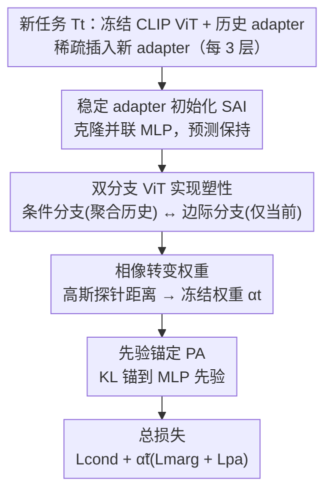

# PACT: Phase-Like Transition Constraints in Adapter-Based Continual Learning of Vision-Language Models

**会议**: CVPR 2026  
**论文**: [CVF Open Access](https://openaccess.thecvf.com/content/CVPR2026/html/Wang_PACT_Phase-Like_Transition_Constraints_in_Adapter-Based_Continual_Learning_of_Vision-Language_CVPR_2026_paper.html)  
**代码**: https://github.com/xwangrs/PACTCVPR2026.git  
**领域**: 多模态VLM / 持续学习  
**关键词**: 持续学习, PAC-Bayes, adapter, 稳定性-塑性权衡, 相变约束

## 一句话总结
针对"用正交约束隔离各任务 adapter 会压制跨任务知识共享"的痛点，作者从 PAC-Bayes 理论推导出一个**后收敛阶段**应满足的"相像转变约束（PACT）"：让 adapter 像水的相变一样在"冻结（保历史）"与"融化（适应新任务）"两个状态间**平滑过渡而非硬阈值切换**，通过双分支 ViT + 稳定 adapter 初始化（SAI）+ 先验锚定（PA）落地，在多种持续学习设定上超过 SOTA，且可训练参数比标准 adapter 基线少 36.96%。

## 研究背景与动机

**领域现状**：让视觉-语言模型（VLM）持续学习新任务而不灾难性遗忘，主流是参数高效微调（PEFT）——冻结大部分预训练权重，只训练 adapter / LoRA / prompt 这类小模块。常见做法是把每个任务的 adapter 优化到收敛，各自捕获任务专属知识，并常用 **(近似) 正交约束**让不同任务的 adapter 占据共享子空间里互相正交的方向以减少干扰。

**现有痛点**：来自深度学习与神经科学的研究都表明，**强行把不同任务塞进互相正交的子空间会压制跨任务知识迁移与共享，甚至造出"知识孤岛"**。也就是说，"正交隔离"在减干扰的同时，也切断了相关任务之间本该有的协同。

**核心矛盾**：稳定性-塑性困境。塑性项希望 adapter 充分适应新任务，稳定性项希望它别偏离已积累的知识；正交约束是一种"一刀切"的硬隔离，没有给"任务相关时该共享、任务无关时才隔离"留出弹性空间。

**本文目标**：给出一个**有理论依据**的、能根据任务间相似度自适应地在共享与隔离之间过渡的约束机制，替代生硬的正交约束。

**切入角度**：作者把持续学习投进 PAC-Bayes 框架——序贯地把上一任务的后验当成当前任务的先验（$P_t:=Q_{t-1}$）。由此推导出的泛化界里自然冒出两个互补项：奖励任务适应的**塑性项**与惩罚偏离积累知识的**稳定项**。更关键的观察是：PAC-Bayes 理论假设损失有界，而这个条件**只有在训练已基本收敛后才近似成立**，所以这套约束应当是一个"后收敛现象"。

**核心 idea**：在每个任务标准收敛**之后**，再用一个"相像转变关系"调制 adapter 更新——当前 adapter 离历史 adapter 远就保持自由（融化），近就平滑加大约束（冻结），从而像水的相变一样在两态间软切换，而非硬阈值。

## 方法详解

### 整体框架
PACT 处理一个任务序列 $T_1,\dots,T_T$，骨干用冻结的 CLIP ViT-B/16，每个任务只训练新插入的 adapter（稀疏插入：每 3 层一个，即第 3/6/9/12 层）。在每个任务上，先用 PAC-Bayes 把当前任务的 KL 复杂度项分解成**塑性项 $\mathcal{P}$**（当前 adapter 条件后验与边际后验的 KL）与**稳定项 $\mathcal{S}$**（当前 adapter 后验相对其初始化的漂移）。塑性靠一个**双分支 ViT** 实现：条件分支聚合冻结历史 adapter + 当前 adapter，边际分支只用当前 adapter，两分支各接分类头、最小化各自交叉熵以拉近两个后验。稳定靠两件套：**SAI（稳定 adapter 初始化）** 让新 adapter 初始时与预训练 MLP 功能等价，**PA（先验锚定）** 用 KL 把后验锚到 MLP 先验、限制漂移。最关键的"相变"由一个**相像转变权重**驱动：用高斯探针测当前 adapter 与最近历史 adapter 的距离，距离近→冻结权重 $\alpha_t\to1$、距离远→$\alpha_t\to0$，再经训练稳定度调制成 $\tilde\alpha_t$，只在后收敛阶段门控边际与 PA 损失。总损失 $\mathcal{L}_{\text{total}}=\mathcal{L}_{\text{cond}}+\tilde\alpha_t(\mathcal{L}_{\text{marg}}+\mathcal{L}_{\text{pa}})$。

### 关键设计

**1. PAC-Bayes→持续学习的条件-边际分解：把稳定性-塑性写成两个 KL 项**

经典 PAC-Bayes 只管单任务、不建模后验跨任务的序贯演化。作者把它扩到持续学习：任务 $t$ 时设先验 $P_t:=Q_{t-1}$（上一任务训完的后验），它只依赖历史数据 $D_{<t}$、独立于当前 $D_t$，从而把"从旧任务到新任务的迁移"系统化。把 adapter 参数拆成冻结历史块 $\theta_a^{[t-1]}$ 与可训练当前块 $\theta_a^t$，定理给出每任务 KL 项 $I_t$ 的上界分解：$I_t\le\mathbb{E}_{\theta_a^{[t-1]}\sim Q_t^a}[\underbrace{\mathcal{P}}_{\text{塑性}}+\underbrace{\kappa\mathcal{S}}_{\text{稳定}}]$，其中塑性项 $\mathcal{P}=\mathrm{KL}(Q_t^a(\theta_a^t\mid\theta_a^{[t-1]})\Vert Q_t^a(\theta_a^t))$ 度量当前 adapter 推断对历史 adapter 的统计依赖（越小越塑性），稳定项 $\mathcal{S}=\mathrm{KL}(Q_t^a(\theta_a^t)\Vert Q_{t-1}^a(\theta_a^t))$ 度量后验相对初始化的漂移（越小越稳定），$\kappa<\infty$ 是重叠常数。这把"稳定-塑性折中"从经验直觉变成可优化的两个明确目标，是后面所有算法的理论基石。

**2. 双分支 ViT 实现塑性：用条件/边际对比把 $\mathcal{P}$ 变成可训练 surrogate**

塑性项要最小化的是条件后验 $Q_t^a(\theta_a^t\mid\theta_a^{[t-1]})$ 与边际后验 $Q_t^a(\theta_a^t)$ 的 KL——直接算分布散度不可行。作者构造两条共享冻结骨干 $\theta_f$ 与当前 adapter $\theta_a^t$、只在"是否聚合历史 adapter 输出"上不同的并行分支：**条件分支**把历史 adapter 输出按均值聚合并加当前 adapter，$h_{\text{cond}}=\frac{1}{t}\sum_{i=1}^t h_a^{(i)}+0.1\epsilon$；**边际分支**只用当前 adapter，$h_{\text{marg}}=h_a^{(t)}+0.1\epsilon$（$\epsilon\sim\mathcal{N}(0,I)$ 是 PAC-Bayes 所需的随机性噪声）。各接独立分类头得到 $\mathcal{L}_{\text{cond}}$ 与 $\mathcal{L}_{\text{marg}}$。由于两分支同数据、共享 $\theta_f$ 与 $\theta_a^t$、只差历史块，最小化 $\mathcal{L}_{\text{cond}}+\mathcal{L}_{\text{marg}}$ 就成了拉近条件后验与边际后验的可处理代理目标，从而压低 $\mathcal{P}$、鼓励当前 adapter 聚焦新知识、弱化对历史 adapter 的依赖。

**3. SAI + PA 实现稳定：先给一个零漂移起点，再限制后续漂移**

稳定项 $\mathcal{S}$ 度量新 adapter 后验相对初始化的漂移，漂移过大会扭曲被历史任务共享的表征。作者两步走。**SAI（稳定 adapter 初始化）**：新 adapter 与冻结 MLP 块**并联**、结构相同、**直接克隆 MLP 参数**，并用门控 $g_t=\sigma(\gamma_t)$ 做凸组合 $h_{\text{out}}=(1-g_t)h_{\text{base}}+g_t h_{\text{adapter}}$，再稀疏插入（每 3 层）。这样插入瞬间模型预测分布几乎不变，$\mathcal{S}=\mathrm{KL}(Q_t^a\Vert Q_{t-1}^a)$ 在初始化处取到最小（精确匹配时为 0），给后续训练一个良态起点。**PA（先验锚定）**：SAI 只保证起点好、不约束训练中漂多远，于是加稳定损失 $\mathcal{L}_{\text{pa}}=\mathrm{KL}(Q_t^a(\theta_a^t)\Vert Q_{\text{mlp}}^a(\theta_a^t))$，把当前 adapter 后验锚到固定的 MLP 先验（$Q_{\text{mlp}}^a\equiv Q_{t-1}^a$），直接惩罚漂移。由于预训练 MLP 本就有强零样本泛化，让 adapter 始终贴着它，既保稳定又能保住甚至增强未见任务上的零样本表现。

**4. 相像转变权重：用 adapter 间距离驱动平滑的冻结/融化门控**

这是"相变"得以发生的核心。作者构造一个固定高斯探针库 $Z=\{z_m\}_{m=1}^M$（$z_m\sim\mathcal{N}(0,I_d)$，跨层跨步共享），把探针分别喂给当前 adapter 与每个历史 adapter 得到响应矩阵 $H^{(t)},H^{(j)}$，用尺度归一化的 Frobenius 距离 $d_j=\frac{\lVert H^{(t)}-H^{(j)}\rVert_F^2}{\varepsilon+\lVert H^{(t)}\rVert_F^2+\lVert H^{(j)}\rVert_F^2}$ 量化二者差异，取最近历史 adapter $j^\star=\arg\min_j d_j$，再用指数核转成冻结权重 $\alpha_t=\exp(-d_{j^\star}/\tau)$：当前 adapter 行为像某个历史 adapter 时 $\alpha_t\approx1$（冻结），明显偏离时 $\alpha_t\approx0$（融化）。这个 $\alpha_t$ 再被一个训练稳定度度量调制成 $\tilde\alpha_t\in[0,1]$，确保正则只在训练进入相对稳定的后收敛阶段才生效——因为 $\mathcal{L}_{\text{marg}}$、$\mathcal{L}_{\text{pa}}$ 背后的理论依赖"损失有界"假设，而这只在主条件目标基本收敛后才近似成立。于是总损失 $\mathcal{L}_{\text{total}}=\mathcal{L}_{\text{cond}}+\tilde\alpha_t(\mathcal{L}_{\text{marg}}+\mathcal{L}_{\text{pa}})$ 中，不稳定期 $\tilde\alpha_t\approx0$ 只优化条件损失、专注早期适应，稳定后才激活边际与 PA 损失——这正是"无硬阈值、双模态、相像而非严格相变"的来源。

### 损失函数 / 训练策略
总目标 $\mathcal{L}_{\text{total}}=\mathcal{L}_{\text{cond}}+\tilde\alpha_t(\mathcal{L}_{\text{marg}}+\mathcal{L}_{\text{pa}})$：条件交叉熵全程主导，边际交叉熵与 PA 的 KL 锚定损失由稳定度感知权重 $\tilde\alpha_t$ 在后收敛阶段平滑激活。实现上用 CLIP ViT-B/16，adapter 复刻 MLP 块结构、只插在第 3/6/9/12 层、其余层不动；AdamW 优化，MTIL 训 3k 步、CIL 训 1k 步。稀疏插入使可训练参数比标准 adapter 基线降低 36.96%。

## 实验关键数据

### 主实验
两类设定：多域任务增量学习（MTIL，11 数据集基准）与类增量学习（CIL，CIFAR-100 / TinyImageNet-100）。MTIL 指标 Transfer（TF，已学到任务 $i$ 后对未见任务的平均准确率，即零样本泛化）、Last（LS，对已见任务的保持）、Avg（TF 与 LS 的均值）。下表为 MTIL Order-I 的整体均值。

| 方法 | Transfer | Average | Last |
|------|------|------|------|
| CLIP 零样本 | 69.4 | 65.3 | 65.3 |
| MoE-Adapters | 67.4 | 77.2 | 87.4 |
| ConDU | 70.3 | 78.3 | 86.2 |
| AFA | 70.3 | 78.5 | 87.2 |
| TRGE | 69.8 | 78.5 | 87.6 |
| **PACT（本文）** | **71.76 (+1.46)** | **81.05 (+2.55)** | **90.54 (+2.94)** |

PACT 在 Transfer / Average / Last 三项全面领先次优方法 +1.46 / +2.55 / +2.94，且**零样本泛化（Transfer）与已学任务保持（Last）同时变好**，说明取得了更好的稳定-塑性平衡：既适应新数据、又少忘旧知识。

### 消融实验
少样本 MTIL（FS-MTIL）下 PACT 在 5-shot 与 16-shot 协议均最优，体现其 PAC-Bayes 形式化对训练样本数不作假设的鲁棒性（∆ 为相对零样本的变化）。

| 配置 | 关键指标 | 说明 |
|------|---------|------|
| Zero-Shot | TF 69.4 / Avg 65.3 / Last 65.3 | CLIP 基线 |
| ConDU (5-shot) | TF 70.3 / Avg 72.7 / Last 77.4 | 次优之一 |
| AFA (5-shot) | TF 70.2 / Avg 74.1 / Last 79.4 | 次优之一 |
| **PACT (5-shot)** | TF 70.5 / Avg 72.0 / **Last 80.7 (+15.4)** | 本文 |
| IAP (16-shot) | TF 70.9 / Avg 72.5 / Last 77.7 | 对比 |
| **PACT (16-shot)** | Transfer/Avg/Last 均第一 | 本文 |
| 稀疏插入（每 3 层）| 可训练参数 −36.96% | 相对标准 adapter 基线 |

### 关键发现
- **稳定与塑性同涨**：PACT 在零样本泛化（Transfer）和旧任务保持（Last）上同时超越基线，而很多方法只能顾此失彼——这正印证了"相像转变 + 互补的条件/边际正则在任务相关时共享、无关时抑制干扰"的设计意图。
- **参数更省还更强**：稀疏插入（每 3 层一个 adapter）让可训练参数比标准 adapter 基线少 36.96%，却拿到更高精度，说明 adapter 的表达力被更充分利用。
- **后收敛激活很关键**：$\tilde\alpha_t$ 把正则推迟到训练稳定后才生效，呼应 PAC-Bayes 的"损失有界"前提；早期只优化条件损失保证适应、后期再加约束保证不漂移。
- **图 1 的训练动态可视化**：CE 收敛后引入 PACT 会让损失**暂时上升**再重新收敛到新平衡，几何上 adapter 在"Free"与"PACT"两态间平滑移动（论文用 ↭ 标注），直观展示了"相像而非硬阈值"的相变行为。

## 亮点与洞察
- **"adapter 像水一样相变"是个很有画面感且有理论支撑的比喻**：把抽象的稳定-塑性折中具象成冻结/融化两态间的软过渡，而支撑它的是 PAC-Bayes 界里塑性项 + 稳定项的双模态优化景观，理论与直觉罕见地对齐。
- **"后收敛才施加约束"这一洞察可复用**：很多正则/约束类方法默认全程开启，PACT 指出 PAC-Bayes 的有界损失假设只在收敛后成立，故用稳定度感知权重门控约束——这种"按训练阶段调度正则"的思路可迁移到其他基于泛化界的方法。
- **用高斯探针响应距离度量 adapter 相似度**是个轻量且无需额外可学习参数的 trick：固定探针库、跨层共享，直接比较两个 adapter 的前向映射，可迁移到任何需要"模块间相似度"判定的场景。
- **SAI 让 adapter 初始即等价于预训练 MLP**，把稳定项在起点压到近 0，既给优化一个良态起点、又顺带保住 CLIP 的零样本能力，是"如何无痛插入新模块"的优雅范式。

## 局限与展望
- 方法依赖"后收敛"判定与稳定度调制 $\tilde\alpha_t$，⚠️ 其具体计算流程论文放在附录、正文未完全展开，稳定度阈值/调度对结果的敏感性不易评估。
- 高斯探针距离用最近历史 adapter $j^\star$ 决定冻结强度，当历史任务很多时只看最近邻是否会漏掉与多个历史任务的复杂关系，论文未深入讨论。
- 实验集中在 CLIP ViT-B/16 + adapter 这一具体实例化上，PAC-Bayes 推导是否同样适配 LoRA / prompt 等其他 PEFT 形式、是否依赖 adapter 复刻 MLP 结构这一强假设，仍待验证。
- 相对正交约束方法的优势在任务高度相关时应更明显，但论文未给出"任务相关度 vs 增益"的细粒度分析。

## 相关工作与启发
- **vs 正交约束 PEFT（如 orthogonal-LoRA 系列）**: 他们用 (近似) 正交把各任务 adapter 硬隔离到互不干扰的子空间，本文论证这会压制跨任务共享、造知识孤岛；PACT 用相像转变软门控，任务相关时允许共享、无关时才约束，区别在"硬隔离 vs 自适应软过渡"。
- **vs 经典正则类持续学习（EWC/参数重要性惩罚）**: 他们靠惩罚重要参数的变化来防遗忘，本文则从 PAC-Bayes 序贯先验出发把稳定-塑性写成两个明确 KL 项，理论更系统，且把约束限定在后收敛阶段。
- **vs 其他 PEFT-CL（MoE-Adapters / DIKI / IAP / AFA / TRGE 等）**: 它们多把 adapter 训到收敛各自固化，PACT 的关键差异是"收敛之后还要再塑形"——用相变约束诱导跨任务的结构化耦合，在 Transfer/Avg/Last 上一致领先并显著省参数。

<!-- RELATED:START -->

## 相关论文

- [\[CVPR 2026\] Enhancing Continual Learning of Vision-Language Models via Dynamic Prefix Weighting](enhancing_continual_learning_of_vision-language_models_via_dynamic_prefix_weight.md)
- [\[CVPR 2026\] On Token's Dilemma: Dynamic MoE with Drift-Aware Token Assignment for Continual Learning of Large Vision Language Models](on_tokens_dilemma_dynamic_moe_with_drift-aware_token_assignment_for_continual_le.md)
- [\[CVPR 2026\] Octopus: History-Free Gradient Orthogonalization for Continual Learning in Multimodal Large Language Models](octopus_history-free_gradient_orthogonalization_for_continual_learning_in_multim.md)
- [\[CVPR 2026\] Re-evaluating Continual VQA: Toward Fair and Robust Evaluation for Multimodal Continual Learning](re-evaluating_continual_vqa_toward_fair_and_robust_evaluation_for_multimodal_con.md)
- [\[CVPR 2026\] Continual Learning with Vision-Language Models via Semantic-Geometry Preservation](continual_learning_with_vision-language_models_via_semantic-geometry_preservatio.md)

<!-- RELATED:END -->
