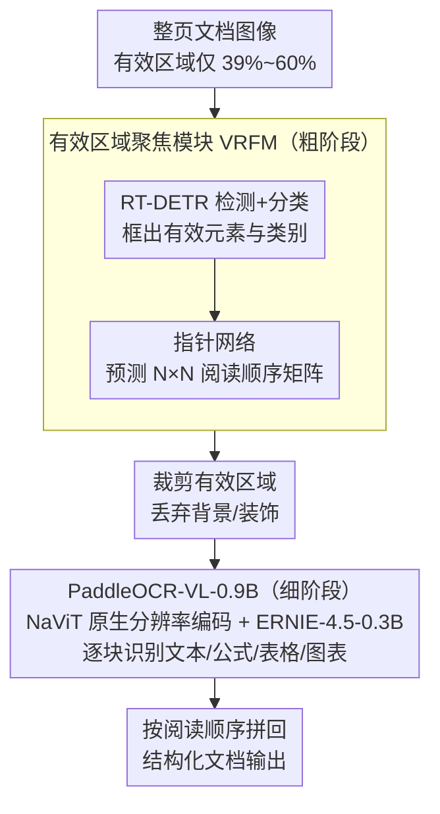

# PaddleOCR-VL: Boosting Document Parsing Efficiency and Performance with Coarse-to-Fine Visual Processing

**会议**: CVPR 2026  
**arXiv**: [2603.24326](https://arxiv.org/abs/2603.24326)  
**代码**: [https://github.com/PaddlePaddle/PaddleOCR](https://github.com/PaddlePaddle/PaddleOCR)  
**领域**: 多模态VLM  
**关键词**: 文档解析, 视觉语言模型, 粗到细处理, 视觉冗余消除, OCR

## 一句话总结

PaddleOCR-VL 提出粗到细的文档解析架构：粗阶段用轻量级有效区域聚焦模块(VRFM)定位文档中的有效视觉区域并预测阅读顺序，细阶段用紧凑的0.9B视觉语言模型对裁剪区域进行精细识别，在最少视觉token和参数下实现文档解析SOTA。

## 研究背景与动机

1. **领域现状**：文档解析方法分为三类——流水线方法（拼接专家组件）、通用VLM（端到端但重）、专用VLM（统一架构但效率低）。高分辨率输入对文档解析至关重要，但导致视觉token数量二次增长。
2. **现有痛点**：通用VLM在手写或复杂文档上频繁产生幻觉和识别错误；专用VLM（如MinerU2-VLM）参数量大、解码序列长导致延迟高；统一压缩视觉token的方法（如DeepSeek-OCR）会损害细粒度布局精度。
3. **核心矛盾**：文档图像中有效视觉区域高度不均匀——PPT文档有效区域仅占39%，信息密集型文档约60%。大量背景/装饰区域浪费了计算资源。
4. **本文目标**：在保持高分辨率精度的同时消除视觉冗余，实现高精度+高效率。
5. **切入角度**：观察到有效视觉区域的稀疏性，用检测器定位有效区域后仅对这些区域做精细识别。
6. **核心 idea**：解耦布局分析与元素识别——轻量检测器做粗粒度定位+阅读顺序预测，紧凑VLM对裁剪区域做细粒度识别，避免处理整张大图。

## 方法详解

### 整体框架

PaddleOCR-VL 想解决的核心矛盾是：文档解析既要高分辨率（细粒度识别需要），又怕高分辨率（视觉 token 随分辨率二次增长）。它的答案是把"在哪里看"和"看清楚是什么"两件事拆开。粗阶段的有效区域聚焦模块(VRFM)接收整张文档图像，只做轻量的布局分析——框出每个有效元素的位置、类别，并预测它们的阅读顺序；细阶段的 PaddleOCR-VL-0.9B 只接收 VRFM 裁出来的那些小区域，逐个做精细识别（文本、公式、表格、图表）。最后按 VRFM 给出的阅读顺序把识别结果拼回结构化文档。整页大图从头到尾只被那个轻量检测器看过一次，真正烧 token 的 VLM 永远只面对裁剪后的小块。

### 关键设计

**1. 有效区域聚焦模块 (VRFM)：用检测器替代生成式 VLM 做布局分析，同时给出阅读顺序**

文档图像里有效区域其实很稀疏——PPT 页面只有约 39% 是正文/图表，信息密集的文档也就 60% 左右，剩下都是背景和装饰。如果让一个生成式 VLM 把整页吞进去再吐出布局，既慢、坐标又容易飘。VRFM 改用一个 RT-DETR 检测器直接做布局元素的检测与分类，得到区域级表示；再在检测头上接一个指针网络(Pointer Network)，对两两区域间的先后关系建模，输出一个 $N \times N$ 矩阵编码相对阅读顺序。检测、分类、排序三件事在一个轻量模块里联合完成。这样布局分析的坐标精度由专用检测器保证，阅读顺序则交给天然适合做序列排序的指针网络，比让 VLM "顺便"预测坐标和顺序更稳。

**2. PaddleOCR-VL-0.9B：识别模块只面对裁剪小块，且用原生动态分辨率编码避免失真**

既然有效区域已经被 VRFM 框出来并裁好，精细识别这一步就不必再处理整页。PaddleOCR-VL-0.9B 沿用 LLaVA 式结构——视觉编码器 + MLP 投影器 + 语言模型，但把规模压到仅 0.9B：视觉编码器采用 NaViT 风格的原生动态分辨率(native dynamic-resolution)设计（由 Keye-VL 初始化），按图像原始分辨率处理而非缩放或切片，从而避免形变、减少幻觉、提升密集文本任务表现；语言模型则选用紧凑的 ERNIE-4.5-0.3B 并加入 3D-RoPE 位置编码，兼顾低延迟与低显存。由于每次只吃一个裁剪区域，视觉 token 数大幅下降，模型不用在一张大图里既找元素又认内容，只需在已经定位好的小块上专心识别多种元素以及 109 种语言，于是更小的参数量反而能达到更好的效果——这正是论文"聪明地选择在哪里投入计算"思路的落点。

**3. 高质量数据流水线：3000 万样本撑起多语言、多类型的泛化**

架构之外，数据是性能的另一根支柱。作者从公开来源和合成数据收集了超过 3000 万个分布广泛的样本，覆盖各类文档类型、语言和复杂度。这种规模和多样性让 0.9B 的小模型在手写、历史文档等挑战性内容上也能保持鲁棒，也是 109 种语言支持的底气所在。论文把数据多样性明确列为高性能的关键因素之一，强调它对 VLM 的影响不亚于模型结构本身。

### 一个完整示例

以一张混排的 PPT 页面为例走一遍：整页约 39% 是有效区域，其余是背景和装饰。VRFM 先把这一页扫一遍，框出比如 3 个标题块、2 个正文段、1 张表格和 1 张配图共 7 个有效区域，给每个区域打上类别标签，并通过指针网络输出 $7 \times 7$ 的阅读顺序矩阵，确定"标题→正文→表格→配图"的先后。接着只把这 7 个裁剪小块逐个送进 PaddleOCR-VL-0.9B：正文块识别成文字、表格块还原成结构化表格、公式块转成 LaTeX。期间那 61% 的背景区域从未进入 VLM，token 全省下来。最后按那张阅读顺序矩阵把 7 段识别结果拼成一份结构化文档输出。

### 损失函数 / 训练策略

- VRFM：标准目标检测损失 + 指针网络排序损失，联合训练检测、分类与阅读顺序。
- PaddleOCR-VL-0.9B：自回归生成损失。
- 两个模块各自独立优化，专注自己的子任务，互不耦合。
- 训练依托超 3000 万样本的大规模数据。

## 实验关键数据

### 主实验

| 方法 | 参数量 | 视觉Token数 | OmniDocBench v1.5 整体 |
|------|--------|-------------|----------------------|
| MinerU2-VLM | 大 | 多 | 次优 |
| Dolphin | 大 | 多 | 次优 |
| DeepSeek-OCR | 中 | 中(压缩) | 次优 |
| **PaddleOCR-VL** | **最少(0.9B)** | **最少** | **SOTA** |

### 消融实验

| 配置 | 关键指标 | 说明 |
|------|---------|------|
| 端到端VLM | 基线 | 处理整页，token多 |
| 粗阶段(VRFM) | 高效定位 | 过滤39-60%冗余区域 |
| + 细阶段(VL-0.9B) | SOTA | 精细识别裁剪区域 |
| 无指针网络 | 阅读顺序差 | 验证排序模块必要性 |

### 关键发现

- PaddleOCR-VL 在文本、公式、表格、阅读顺序四个关键指标上均达到SOTA
- 参数量和视觉token数均为最少，推理延迟和吞吐量显著优于竞品
- 高质量数据流水线是性能的关键因素之一
- 在手写和历史文档等挑战性内容上表现出强鲁棒性
- 支持109种语言的多语言文档解析

## 亮点与洞察

- **文档视觉冗余的统计分析**提供了有说服力的动机：PPT文档仅39%有效区域，直接证明了选择性处理的必要性
- **解耦设计**允许各模块独立优化是实用优势——可以单独升级检测器或识别模型
- **0.9B参数+最少token达到SOTA**证明了"聪明地选择在哪里投入计算"比"用更大模型处理所有内容"更有效

## 局限与展望

- 两阶段流水线引入级联误差——VRFM的检测错误会传导到识别阶段
- 密集排布页面上VRFM的定位精度可能受限
- 阅读顺序预测在极复杂布局（多栏混排+浮动元素）下可能不准确
- 仅在文档解析场景验证，未扩展到更广泛的VLM应用

## 相关工作与启发

- **vs MinerU2.5/Dolphin**: 统一端到端VLM，但参数大、效率低；PaddleOCR-VL通过粗到细解耦实现更高效率
- **vs DeepSeek-OCR**: 统一压缩视觉token，但会损害布局精度；PaddleOCR-VL选择性丢弃无效区域而非均匀压缩
- **vs 流水线方法**: 传统流水线使用多个独立专家模型，复杂且易误差累积；PaddleOCR-VL仅两个模块，更简洁

## 评分

- 新颖性: ⭐⭐⭐⭐ 粗到细解耦+有效区域聚焦的思路清晰有效
- 实验充分度: ⭐⭐⭐⭐⭐ 多基准全面验证，公私数据集覆盖广
- 写作质量: ⭐⭐⭐⭐ 动机分析有数据支撑
- 价值: ⭐⭐⭐⭐⭐ 开源代码+模型，实际可用性强

<!-- RELATED:START -->

## 相关论文

- [\[CVPR 2026\] Efficient Document Parsing via Parallel Token Prediction](efficient_document_parsing_via_parallel_token_prediction.md)
- [\[CVPR 2026\] Towards Real-World Document Parsing via Realistic Scene Synthesis and Document-Aware Training](towards_real-world_document_parsing_via_realistic_scene_synthesis_and_document-a.md)
- [\[CVPR 2026\] Multimodal OCR: Parse Anything from Documents](multimodal_ocr_parse_anything_from_documents.md)
- [\[CVPR 2026\] DocSeeker: Structured Visual Reasoning with Evidence Grounding for Long Document Understanding](docseeker_long_document_understanding.md)
- [\[CVPR 2026\] VL-RouterBench: A Benchmark for Vision-Language Model Routing](vl-routerbench_a_benchmark_for_vision-language_model_routing.md)

<!-- RELATED:END -->
