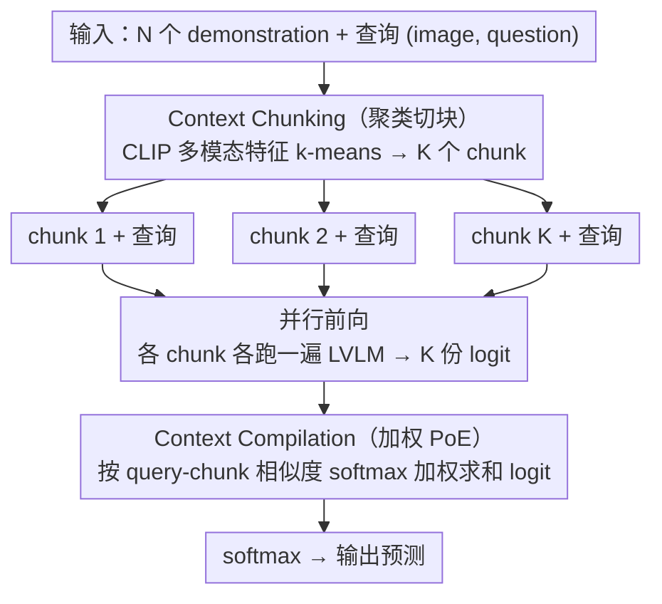

# Parallel In-context Learning for Large Vision Language Models

**会议**: CVPR 2026 Findings  
**arXiv**: [2603.16092](https://arxiv.org/abs/2603.16092)  
**代码**: 无  
**领域**: 多模态VLM  
**关键词**: 上下文学习, 推理加速, Product-of-Experts, 多模态学习, 上下文分块

## 一句话总结
提出 Parallel-ICL，将多模态 in-context learning 的长 demonstration 上下文分块并行处理，通过加权 Product-of-Experts 在 logit 层集成，实现与全上下文 MM-ICL 相当甚至更优的性能，同时显著降低推理延迟。

## 研究背景与动机
**领域现状**：大型视觉语言模型（LVLM）通过 MM-ICL 利用多个 demonstration 示例来适应新任务，示例越多性能越好。

**现有痛点**：Transformer 的注意力计算代价随上下文长度二次增长，而 LVLM 中每张图片需要数千个视觉 token，导致增加 demonstration 数量会急剧增加推理延迟。例如 32-shot 比 8-shot 慢约 3.5 倍。

**核心矛盾**：准确率与推理效率之间存在严重的 trade-off：性能需要更多 demonstration，但推理速度要求更短的上下文。

**本文目标**：在推理时高效近似长上下文 MM-ICL，无需额外训练或数据集。

**切入角度**：各个 demonstration 之间是独立的，不需要必须作为一个长序列处理。可以分块并行处理后再集成结果。

**核心idea**：将长 demonstration 上下文分成多个短"块"（chunk），并行处理后用加权 PoE 在 logit 层合并预测，理论依据来自集成学习中 Fano 不等式的 diversity-relevance 分析。

## 方法详解

### 整体框架
这篇论文要解决的是 MM-ICL 的一个硬约束：demonstration 越多性能越好，但把几十个示例拼成一条长序列喂给 LVLM，注意力开销随长度二次膨胀，32-shot 推理要比 8-shot 慢约 3.5 倍。Parallel-ICL 的整体思路是，既然各个 demonstration 彼此独立、不必非得作为一条长序列被一起注意，那就把它们切成若干个短"块"（chunk），每个 chunk 只带少量示例、并行地各自跑一遍前向，最后在 logit 层把各 chunk 的预测加权合并成最终输出。

举个具体的例子串一下：当 N=32、K=4 时，32 个示例先按多模态特征聚成 4 组，每组约 8 个示例构成一个 chunk；4 个 chunk 连同查询并行送入模型，各自得到一份对答案词表的 logit；再按"这个 chunk 跟当前查询有多像"算出 4 个权重，把 4 份 logit 加权求和得到最终预测。这样每条前向序列只有约 8-shot 的长度（~21K token 而非全上下文的 ~85K token），延迟从 3.5 秒压到约 1.5 秒，准确率却基本持平甚至更高。整个过程不动模型参数、不动示例集合，纯粹改变"怎么处理"。整条 pipeline 可概括为「聚类切块 → 并行前向 → 加权 PoE 合并」，对应下面两个关键设计 Context Chunking 与 Context Compilation，而设计 3 的集成学习理论是这两步的共同依据。

### 关键设计

**1. Context Chunking：用聚类切块，让块与块之间尽量不重复**

最朴素的切法是随机分组，但随机分块容易让相似的示例落进不同 chunk，使各 chunk 学到的东西高度冗余，集成时白白浪费算力。Parallel-ICL 改用 k-means 对每个 demonstration 的多模态特征（CLIP 的图像特征与文本特征拼接而成）做聚类，把语义相近的示例聚到同一个 chunk，从而让不同 chunk 覆盖不同的"知识子集"、彼此差异最大化。这一步的依据来自集成学习的 Fano 不等式分析：集成误差的下界与各成员预测的冗余度正相关，冗余项 $I_{redun}$ 越小越好，而最大化 chunk 间多样性正是压低 $I_{redun}$ 的直接手段。消融也印证了这点——聚类分块在准确率和块间多样性上都稳定优于随机分块。

**2. Context Compilation：在 logit 层做加权 PoE，让更相关的块说话更响**

各 chunk 并行跑完后需要合成一个答案，Parallel-ICL 用加权 Product-of-Experts (PoE) 在 logit 层集成，对每个候选答案 $y_i$ 的最终打分为各 chunk logit 的加权和：

$$\hat{l}_\theta(y_i) = \sum_{k=1}^{K} w_k\, l_\theta(y_i \mid C_k, x, t)$$

权重 $w_k$ 不是均匀分配，而是按 chunk 与查询的相似度（softmax 归一化的余弦相似度）来定——跟当前查询越贴近的 chunk，对最终预测的发言权越大。这对应 Fano 分析里的 relevance 项 $I_{relev}$：成员预测与真值越相关，集成误差越低，所以让相关的 chunk 占更高权重是有据可依的。之所以选 PoE 而非 MoE，是因为 PoE 适合 VLM 这种大词表的高维概率分布，在 logit 上直接加和即可高效实现，无需额外路由网络。消融显示相似度加权在多数 benchmark 上优于均匀权重。

**3. 理论基础：diversity 与 relevance 共同决定集成上限**

前两个设计不是拍脑袋拼出来的，而是从同一个理论框架推出来的。论文引用 Theorem 5.1（Brown & Zhou-Li）把集成预测的误差拆成两块：relevance（各成员与真值的相关性）和 redundancy（成员之间的重复信息）。要让集成误差低，就需要同时满足两个条件——每个 chunk 自己预测得准（高 relevance），且 chunk 之间信息冗余低（高 diversity）。这两个性质恰好分别对应设计 1 和设计 2：chunking 负责最大化多样性来压低冗余，compilation 负责按相关性加权来抬高 relevance。换句话说，理论先告诉你"好的集成需要什么"，方法再分头把这两件事各自做到位。

### 损失函数 / 训练策略
无需任何训练，纯推理时方法（plug-and-play），可直接套到任何支持 MM-ICL 的 LVLM 上。

## 实验关键数据

### 主实验

| 方法 | Token长度 | 准确率 | 总延迟(s) |
|------|-----------|--------|-----------|
| Zero-shot | 2,557 | 0.00 | 0.099 |
| MM-ICL (8-shot) | 23,318 | 56.90 | 1.004 |
| MM-ICL (16-shot) | 44,027 | 58.20 | 2.376 |
| MM-ICL (32-shot) | 84,959 | 58.90 | 3.479 |
| Parallel-ICL (32-shot, K=4) | ~21K/chunk | ≈58.90 | ~1.5 |

### 消融实验

| 配置 | 关键发现 |
|------|---------|
| Random chunking vs Clustering | 聚类分块在准确率和多样性上均优于随机分块 |
| 均匀权重 vs 相似度权重 | 相似度加权在多数 benchmark 上更优 |
| 图像特征 vs 文本特征 vs 多模态特征 | 多模态特征聚类效果最好 |
| K=2,4 vs K=1(full) at N=32 | K=2,4 在部分任务上超过完整上下文，可能缓解"lost in the middle"问题 |

### 关键发现
- Parallel-ICL 在 N=32 时某些情况下**超过**全上下文 MM-ICL，原因可能是缓解了"lost in the middle"问题
- 推理加速显著：K=4 时延迟约为全上下文的 1/3-1/2
- 跨模型通用：在 LLaVA-OV、Qwen2.5-VL、InternVL3.5 上都有效
- chunk 间多样性与最终准确率正相关，验证了理论分析

## 亮点与洞察
- **理论驱动的方法设计**：从 Fano 不等式出发推导 diversity 和 relevance 的重要性，再用聚类和相似度加权实现，理论与实践衔接自然
- **Plug-and-play 的推理方法**：不需要任何额外训练、数据集或模型修改，可直接应用于任何支持 MM-ICL 的 LVLM
- **意外发现**：分块并行在某些场景下优于完整上下文，暗示了长上下文 MM-ICL 存在信息损失问题，为未来研究提供了新视角
- 与通用推理加速方法（token pruning、KV cache 压缩）正交，可以组合使用

## 局限与展望
- PoE 假设各 chunk 预测近似条件独立，当 demonstration 之间有强依赖时可能不成立
- 聚类需要额外的 CLIP 特征提取，增加少量预处理开销
- 对生成式长文本任务（如 image captioning）的效果不如判别式任务（如 VQA）稳定
- 最优的 K 值因任务而异，需要调参

## 相关工作与启发
- **vs Task Vector 方法 (Peng et al. / Jiang et al.)**：它们需要大量 demonstration 预先提取 task vector，且需要额外优化，偏离了 MM-ICL 的动态适应本质。Parallel-ICL 保留了 plug-and-play 特性
- **vs VCD / Contrastive Decoding**：VCD 在 logit 层做减法去偏，Parallel-ICL 在 logit 层做加权集成增强，两者都体现了"logit-level ensemble/manipulation"的思想

## 补充分析
- Parallel-ICL 不改变模型参数也不改变 demonstration 集合，纯粹改变处理方式，实验中观察到的性能提升暗示全上下文 MM-ICL 中存在信息处理瓶颈
- PoE 选择优于 MoE 的原因：PoE 适合高维概率分布（如 VLM 的大词汇表），在 logit 加和操作下可以高效实现
- 实验使用的特征提取器为 CLIP ViT-L/14，特征提取的额外延迟可以忽略
- 在 MI-Bench-ICL 的 demo-based learning 任务中，Parallel-ICL K=4 at N=32 的延迟仅约为 full-context 的 40%
- 该方法也可以与 KV cache 共享等技术结合，进一步降低延迟

## 评分
- 新颖性: ⭐⭐⭐⭐ 理论驱动的分块并行 ICL 思路新颖
- 实验充分度: ⭐⭐⭐⭐ 多模型多任务验证，消融充分
- 写作质量: ⭐⭐⭐⭐⭐ 理论分析清晰，逻辑流畅
- 价值: ⭐⭐⭐⭐ 实用性强的推理加速方法

<!-- RELATED:START -->

## 相关论文

- [\[CVPR 2026\] PointThinker: Point-Incentivized Parallel Thinking for Multimodal Large Language Model](pointthinker_point-incentivized_parallel_thinking_for_multimodal_large_language_.md)
- [\[CVPR 2026\] Efficient Document Parsing via Parallel Token Prediction](efficient_document_parsing_via_parallel_token_prediction.md)
- [\[CVPR 2026\] HiFICL: High-Fidelity In-Context Learning for Multimodal Tasks](hificl_highfidelity_incontext_learning_for_multimo.md)
- [\[CVPR 2026\] CoVFT: Context-aware Visual Fine-tuning for Multimodal Large Language Models](covft_context-aware_visual_fine-tuning_for_multimodal_large_language_models.md)
- [\[CVPR 2026\] Decouple to Generalize: Context-First Self-Evolving Learning for Data-Scarce Vision-Language Reasoning](decouple_to_generalize_context-first_self-evolving_learning_for_data-scarce_visi.md)

<!-- RELATED:END -->
