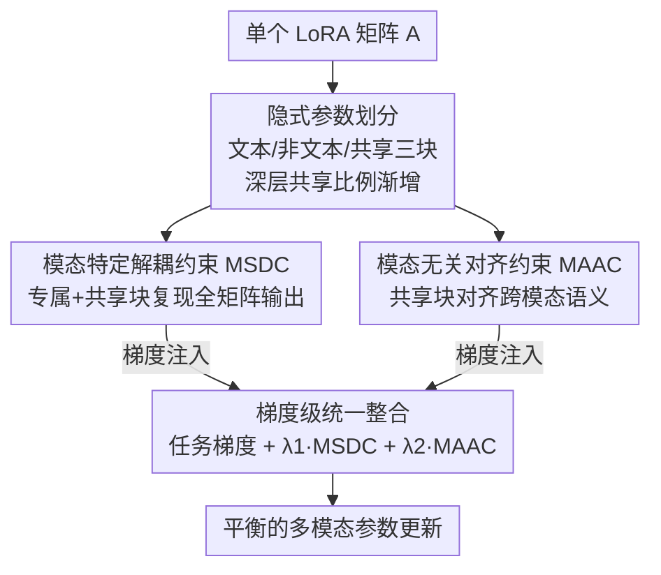

# Parameter-Efficient Adaptation for MLLMs via Implicit Modality Decomposition

**会议**: CVPR 2026  
**论文**: [CVF Open Access](https://openaccess.thecvf.com/content/CVPR2026/html/Zhang_Parameter-Efficient_Adaptation_for_MLLMs_via_Implicit_Modality_Decomposition_CVPR_2026_paper.html)  
**代码**: https://github.com/mmffzzz/IMoD.git  
**领域**: 多模态VLM / LLM效率  
**关键词**: PEFT, LoRA, 多模态大模型, 模态失衡, 梯度级约束

## 一句话总结
针对 LoRA 微调多模态大模型时"文本模态过度主导参数更新"的失衡问题，本文提出 IMoD：把单个 LoRA 矩阵隐式划分成文本专属、非文本专属、共享三块，再用两条直接注入反向传播的梯度级约束去引导它们各司其职，在不增加任何可训练参数、保持权重可合并的前提下，音视文任务平均提升约 3.3%。

## 研究背景与动机

**领域现状**：把预训练 LLM 扩展成多模态大模型（MLLM）已成为主流范式——冻结 LLM 主干，外挂模态编码器和轻量投影层，再用 PEFT 微调。其中 LoRA 因为参数开销极小、不改架构、推理时可合并回主干而被最广泛采用。

**现有痛点**：LoRA 当初不是为多模态设计的。作者用 Fisher 信息矩阵（FIM）做参数级分析发现，在 MUSIC-AVQA 上训练时，**非文本主导率**（Non-Text Dominance Rate，定义见下）从初始水平一路掉到最终步的 **14.8%**——意味着绝大多数可训练参数的更新被文本模态牵着走，视觉/音频信号即使信息丰富也几乎不参与参数更新，模型预测被文本 prompt 主导。

**核心矛盾**：LoRA 只有一小撮参数可训练，却要承接所有模态的梯度。由于 LLM 主干在海量文本上预训练、而非文本编码器监督信号有限，所有模态的梯度被迫挤在同一个低秩矩阵上，强势的文本模态自然吃掉了大部分更新预算。

**本文目标**：在不破坏 LoRA 三大优点（参数高效、可合并、架构简洁）的前提下，让非文本模态拿回应有的更新份额，同时还要留出专门捕捉"模态无关语义"的容量。

**切入角度**：一个看似直接的方案是给每个模态各配一个 LoRA 矩阵（显式模态分解，如 MokA / Uni-modal LoRA），但它有三宗罪——参数量随模态数线性膨胀、微调后无法合并回主干（推理变慢）、且没有专门参数去学跨模态共享的语义。作者据此反推：能不能在**一个矩阵内部**完成模态解耦？

**核心 idea**：用"隐式划分 + 梯度级约束"代替"显式多矩阵"——在单个 LoRA 矩阵里软性划出文本/非文本/共享三个功能区，再用两条约束的梯度直接注入反向传播去塑造它们，既解耦又对齐，参数量与标准 LoRA 完全相同。

## 方法详解

### 整体框架
IMoD（Implicit Modality Decomposition）挂在标准 LoRA 之上，整条流程是：训练前先把 LoRA 的 $A$ 矩阵按预定比例用二值掩码软划分成文本专属、非文本专属、共享三块（且越深的层共享比例越高）；训练中，**模态特定解耦约束（MSDC）**逼着每个模态只用"自己的专属块 + 共享块"也能复现全矩阵的输出，从而把模态知识彼此隔开；**模态无关对齐约束（MAAC）**则逼着共享块对不同模态产出一致的、模态不变的语义；最后这两条约束都不进总损失，而是各自算梯度后直接注入 $A$ 的反向传播，与任务梯度按权重相加成统一更新。这样"哪块参数该往哪个模态走"被精确地局部调控，非文本主导率从 14.8% 回升到约 21.4%。

### 关键设计

**1. 隐式参数划分：在一个矩阵里软性切出三个功能区，而非硬分配**

针对"显式多矩阵会让参数线性膨胀且不可合并"的痛点，IMoD 不新增任何矩阵，而是对 $A\in\mathbb{R}^{r\times d}$ 用三个二值掩码 $M_t,M_o,M_s\in\{0,1\}^{r\times d}$ 做逐元素划分：$A=(M_t\odot A)+(M_o\odot A)+(M_s\odot A)$。元素是按预定比例**随机交错**分配的（不是块状切分），而且这只是一个"软目标"——参数并不被强制只响应指定模态，真正的分工靠后面两条约束慢慢逼出来。

更巧的是**层级递增分配**：作者借用"MLLM 低层偏模态特定、高层偏模态无关"的已知性质，让共享比例随层深线性增长 $r_s^{(l)}=r_s^{(0)}+\alpha\cdot\frac{l}{L}$，其余分给文本/非文本专属（$r_t^{(l)}+r_o^{(l)}+r_s^{(l)}=1$）。这样浅层聚焦模态特定线索、深层逐渐转向共享语义，参数分布天然呈层级结构。消融显示 $\alpha=0.4$ 最优。

**2. 模态特定解耦约束（MSDC）：让"只用本模态参数"等价于"用全矩阵"，实现隐式分离**

这条约束直击"不同模态知识互相干扰"的痛点，原理朴素：处理纯文本输入时，扰动非文本专属参数不该明显影响文本输出。具体地，定义文本相关参数子集 $A_T=A\odot(M_t+M_s)$，给定文本特征 $X_t$（非文本 token 置零），算两个输出——只用文本相关子集的 $\tilde z_t=A_TX_t$ 与用全矩阵的 $z_t=AX_t$——强制二者一致：$L_{TS}=\lVert\tilde z_t-z_t\rVert_2^2$；非文本侧对称地有 $L_{OS}$。这样一来，对每个模态而言，整个参数矩阵的行为就等价于"只激活了模态相关参数"，从而在推理用全参数时仍保留模态特定行为。最后不把两个 loss 加进总损失，而是算它们对 $A$ 的梯度直接注入反向：$G_A^{MSD}=\nabla_AL_{TS}+\nabla_AL_{OS}$。

**3. 模态无关对齐约束（MAAC）：让共享块产出可靠的模态不变语义**

MSDC 只保证专属块各管各的，并不能保证共享块真的学到跨模态一致的语义，MAAC 补上这一环。给定文本/非文本 token，共享表示为 $s_t=(A\odot M_s)X_t$、$s_o=(A\odot M_s)X_o$，取序列均值 $\bar s_t,\bar s_o$ 作为句级语义。但均值未必可靠——对长或语义发散的序列，均值可能不是好的语义中心。于是引入**集中度系数**：$c_t=\frac1L\sum_i\cos(s_{t,i},\bar s_t)$（$c_o$ 同理），衡量 token 嵌入相对均值的平均余弦相似度，值越高说明均值越能代表整体语义。最终对齐项按集中度加权：$L_{MA}=1-(c_t+c_o)\cdot\cos(\bar s_t,\bar s_o)$，即对语义越可靠的序列越强调对齐。同样只注入梯度：$G_A^{MA}=\nabla_AL_{MA}$。⚠️ 原文式 (7) 中共享掩码维度标注为 $M_s\in\{0,1\}^{d\times k}$，与式 (1) 的 $r\times d$ 不一致，疑为排版笔误，以原文为准。

**4. 梯度级统一整合：用梯度注入代替 loss 相加，保住细粒度的局部修正信号**

为什么不把两条约束当 loss 加进总目标，而要在梯度层面整合？作者的核心论点是：约束本就是为"引导每个参数在其指定分区内的行为"而设计的，如果汇成一个全局 loss，这些细粒度的逐参数修正信号会被稀释掉。于是统一更新规则写成 $G_A=\nabla_AL_{Task}+\lambda_1\cdot G_A^{MSD}+\lambda_2\cdot G_A^{MA}$，让解耦和对齐恰好作用在该作用的地方，优化更稳更精准。消融给出 $\lambda_1=1,\lambda_2=1\times10^{-4}$ 最优，且在大范围内性能稳定。

### 自定义指标定义
- **非文本主导率 $R_{Non\text{-}Text}$**：被非文本模态主导的参数占比，$R_{Non\text{-}Text}=|\{(i,j)\mid \text{FIM}_{Non\text{-}Text}[i,j]>\text{FIM}_{Text}[i,j]\}|/|W|$。其中 FIM 是 Fisher 信息矩阵，$\text{FIM}_{Text}[i,j]$ 度量文本模态对参数 $W[i,j]$ 更新的驱动程度。标准 LoRA 训练末期该率掉到 14.8%（严重失衡），IMoD 提升到约 21.4%。

## 实验关键数据

### 主实验
两阶段训练（跨模态预对齐 + 指令微调，主干 LLM 全程冻结），覆盖音视文 / 视文 / 语音文三类配置，对比标准 LoRA 及 LoRAMoE、DoRA、HydraLoRA、Uni-modal LoRA、MokA 等变体。"#A/#B"表示训 N 个模态所需的 LoRA 适配矩阵数，"Inf. Merge"表示能否合并回主干。

音视文场景（MUSIC-AVQA / AVE，准确率）：

| 主干 | 方法 | MUSIC-AVQA | AVE | #A | #B | Inf.Merge |
|------|------|-----------|-----|----|----|-----------|
| LLaMA2 | LoRA | 73.41 | 69.84 | 1 | 1 | ✓ |
| LLaMA2 | MokA | 75.71 | 74.68 | N | 1 | ✗ |
| LLaMA2 | **IMoD** | **77.31** | **75.77** | 1 | 1 | ✓ |
| Qwen2.5-VL | LoRA | 73.00 | 71.38 | 1 | 1 | ✓ |
| Qwen2.5-VL | **IMoD** | **75.71** | **74.38** | 1 | 1 | ✓ |
| Qwen3 | LoRA | 78.57 | 74.17 | 1 | 1 | ✓ |
| Qwen3 | **IMoD** | **80.13** | **76.94** | 1 | 1 | ✓ |

视文场景（LLaMA2 主干）：

| 方法 | MMEpercep | MMBench | POPE | SEED-Bench | Inf.Merge |
|------|-----------|---------|------|-----------|-----------|
| LoRA | 908.52 | 50.64 | 70.28 | 39.71 | ✓ |
| MokA | 1025.86 | 52.74 | 74.23 | 40.45 | ✗ |
| **IMoD** | **1032.68** | **53.35** | **75.60** | **41.83** | ✓ |

关键看点：IMoD 在拿到与显式分解方法 MokA 相当甚至更高精度的同时，是表中唯一**既保持单矩阵参数量（#A=#B=1）又可合并**的方法；语音文场景（MMAU/AIR-Bench）上同样全面领先 LoRA，泛化到三类模态组合都成立。

### 消融实验
LLaMA2 主干，MUSIC-AVQA / AVE：

| 配置 | MUSIC-AVQA | AVE | 说明 |
|------|-----------|-----|------|
| 基线（均不开） | 73.41 | 69.84 | 等价标准 LoRA |
| 仅 MSDC | 75.98 | 74.33 | 解耦约束单独有效 |
| 仅 MAAC | 75.47 | 73.13 | 对齐约束单独有效 |
| MSDC + MAAC | 76.91 | 75.22 | 两者互补 |
| MSDC + MAAC + Layer-wise | **77.31** | **75.77** | 完整模型 |

### 关键发现
- **两条约束互补且单独均有效**：MSDC 单开比 MAAC 单开更强（说明"先把模态隔开"贡献更大），两者叠加再加层级递增分配收益最高。
- **层级递增分配确有增益**：若把矩阵均匀三分而不随层深增大共享比例，性能下降，说明深层多留共享容量更利于跨模态对齐；$\alpha=0.4$ 最优。
- **超参不敏感**：$\lambda_1=1,\lambda_2=10^{-4}$ 最优，但在大范围内稳定，无需精细调参。

## 亮点与洞察
- **"隐式划分 + 软目标"很优雅**：不靠硬分配，而是用随机交错掩码定一个软目标、再让约束把分工逼出来，既保留 LoRA 的灵活性又拿到了模态解耦，关键是参数量一点没涨。
- **梯度级注入而非 loss 相加**是可迁移的 trick：当你的正则是"逐参数局部引导"性质时，把它做成梯度直接注入反向，比汇成全局 loss 更能保住细粒度信号——这一思路可借鉴到其他需要参数级精细调控的 PEFT 场景。
- **用 FIM 量化模态主导**给"文本主导"这个常被定性讨论的现象提供了可测量的抓手（非文本主导率），让"失衡"从口号变成可优化的目标。

## 局限与展望
- 划分比例、层级增长率 $\alpha$、两个 $\lambda$ 都是预设超参，虽然论文说不敏感，但跨更多模态/任务时这套软划分是否仍最优未充分验证。
- 掩码是训练前**随机交错**一次性确定的，未探索按重要性自适应划分（如根据 FIM 动态调整分区）是否能进一步提升。
- 评测以 QA/分类类基准为主，对生成类、长序列多模态推理等更复杂任务的效果还需检验。
- 非文本主导率从 14.8% 提到约 21.4%，仍远低于"均衡"（50%），说明失衡只是被缓解而非根治，留有空间。

## 相关工作与启发
- **vs 标准 LoRA**：LoRA 用单一共享矩阵承接所有模态梯度，导致文本主导、非文本欠学习；IMoD 在同一矩阵里隐式解耦三块并梯度级调控，参数量相同但模态更平衡。
- **vs 显式模态分解（MokA / Uni-modal LoRA）**：它们给每个模态各配矩阵，能解耦但参数随模态数线性增长、无法合并、且缺共享语义容量；IMoD 在单矩阵内完成解耦+对齐，保住参数效率与可合并性，还专门留了共享块学模态不变语义。
- **vs 其他失衡缓解法**：以往工作多从对齐学习速度、调整数据流/采样入手，不检视也不控制"模态特定更新如何分布在可训练参数上"；IMoD 直接在参数层面做这件事，对低秩 PEFT 这种参数稀缺场景尤其对症。

## 评分
- 新颖性: ⭐⭐⭐⭐ "隐式划分 + 梯度级约束"在单矩阵内同时解耦与对齐，角度新颖且实用，但属于 LoRA 框架内的精巧改进。
- 实验充分度: ⭐⭐⭐⭐ 覆盖音视文/视文/语音文三类配置、多个主干，主实验+消融+超参分析齐全。
- 写作质量: ⭐⭐⭐⭐ 动机用 FIM 实证、方法层层递进清晰；个别公式维度标注有疑似笔误。
- 价值: ⭐⭐⭐⭐ 零额外参数、可合并、即插即用地缓解模态失衡，对 MLLM 微调有直接实用价值。

<!-- RELATED:START -->

## 相关论文

- [\[CVPR 2026\] Harmonious Parameter Adaptation in Continual Visual Instruction Tuning for Safety-Aligned MLLMs](harmonious_parameter_adaptation_in_continual_visual_instruction_tuning_for_safet.md)
- [\[CVPR 2026\] Decoupled and Reusable Adaptation for Efficient Cross-Modal Transfer](decoupled_and_reusable_adaptation_for_efficient_cross-modal_transfer.md)
- [\[NeurIPS 2025\] RobustMerge: Parameter-Efficient Model Merging for MLLMs with Direction Robustness](../../NeurIPS2025/multimodal_vlm/robustmerge_parameter-efficient_model_merging_for_mllms_with_direction_robustnes.md)
- [\[CVPR 2026\] Efficient and High-Fidelity Omni Modality Retrieval](efficient_and_high-fidelity_omni_modality_retrieval.md)
- [\[ICML 2026\] AOEPT: Breaking the Implicit Modality-Reduction Bottleneck in Modality-Missing Prompt Tuning](../../ICML2026/multimodal_vlm/aoept_breaking_the_implicit_modality-reduction_bottleneck_in_modality-missing_pr.md)

<!-- RELATED:END -->
