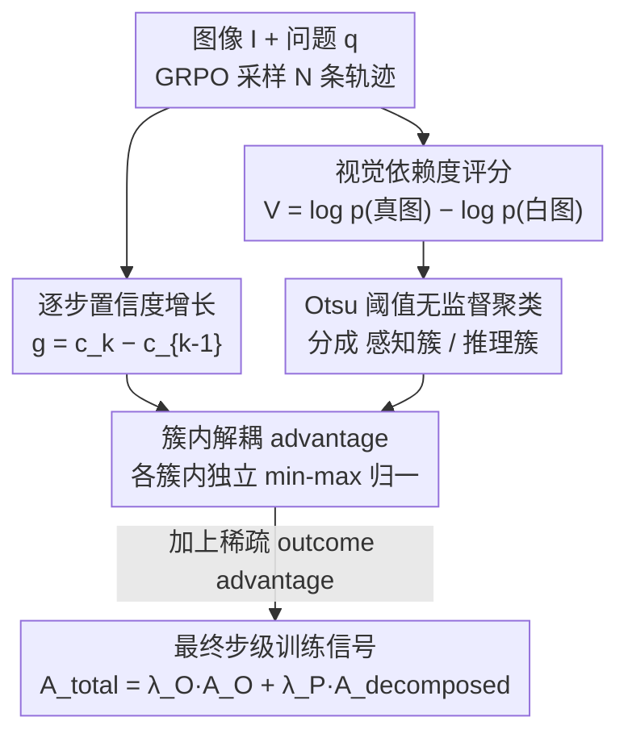

# PDCR: Perception-Decomposed Confidence Reward for Vision-Language Reasoning

**会议**: CVPR 2026  
**arXiv**: [2605.13467](https://arxiv.org/abs/2605.13467)  
**代码**: https://github.com/hee-suk-yoon/PDCR  
**领域**: 多模态VLM / 对齐RLHF  
**关键词**: 视觉语言推理, RLVR, 过程奖励, 置信度增长, 技能解耦

## 一句话总结
针对"把语言域里的置信度增长过程奖励直接搬到视觉语言推理"会因为视觉感知步骤稀疏、被密集文本推理步骤的统计量淹没（mixture-induced signal degradation）的问题，PDCR 用一个模型自带的 Visual Dependence Score + Otsu 阈值把每一步无监督地分成"看图(感知)"和"想(推理)"两簇，再在各自簇内独立做 min-max 归一化算 advantage，从而给稀疏的视觉步骤一个不被文本步骤压扁的、尺度正确的奖励信号，在 7 个 V-L 推理 benchmark 上稳定超过 GRPO/DAPO/PACR。

## 研究背景与动机
**领域现状**：可验证奖励的强化学习（RLVR）是提升 VLM 多步推理的主流路线，但标准做法只给一个稀疏的终点奖励——最终答案对就 +1、错就 0（GRPO）。这个信号对中间每一步毫无指导，造成严重的 credit assignment 问题。为补这个稀疏，一条路是训练外部过程奖励模型（PRM），但它贵、吃数据、还容易和策略错位；另一条更省的路来自语言域：用模型自己对正确答案的对数概率随推理步骤的"置信度增长"当 dense 过程奖励（PACR），不需要外部模型。

**现有痛点**：PACR 在纯文本推理里有效，但作者发现把它"原样"搬到视觉语言推理是次优的。原因是 V-L 推理不是一个同质过程，而是两种异质技能的混合：① **视觉感知步骤**（从图里抽证据、转成文字观察，如"图中有人站在收银台前操作 POS 机"）——稀疏但关键；② **文本推理步骤**（基于已有事实做逻辑/计算/下结论）——密集且占多数。论文实测：感知步骤只占约 30%（31.4%），推理步骤占约 70%（68.6%），且二者注意力模式截然不同（感知步骤高度 attend 视觉 token，推理步骤几乎只 attend 前文文本）。

**核心矛盾**：PACR 的过程 advantage 是把所有步骤的折扣回报放进**一个全局池**里做 min-max 归一化（公式 5）。当这个池被占多数的文本步骤回报主导时，全局的 min/max 对稀疏的感知步骤毫无代表性——感知步骤的 advantage 分布被压缩、错位，关键的"看图"动作拿不到尺度正确的信用。作者把这个现象命名为 **mixture-induced signal degradation（混合诱导的信号退化）**。

**核心 idea**：让奖励结构去匹配任务的异质本质——先无监督地把步骤分成感知簇和推理簇，再在**各自簇内**独立归一化算 advantage，而不是全局一锅煮。这样感知步骤只跟自己的同类比，得到稳定、尺度正确的信号。

## 方法详解

### 整体框架
PDCR 接在标准 GRPO 之上：对一个图像 $\mathbf{I}$ + 问题 $\mathbf{q}$，旧策略采样 $N$ 条推理轨迹，每条切成若干步 $\{h_k^{(i)}\}$，终点给稀疏 outcome 奖励 $R^{(i)}$（答案对=1，错=0）。PDCR 在这之上加一条 dense 过程奖励，整体分两条并行路径再汇合：

- **绿色路径（过程奖励）**：沿用 PACR 的思路，逐步计算模型对正确答案 $Y_{gt}$ 的置信度 $c_k^{(i)}=\log\pi_\theta(Y_{gt}\mid\mathbf{I},\mathbf{q},H_{\le k}^{(i)})$，置信度增益 $g_k^{(i)}=c_k^{(i)}-c_{k-1}^{(i)}$，再累成折扣回报 $G_k^{(i)}=\sum_{m\ge k}\gamma^{m-k}g_m^{(i)}$。
- **粉色路径（无监督技能解耦）**：对每一步算 Visual Dependence Score $V_k^{(i)}$（真图 vs 白图的对数似然比），再用 Otsu 法找最优阈值 $c^*$ 把所有步骤分成视觉感知簇 $\mathcal{I}_{\text{visual}}$ 和文本推理簇 $\mathcal{I}_{\text{textual}}$。
- **汇合（解耦 advantage）**：把绿色路径的回报 $G_k^{(i)}$ 放进粉色路径划好的**对应簇内**做 min-max 归一化，得到解耦过程 advantage $A_{\text{decomposed},k}^{(i)}$，最后与稀疏 outcome advantage $A_O^{(i)}$ 加权求和当最终训练信号。

### 关键设计

**1. Visual Dependence Score：用"真图 vs 白图"的对数似然比量化一步到底多依赖看图**

要在训练里把步骤分成感知/推理，最大的障碍是没有标注——Section 4 里验证问题时用的是 GPT 标注，但实际训练拿不到。PDCR 的做法是构造一个完全模型自带、不需外部标签的信号：对同一步 $h_k^{(i)}$，分别在**真实图像** $\mathbf{I}$ 和**纯白空白图像** $\mathbf{I}_{\text{white}}$ 条件下算它的对数概率，二者之差就是视觉依赖度：

$$V_k^{(i)} = \underbrace{\log\pi_\theta(h_k^{(i)}\mid\mathbf{I},\mathbf{q},H_{<k}^{(i)})}_{p_k^{(i)}} - \underbrace{\log\pi_\theta(h_k^{(i)}\mid\mathbf{I}_{\text{white}},\mathbf{q},H_{<k}^{(i)})}_{p_{w,k}^{(i)}}$$

直觉很干净：如果这一步换成白图后概率掉很多（$V$ 大），说明它生成时真的靠了图里的视觉证据，是感知步骤；如果换白图几乎没影响（$V\approx 0$），说明它主要靠前文文本驱动，是推理步骤。代价只是每条轨迹多一次"喂白图"的前向。

**2. Otsu 动态阈值：参数无关地把一维视觉依赖度劈成两簇**

有了每步的 $V_k^{(i)}$，还得定一个阈值把它们二分。最朴素的做法是 Top-K（把分最高的固定百分比当感知步骤），但它对 $K$ 极其敏感、要手调。PDCR 直接借用图像分割里的经典 **Otsu 法**：把所有 $M$ 个分数排序后，遍历每个切点 $k$ 把数据分成两簇 $C_1,C_2$，选使**簇内平方和（SSE）最小**的切点：

$$SSE(k)=\sum_{i=1}^{k}(v_i-\mu_1(k))^2+\sum_{i=k+1}^{M}(v_i-\mu_2(k))^2,\quad k^*=\arg\min_k SSE(k)$$

最优阈值 $c^*=v_{k^*}$，据此把步集分成 $\mathcal{I}_{\text{visual}}=\{(i,k)\mid V_k^{(i)}\ge c^*\}$ 与 $\mathcal{I}_{\text{textual}}=\{(i,k)\mid V_k^{(i)}<c^*\}$。它是参数无关的（不用调 $K$），且实测分类准确率 76.2% 显著高于最优 Top-K 的 67.5%——因为它会随每个 batch 的分数分布自适应，而不是死守一个固定比例。

**3. 簇内解耦 advantage：让感知步骤只跟同类比，根治信号退化**

这是 PDCR 的落脚点。PACR 把所有步骤的回报放进全局池 $I$ 做归一化（公式 5），稀疏的感知步骤被密集文本步骤的 min/max 主导、advantage 被压扁。PDCR 改成在各自簇内独立做 min-max 归一化——视觉步骤：

$$A_{V,k}^{(i)}=\frac{G_k^{(i)}-\min_{(j,k')\in\mathcal{I}_{\text{visual}}}G_{k'}^{(j)}}{\max_{(j,k')\in\mathcal{I}_{\text{visual}}}G_{k'}^{(j)}-\min_{(j,k')\in\mathcal{I}_{\text{visual}}}G_{k'}^{(j)}}$$

文本步骤 $A_{T,k}^{(i)}$ 用 $\mathcal{I}_{\text{textual}}$ 的 min/max 同理计算。这样感知步骤的回报只跟其它感知步骤比，得到稳定、尺度正确的奖励，不再被文本步骤"稀释"。这正是它和 PACR 的本质区别：同样的置信度增长信号，PDCR 只是换了归一化的统计基线（分簇 vs 全局），却恰好对症了 V-L 任务的异质性。

### 损失函数 / 训练策略
最终步级总 advantage 是稀疏 outcome advantage 与解耦过程 advantage 的加权和：

$$A_{total,k}^{(i)}=\lambda_O A_O^{(i)}+\lambda_P A_{\text{decomposed},k}^{(i)},\quad A_{\text{decomposed},k}^{(i)}=\begin{cases}A_{V,k}^{(i)},&(i,k)\in\mathcal{I}_{\text{visual}}\\ A_{T,k}^{(i)},&(i,k)\in\mathcal{I}_{\text{textual}}\end{cases}$$

其中 $A_O^{(i)}=(R^{(i)}-\text{mean}\{R^{(j)}\})/\text{std}\{R^{(j)}\}$ 是 GRPO 的组内归一化 outcome advantage，$\lambda_O,\lambda_P$ 是权重超参。这个 $A_{total,k}^{(i)}$ 会施加到组成步骤 $h_k^{(i)}$ 的所有 token 上做策略更新。训练用 Qwen2.5-VL-3B/7B-Instruct，数据集为 Vision-SR1（约 47K 含可验证答案、覆盖数学/常识/通用视觉三类的样本），与各 baseline 用相同 system prompt 和超参以公平对比。

## 实验关键数据

### 主实验
7 个 V-L 推理 benchmark（MMMU-Pro / MMMU / RealWorldQA / VisNumBench / MathVerse / MathVision / HallusionBench）上的平均准确率：

| Backbone | 方法 | 平均准确率 | 说明 |
|----------|------|-----------|------|
| Qwen2.5-VL-3B | Zero-shot | 36.3 | 未训练基线 |
| Qwen2.5-VL-3B | GRPO | 43.6 | 稀疏 outcome 奖励 |
| Qwen2.5-VL-3B | DAPO | 44.1 | 加动态采样稳定化 |
| Qwen2.5-VL-3B | PACR | 44.4 | 全局归一化 dense 奖励 |
| Qwen2.5-VL-3B | **PDCR (ours)** | **45.2** | 簇内解耦，最高 |
| Qwen2.5-VL-7B | Zero-shot | 41.4 | 未训练基线 |
| Qwen2.5-VL-7B | GRPO | 51.5 | — |
| Qwen2.5-VL-7B | DAPO | 52.0 | — |
| Qwen2.5-VL-7B | PACR | 52.2 | 次优 |
| Qwen2.5-VL-7B | **PDCR (ours)** | **52.9** | 最高 |

PDCR 在两种模型规模上都拿到最高平均分。相对全局归一化的 PACR，提升集中在复杂理解任务：7B 上 MMMU-Pro 42.5 vs 41.5、MMMU 51.5 vs 50.5、MathVerse 55.0 vs 54.3。

### 消融实验
**Random Decomposition**（保留簇内解耦归一化，但把每步**随机**丢进视觉/文本簇）：

| Backbone | 配置 | 平均准确率 | 说明 |
|----------|------|-----------|------|
| Qwen2.5-VL-3B | PDCR (ours) | 45.2 | 完整模型 |
| Qwen2.5-VL-3B | → Random Decomposition | 44.1 | 随机分簇，掉 1.1 |
| Qwen2.5-VL-7B | PDCR (ours) | 52.9 | 完整模型 |
| Qwen2.5-VL-7B | → Random Decomposition | 52.3 | 随机分簇，掉 0.6 |

7B 上随机分簇（52.3）只比 naive PACR（52.2）高一点点，远低于完整 PDCR（52.9）——证明"光分簇"没用，增益来自**正确识别并分开**两种异质技能。

### 关键发现
- **解耦本身才是关键，不是分簇这个动作**：Random Decomposition 几乎退化到 PACR 水平，说明 Visual Dependence Score 提供的"有意义的"数据驱动划分才是涨点来源。
- **超过 DAPO 说明增益不止来自稳定化**：PACR/PDCR 的过程奖励天然非零，能像 DAPO 一样规避 GRPO 的 vanishing advantage 问题（一组轨迹全对或全错时 outcome advantage 为 0）。但 PDCR（52.9）仍稳定超过 DAPO（52.0），证明感知解耦奖励提供的是高质量训练信号，而非仅仅补了稀疏。
- **Otsu 完胜 Top-K**：动态阈值分类准确率 76.2%，Top-K 在 $K=30$ 时峰值才 67.5%，且 Top-K 对 $K$ 极敏感。
- **成本与收益**：PACR 因需额外前向算 $c_k$ 比 GRPO 贵约 1.5×，PDCR 再加一次算 $V_k$ 的前向，开销略增；但 PACR/PDCR 都学会产出**更短更精炼**的推理链，推理时效率显著提升，抵消训练开销。

## 亮点与洞察
- **"白图对照"是个极简又巧妙的视觉依赖度探针**：不引入任何外部模型、不生成 caption，仅靠真图/白图两次前向的对数似然比，就把"这一步靠不靠看图"量化成了一个连续分数，可直接拿来无监督聚类——这个 model-internal 信号的设计可迁移到任何"想知道某段生成多依赖某个模态/输入"的场景。
- **从图像分割借 Otsu 法解决一维聚类**：作者敏锐地发现"把推理步按视觉依赖度二分"和"把像素按强度分前景/背景"是同构问题，直接搬来参数无关的经典算法，省掉调 $K$，还更准。
- **真正的洞察是"归一化的统计基线"也要对齐任务结构**：PDCR 不改奖励信号本身（还是置信度增长），只把全局归一化换成簇内归一化，就解决了 PACR 的失效——提醒我们 RL 里 advantage 归一化的"参照群体"选错，再好的信号也会被统计稀释。

## 局限与展望
- **只分两簇、二元划分较粗**：感知/推理的二分对很多步骤（既看图又推理的混合步）是硬切，76.2% 的分类准确率也说明约 1/4 步被分错；更细粒度或软分配可能更准。
- **依赖"白图"作为反事实基线**：白图是否是最优的 null condition 没充分讨论，对某些任务（如图本身就接近白底）白图扰动可能不够。
- **绝对提升幅度偏小**：7B 上平均仅比 PACR 高 0.7、比 GRPO 高 1.4，部分单项还略低于 baseline（如 3B 的 MMMU-Pro 33.3 vs PACR 33.4），增益稳定但不算大。
- **额外前向带来训练开销**：每条轨迹多一次白图前向，在大 batch / 长轨迹下成本不可忽略，作者用"推理链变短"来论证整体划算，但训练侧确实更贵。

## 相关工作与启发
- **vs PACR（语言域置信度增长奖励）**: PACR 把所有推理步的置信度增长回报放进**全局池**做 min-max 归一化，PDCR 指出这在 V-L 任务里会因感知步骤稀疏而退化，改成**簇内归一化**。二者奖励信号相同，区别只在归一化的统计基线，但这一改对症了任务异质性。
- **vs 外部过程奖励模型（PRM）**: PRM 给 dense 步级信号但贵、吃数据、易错位；PDCR 完全用模型自带信号（置信度 + 视觉依赖度），无需任何外部标注或模型。
- **vs 现有视觉语言奖励解耦工作**: 已有工作多通过生成显式文本（如 image caption）作为奖励基础（如 Vision-SR1 这类）；PDCR 直接在 process 层用内部信号给原始推理步分类，不需要额外生成文本。
- **vs GRPO/DAPO**: DAPO 靠动态采样规避 vanishing advantage，PDCR 的非零过程奖励天然规避同一问题，且额外提供感知/推理分开评估的高质量信号，实验上稳定超过 DAPO。

## 评分
- 新颖性: ⭐⭐⭐⭐ 把"奖励归一化要对齐任务异质结构"这个观察落成 Visual Dependence Score + Otsu 簇内归一化，角度新颖且诊断清晰（mixture-induced signal degradation）。
- 实验充分度: ⭐⭐⭐⭐ 两种模型规模 × 7 个 benchmark，含 Random Decomposition 消融、Otsu vs Top-K 验证、训练动态与成本分析，较完整；但绝对提升偏小、缺更大模型验证。
- 写作质量: ⭐⭐⭐⭐⭐ 问题诊断（观察1-3）→ 方法 → 实验逻辑链清晰，公式与图示对应到位，易读。
- 价值: ⭐⭐⭐⭐ 提供了一个轻量、无标注、即插即用的过程奖励改进，对做 V-L RLVR 的人有直接参考价值。

<!-- RELATED:START -->

## 相关论文

- [\[CVPR 2026\] Linking Perception, Confidence and Accuracy in MLLMs](linking_perception_confidence_and_accuracy_in_mllms.md)
- [\[ICML 2026\] Decomposed On-Policy Distillation for Vision-Language Reasoning: Steering Gradients for Visual Grounding](../../ICML2026/multimodal_vlm/decomposed_on-policy_distillation_for_vision-language_reasoning_steering_gradien.md)
- [\[CVPR 2026\] Perception Programs: Unlocking Visual Tool Reasoning in Language Models](perception_programs_visual_tool_reasoning.md)
- [\[CVPR 2026\] CICA: Coupling Confidence-Aware Pretraining with Confidence-Informed Attention for Robust Multimodal Sentiment Analysis](cica_coupling_confidence-aware_pretraining_with_confidence-informed_attention_fo.md)
- [\[CVPR 2026\] Hierarchical Process Reward Models are Symbolic Vision Learners](hierarchical_process_reward_models_are_symbolic_vision_learners.md)

<!-- RELATED:END -->
