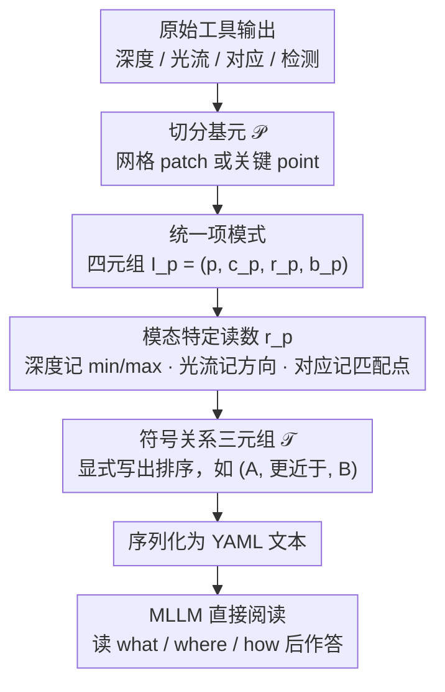

# Perception Programs: Unlocking Visual Tool Reasoning in Language Models

**会议**: CVPR 2026  
**arXiv**: [2604.12896](https://arxiv.org/abs/2604.12896)  
**代码**: [https://github.com/AISmartPerception/perception-programs](https://github.com/AISmartPerception/perception-programs)  
**领域**: LLM/NLP  
**关键词**: 感知程序, 视觉工具, 语言原生表示, 训练免费, 多模态推理

## 一句话总结

提出 Perception Programs (P2)，一种训练免费、模型无关的方法，将视觉工具（深度、光流、对应等）的原始输出转换为紧凑的语言原生结构化摘要，使 MLLM 能直接"阅读"视觉模态而非从密集像素推断，在 BLINK 6 个任务上平均提升 19.66%。

## 研究背景与动机

**领域现状**：MLLM 越来越多地与视觉工具（深度估计、光流、视觉对应等）配合使用来增强视觉推理。

**现有痛点**：尽管视觉工具提供了准确的感知信号，MLLM 常常无法充分利用。原始工具输出是密集的像素级表示，与 LLM 的语言原生推理能力不匹配。实验表明 GPT-5 Mini 甚至无法从深度图恢复正确的深度排序（Kendall τ 快速趋近零）。

**核心矛盾**：瓶颈不在于更多的工具调用或更大的 MLLM，而在于视觉工具输出的表示方式。密集数值 token 与语言推理基底的根本性不匹配。

**本文目标**：将工具输出从密集像素级表示转换为语言原生的结构化摘要。

**切入角度**：人类对视觉信息的线索提取方式因数据类型而异（深度关注远近、光流关注方向等）。将关键信息转换为文本减轻了模型处理像素细节的负担。

**核心 idea**：P2 标准化了工具传达的内容（what）、空间位置（where）和部分间关系（how），使任何 MLLM 都能直接解析和推理。

## 方法详解

### 整体框架

P2 要解决的事很具体：视觉工具（深度、光流、对应等）算出来的结果是密集的像素级数值，MLLM 读不懂——它擅长读文本而不擅长"看"一张深度图里的数字阵列。P2 的做法是在工具和 MLLM 之间插一层"翻译"，把像素输出改写成 LLM 母语里的结构化摘要。

整条管线是这样转的：拿到工具的原始输出后，先把像素域切成一组有限的基元（网格 patch 或关键 point）；为每个基元抽出一个结构化项 $I_p = (p, c_p, r_p, b_p)$——分别是基元标识、归一化坐标、从该模态读出的数值、可选的语义标签；再在基元之间生成一批稀疏的符号关系三元组 $\mathcal{T}$（比如"A 比 B 更近"）。最后把所有项和关系序列化成一段 YAML 文本，直接塞进 MLLM 的输入。模型从此不用从像素里猜，而是像读一份清单一样读出 what / where / how。整条链路全程在推理时完成、不碰模型参数（对应下方第 3 点）。

### 关键设计

**1. 统一项模式：让所有模态共用一套结构，方法才能泛化**

各种视觉工具的输出形态五花八门（深度是标量场、光流是向量场、对应是点对），如果每种都单独设计读法，方法就绑死在某一类工具上。P2 让深度、光流、对应、检测全部落到同一个四元组 $I_p = (p, c_p, r_p, b_p)$ 上：$p$ 是基元标识，$c_p$ 是归一化到 $[0,1000]^2$ 的空间坐标（统一坐标系，模型不用关心原图分辨率），$r_p$ 是从该模态数据里读出的数值，$b_p$ 是可选语义标签。模态之间唯一变化的只有两处——读数 $r_p$ 怎么构造、以及要不要附带关系三元组。正因为骨架统一，换一个新工具时只需定义它的 $r_p$ 读法即可接入，不必重写整套表示。

**2. 模态特定读数构造：每种模态只保留人类真正用来推理的那条线索**

人看深度图盯的是远近、看光流盯的是方向，关键信息因模态而异，所以 $r_p$ 的构造对每种模态量身定制。深度模态里，每个网格单元存最小和最大深度 $r_p = [\min D, \max D]$，并在相邻单元间生成"更近于 / 更远于"这类关系三元组，把空间排序显式写出来；光流模态编码运动的方向和幅度；对应模态编码匹配点的位置和置信度；检测模态编码物体类别和边界框。这样做的效果是把"密集像素里隐含的关系"提前算成显式文本，MLLM 不必自己从一堆数字里还原顺序——实验里 GPT-5 Mini 直接读深度图时 Kendall $\tau$ 趋近零，正是这一步替它把排序做完了。

**3. 训练免费、模型无关：只换表示，不碰模型**

P2 是一个纯推理时的表示转换模块，不需要参数更新、架构修改，也不增加额外的工具调用。它直接嵌在标准的工具使用管线里——同一份工具输出，转成 P2 摘要后被 MLLM 消费，相比直接喂原始输出只多了一点文本处理开销。这意味着任何现成 MLLM（闭源 API 或开源小模型）都能即插即用，也正因为不依赖训练，它能叠加在已有的 agent 工具使用方法之上再涨点。

### 一个例子：把深度图翻译成 YAML

以"判断图中哪个物体更近"为例。深度工具先输出一张稠密深度图，P2 把它切成 $8\times8$ 的网格；对每个单元算出 $r_p = [\min D, \max D]$，于是每个网格变成一行项，例如 `{p: c34, c: [375, 500], r: [2.1, 2.8]}`——坐标在归一化空间的中部、深度约 2~3 米。接着比较相邻单元的深度，生成关系三元组如 `(c34, 更近于, c52)`。最后把几十个项和若干关系打包成一段 YAML：MLLM 读到的不再是像素阵列，而是一份"哪块在哪、谁离镜头更近"的明细清单，直接据此回答前景物体的相对深度。

### 损失函数 / 训练策略

P2 不涉及任何训练，是纯推理时的表示转换，无训练目标与超参。

## 实验关键数据

### 主实验

| 模型 | 任务 | 基线 | +原始工具 | +P2 |
|------|------|------|---------|-----|
| GPT-5 Mini | 多视角推理 | 41.4% | 52.8% | **86.5%** |
| GPT-5 Mini | 相对深度 | 52.4% | 61.2% | **81.5%** |
| GPT-5 Mini | 视觉对应 | 38.7% | 45.3% | **72.1%** |
| InternVL3.5-4B | 6任务平均 | 42.1% | 48.5% | **70.3%** |
| Qwen3VL-4B | 6任务平均 | 43.5% | 49.2% | **71.8%** |

### 消融实验

| 配置 | BLINK 6任务平均 | 说明 |
|------|---------------|------|
| 完整 P2 | 86.5% | 项+关系 |
| 仅项 (无关系) | 78.2% | 无邻域关系 |
| 粗网格 (4×4) | 82.1% | 分辨率降低 |
| 细网格 (12×12) | 85.8% | 更高分辨率 |
| 原始工具输出 | 52.8% | 像素级表示 |

### 关键发现

- P2 在多视角推理上将 GPT-5 Mini 的准确率从 41.4% 提升到 86.5%（+45 个百分点），效果惊人
- 即使在 4B 级小模型上也有 21-25% 的绝对提升
- P2 可增强现有的 agent 工具使用方法：在深度和定位任务上额外提升 18.28%

## 亮点与洞察

- 核心洞察深刻：视觉推理的瓶颈不在工具准确性，而在表示方式。MLLM 能"读"文本但不能有效"看"密集数值
- P2 的设计体现了"让机器做机器擅长的事"的原则：让视觉工具提取感知信号，让 LLM 做语言推理
- 训练免费+模型无关使其具有极高的实用价值

## 局限与展望

- 网格划分的粒度需要根据任务调整
- 对于需要精确像素级信息的任务（如精细分割边界），P2 的空间离散化可能损失信息
- 未评估在视频时间维度上的扩展
- 可探索自适应粒度和动态关系生成

## 相关工作与启发

- **vs VisProg/ViperGPT**: 这些方法生成调用工具的程序，但仍在像素级操作工具输出；P2 改变的是工具输出的表示
- **vs Aurora/Mirage**: 这些方法用训练来改善工具使用，P2 不需要训练即可获得更大提升

## 评分

- 新颖性: ⭐⭐⭐⭐⭐ "表示方式才是瓶颈"的洞察改变了问题定义
- 实验充分度: ⭐⭐⭐⭐⭐ 多模型多任务的全面验证，效果惊人
- 写作质量: ⭐⭐⭐⭐⭐ 动机、分析和实验都很清晰
- 价值: ⭐⭐⭐⭐⭐ 对 MLLM 工具使用范式有重要启发

<!-- RELATED:START -->

## 相关论文

- [\[CVPR 2026\] Don't Show Pixels, Show Cues: Unlocking Visual Tool Reasoning in Language Models via Perception Programs](dont_show_pixels_show_cues_unlocking_visual_tool_reasoning_in_language_models_vi.md)
- [\[CVPR 2026\] Proof-of-Perception: Certified Tool-Using Multimodal Reasoning with Compositional Conformal Guarantees](pop_proof_of_perception_conformal_reasoning.md)
- [\[CVPR 2026\] Synthesizing Visual Concepts as Vision-Language Programs](synthesizing_visual_concepts_as_vision-language_programs.md)
- [\[CVPR 2026\] Abstract 3D Perception for Spatial Intelligence in Vision-Language Models](abstract_3d_perception_for_spatial_intelligence_in_vision-language_models.md)
- [\[CVPR 2026\] Visual Reasoning through Tool-supervised Reinforcement Learning](visual_reasoning_through_tool-supervised_reinforcement_learning.md)

<!-- RELATED:END -->
